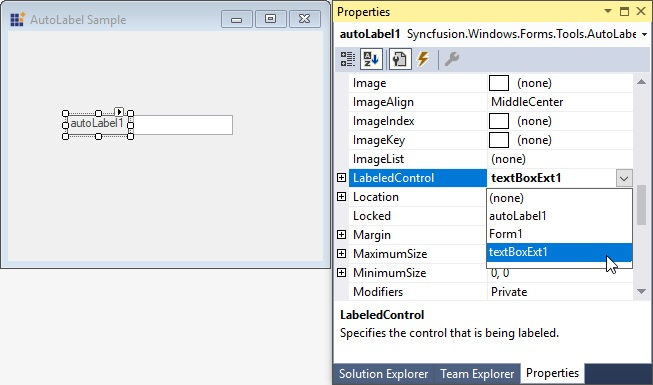
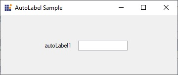

# Getting Started

This section briefly describes how to create a new Windows Forms project in Visual Studio, and add the **AutoLabel** control with its basic functionalities.

## Assembly deployment

Refer to the [control dependencies](https://help.syncfusion.com/windowsforms/control-dependencies#autolabel) section to get the list of assemblies or NuGet package details that need to be added as reference to use the control in any application.

[Click here](https://help.syncfusion.com/windowsforms/visual-studio-integration/nuget-packages) to find more details on how to install NuGet packages in a Windows Forms application.

## Adding the AutoLabel control via designer

1) Create a new Windows Forms application in Visual Studio.

2) The **AutoLabel** control can be added to an application by dragging it from the toolbox to the design view. The following dependent assemblies will be added automatically.

* Syncfusion.Shared.Base

   

3) Set the desired properties for the **AutoLabel** control using the **Properties** dialog.

## Adding the AutoLabel control via code

1) Create a C# or VB application via Visual Studio.

2) Add the following assembly reference to the project.

* Syncfusion.Shared.Base

3) Include the required namespace.




using Syncfusion.Windows.Forms.Tools;
		




Imports Syncfusion.Windows.Forms.Tools




4) Create an instance of the **AutoLabel** control. Set the following properties and add it to the form.




//Initialization
private Syncfusion.Windows.Forms.Tools.AutoLabel autoLabel1;
this.autoLabel1 = new Syncfusion.Windows.Forms.Tools.AutoLabel();

//Set the properties
this.autoLabel1.Text = "autoLabel1";
this.autoLabel1.BackColor = System.Drawing.Color.DarkGray;
this.autoLabel1.ForeColor = System.Drawing.Color.DarkBlue;
this.autoLabel1.Font = new System.Drawing.Font("Microsoft Sans Serif", 8.25F, System.Drawing.FontStyle.Bold, System.Drawing.GraphicsUnit.Point, ((byte)(0)));
this.autoLabel1.TextAlign = System.Drawing.ContentAlignment.MiddleCenter;

// Add the AutoLabel control to the form.
this.Controls.Add(this.autoLabel1);





' Initialization
Private autoLabel1 As Syncfusion.Windows.Forms.Tools.AutoLabel
Me.autoLabel1 = New Syncfusion.Windows.Forms.Tools.AutoLabel()

' Set the properties
Me.autoLabel1.Text = "autoLabel1"
Me.autoLabel1.BackColor = System.Drawing.Color.DarkGray
Me.autoLabel1.ForeColor = System.Drawing.Color.DarkBlue
Me.autoLabel1.Font = New System.Drawing.Font("Microsoft Sans Serif", 8.25F, System.Drawing.FontStyle.Bold, System.Drawing.GraphicsUnit.Point, CByte((0)))
Me.autoLabel1.TextAlign = System.Drawing.ContentAlignment.MiddleCenter

' Add the AutoLabel control to the form.
Me.Controls.Add(Me.autoLabel1)




## Labeling a control

1) Add one control to the form. For example, **TextBoxExt**.

2) Right-click on the **AutoLabel** control. Choose **Properties**  and select `LabeledControl` property. Now, you can choose newly added **TextBoxExt** control.





this.autoLabel1.LabeledControl = this.textBoxExt1;





Me.autoLabel1.LabeledControl = Me.textBoxExt1





## Spacing

The space between the **AutoLabel** control and the labeled control can be customized using the following properties. When using relative positioning, you can also specify the gap between the label and the control.

<table>
<tr>
<th>
AutoLabel Properties</th><th>
Description</th></tr>
<tr>
<td>
DX</td><td>
The effective horizontal distance between the left of the AutoLabel and its labeled control.</td></tr>
<tr>
<td>
DY</td><td>
The effective vertical distance between the top of the AutoLabel and its labeled control.</td></tr>
<tr>
<td>
Gap</td><td>
Specifies the horizontal and vertical gap to use when computing the relative position.</td></tr>
</table>




this.autoLabel1.DX = -70;
this.autoLabel1.DY = 3;
this.autoLabel1.Gap = 10;





Me.autoLabel1.DX = -70
Me.autoLabel1.DY = 3
Me.autoLabel1.Gap = 10




  

## Position

 The **AutoLabel** control can be positioned relative to the top, left, bottom, or right of the labeled control.

 <table>
<tr>
<th>
AutoLabel Property</th><th>
Description</th></tr>
<tr>
<td>
Position</td><td>
Specifies the relative position of the control and the AutoLabel. The options included are as follows: Custom, Left, Top, and Side.</td></tr>
</table>

When the `Position` property is set to **Custom**, you can drag the label to the required position using the mouse.




this.autoLabel1.Position = Syncfusion.Windows.Forms.Tools.AutoLabelPosition.Side;





Me.autoLabel1.Position = Syncfusion.Windows.Forms.Tools.AutoLabelPosition.Side




## Size

This section explains the size settings of the **AutoLabel** control.

The **AutoLabel** control can be resized using the below given property.

<table>
<tr>
<th>
AutoLabel Property</th><th>
Description</th></tr>
<tr>
<td>
AutoSize</td><td>
Enables automatic resizing based on the font size.</td></tr>
</table>

N> This is valid only for label controls that do not wrap text.




this.autoLabel1.AutoSize = true;





Me.autoLabel1.AutoSize = True




## Adding themes to control with SkinManager

You can apply the required skin to the form using the `VisualTheme` property.





SkinManager.SetVisualStyle(this.autoLabel1, VisualTheme.Office2016Colorful);





SkinManager.SetVisualStyle(Me.autoLabel1, VisualTheme.Office2016Colorful)





N> This control supports only Office2016Colorful, Office2016Black, Office2016DarkGray, and Office2016White styles using SkinManager.
