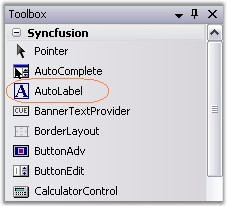
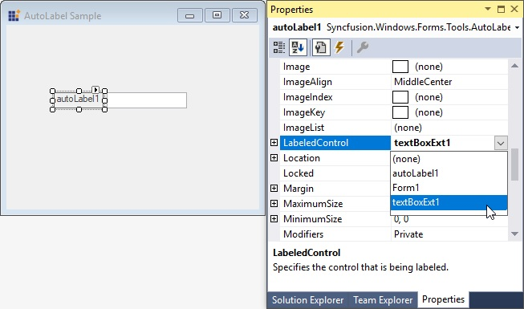
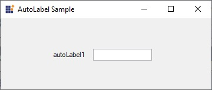
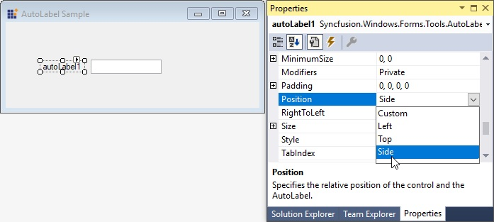
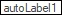

# Getting Started with Windows Forms AutoLabel

This section briefly describes how to create a new Windows Forms project in Visual Studio and add the [AutoLabel](https://help.syncfusion.com/cr/windowsforms/Syncfusion.Windows.Forms.Tools.AutoLabel.html) control with its basic functionalities.

## Assembly deployment

Refer to the [control dependencies](https://help.syncfusion.com/windowsforms/control-dependencies#autolabel) section to get the list of assemblies or NuGet package details that need to be added as reference to use the control in any application.

Refer to this [documentation](https://help.syncfusion.com/windowsforms/installation/install-nuget-packages) to find more details about installing NuGet packages in a Windows Forms application.

You can also add the required assemblies as references from the Package Manager Console using the following PowerShell command:

```powershell
Install-Package Syncfusion.Shared.Base
```

## Adding the AutoLabel control via designer

1. Create a new Windows Forms application in Visual Studio.

2. Add the [AutoLabel](https://help.syncfusion.com/cr/windowsforms/Syncfusion.Windows.Forms.Tools.AutoLabel.html) control to the application by dragging it from the toolbox to the design view. The following dependent assembly will be added automatically:

    * Syncfusion.Shared.Base

  

3. Set the desired properties for the [AutoLabel](https://help.syncfusion.com/cr/windowsforms/Syncfusion.Windows.Forms.Tools.AutoLabel.html) control using the **Properties** dialog.

## Adding the AutoLabel control via code

The following steps describe how to create an AutoLabel control programmatically.

1. Create a C# or VB application via Visual Studio.

2. Add the following assembly reference to the project:

    * Syncfusion.Shared.Base

3. Include the required namespace.





using System.Drawing;
using System.Windows.Forms;
using Syncfusion.Windows.Forms.Tools;





Imports System.Drawing
Imports System.Windows.Forms
Imports Syncfusion.Windows.Forms.Tools




{{ codesnippet1 | OrderList_Indent_Level_1 }}

4. Create an instance of the [AutoLabel](https://help.syncfusion.com/cr/windowsforms/Syncfusion.Windows.Forms.Tools.AutoLabel.html) control, set its properties, and add it to **Form1**.





public partial class Form1 : Form
{
    private Syncfusion.Windows.Forms.Tools.AutoLabel autoLabel1;

    public Form1()
    {
        InitializeComponent();

        this.autoLabel1 = new Syncfusion.Windows.Forms.Tools.AutoLabel();
        this.autoLabel1.Text = "autoLabel1";
        this.autoLabel1.BackColor = Color.DarkGray;
        this.autoLabel1.ForeColor = Color.DarkBlue;
        this.autoLabel1.Font = new Font("Microsoft Sans Serif", 8.25F, FontStyle.Bold, GraphicsUnit.Point, ((byte)(0)));
        this.autoLabel1.TextAlign = ContentAlignment.MiddleCenter;

        this.Controls.Add(this.autoLabel1);
    }
}





Public Partial Class Form1
    Inherits Form

    Private autoLabel1 As Syncfusion.Windows.Forms.Tools.AutoLabel

    Public Sub New()
        InitializeComponent()

        Me.autoLabel1 = New Syncfusion.Windows.Forms.Tools.AutoLabel()
        Me.autoLabel1.Text = "autoLabel1"
        Me.autoLabel1.BackColor = Color.DarkGray
        Me.autoLabel1.ForeColor = Color.DarkBlue
        Me.autoLabel1.Font = New Font("Microsoft Sans Serif", 8.25F, FontStyle.Bold, GraphicsUnit.Point, CByte((0)))
        Me.autoLabel1.TextAlign = ContentAlignment.MiddleCenter

        Me.Controls.Add(Me.autoLabel1)
    End Sub
End Class




{{ codesnippet2 | OrderList_Indent_Level_1 }}

## Labeling a control

1. Add one control to the form. For example, [TextBoxExt](https://help.syncfusion.com/cr/windowsforms/Syncfusion.Windows.Forms.Tools.TextBoxExt.html).

2. Right-click on the [AutoLabel](https://help.syncfusion.com/cr/windowsforms/Syncfusion.Windows.Forms.Tools.AutoLabel.html) control, choose **Properties**, and select the `LabeledControl` property. You can then select the newly added **TextBoxExt** control from the drop-down.





this.autoLabel1.LabeledControl = this.textBoxExt1;





Me.autoLabel1.LabeledControl = Me.textBoxExt1




{{ codesnippet3 | OrderList_Indent_Level_1 }}



## Spacing

The space between the [AutoLabel](https://help.syncfusion.com/cr/windowsforms/Syncfusion.Windows.Forms.Tools.AutoLabel.html) control and the labeled control can be customized using the following properties. When using relative positioning, you can also specify the gap between the label and the control.

<table>
<tr>
<th>
AutoLabel Properties</th><th>
Description</th></tr>
<tr>
<td>
DX</td><td>
The effective horizontal distance between the left of the AutoLabel and its labeled control.</td></tr>
<tr>
<td>
DY</td><td>
The effective vertical distance between the top of the AutoLabel and its labeled control.</td></tr>
<tr>
<td>
Gap</td><td>
Specifies the horizontal and vertical gap to use when computing the relative position.</td></tr>
</table>




this.autoLabel1.DX = -70;
this.autoLabel1.DY = 3;
this.autoLabel1.Gap = 10;





Me.autoLabel1.DX = -70
Me.autoLabel1.DY = 3
Me.autoLabel1.Gap = 10






## Position

The [AutoLabel](https://help.syncfusion.com/cr/windowsforms/Syncfusion.Windows.Forms.Tools.AutoLabel.html) control can be positioned relative to the top, left, bottom, or right of the labeled control.

<table>
<tr>
<th>
AutoLabel Property</th><th>
Description</th></tr>
<tr>
<td>
Position</td><td>
Specifies the relative position of the AutoLabel and the labeled control. The available options are: Left, Top, Right, Bottom, and Custom.</td></tr>
</table>

When the [Position](https://help.syncfusion.com/cr/windowsforms/Syncfusion.Windows.Forms.Tools.AutoLabel.html#Syncfusion_Windows_Forms_Tools_AutoLabel_Position) property is set to **Custom**, you can drag the label to the required position using the mouse.




this.autoLabel1.Position = Syncfusion.Windows.Forms.Tools.AutoLabelPosition.Left;





Me.autoLabel1.Position = Syncfusion.Windows.Forms.Tools.AutoLabelPosition.Left






## Size

This section explains the size settings of the [AutoLabel](https://help.syncfusion.com/cr/windowsforms/Syncfusion.Windows.Forms.Tools.AutoLabel.html) control.

The **AutoLabel** control can be resized using the following property.

<table>
<tr>
<th>
AutoLabel Property</th><th>
Description</th></tr>
<tr>
<td>
AutoSize</td><td>
Enables automatic resizing based on the font size.</td></tr>
</table>

N> This applies only to label controls that do not wrap text.




this.autoLabel1.AutoSize = true;





Me.autoLabel1.AutoSize = True




## Adding themes to control with SkinManager

You can apply the required skin to the AutoLabel control by calling [SkinManager.SetVisualStyle](https://help.syncfusion.com/cr/windowsforms/Syncfusion.Windows.Forms.SkinManager.html#Syncfusion_Windows_Forms_SkinManager_SetVisualStyle_System_Windows_Forms_Control_Syncfusion_Windows_Forms_VisualTheme_) with a [VisualTheme](https://help.syncfusion.com/cr/windowsforms/Syncfusion.Windows.Forms.VisualTheme.html) value.




SkinManager.SetVisualStyle(this.autoLabel1, VisualTheme.Office2016Colorful);





SkinManager.SetVisualStyle(Me.autoLabel1, VisualTheme.Office2016Colorful)






N> This control supports only Office2016Colorful, Office2016Black, Office2016DarkGray, and Office2016White styles using SkinManager.
