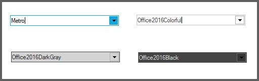
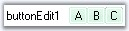

# ButtonEditAppearance in Windows Forms ButtonEdit

A [ButtonEdit](https://help.syncfusion.com/cr/windowsforms/Syncfusion.Windows.Forms.Tools.ButtonEdit.html) control is a combination of controls with textbox and buttons. The ButtonEdit control supports properties which controls the appearance and behavior of the control.



[TextBox Settings for ButtonEdit](/windowsforms/buttonedit/textboxsettingsforbuttonedit), [Child Button Customization](https://help.syncfusion.com/windowsforms/buttonedit/textboxsettingsforbuttonedit)



## Style Settings

The ButtonEdit control can be customized by following ways,

1. Button Styles.
2. Custom Colors for ButtonEdit.
3. Border Styles.

### Button Styles

Styles for the [ButtonEdit](https://help.syncfusion.com/cr/windowsforms/Syncfusion.Windows.Forms.Tools.ButtonEdit.html) control can be applied using [ButtonStyle](https://help.syncfusion.com/cr/windowsforms/Syncfusion.Windows.Forms.Tools.ButtonEdit.html#Syncfusion_Windows_Forms_Tools_ButtonEdit_ButtonStyle) property. [UseVisualStyle](https://help.syncfusion.com/cr/windowsforms/Syncfusion.Windows.Forms.Tools.ButtonEdit.html#Syncfusion_Windows_Forms_Tools_ButtonEdit_UseVisualStyle) property must be enabled before applying style for ButtonEdit.

<table>
<tr>
<th>
Properties</th><th>
Description</th></tr>
<tr>
<td>
ButtonStyle</td><td>
Specifies the button style for the control. The styles are,

Classic,

Office2000,

WindowsXP,

OfficeXP,

Office2003,

Office2007,

Metro,

Office2016Colorful,

Office2016White,

Office2016DarkGray and

Office2016Black.</td></tr>
<tr>
<td>
UseVisualStyle</td><td>
Specifies whether the visual styles can be applied using ButtonStyle property or not. This property should be set to true to make the ButtonStyle setting effective.</td></tr>
</table>




this.buttonEdit.UseVisualStyle = true;
this.buttonEdit.ButtonStyle = Syncfusion.Windows.Forms.ButtonAppearance.Office2016Colorful;





Me.buttonEdit.UseVisualStyle = True
Me.buttonEdit.ButtonStyle = Syncfusion.Windows.Forms.ButtonAppearance.Office2016Colorful




N> [ButtonEdit](https://help.syncfusion.com/cr/windowsforms/Syncfusion.Windows.Forms.Tools.ButtonEdit.html) control also supports all the three windows color themes, i.e., Blue, Silver and Oliver themes. We need to change the Windows theme color in desktop properties for this.

### Custom Colors for ButtonEdit

You can apply custom colors to the [ButtonEdit](https://help.syncfusion.com/cr/windowsforms/Syncfusion.Windows.Forms.Tools.ButtonEdit.html) Control by setting Office2007ColorScheme of individual child buttons to "_Managed_" and specifying the custom color through the ApplyManagedColors method as follows.




this.buttonEditChildButton1.Office2007ColorScheme = Syncfusion.Windows.Forms.Office2007Theme.Managed;
this.buttonEditChildButton2.Office2007ColorScheme = Syncfusion.Windows.Forms.Office2007Theme.Managed;
this.buttonEditChildButton3.Office2007ColorScheme = Syncfusion.Windows.Forms.Office2007Theme.Managed;
Office2007Colors.ApplyManagedColors(this, Color.LightGreen);





Me.buttonEditChildButton1.Office2007ColorScheme = Syncfusion.Windows.Forms.Office2007Theme.Managed
Me.buttonEditChildButton2.Office2007ColorScheme = Syncfusion.Windows.Forms.Office2007Theme.Managed
Me.buttonEditChildButton3.Office2007ColorScheme = Syncfusion.Windows.Forms.Office2007Theme.Managed
Office2007Colors.ApplyManagedColors(Me, Color.LightGreen)




### Border Styles

The border styles for the [ButtonEdit](https://help.syncfusion.com/cr/windowsforms/Syncfusion.Windows.Forms.Tools.ButtonEdit.html) control can be customized using the [Border3DStyle](https://help.syncfusion.com/cr/windowsforms/Syncfusion.Windows.Forms.Tools.ButtonEdit.html#Syncfusion_Windows_Forms_Tools_ButtonEdit_Border3DStyle), [BorderSides](https://help.syncfusion.com/cr/windowsforms/Syncfusion.Windows.Forms.Tools.ButtonEdit.html#Syncfusion_Windows_Forms_Tools_ButtonEdit_BorderSides), [FlatStyle](https://help.syncfusion.com/cr/windowsforms/Syncfusion.Windows.Forms.Tools.ButtonEdit.html#Syncfusion_Windows_Forms_Tools_ButtonEdit_FlatStyle) and [FlatBorderColor](https://help.syncfusion.com/cr/windowsforms/Syncfusion.Windows.Forms.Tools.ButtonEdit.html#Syncfusion_Windows_Forms_Tools_ButtonEdit_FlatBorderColor) properties.

<table>
<tr>
<th>
Properties</th><th>
Description</th></tr>
<tr>
<td>
Border3DStyle</td><td>
Sets the 3D border style for the control. The options are,
RaisedOuter,
RaisedInner,
SunkenOuter,
SunkenInner,
Raised,
Sunken,
Etched,
Flat,
Adjust and
Bump.</td></tr>
<tr>
<td>
BorderSides</td><td>
Specifies the sides of the control which should have border.</td></tr>
<tr>
<td>
FlatStyle</td><td>
Specifies the flat style to be applied to the ButtonEdit control. Set UseVisualStyle property to false to make this setting effective.</td></tr>
<tr>
<td>
FlatBorderColor</td><td>
Specifies the border color for the control, when FlatStyle is set to "Flat". This color setting can be reset by calling ButtonEdit.ResetFlatBorderColor method.</td></tr>
</table>




this.buttonEdit.UseVisualStyle = false;
this.buttonEdit.FlatBorderColor = System.Drawing.Color.Red;
this.buttonEdit.FlatStyle = System.Windows.Forms.FlatStyle.Flat;





Me.buttonEdit.UseVisualStyle = False
Me.buttonEdit.FlatBorderColor = System.Drawing.Color.Red;
Me.buttonEdit.FlatStyle = System.Windows.Forms.FlatStyle.Flat;




 

N> The Border styles of the child buttons can be controlled using [ButtonEditChildButton](https://help.syncfusion.com/cr/windowsforms/Syncfusion.Windows.Forms.Tools.ButtonEditChildButton.html) [BorderStyleAdv](https://help.syncfusion.com/cr/windowsforms/Syncfusion.Windows.Forms.ButtonAdv.html#Syncfusion_Windows_Forms_ButtonAdv_BorderStyleAdv) property. SeeSee Button Types and Border Styles topic for details.

## Size Settings

You can set the maximum and minimum size for the [ButtonEdit](https://help.syncfusion.com/cr/windowsforms/Syncfusion.Windows.Forms.Tools.ButtonEdit.html) control using [MaximumSize](https://help.syncfusion.com/cr/windowsforms/Syncfusion.Windows.Forms.Tools.ButtonEdit.html#Syncfusion_Windows_Forms_Tools_ButtonEdit_MaximumSize) and [MinimumSize](https://help.syncfusion.com/cr/windowsforms/Syncfusion.Windows.Forms.Tools.ButtonEdit.html#Syncfusion_Windows_Forms_Tools_ButtonEdit_MinimumSize) properties.

<table>
<tr>
<th>
Properties</th><th>
Description</th></tr>
<tr>
<td>
MaximumSize</td><td>
Sets the maximum size of the ButtonEdit control.</td></tr>
<tr>
<td>
MinimumSize</td><td>
Sets the minimum size of the ButtonEdit control.</td></tr>
</table>

## Foreground Settings

The font style and the fore color of the [ButtonEdit](https://help.syncfusion.com/cr/windowsforms/Syncfusion.Windows.Forms.Tools.ButtonEdit.html) control can be customized by [Font](https://help.syncfusion.com/cr/windowsforms/Syncfusion.Windows.Forms.Tools.ButtonEdit.html#) and [ForeColor](https://help.syncfusion.com/cr/windowsforms/Syncfusion.Windows.Forms.Tools.ButtonEdit.html#Syncfusion_Windows_Forms_Tools_ButtonEdit_ForeColor) properties. These property settings can be overridden by TextBox.Font and TextBox.ForeColor respectively.




this.buttonEdit.Font = new System.Drawing.Font("Verdana", 8.25F, System.Drawing.FontStyle.Regular);
this.buttonEdit.ForeColor = Color.SteelBlue;





Me.buttonEdit.Font = New System.Drawing.Font("Verdana", 8.25F, System.Drawing.FontStyle.Regular)
Me.buttonEdit.ForeColor = Color.SteelBlue




N> Foreground settings for the [ButtonEditChildButton](https://help.syncfusion.com/cr/windowsforms/Syncfusion.Windows.Forms.Tools.ButtonEditChildButton.html) can be specified using Font and ForeColor properties.

## Case Settings

Using [CharacterCasing](https://help.syncfusion.com/cr/windowsforms/Syncfusion.Windows.Forms.Tools.ButtonEdit.html#Syncfusion_Windows_Forms_Tools_ButtonEdit_CharacterCasing) property of [ButtonEdit](https://help.syncfusion.com/cr/windowsforms/Syncfusion.Windows.Forms.Tools.ButtonEdit.html), we can specify whether the case of the character can be modified as they are typed. The options are Upper, Lower and Normal.




buttonEdit.Text = "ButtonEdit1";
buttonEdit.CharacterCasing = CharacterCasing.Lower;





Me.buttonEdit.Text = "ButtonEdit1"
Me.buttonEdit.CharacterCasing = CharacterCasing.Lower




N> This case setting can be overridden by TextBox.CharacterCasing property.



[TextBox Settings for ButtonEdit](/windowsforms/buttonedit/textboxsettingsforbuttonedit), [Child Button Customization](http://help.syncfusion.com/windowsforms/buttonedit/textboxsettingsforbuttonedit)


