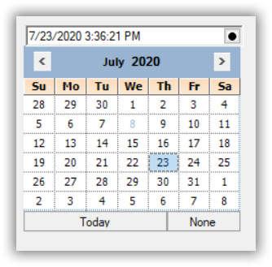

# ButtonEditEvents in Windows Forms ButtonEdit

The [ButtonEdit](https://help.syncfusion.com/cr/windowsforms/Syncfusion.Windows.Forms.Tools.ButtonEdit.html) events are discussed in the below sections.

## ButtonClicked Event

[ButtonClicked](https://help.syncfusion.com/cr/windowsforms/Syncfusion.Windows.Forms.Tools.ButtonEdit.html) event is raised whenever [ButtonEditChildButton](https://help.syncfusion.com/cr/windowsforms/Syncfusion.Windows.Forms.Tools.ButtonEditChildButton.html) control is clicked. It allows you to get the child button that is clicked. 




buttonEdit.ButtonClicked += ButtonEdit_ButtonClicked;
private void ButtonEdit_ButtonClicked(object sender, ButtonClickedEventArgs args)
{
    args.ClickedButton.ButtonAlign = ButtonAlignment.Left;
}





buttonEdit.ButtonClicked += ButtonEdit_ButtonClicked
Private Sub ButtonEdit_ButtonClicked(ByVal sender As Object, ByVal args As ButtonClickedEventArgs)
    args.ClickedButton.ButtonAlign = ButtonAlignment.Left
End Sub




## Border Events

The [Border3DStyleChanged](https://help.syncfusion.com/cr/windowsforms/Syncfusion.Windows.Forms.Tools.ButtonEdit.html) and [BorderSidesChanged](https://help.syncfusion.com/cr/windowsforms/Syncfusion.Windows.Forms.Tools.ButtonEdit.html) events are raised whenever [Border3DStyle](https://help.syncfusion.com/cr/windowsforms/Syncfusion.Windows.Forms.Tools.ButtonEdit.html#Syncfusion_Windows_Forms_Tools_ButtonEdit_Border3DStyle) and [BorderSides](https://help.syncfusion.com/cr/windowsforms/Syncfusion.Windows.Forms.Tools.ButtonEdit.html#Syncfusion_Windows_Forms_Tools_ButtonEdit_BorderSides) properties values are changed in [ButtonEdit](https://help.syncfusion.com/cr/windowsforms/Syncfusion.Windows.Forms.Tools.ButtonEdit.html) control.

<table>
<tr>
<th>
ButtonEdit Properties</th><th>
Description</th></tr>
<tr>
<td>
Border3DStyleChanged</td><td>
Raised when Border3DStyle property of ButtonEdit control is changed.</td></tr>
<tr>
<td>
BorderSidesChanged</td><td>
Raised when BorderSides property of ButtonEdit control is changed.</td></tr>
</table>




private void buttonEdit1_Border3DStyleChanged(object sender, EventArgs e)
{
    Console.WriteLine("3D border styles is changed");            
}
private void buttonEdit1_BorderSidesChanged(object sender, EventArgs e)
{
    Console.WriteLine(" Border sides is changed");           
}





Private Sub buttonEdit1_Border3DStyleChanged(ByVal sender As Object, ByVal e As EventArgs)
Console.WriteLine("3D border styles is changed")
End Sub
Private Sub buttonEdit1_BorderSidesChanged(ByVal sender As Object, ByVal e As EventArgs)
Console.WriteLine(" Border sides is changed")
End Sub




## ButtonEditChildButton Events

The below table list the events that are available for the [ButtonEditChildButton](https://help.syncfusion.com/cr/windowsforms/Syncfusion.Windows.Forms.Tools.ButtonEditChildButton.html) control.

<table>
<tr>
<th>
ButtonEditChildButton Events</th><th>
Description</th></tr>
<tr>
<td>
Click</td><td>
Occurs when the control is clicked. This event calls the ButtonEdit.HandleChildButtonClicked method. Using this method, we can access the corresponding control and customize it.</td></tr>
<tr>
<td>
TextChanged</td><td>
Raised when Text property value is changed. This event calls HandleChildButtonTextChanged method. Using this method, we can access the corresponding control and customize it.</td></tr>
<tr>
<td>
MouseDown</td><td>
Handled when the mouse is over the control and when mouse button is pressed. This event calls HandleChildButtonMouseDown. Using this method, we can access the corresponding control and customize it.</td></tr>
<tr>
<td>
MouseUp</td><td>
Handled when the mouse is over the control and mouse button is released. This event calls HandleChildButtonMouseUp. Using this method, we can access the corresponding control and customize it.</td></tr>
<tr>
<td>
MouseEnter</td><td>
Raised when the mouse pointer enters the control. This event calls HandleChildButtonMouseEnter method. Using this method, we can access the corresponding control and customize it.</td></tr>
<tr>
<td>
MouseLeave</td><td>
Raised when the mouse pointer leaves the control. This event calls HandleChildButtonMouseLeave method. Using this method, we can access the corresponding control and customize it.</td></tr>
<tr>
<td>
MouseHover</td><td>
Raised when the mouse pointer rests the control. This event calls HandleChildButtonMouseHover method. Using this method, we can access the corresponding control and customize it.</td></tr>
<tr>
<td>
BackColorChanged</td><td>
Raised when BackColor property of the ButtonEdit control is changed. This event calls HandleChildButtonBackColorChanged method. Using this method, we can access the corresponding control and customize it.</td></tr>
</table>

## Click Event

You can display CalendarPopup on [ButtonEdit](https://help.syncfusion.com/cr/windowsforms/Syncfusion.Windows.Forms.Tools.ButtonEdit.html) Child button click event. It can be done using the below steps.

1. Drag and drop TableLayoutPanel and add ButtonEdit control on first row and resize to its fit.
2. Remove unwanted columns in TableLayoutPanel.
3. Create an instance of [CalendarPopup](https://help.syncfusion.com/cr/windowsforms/Syncfusion.Windows.Forms.Tools.CalendarPopup.html) and [MonthCalendarAdv](https://help.syncfusion.com/cr/windowsforms/Syncfusion.Windows.Forms.Tools.MonthCalendarAdv.html) control and add MonthCalendarAdv in CalendarPopup.
4. Add the CalendarPopup control in second row.





public partial class Form1 : Form
{
    ButtonEditChildButton childButton = new ButtonEditChildButton()
    {
         Size = new Size(22, 22),
         Image = Image.FromFile(@"..\..\Images\Dot.png"),
    };

    CalendarPopup calendarPopup = new CalendarPopup()
    {
        AutoSize = false,
        Visible = false,
        Dock = DockStyle.Fill
    };

    MonthCalendarAdv monthCalendarAdv = new MonthCalendarAdv();
    public Form1()
    {
        InitializeComponent();
           
        childButton.Click += ChildButton_Click;

        calendarPopup.Controls.Add(monthCalendarAdv);
        buttonEdit1.Buttons.Add(childButton);
        tableLayoutPanel1.Controls.Add(calendarPopup, 0, 1);
        monthCalendarAdv.DateSelected += MonthCalendarAdv_DateSelected;
    }
}





Public Partial Class Form1
    Inherits Form

    Private childButton As ButtonEditChildButton = New ButtonEditChildButton() With {
        .Size = New Size(22, 22),
        .Image = Image.FromFile("..\..\Images\Dot.png")
    }
    Private calendarPopup As CalendarPopup = New CalendarPopup() With {
        .AutoSize = False,
        .Visible = False,
        .Dock = DockStyle.Fill
    }
    Private monthCalendarAdv As MonthCalendarAdv = New MonthCalendarAdv()

    Public Sub New()
        InitializeComponent()
        childButton.Click += ChildButton_Click
        calendarPopup.Controls.Add(monthCalendarAdv)
        buttonEdit1.Buttons.Add(childButton)
        tableLayoutPanel1.Controls.Add(calendarPopup, 0, 1)
        monthCalendarAdv.DateSelected += MonthCalendarAdv_DateSelected
    End Sub
End Class




{{ codesnippet1 | OrderList_Indent_Level_1 }}

5. Handle the Click event of buttonEditChildButton1 to display the Calendar as follows.





private void ChildButton_Click(object sender, EventArgs e)
{
    calendarPopup.Visible = true;
}




Private Sub ChildButton_Click(ByVal sender As Object, ByVal e As EventArgs)
    calendarPopup.Visible = True
End Sub




{{ codesnippet2 | OrderList_Indent_Level_1 }}

6. The event DateSelected can also be handled to display the selected date in the textbox of ButtonEdit control.
   




private void MonthCalendarAdv_DateSelected(object sender, EventArgs e)
{
    buttonEdit1.TextBox.Text = monthCalendarAdv.Value.ToString();
    calendarPopup.Visible = false;
}





Private Sub MonthCalendarAdv_DateSelected(ByVal sender As Object, ByVal e As EventArgs)
    buttonEdit1.TextBox.Text = monthCalendarAdv.Value.ToString()
    calendarPopup.Visible = False
End Sub




{{ codesnippet3 | OrderList_Indent_Level_1 }}

N> Download Demo sample from[GitHub](https://github.com/SyncfusionExamples/How-to-create-a-DatePicker-in-Winforms-using-ButtonEdit-and-MonthCalendarAdv)
