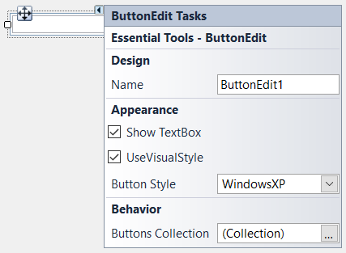

---
layout: post
title: DesignTime Features in Windows Forms ButtonEdit control | Syncfusion®
description: Design-time features in ButtonEdit provide smart tag support for configuring appearance, images, borders, and child button collections.
platform: windowsforms
control: Tools
documentation: ug
---

# DesignTime Features in Windows Forms ButtonEdit

[ButtonEdit](https://help.syncfusion.com/cr/windowsforms/Syncfusion.Windows.Forms.Tools.ButtonEdit.html) control has Smart Tag, which lets you customize the properties easily.

 

The various settings that can be customized by this window are as follows.

* Name - Lets you edit the control text.
* UseVisualStyle - Enables visual style settings.
* BorderStyle - Lets you to set the border styles for the control.
* Image - Lets you to set the image for the ButtonAdv control.
* ButtonsCollection - Opens ButtonEditChildButton Collection Editor window to add ButtonEditChildButtons.
