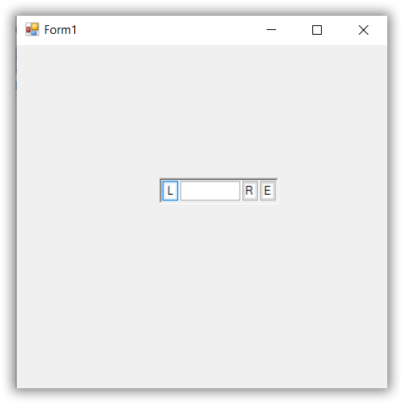

# Getting Started with Windows Forms ButtonEdit

This section briefly describes how to create a new Windows Forms project in Visual Studio and add [ButtonEdit](https://help.syncfusion.com/cr/windowsforms/Syncfusion.Windows.Forms.Tools.ButtonEdit.html) with it's basic functionalities.

## Assembly deployment

Refer to the [control dependencies](https://help.syncfusion.com/windowsforms/control-dependencies#buttonedit) section to get the list of assemblies or NuGet package details which needs to be added as reference to use the control in any application.

[Check here](https://help.syncfusion.com/windowsforms/visual-studio-integration/nuget-packages) to find more details on how to install nuget packages in Windows Forms application.

## Creating Application with ButtonEdit
In this walk through, users will create WinForms application that contains [ButtonEdit](https://help.syncfusion.com/cr/windowsforms/Syncfusion.Windows.Forms.Tools.ButtonEdit.html) control.

### Creating the Project
Create new Windows Forms Project in Visual Studio to display [ButtonEdit](https://help.syncfusion.com/cr/windowsforms/Syncfusion.Windows.Forms.Tools.ButtonEdit.html) control.

### Adding a ButtonEdit control through designer

**Step 1**: Create a new Windows Forms application in Visual Studio. Drag and drop the [ButtonEdit](https://help.syncfusion.com/cr/windowsforms/Syncfusion.Windows.Forms.Tools.ButtonEdit.html) from toolbox in Form designer window. The [dependent assemblies](https://help.syncfusion.com/windowsforms/control-dependencies#buttonedit) will be added automatically.

 

**Step 2**: Set the desired properties for [ButtonEdit](https://help.syncfusion.com/cr/windowsforms/Syncfusion.Windows.Forms.Tools.ButtonEdit.html) control using the **"Properties"** dialog window. 

**Step 3**: You can add the child buttons for the [ButtonEdit](https://help.syncfusion.com/cr/windowsforms/Syncfusion.Windows.Forms.Tools.ButtonEdit.html) using **ButtonEditChildButton Collection Editor"** dialog box.

### Adding ButtonEdit control through Code

In order to add [ButtonEdit](https://help.syncfusion.com/cr/windowsforms/Syncfusion.Windows.Forms.Tools.ButtonEdit.html) control manually, do the below steps,

1) 	Add the required [assembly references](https://help.syncfusion.com/windowsforms/control-dependencies#buttonedit) to the project.

2)	Create the [ButtonEdit](https://help.syncfusion.com/cr/windowsforms/Syncfusion.Windows.Forms.Tools.ButtonEdit.html) control instance and add it to the Form.





using Syncfusion.Windows.Forms.Tools;





Imports Syncfusion.Windows.Forms.Tools

   


   




public Form1()
{            
    InitializeComponent();
    ButtonEdit buttonEdit = new ButtonEdit();
    buttonEdit.Location = new System.Drawing.Point(367, 135);
    buttonEdit.Name = "buttonEdit1";
    buttonEdit.Text = buttonEdit.Name;
    buttonEdit.Size = new System.Drawing.Size(121, 21);
    this.Controls.Add(buttonEdit);
}





Public Sub New()

    InitializeComponent()
    Dim ButtonEdit As buttonEdit = New ButtonEdit()
    buttonEdit.Location = New System.Drawing.Point(367, 135)
    buttonEdit.Name = "buttonEdit1"
    buttonEdit.Text = buttonEdit.Name
    buttonEdit.Size = New System.Drawing.Size(121, 21)
    Me.Controls.Add(buttonEdit)
    
End Sub





## Embed the TextBox and ChildButtons in ButtonEdit control

[ButtonEdit](https://help.syncfusion.com/cr/windowsforms/Syncfusion.Windows.Forms.Tools.ButtonEdit.html) control is a combination of textbox and buttons. It contains [TextBox](https://help.syncfusion.com/cr/windowsforms/Syncfusion.Windows.Forms.Tools.ButtonEdit.html#Syncfusion_Windows_Forms_Tools_ButtonEdit_TextBox) property to embed the instance of the textbox control. Also, we can set different types of textbox such as PercentTextBox, IntegerTextBox, etc. Meanwhile we can add child buttons in [Buttons](https://help.syncfusion.com/cr/windowsforms/Syncfusion.Windows.Forms.Tools.ButtonEdit.html#Syncfusion_Windows_Forms_Tools_ButtonEdit_Buttons) collection.





public Form1()
{
            
    InitializeComponent();
    TextBoxExt textBoxExt1;
    ButtonEditChildButton ButtonEditChildButton1;
    ButtonEditChildButton ButtonEditChildButton2;
    ButtonEditChildButton ButtonEditChildButton3;
    ButtonEdit buttonEdit = new ButtonEdit();
    buttonEdit.Location = new System.Drawing.Point(145, 135);
    buttonEdit.Name = "ButtonEdit1";
    buttonEdit.Size = new System.Drawing.Size(121, 21);
    textBoxExt1 = new TextBoxExt();
    ButtonEditChildButton1 = new ButtonEditChildButton();
    ButtonEditChildButton2 = new ButtonEditChildButton();
    ButtonEditChildButton3 = new ButtonEditChildButton();

    //Embedding text in TextBox
    buttonEdit.TextBox = textBoxExt1;
    buttonEdit.Controls.Add(textBoxExt1);

    //Aligning the child button
    ButtonEditChildButton1.ButtonAlign = ButtonAlignment.Left;

    //Setting text for child buttons
    ButtonEditChildButton1.Text = "L";
    ButtonEditChildButton2.Text = "R";
    ButtonEditChildButton3.Text = "E";

    //Adding child buttons 
    buttonEdit.Buttons.Add(ButtonEditChildButton1);
    buttonEdit.Buttons.Add(ButtonEditChildButton2);
    buttonEdit.Buttons.Add(ButtonEditChildButton3);
    this.Controls.Add(buttonEdit);

}





Public Sub New()

    InitializeComponent()
    Dim textBoxExt1 As TextBoxExt
    Dim ButtonEditChildButton1 As ButtonEditChildButton
    Dim ButtonEditChildButton2 As ButtonEditChildButton
    Dim ButtonEditChildButton3 As ButtonEditChildButton
    Dim ButtonEdit As buttonEdit = New ButtonEdit()
    buttonEdit.Location = New System.Drawing.Point(367, 135)
    buttonEdit.Name = "ButtonEdit1"
    buttonEdit.Size = New System.Drawing.Size(121, 21)
    textBoxExt1 = New TextBoxExt()
    ButtonEditChildButton1 = New ButtonEditChildButton()
    ButtonEditChildButton2 = New ButtonEditChildButton()
    ButtonEditChildButton3 = New ButtonEditChildButton()

    'Embedding text in TextBox
    buttonEdit.TextBox = textBoxExt1
    buttonEdit.Controls.Add(Me.textBoxExt1)
    ButtonEditChildButton1.ButtonAlign = ButtonAlignment.Left

    'Setting text for child buttons
    ButtonEditChildButton1.Text = "L"
    ButtonEditChildButton2.Text = "R"
    ButtonEditChildButton3.Text = "E"

    'Adding child buttons 
    buttonEdit.Buttons.Add(ButtonEditChildButton1)
    buttonEdit.Buttons.Add(ButtonEditChildButton2)
    buttonEdit.Buttons.Add(ButtonEditChildButton3)
    Me.Controls.Add(buttonEdit)

End Sub





