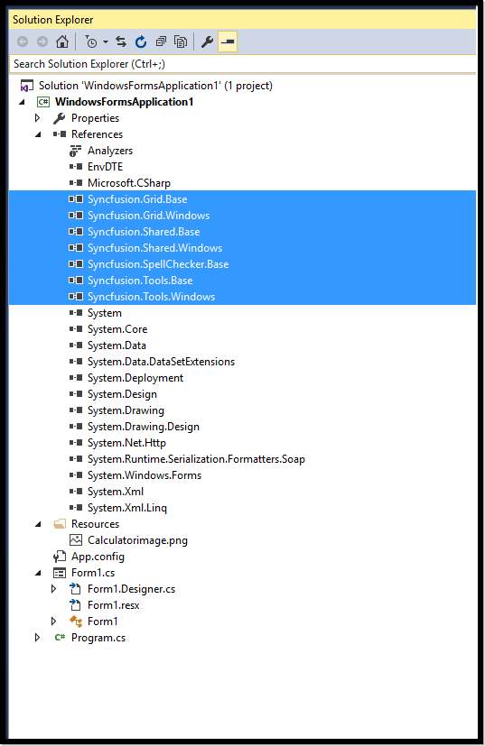
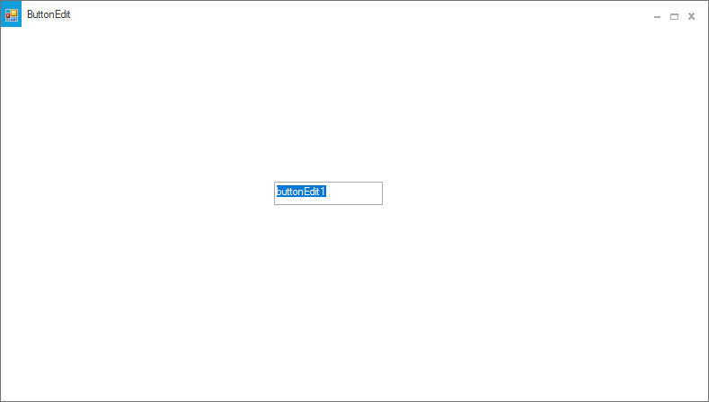
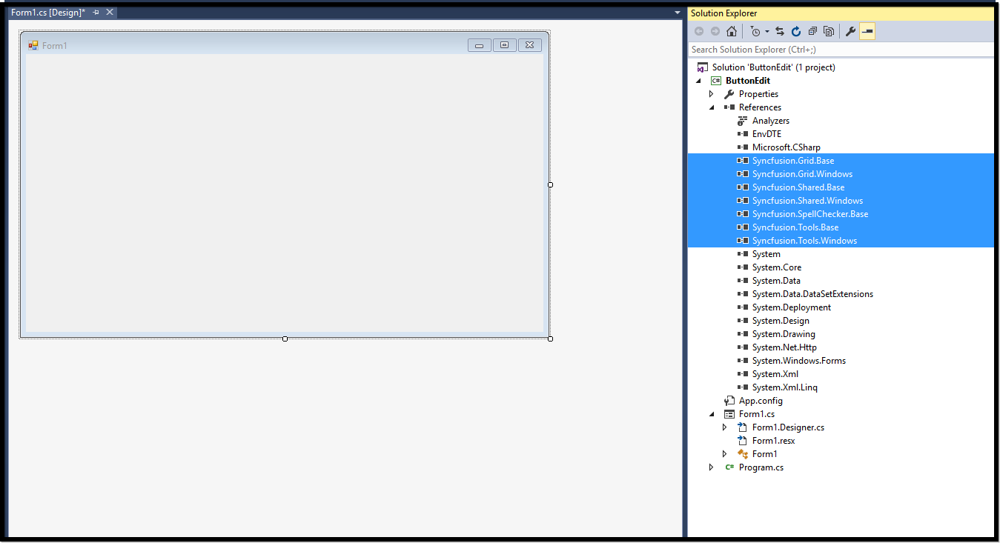
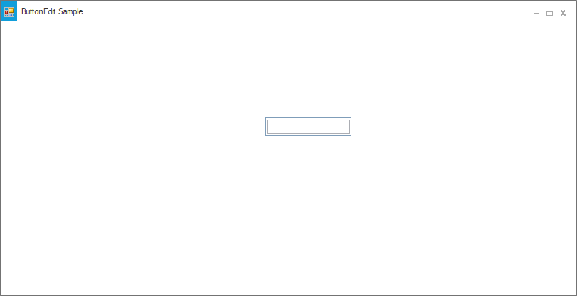
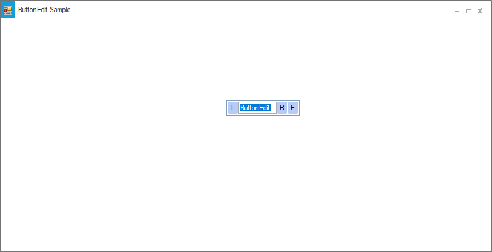

# Getting Started

This section briefly describes how to create a new Windows Forms project in Visual Studio and add **"ButtonEdit"** with it's basic functionalities.

## Assembly deployment

Refer to the [control dependencies](https://help.syncfusion.com/windowsforms/control-dependencies#buttonedit) section to get the list of assemblies or NuGet package details which needs to be added as reference to use the control in any application.

[Click here](https://help.syncfusion.com/windowsforms/nuget-packages) to find more details on how to install nuget packages in Windows Forms application.

## Adding a ButtonEdit control through designer

**Step 1**: Create a new Windows Forms application in Visual Studio. Drag and drop the ButtonEdit from toolbox into form design view. The following dependent assemblies will be added automatically.

* Syncfusion.Grid.Base
* Syncfusion.Grid.Windows
* Syncfusion.Shared.Base
* Syncfusion.Shared.Windows
* Syncfusion.Tools.Base
* Syncfusion.Tools.Windows

 

 

 

**Step 2**: When the control is initially added to the form, it appears like an edit control with no buttons. Set the desired properties for **"ButtonEdit"** control using the **"Properties"** dialog window. Similarly you can add the child buttons for the ButtonEdit using **ButtonEditChildButton Collection Editor"** property. Here, we have illustrated how to add child buttons and how to access the ButtonEdit properties.

**Step 3**: Run the application and the following output will be shown:

## Adding a ButtonEdit control through Code

**Step 1**:  Create a new Windows Forms application in Visual Studio. Add the following required assembly references and namespace to the project. 

* Syncfusion.Grid.Base
* Syncfusion.Grid.Windows
* Syncfusion.Shared.Base
* Syncfusion.Shared.Windows
* Syncfusion.Tools.Base
* Syncfusion.Tools.Windows





using Syncfusion.Windows.Forms.Tools;





Imports Syncfusion.Windows.Forms.Tools

   


   

**Step 2**: In Form1.cs, create an instance of **"ButtonEdit"** control and add in to the form. Also you can customize the ButtonEdit properties using the following code.





public Form1()
{
            
            InitializeComponent();
            ButtonEdit ButtonEdit = new ButtonEdit();
            ButtonEdit.UseVisualStyle = true;
            ButtonEdit.ThemeName = "Office2019Colorful";
            ButtonEdit.Location = new System.Drawing.Point(367, 135);
            ButtonEdit.Name = "buttonEdit1";
            ButtonEdit.Size = new System.Drawing.Size(121, 21);
            this.Controls.Add(ButtonEdit);

}





Public Sub New()

    InitializeComponent()
    Dim ButtonEdit As ButtonEdit = New ButtonEdit()
    ButtonEdit.UseVisualStyle = True
    ButtonEdit.ThemeName = "Office2019Colorful"
    ButtonEdit.Location = New System.Drawing.Point(367, 135)
    ButtonEdit.Name = "buttonEdit1"
    ButtonEdit.Size = New System.Drawing.Size(121, 21)
    Me.Controls.Add(ButtonEdit)
    
End Sub





**Step 3**: Run the application and the following output will be shown.

## Embed the TextBox and ChildButtons to ButtonEdit control

ButtonEdit control is a combination of textbox and buttons. It contains **TextBox** property to embed the instance of the textbox control. Also, we can set different types of textbox such as PercentTextBox, IntegerTextBox, etc. Meanwhile we can add child buttons in **Buttons** collection.





public Form1()
{
            
            InitializeComponent();
            Syncfusion.Windows.Forms.Tools.TextBoxExt textBoxExt1;
            Syncfusion.Windows.Forms.Tools.ButtonEditChildButton ButtonEditChildButton1;
            Syncfusion.Windows.Forms.Tools.ButtonEditChildButton ButtonEditChildButton2;
            Syncfusion.Windows.Forms.Tools.ButtonEditChildButton ButtonEditChildButton3;
            ButtonEdit ButtonEdit = new ButtonEdit();
            ButtonEdit.UseVisualStyle = true;
            ButtonEdit.ThemeName = "Office2019Colorful";
            ButtonEdit.Location = new System.Drawing.Point(367, 135);
            ButtonEdit.Name = "ButtonEdit1";
            ButtonEdit.Size = new System.Drawing.Size(121, 21);
            textBoxExt1 = new Syncfusion.Windows.Forms.Tools.TextBoxExt();
            ButtonEditChildButton1 = new ButtonEditChildButton();
            ButtonEditChildButton2 = new ButtonEditChildButton();
            ButtonEditChildButton3 = new ButtonEditChildButton();
            //Embedding text in TextBox
            ButtonEdit.TextBox = textBoxExt1;
            ButtonEdit.Controls.Add(this.textBoxExt1);
            //Aligning the child button
            ButtonEditChildButton1.ButtonAlign = ButtonAlignment.Left;
            //Setting text for child buttons
            ButtonEditChildButton1.Text = "L";
            ButtonEditChildButton2.Text = "R";
            ButtonEditChildButton3.Text = "E";
            //Adding child buttons 
            ButtonEdit.Buttons.Add(ButtonEditChildButton1);
            ButtonEdit.Buttons.Add(ButtonEditChildButton2);
            ButtonEdit.Buttons.Add(ButtonEditChildButton3);
            this.Controls.Add(ButtonEdit);

}





Public Sub New()

    InitializeComponent()
    Dim textBoxExt1 As Syncfusion.Windows.Forms.Tools.TextBoxExt
    Dim ButtonEditChildButton1 As Syncfusion.Windows.Forms.Tools.ButtonEditChildButton
    Dim ButtonEditChildButton2 As Syncfusion.Windows.Forms.Tools.ButtonEditChildButton
    Dim ButtonEditChildButton3 As Syncfusion.Windows.Forms.Tools.ButtonEditChildButton
    Dim ButtonEdit As ButtonEdit = New ButtonEdit()
    ButtonEdit.UseVisualStyle = True
    ButtonEdit.ThemeName = "Office2019Colorful"
    ButtonEdit.Location = New System.Drawing.Point(367, 135)
    ButtonEdit.Name = "ButtonEdit1"
    ButtonEdit.Size = New System.Drawing.Size(121, 21)
    textBoxExt1 = New Syncfusion.Windows.Forms.Tools.TextBoxExt()
    ButtonEditChildButton1 = New ButtonEditChildButton()
    ButtonEditChildButton2 = New ButtonEditChildButton()
    ButtonEditChildButton3 = New ButtonEditChildButton()
    'Embedding text in TextBox
    ButtonEdit.TextBox = textBoxExt1
    ButtonEdit.Controls.Add(Me.textBoxExt1)
    ButtonEditChildButton1.ButtonAlign = ButtonAlignment.Left
    ButtonEditChildButton1.Text = "L"
    ButtonEditChildButton2.Text = "R"
    ButtonEditChildButton3.Text = "E"
    'Adding child buttons 
    ButtonEdit.Buttons.Add(ButtonEditChildButton1)
    ButtonEdit.Buttons.Add(ButtonEditChildButton2)
    ButtonEdit.Buttons.Add(ButtonEditChildButton3)
    Me.Controls.Add(ButtonEdit)

End Sub




