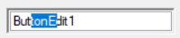

# TextBoxSettingsForButtonEdit in Windows Forms ButtonEdit

The default textbox within the [ButtonEdit](https://help.syncfusion.com/cr/windowsforms/Syncfusion.Windows.Forms.Tools.ButtonEdit.html) control can be replaced with any custom textbox like [PercentTextBox](https://help.syncfusion.com/windowsforms/percent-textbox/overview), [IntegerTextBox](https://help.syncfusion.com/windowsforms/integer-textbox/overview), and so on. The embedded textbox of a ButtonEdit control can shown by [ShowTextBox](https://help.syncfusion.com/cr/windowsforms/Syncfusion.Windows.Forms.Tools.ButtonEdit.html#Syncfusion_Windows_Forms_Tools_ButtonEdit_ShowTextBox) property and customized by [SelectionLength](https://help.syncfusion.com/cr/windowsforms/Syncfusion.Windows.Forms.Tools.ButtonEdit.html#Syncfusion_Windows_Forms_Tools_ButtonEdit_SelectionLength) and [SelectionStart](https://help.syncfusion.com/cr/windowsforms/Syncfusion.Windows.Forms.Tools.ButtonEdit.html#Syncfusion_Windows_Forms_Tools_ButtonEdit_SelectionStart) properties.

<table>
<tr>
<th>
ButtonEdit Properties</th><th>
Description</th></tr>
<tr>
<td>
ShowTextBox</td><td>
Indicates whether the embedded TextBox is visible in the ButtonEdit control. This property setting can be reset to default by calling ResetShowTextBox method.</td></tr>
<tr>
<td>
SelectionLength</td><td>
Sets the selection length of the embedded TextBox. This property setting can be reset to default by calling ResetSelectionLength method.</td></tr>
<tr>
<td>
SelectionStart</td><td>
Sets the SelectionStart property of the ButtonEdit control which is same as the TextBoxBase.SelectionStart of the embedded TextBox. This property setting can be reset to default by calling ResetSelectionStart method.</td></tr>
</table>




this.buttonEdit1.SelectionLength = 1;
this.buttonEdit1.SelectionStart = 3;
this.buttonEdit1.ShowTexBox = true;





Me.buttonEdit1.SelectionLength = 1
Me.buttonEdit1.SelectionStart = 3
Me.buttonEdit1.ShowTexBox = True




 N> To increase the height of the [ButtonEdit](https://help.syncfusion.com/cr/windowsforms/Syncfusion.Windows.Forms.Tools.ButtonEdit.html) control, by enabling the Multiline property of `ButtonEdit.TextBox`.

 
