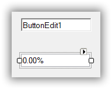
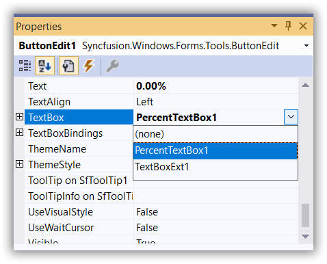
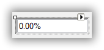

# How to Replace the Default TextBox in a ButtonEdit Control

You can replace the default TextBox of the [ButtonEdit](https://help.syncfusion.com/cr/windowsforms/Syncfusion.Windows.Forms.Tools.ButtonEdit.html) control with other TextBox by doing the following steps.

1. Drag a ButtonEdit control and a [PercentTextBox](https://help.syncfusion.com/windowsforms/percent-textbox/overview) control that you would like to replace with the default TextBox of the ButtonEdit control.

2. From the property window of ButtonEdit, select the PercentTextBox to be the TextBox control of the ButtonEdit control. 





buttonEdit.TextBox = new PercentTextBox();





buttonEdit.TextBox = new PercentTextBox()




{{ codesnippet1 | OrderList_Indent_Level_1 }}

 

3. From the same properties window, you can set the percent properties for the ButtonEdit control.

 

 
