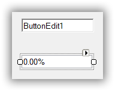
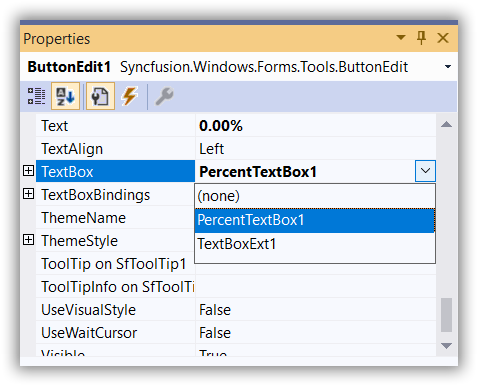
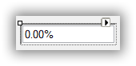

# How to Replace the Default TextBox in Windows Forms ButtonEdit

You can replace the default TextBox of the [WinForms ButtonEdit](https://help.syncfusion.com/cr/windowsforms/Syncfusion.Windows.Forms.Tools.ButtonEdit.html) control with other TextBox by doing the following steps.

1. Drag a WinForms ButtonEdit control and a [PercentTextBox](https://help.syncfusion.com/windowsforms/percent-textbox/overview) control that you would like to replace with the default TextBox of the WinForms ButtonEdit control.

2. From the property window of WinForms ButtonEdit, select the PercentTextBox to be the TextBox control of the WinForms ButtonEdit control. 





buttonEdit.TextBox = new PercentTextBox();





buttonEdit.TextBox = new PercentTextBox()




{{ codesnippet1 | OrderList_Indent_Level_1 }}

 

3. From the same properties window, you can set the percent properties for the WinForms ButtonEdit control.

 

 
