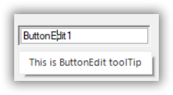

# How to Set Tooltip for ButtonEdit Child Buttons

 To set tooltip for a child button in a [ButtonEdit](https://help.syncfusion.com/cr/windowsforms/Syncfusion.Windows.Forms.Tools.ButtonEdit.html) control, drag and drop a [SfToolTip](https://help.syncfusion.com/cr/windowsforms/Syncfusion.Windows.Forms.SfToolTip.html) control from the toolbox. Text for tooltip is set using the extender property of the particular child button in Properties window.

  

You can also set the Tooltip for ButtonEdit control programmatically using its [SetToolTip](https://help.syncfusion.com/cr/windowsforms/Syncfusion.Windows.Forms.SfToolTip.html#Syncfusion_Windows_Forms_SfToolTip_SetToolTip_System_Windows_Forms_Control_System_String_) method of SfToolTip control.




toolTip.SetToolTip(buttonEdit.Buttons[0], "Child button toolTip");





toolTip.SetToolTip(buttonEdit.Buttons[0], "Child button toolTip")




  

