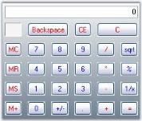
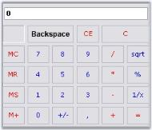

# Calculator Appearance in Windows Forms Calculator

This section will walk you through the different appearance settings for the [Calculator control](https://help.syncfusion.com/cr/windowsforms/Syncfusion.Windows.Forms.Tools.CalculatorControl.html).

* [Layout Modes](https://help.syncfusion.com/cr/windowsforms/Syncfusion.Windows.Forms.Tools.CalculatorControl.html#Syncfusion_Windows_Forms_Tools_CalculatorControl_LayoutType) - Layout of the components in a [Calculator control](https://help.syncfusion.com/cr/windowsforms/Syncfusion.Windows.Forms.Tools.CalculatorControl.html).
* Background Settings - Background settings for the control.
* Border Styles - Border for the control.
* Button Spacing - Spacing between the Calculator buttons.
* Button Foreground - Foreground settings for the buttons.

## Layout Modes

The [Calculator control](https://help.syncfusion.com/cr/windowsforms/Syncfusion.Windows.Forms.Tools.CalculatorControl.html) can be laid out in the following modes.

* WindowsStandard Mode - Modeled with windows standard layout(Default) and
* Financial Mode - Modeled with windows financial layout.



this.calculatorControl1.LayoutType = Syncfusion.Windows.Forms.Tools.CalculatorLayoutTypes.Financial;


Me.calculatorControl1.LayoutType = Syncfusion.Windows.Forms.Tools.CalculatorLayoutTypes.Financial



 

N> We can set different button styles for the Calculator control, using [CalculatorControl.ButtonStyle](https://help.syncfusion.com/cr/windowsforms/Syncfusion.Windows.Forms.Tools.CalculatorControl.html#Syncfusion_Windows_Forms_Tools_CalculatorControl_ButtonStyle) property. Refer_ Themes and Button Styles _topic to know more. [ButtonStyles](https://help.syncfusion.com/cr/windowsforms/Syncfusion.Windows.Forms.Tools.CalculatorControl.html#Syncfusion_Windows_Forms_Tools_CalculatorControl_ButtonStyle) can be applied to both the [layout modes](https://help.syncfusion.com/cr/windowsforms/Syncfusion.Windows.Forms.Tools.CalculatorControl.html#Syncfusion_Windows_Forms_Tools_CalculatorControl_LayoutType).

## Background Settings

Background settings for a Calculator control is discussed in this section.

### Background Color

The background of the Calculator can be painted using the below properties.

* [BackColor](https://docs.microsoft.com/en-us/dotnet/api/system.windows.forms.control.backcolor?redirectedfrom=MSDN&view=netframework-4.7.2#System_Windows_Forms_Control_BackColor)
* [BackgroundColor](https://help.syncfusion.com/cr/windowsforms/Syncfusion.Windows.Forms.Tools.CalculatorControl.html#Syncfusion_Windows_Forms_Tools_CalculatorControl_BackgroundColor)



this.calculatorControl1.BackColor = System.Drawing.Color.WhiteSmoke;
this.calculatorControl1.BackgroundColor = new Syncfusion.Drawing.BrushInfo(Syncfusion.Drawing.GradientStyle.Vertical, System.Drawing.Color.WhiteSmoke, System.Drawing.Color.SlateGray);


Me.calculatorControl1.BackColor = System.Drawing.Color.WhiteSmoke
Me.calculatorControl1.BackgroundColor = New Syncfusion.Drawing.BrushInfo(Syncfusion.Drawing.GradientStyle.Vertical, System.Drawing.Color.WhiteSmoke, System.Drawing.Color.SlateGray)



 

### Background Image

The background of the Calculator control can be filled with an image using [BackgroundImage](https://docs.microsoft.com/en-us/dotnet/api/system.windows.forms.control.backgroundimage?redirectedfrom=MSDN&view=netframework-4.7.2#System_Windows_Forms_Control_BackgroundImage) property.



this.calculatorControl1.BackgroundImage = ((System.Drawing.Image)(resources.GetObject("calculatorControl1.BackgroundImage")));
this.calculatorControl1.BackgroundImageLayout = System.Windows.Forms.ImageLayout.Center;


Me.calculatorControl1.BackgroundImage = DirectCast((resources.GetObject("calculatorControl1.BackgroundImage")), System.Drawing.Image) 
Me.calculatorControl1.BackgroundImageLayout = System.Windows.Forms.ImageLayout.Center



 

## Border Styles

The [BorderStyle](https://help.syncfusion.com/cr/windowsforms/Syncfusion.Windows.Forms.Tools.CalculatorControl.html#Syncfusion_Windows_Forms_Tools_CalculatorControl_BorderStyle) property used to specify the border style for the [Calculator control](https://help.syncfusion.com/cr/windowsforms/Syncfusion.Windows.Forms.Tools.CalculatorControl.html).



this.calculatorControl1.BorderStyle = System.Windows.Forms.Border3DStyle.Etched;


this.calculatorControl1.BorderStyle = System.Windows.Forms.Border3DStyle.Etched;



 

## Button Spacing

The default spacing between the Calculator buttons can be modified by enabling [UseVerticalAndHorizontalSpacing](https://help.syncfusion.com/cr/windowsforms/Syncfusion.Windows.Forms.Tools.CalculatorControl.html#Syncfusion_Windows_Forms_Tools_CalculatorControl_UseVerticalAndHorizontalSpacing) property. 



this.calculatorControl1.UseVerticalAndHorizontalSpacing = true;
this.calculatorControl1.HorizontalSpacing = 5;
this.calculatorControl1.VerticalSpacing = 5;


Me.calculatorControl1.UseVerticalAndHorizontalSpacing = True
Me.calculatorControl1.HorizontalSpacing = 5
Me.calculatorControl1.VerticalSpacing = 5



 

## Button Foreground

Using [SetButtonFont](https://help.syncfusion.com/cr/windowsforms/Syncfusion.Windows.Forms.Tools.CalculatorControl.html#Syncfusion_Windows_Forms_Tools_CalculatorControl_SetButtonFont_Syncfusion_Windows_Forms_Tools_CalcActions_System_Drawing_Font_) and [SetButtonColor](https://help.syncfusion.com/cr/windowsforms/Syncfusion.Windows.Forms.Tools.CalculatorControl.html#Syncfusion_Windows_Forms_Tools_CalculatorControl_SetButtonColor_Syncfusion_Windows_Forms_Tools_CalcActions_System_Drawing_Color_) properties, we can set the font style and color for the button text. The button can be identified using [CalcActions](https://help.syncfusion.com/cr/windowsforms/Syncfusion.Windows.Forms.Tools.CalcActions.html) enumerator.



this.calculatorControl1.SetButtonColor(CalcActions.CalcSpecialBackspace, Color.Black);
this.calculatorControl1.SetButtonFont(CalcActions.CalcSpecialBackspace, new Font("Arial", 9, FontStyle.Bold));


Me.calculatorControl1.SetButtonColor(CalcActions.CalcSpecialBackspace, Color.Black);
Me.calculatorControl1.SetButtonFont(CalcActions.CalcSpecialBackspace, New Font("Arial", 9, FontStyle.Bold))



 
