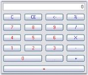
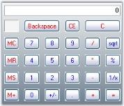
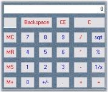
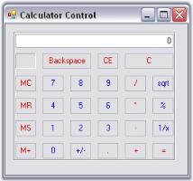
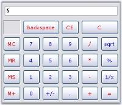
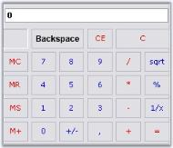

# Calculator Appearance in WinForms Calculator

This section will walk you through the different appearance settings for the [WinForms Calculator control](https://help.syncfusion.com/cr/windowsforms/Syncfusion.Windows.Forms.Tools.CalculatorControl.html).

* [Layout Modes](https://help.syncfusion.com/cr/windowsforms/Syncfusion.Windows.Forms.Tools.CalculatorControl.html#Syncfusion_Windows_Forms_Tools_CalculatorControl_LayoutType) - Layout of the components in a [WinForms Calculator control](https://help.syncfusion.com/cr/windowsforms/Syncfusion.Windows.Forms.Tools.CalculatorControl.html).
* Background Settings - Background settings for the control.
* Border Styles - Border for the control.
* Button Spacing - Spacing between the Calculator buttons.
* Button Foreground - Foreground settings for the buttons.

## Layout Modes

The [WinForms Calculator control](https://help.syncfusion.com/cr/windowsforms/Syncfusion.Windows.Forms.Tools.CalculatorControl.html) can be laid out in the following modes.

* WindowsStandard Mode - Modeled with windows standard layout(Default) and
* Financial Mode - Modeled with windows financial layout.



this.calculatorControl1.LayoutType = Syncfusion.Windows.Forms.Tools.CalculatorLayoutTypes.Financial;


Me.calculatorControl1.LayoutType = Syncfusion.Windows.Forms.Tools.CalculatorLayoutTypes.Financial



N> We can set different button styles for the WinForms Calculator control using the [CalculatorControl.ButtonStyle](https://help.syncfusion.com/cr/windowsforms/Syncfusion.Windows.Forms.Tools.CalculatorControl.html#Syncfusion_Windows_Forms_Tools_CalculatorControl_ButtonStyle) property. Refer to the [Themes and Button Styles](style-settings#themes-and-button-styles) topic to know more. [ButtonStyles](https://help.syncfusion.com/cr/windowsforms/Syncfusion.Windows.Forms.Tools.CalculatorControl.html#Syncfusion_Windows_Forms_Tools_CalculatorControl_ButtonStyle) can be applied to both the [layout modes](https://help.syncfusion.com/cr/windowsforms/Syncfusion.Windows.Forms.Tools.CalculatorControl.html#Syncfusion_Windows_Forms_Tools_CalculatorControl_LayoutType).

## Background Settings

Background settings for the WinForms Calculator control are discussed in this section.

### Background Color

The background of the WinForms Calculator can be painted using the following properties:

* [BackColor](https://docs.microsoft.com/en-us/dotnet/api/system.windows.forms.control.backcolor?redirectedfrom=MSDN&view=netframework-4.7.2#System_Windows_Forms_Control_BackColor) - Sets a single solid color.
* [BackgroundColor](https://help.syncfusion.com/cr/windowsforms/Syncfusion.Windows.Forms.Tools.CalculatorControl.html#Syncfusion_Windows_Forms_Tools_CalculatorControl_BackgroundColor) - Accepts a `Syncfusion.Drawing.BrushInfo` that supports gradients and patterns.



this.calculatorControl1.BackColor = System.Drawing.Color.WhiteSmoke;
this.calculatorControl1.BackgroundColor = new Syncfusion.Drawing.BrushInfo(Syncfusion.Drawing.GradientStyle.Vertical, System.Drawing.Color.WhiteSmoke, System.Drawing.Color.SlateGray);


Me.calculatorControl1.BackColor = System.Drawing.Color.WhiteSmoke
Me.calculatorControl1.BackgroundColor = New Syncfusion.Drawing.BrushInfo(Syncfusion.Drawing.GradientStyle.Vertical, System.Drawing.Color.WhiteSmoke, System.Drawing.Color.SlateGray)



### Background Image

The background of the WinForms Calculator control can be filled with an image using [BackgroundImage](https://docs.microsoft.com/en-us/dotnet/api/system.windows.forms.control.backgroundimage?redirectedfrom=MSDN&view=netframework-4.7.2#System_Windows_Forms_Control_BackgroundImage) property.



this.calculatorControl1.BackgroundImage = ((System.Drawing.Image)(resources.GetObject("calculatorControl1.BackgroundImage")));
this.calculatorControl1.BackgroundImageLayout = System.Windows.Forms.ImageLayout.Center;


Me.calculatorControl1.BackgroundImage = DirectCast((resources.GetObject("calculatorControl1.BackgroundImage")), System.Drawing.Image)
Me.calculatorControl1.BackgroundImageLayout = System.Windows.Forms.ImageLayout.Center



## Border Styles

The [BorderStyle](https://help.syncfusion.com/cr/windowsforms/Syncfusion.Windows.Forms.Tools.CalculatorControl.html#Syncfusion_Windows_Forms_Tools_CalculatorControl_BorderStyle) property specifies the border style for the [WinForms Calculator control](https://help.syncfusion.com/cr/windowsforms/Syncfusion.Windows.Forms.Tools.CalculatorControl.html). Add the `using System.Windows.Forms;` (C#) / `Imports System.Windows.Forms` (VB) directive at the top of the code file to access the `Border3DStyle` enumeration.



this.calculatorControl1.BorderStyle = System.Windows.Forms.Border3DStyle.Etched;


Me.calculatorControl1.BorderStyle = System.Windows.Forms.Border3DStyle.Etched



## Button Spacing

The default spacing between the WinForms Calculator buttons can be modified by enabling [UseVerticalAndHorizontalSpacing](https://help.syncfusion.com/cr/windowsforms/Syncfusion.Windows.Forms.Tools.CalculatorControl.html#Syncfusion_Windows_Forms_Tools_CalculatorControl_UseVerticalAndHorizontalSpacing) property. 



this.calculatorControl1.UseVerticalAndHorizontalSpacing = true;
this.calculatorControl1.HorizontalSpacing = 5;
this.calculatorControl1.VerticalSpacing = 5;


Me.calculatorControl1.UseVerticalAndHorizontalSpacing = True
Me.calculatorControl1.HorizontalSpacing = 5
Me.calculatorControl1.VerticalSpacing = 5



## Button Foreground

Using the [SetButtonFont](https://help.syncfusion.com/cr/windowsforms/Syncfusion.Windows.Forms.Tools.CalculatorControl.html#Syncfusion_Windows_Forms_Tools_CalculatorControl_SetButtonFont_Syncfusion_Windows_Forms_Tools_CalcActions_System_Drawing_Font_) and [SetButtonColor](https://help.syncfusion.com/cr/windowsforms/Syncfusion.Windows.Forms.Tools.CalculatorControl.html#Syncfusion_Windows_Forms_Tools_CalculatorControl_SetButtonColor_Syncfusion_Windows_Forms_Tools_CalcActions_System_Drawing_Color_) methods, we can set the font style and color for the button text. The button is identified using the [CalcActions](https://help.syncfusion.com/cr/windowsforms/Syncfusion.Windows.Forms.Tools.CalcActions.html) enumerator. Add the `using System.Drawing;` (C#) / `Imports System.Drawing` (VB) directive for the `Color` and `Font` types.



this.calculatorControl1.SetButtonColor(CalcActions.CalcSpecialBackspace, Color.Black);
this.calculatorControl1.SetButtonFont(CalcActions.CalcSpecialBackspace, new Font("Arial", 9, FontStyle.Bold));


Me.calculatorControl1.SetButtonColor(CalcActions.CalcSpecialBackspace, Color.Black)
Me.calculatorControl1.SetButtonFont(CalcActions.CalcSpecialBackspace, New Font("Arial", 9, FontStyle.Bold))



 
