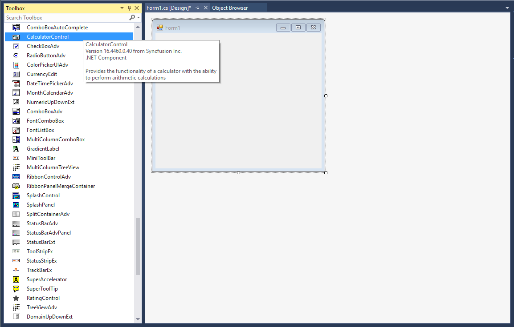

# Getting Started with Windows Forms Calculator

## Assembly deployment

Refer to the [control dependencies](https://help.syncfusion.com/windowsforms/control-dependencies#calculator) section to get the list of assemblies or NuGet package that needs to be added as a reference to use the control in any application.

You can find more details about installing the NuGet package in a Windows Forms application in the following link: 
 
[How to install nuget packages](https://help.syncfusion.com/windowsforms/installation/install-nuget-packages)

## Create a simple application with Calculator

You can create a Windows Forms application with the [Calculator control](https://help.syncfusion.com/cr/windowsforms/Syncfusion.Windows.Forms.Tools.CalculatorControl.html) using the following steps:

## Create a project

Create a new Windows Forms project in Visual Studio to display the [Calculator control](https://help.syncfusion.com/cr/windowsforms/Syncfusion.Windows.Forms.Tools.CalculatorControl.html).

## Add control through designer

The [Calculator control](https://help.syncfusion.com/cr/windowsforms/Syncfusion.Windows.Forms.Tools.CalculatorControl.html) can be added to an application by dragging it from the toolbox to a designer view. The following required assembly references will be added automatically to the project:

* Syncfusion.Grid.Base
* Syncfusion.Grid.Windows
* Syncfusion.Shared.Base
* Syncfusion.Shared.Windows
* Syncfusion.Tools.Base 
* Syncfusion.Tools.Windows

 

## Add control manually in code

To add the control manually in C#, follow the given steps:

1. Add the following required assembly references to the project:
 
    * Syncfusion.Grid.Base
    * Syncfusion.Grid.Windows
    * Syncfusion.Shared.Base
    * Syncfusion.Shared.Windows
    * Syncfusion.Tools.Base 
    * Syncfusion.Tools.Windows

2. Include the [Calculator control](https://help.syncfusion.com/cr/windowsforms/Syncfusion.Windows.Forms.Tools.CalculatorControl.html) namespace **Syncfusion.Windows.Forms.Tools;**.




using Syncfusion.Windows.Forms.Tools;


Imports Syncfusion.Windows.Forms.Tools

 

{{ codesnippet1 | OrderList_Indent_Level_1 }}

3. Create a [Calculator control](https://help.syncfusion.com/cr/windowsforms/Syncfusion.Windows.Forms.Tools.CalculatorControl.html) instance, and add it to the form.




CalculatorControl calculatorControl = new CalculatorControl();
calculatorControl1.Size = new Size(300, 250);
this.Controls.Add(calculatorControl);


Dim calculatorControl As CalculatorControl = New CalculatorControl
calculatorControl1.Size = New Size(300, 250)
Me.Controls.Add(calculatorControl)



{{ codesnippet2 | OrderList_Indent_Level_1 }}

 

