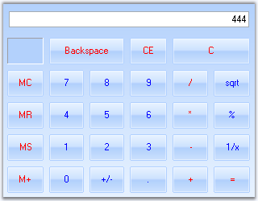

# Windows Forms Calculator Overview

The Essential® Tools CalculatorControl encapsulates the functionality of a standard calculator. It provides an easy way to implement a complete calculator in your applications. The value of the CalculatorControl in the form is maintained internally and also provides the value in the format required. The CalculatorValue class provides methods to get the value of the CalculatorControl as a String or as a Double Value. It supports Office2007 color schemes.

 