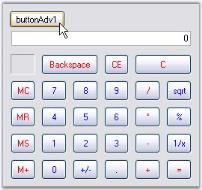

# Popup Calculator in Windows Forms Calculator

The PopupCalculator class can be used to display a popup Calculator control. This class can be created programmatically. 

The PopupCalculator control lets you embed a Calculator control object to a button for example. Drop the button onto the form and add the following code snippet.



private Syncfusion.Windows.Forms.Tools.PopupCalculator popupCalculator1;

private void buttonAdv1_Click(object sender, EventArgs e)

{

    // Create the Popup Calculator.

    popupCalculator1 = new Syncfusion.Windows.Forms.Tools.PopupCalculator();

    // The control that will act as the Popup's parent.

    this.popupCalculator1.ParentControl = this.button1;

    // Set the alignment.

    this.popupCalculator1.PopupCalculatorAlignment = Syncfusion.Windows.Forms.Tools.CalculatorPopupAlignment.Right;

    // Display the Calculator control.

    this.popupCalculator1.DisplayCalculator(Point.Empty);

    //Sets the size of the calculator

    this.popupCalculator1.Size = this.calculatorControl1.Size;

}





Private popupCalculator1 As Syncfusion.Windows.Forms.Tools.PopupCalculator

Private Sub buttonAdv1_Click(ByVal sender As Object, ByVal e As EventArgs)

    ' Create the Popup Calculator. 

    popupCalculator1 = New Syncfusion.Windows.Forms.Tools.PopupCalculator()

    ' The control that will act as the Popup's parent. 

    Me.popupCalculator1.ParentControl = Me.button1

    ' Set the alignment. 

    Me.popupCalculator1.PopupCalculatorAlignment = Syncfusion.Windows.Forms.Tools.CalculatorPopupAlignment.Right

    ' Display the Calculator control. 

    Me.popupCalculator1.DisplayCalculator(Point.Empty)

    'Sets the size of the calculator 

    Me.popupCalculator1.Size = Me.calculatorControl1.Size

End Sub



