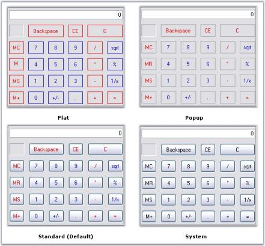
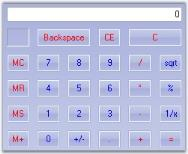

# Style Settings in Windows Forms Calculator

This section discusses on the following styles:

## Button Flat Styles

The flat styles for the button objects in a Calculator control is set using [CalculatorControl.FlatStyle](https://help.syncfusion.com/cr/windowsforms/Syncfusion.Windows.Forms.Tools.CalculatorControl.html#Syncfusion_Windows_Forms_Tools_CalculatorControl_FlatStyle) property. The styles are Flat, Popup, Standard (default) and System.




this.calculatorControl1.FlatStyle = System.Windows.Forms.FlatStyle.Flat;





Me.calculatorControl1.FlatStyle = System.Windows.Forms.FlatStyle.Flat




 

## Themes and Button Styles

### Themes for the Calculator Control

Essential® Tools [Calculator control](https://help.syncfusion.com/cr/windowsforms/Syncfusion.Windows.Forms.Tools.CalculatorControl.html) is themed by default. To disable, set [ThemesEnabled](https://help.syncfusion.com/cr/windowsforms/Syncfusion.Windows.Forms.Tools.CalculatorControl.html#Syncfusion_Windows_Forms_Tools_CalculatorControl_ThemesEnabled) property to false.




this.calculatorControl1.ThemesEnabled = false;





Me.calculatorControl1.ThemesEnabled = False




 

### Button Styles

The [Calculator control](https://help.syncfusion.com/cr/windowsforms/Syncfusion.Windows.Forms.Tools.CalculatorControl.html) supports the below button styles. [UseVisualStyle](https://help.syncfusion.com/cr/windowsforms/Syncfusion.Windows.Forms.Tools.CalculatorControl.html#Syncfusion_Windows_Forms_Tools_CalculatorControl_UseVisualStyle) property should be set to true to enable button styles for the control.

* Classic (default)
* Office2000
* WindowsXP
* OfficeXP
* Office2003
* Office2007
* Metro




this.calculatorControl1.UseVisualStyle = true;

//Setting Office2007 button style for the calculator control
this.calculatorControl1.ButtonStyle = Syncfusion.Windows.Forms.ButtonAppearance.Office2007;





Me.calculatorControl1.UseVisualStyle = True

'Setting Office2007 button style for the calculator control
Me.calculatorControl1.ButtonStyle = Syncfusion.Windows.Forms.ButtonAppearance.Office2007;




 

### OfficeColor Schemes

Essential® Tools [Calculator control](https://help.syncfusion.com/cr/windowsforms/Syncfusion.Windows.Forms.Tools.CalculatorControl.html) supports all the three OfficeColorSchemes. When the ButtonStyle is set to Office2007 style, the color schemes will be blue by default. It can be modified using [Office2007Theme](https://help.syncfusion.com/cr/windowsforms/Syncfusion.Windows.Forms.Tools.CalculatorControl.html#Syncfusion_Windows_Forms_Tools_CalculatorControl_Office2007Theme) property.




this.calculatorControl1.Office2007Theme = Syncfusion.Windows.Forms.Office2007Theme.Silver;





Me.calculatorControl1.Office2007Theme = Syncfusion.Windows.Forms.Office2007Theme.Silver




 

### Custom Colors

We can also apply custom colors to the [Calculator control](https://help.syncfusion.com/cr/windowsforms/Syncfusion.Windows.Forms.Tools.CalculatorControl.html) by setting [Office2007Theme](https://help.syncfusion.com/cr/windowsforms/Syncfusion.Windows.Forms.Tools.CalculatorControl.html#Syncfusion_Windows_Forms_Tools_CalculatorControl_Office2007Theme) to "Managed" and specifying the custom color through the ApplyManagedColors method as follows.




this.calculatorControl1.Office2007Theme = Syncfusion.Windows.Forms.Office2007Theme.Managed;
Office2007Colors.ApplyManagedColors(this, Color.Navy);





Me.calculatorControl1.Office2007Theme = Syncfusion.Windows.Forms.Office2007Theme.Managed;
Office2007Colors.ApplyManagedColors(Me, Color.Navy)




 
