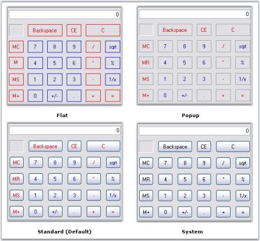
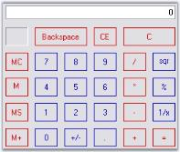
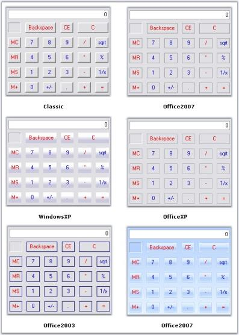
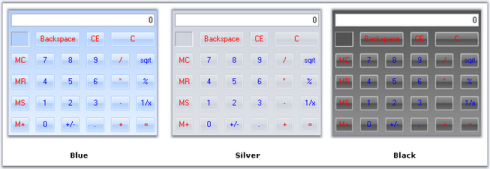
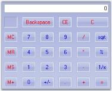

# Style Settings in WinForms Calculator

This section discusses on the following styles:

## Button Flat Styles

The flat style for the button objects in a WinForms Calculator control is set using the [CalculatorControl.FlatStyle](https://help.syncfusion.com/cr/windowsforms/Syncfusion.Windows.Forms.Tools.CalculatorControl.html#Syncfusion_Windows_Forms_Tools_CalculatorControl_FlatStyle) property. The available styles are `Flat`, `Popup`, `Standard` (default), and `System`.




this.calculatorControl1.FlatStyle = System.Windows.Forms.FlatStyle.Flat;





Me.calculatorControl1.FlatStyle = System.Windows.Forms.FlatStyle.Flat




## Themes and Button Styles

### Themes for the WinForms Calculator Control

Essential® Tools [WinForms Calculator control](https://help.syncfusion.com/cr/windowsforms/Syncfusion.Windows.Forms.Tools.CalculatorControl.html) is themed by default. To disable theming, set the [ThemesEnabled](https://help.syncfusion.com/cr/windowsforms/Syncfusion.Windows.Forms.Tools.CalculatorControl.html#Syncfusion_Windows_Forms_Tools_CalculatorControl_ThemesEnabled) property to `false`.




this.calculatorControl1.ThemesEnabled = false;





Me.calculatorControl1.ThemesEnabled = False




### Button Styles

The [WinForms Calculator control](https://help.syncfusion.com/cr/windowsforms/Syncfusion.Windows.Forms.Tools.CalculatorControl.html) supports the following button styles. The [UseVisualStyle](https://help.syncfusion.com/cr/windowsforms/Syncfusion.Windows.Forms.Tools.CalculatorControl.html#Syncfusion_Windows_Forms_Tools_CalculatorControl_UseVisualStyle) property must be set to `true` to enable button styles for the control.

* Classic (default)
* Office2000
* WindowsXP
* OfficeXP
* Office2003
* Office2007
* Metro




this.calculatorControl1.UseVisualStyle = true;

//Setting Office2007 button style for the calculator control
this.calculatorControl1.ButtonStyle = Syncfusion.Windows.Forms.ButtonAppearance.Office2007;





Me.calculatorControl1.UseVisualStyle = True

'Setting Office2007 button style for the calculator control
Me.calculatorControl1.ButtonStyle = Syncfusion.Windows.Forms.ButtonAppearance.Office2007




### OfficeColor Schemes

Essential® Tools [WinForms Calculator control](https://help.syncfusion.com/cr/windowsforms/Syncfusion.Windows.Forms.Tools.CalculatorControl.html) supports all three OfficeColorSchemes. When the `ButtonStyle` is set to `Office2007`, the color scheme is blue by default. It can be modified using the [Office2007Theme](https://help.syncfusion.com/cr/windowsforms/Syncfusion.Windows.Forms.Tools.CalculatorControl.html#Syncfusion_Windows_Forms_Tools_CalculatorControl_Office2007Theme) property.




this.calculatorControl1.Office2007Theme = Syncfusion.Windows.Forms.Office2007Theme.Silver;





Me.calculatorControl1.Office2007Theme = Syncfusion.Windows.Forms.Office2007Theme.Silver




### Custom Colors

We can also apply custom colors to the [WinForms Calculator control](https://help.syncfusion.com/cr/windowsforms/Syncfusion.Windows.Forms.Tools.CalculatorControl.html) by setting [Office2007Theme](https://help.syncfusion.com/cr/windowsforms/Syncfusion.Windows.Forms.Tools.CalculatorControl.html#Syncfusion_Windows_Forms_Tools_CalculatorControl_Office2007Theme) to **Managed** and specifying the custom color through the `ApplyManagedColors` method as follows. Add the `using Syncfusion.Windows.Forms.Office2007Theme;` (C#) / `Imports Syncfusion.Windows.Forms.Office2007Theme` (VB) directive for the `Office2007Colors` type.




this.calculatorControl1.Office2007Theme = Syncfusion.Windows.Forms.Office2007Theme.Managed;
Office2007Colors.ApplyManagedColors(this, Color.Navy);





Me.calculatorControl1.Office2007Theme = Syncfusion.Windows.Forms.Office2007Theme.Managed
Office2007Colors.ApplyManagedColors(Me, Color.Navy)




 
