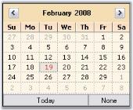

# Customizing the Calendar

DateTimePickerAdv control has properties which can improve the look and feel of the popup calendar. This section discusses various appearance settings available for the calendar.

## Background Settings

The background of the Calendar can be customized using the [CalendarMonthBackground]() and [CalendarTitleBackColor]() properties of DateTimePickerAdv.


this.dateTimePickerAdv1.CalendarMonthBackground = System.Drawing.Color.OldLace;
this.dateTimePickerAdv1.CalendarTitleBackColor = System.Drawing.Color.Wheat;


Me.dateTimePickerAdv1.CalendarMonthBackground = System.Drawing.Color.OldLace
Me.dateTimePickerAdv1.CalendarTitleBackColor = System.Drawing.Color.Wheat


 

## Foreground Settings

The foreground appearance can be customized using the below properties.

* [CalendarFont](https://help.syncfusion.com/cr/windowsforms/Syncfusion.Tools.Windows~Syncfusion.Windows.Forms.Tools.DateTimePickerAdv~CalendarFont.html)
* [CalendarForeColor](https://help.syncfusion.com/cr/windowsforms/Syncfusion.Tools.Windows~Syncfusion.Windows.Forms.Tools.DateTimePickerAdv~CalendarForeColor.html)
* [CalendarTitleForeColor](https://help.syncfusion.com/cr/windowsforms/Syncfusion.Tools.Windows~Syncfusion.Windows.Forms.Tools.DateTimePickerAdv~CalendarTitleForeColor.html)
* [CalendarTrailingForeColor](https://help.syncfusion.com/cr/windowsforms/Syncfusion.Tools.Windows~Syncfusion.Windows.Forms.Tools.DateTimePickerAdv~CalendarTrailingForeColor.html)


this.dateTimePickerAdv1.CalendarFont = new System.Drawing.Font("Microsoft Sans Serif", 8.25F, System.Drawing.FontStyle.Italic);
this.dateTimePickerAdv1.CalendarForeColor = System.Drawing.Color.SaddleBrown;
this.dateTimePickerAdv1.CalendarTitleForeColor = System.Drawing.Color.SaddleBrown;
this.dateTimePickerAdv1.CalendarTrailingForeColor = System.Drawing.Color.Blue;


Me.dateTimePickerAdv1.CalendarFont = New System.Drawing.Font("Microsoft Sans Serif", 8.25F, System.Drawing.FontStyle.Italic) 
Me.dateTimePickerAdv1.CalendarForeColor = System.Drawing.Color.SaddleBrown 
Me.dateTimePickerAdv1.CalendarTitleForeColor = System.Drawing.Color.SaddleBrown 
Me.dateTimePickerAdv1.CalendarTrailingForeColor = System.Drawing.Color.Blue


 
_CalendarFont = "Italic"; TrailingForeColor = "Blue"_

## Calendar Size

The default size of the popup calendar can be changed using the below properties.

* [CalendarSize](https://help.syncfusion.com/cr/windowsforms/Syncfusion.Tools.Windows~Syncfusion.Windows.Forms.Tools.DateTimePickerAdv~CalendarSize.html)
* [CalendarSizeToFit](https://help.syncfusion.com/cr/windowsforms/Syncfusion.Tools.Windows~Syncfusion.Windows.Forms.Tools.DateTimePickerAdv~CalendarSizeToFit.html)


this.dateTimePickerAdv1.CalendarSize = new System.Drawing.Size(250, 200);
this.dateTimePickerAdv1.CalendarSizeToFit = false;


Me.dateTimePickerAdv1.CalendarSize = New System.Drawing.Size(250, 200)
Me.dateTimePickerAdv1.CalendarSizeToFit = False




[Calendar Value](http://help.syncfusion.com/windowsforms/calendar/calendar-value)

