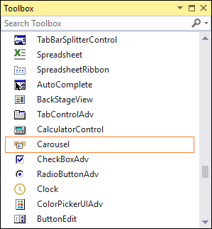

# Getting Started with Windows Forms Carousel

This section briefly describes how to create a Windows Forms project in Visual Studio and add the **Carousel** control with its basic functionalities. The Carousel control is a circular conveyor used for displaying and rotating the custom controls or image objects.

## Assembly deployment

Refer to the [Control Dependencies](https://help.syncfusion.com/windowsforms/control-dependencies#carousel) section to get the list of assemblies or details of NuGet package that needs to be added as reference to use the control in any application. 

Refer to this [documentation](https://help.syncfusion.com/windowsforms/installation/install-nuget-packages) to find more details about installing NuGet packages in an application.

## Adding Carousel control via designer

The following steps describe how to create a **Carousel** control via designer.

1. Create a new Windows Forms application in Visual Studio.

2. Add the [Carousel](https://help.syncfusion.com/cr/windowsforms/Syncfusion.Windows.Forms.Tools.Carousel.html) control to an application by dragging it from the toolbox to design view. The following dependent assemblies will be added automatically:

    * Syncfusion.Grid.Base
    * Syncfusion.Grid.Windows
    * Syncfusion.Shared.Base
    * Syncfusion.Shared.Windows
    * Syncfusion.Tools.Base
    * Syncfusion.Tools.Windows

 

## Adding Carousel control via code

The following steps describe how to create a **Carousel** control programmatically:

1. Create a C# or VB application via Visual Studio.

2. Add the following assembly references to the project:

    * Syncfusion.Grid.Base
    * Syncfusion.Grid.Windows
    * Syncfusion.Shared.Base
    * Syncfusion.Shared.Windows
    * Syncfusion.Tools.Base
    * Syncfusion.Tools.Windows

3. Include the required namespaces.





using Syncfusion.Windows.Forms.Tools;





Imports Syncfusion.Windows.Forms.Tools




{{ codesnippet1 | OrderList_Indent_Level_1 }}

4. Create an instance of the [Carousel](https://help.syncfusion.com/cr/windowsforms/Syncfusion.Windows.Forms.Tools.Carousel.html) control, and then add it to the form.





Carousel carousel1 = new Carousel();
this.Controls.Add(carousel);





Dim carousel1 As Carousel = New Carousel
Me.Controls.Add(carousel1)




{{ codesnippet2 | OrderList_Indent_Level_1 }}

## Adding controls into Carousel

You can load custom controls in Carousel, and it needs to be added into the [Items](https://help.syncfusion.com/cr/windowsforms/Syncfusion.Windows.Forms.Tools.Carousel.html#Syncfusion_Windows_Forms_Tools_Carousel_Items) collection property in Carousel class.





//Initialization
ButtonAdv buttonAdv1 =new ButtonAdv();
ButtonAdv buttonAdv2 =new ButtonAdv();
ButtonAdv buttonAdv3 =new ButtonAdv();
ButtonAdv buttonAdv4 =new ButtonAdv();
ButtonAdv buttonAdv5 =new ButtonAdv();
ButtonAdv buttonAdv6 =new ButtonAdv();

//Set the properties for all buttonadv control
buttonAdv1.BackColor = System.Drawing.Color.FromArgb(((int)(((byte)(22)))), ((int)(((byte)(165)))), ((int)(((byte)(220)))));
buttonAdv1.ForeColor = System.Drawing.Color.White;

buttonAdv2.BackColor = System.Drawing.Color.FromArgb(((int)(((byte)(22)))), ((int)(((byte)(165)))), ((int)(((byte)(220)))));
buttonAdv2.ForeColor = System.Drawing.Color.White;

buttonAdv3.BackColor = System.Drawing.Color.FromArgb(((int)(((byte)(22)))), ((int)(((byte)(165)))), ((int)(((byte)(220)))));
buttonAdv3.ForeColor = System.Drawing.Color.White;

buttonAdv4.BackColor = System.Drawing.Color.FromArgb(((int)(((byte)(22)))), ((int)(((byte)(165)))), ((int)(((byte)(220)))));
buttonAdv4.ForeColor = System.Drawing.Color.White;

buttonAdv5.BackColor = System.Drawing.Color.FromArgb(((int)(((byte)(22)))), ((int)(((byte)(165)))), ((int)(((byte)(220)))));
buttonAdv5.ForeColor = System.Drawing.Color.White;

buttonAdv6.BackColor = System.Drawing.Color.FromArgb(((int)(((byte)(22)))), ((int)(((byte)(165)))), ((int)(((byte)(220)))));
buttonAdv6.ForeColor = System.Drawing.Color.White;

//Add the custom controls into carousel
carousel1.Controls.Add(buttonAdv1);
carousel1.Controls.Add(buttonAdv2);
carousel1.Controls.Add(buttonAdv3);
carousel1.Controls.Add(buttonAdv4);
carousel1.Controls.Add(buttonAdv5);
carousel1.Controls.Add(buttonAdv6);

//Add the custom controls into carousel items
carousel1.Items.Add(buttonAdv1);
carousel1.Items.Add(buttonAdv2);
carousel1.Items.Add(buttonAdv3);
carousel1.Items.Add(buttonAdv4);
carousel1.Items.Add(buttonAdv5);
carousel1.Items.Add(buttonAdv6);





'Initialization
Dim buttonAdv1 As New ButtonAdv()
Dim buttonAdv2 As New ButtonAdv()
Dim buttonAdv3 As New ButtonAdv()
Dim buttonAdv4 As New ButtonAdv()
Dim buttonAdv5 As New ButtonAdv()
Dim buttonAdv6 As New ButtonAdv()

'Set the properties for all buttonadv controls
buttonAdv1.BackColor = System.Drawing.Color.FromArgb((CInt(Fix((CByte(22))))), (CInt(Fix((CByte(165))))), (CInt(Fix((CByte(220))))))
buttonAdv1.ForeColor = System.Drawing.Color.White

buttonAdv2.BackColor = System.Drawing.Color.FromArgb((CInt(Fix((CByte(22))))), (CInt(Fix((CByte(165))))), (CInt(Fix((CByte(220))))))
buttonAdv2.ForeColor = System.Drawing.Color.White

buttonAdv3.BackColor = System.Drawing.Color.FromArgb((CInt(Fix((CByte(22))))), (CInt(Fix((CByte(165))))), (CInt(Fix((CByte(220))))))
buttonAdv3.ForeColor = System.Drawing.Color.White

buttonAdv4.BackColor = System.Drawing.Color.FromArgb((CInt(Fix((CByte(22))))), (CInt(Fix((CByte(165))))), (CInt(Fix((CByte(220))))))
buttonAdv4.ForeColor = System.Drawing.Color.White

buttonAdv5.BackColor = System.Drawing.Color.FromArgb((CInt(Fix((CByte(22))))), (CInt(Fix((CByte(165))))), (CInt(Fix((CByte(220))))))
buttonAdv5.ForeColor = System.Drawing.Color.White

buttonAdv6.BackColor = System.Drawing.Color.FromArgb((CInt(Fix((CByte(22))))), (CInt(Fix((CByte(165))))), (CInt(Fix((CByte(220))))))
buttonAdv6.ForeColor = System.Drawing.Color.White

'Add the custom controls into carousel
carousel1.Controls.Add(buttonAdv1)
carousel1.Controls.Add(buttonAdv2)
carousel1.Controls.Add(buttonAdv3)
carousel1.Controls.Add(buttonAdv4)
carousel1.Controls.Add(buttonAdv5)
carousel1.Controls.Add(buttonAdv6)

'Add the custom controls into carousel items
carousel1.Items.Add(buttonAdv1)
carousel1.Items.Add(buttonAdv2)
carousel1.Items.Add(buttonAdv3)
carousel1.Items.Add(buttonAdv4)
carousel1.Items.Add(buttonAdv5)
carousel1.Items.Add(buttonAdv6)





 

## Adding images into Carousel

You can load images in Carousel, it needs to added into [ImageListCollection](https://help.syncfusion.com/cr/windowsforms/Syncfusion.Windows.Forms.Tools.Carousel.html#Syncfusion_Windows_Forms_Tools_Carousel_ImageListCollection) property in Carousel class.





//Image slides
carousel1.ImageSlides = true;

//Initialization
CarouselImage carouselImage1 = new CarouselImage();
CarouselImage carouselImage2 = new CarouselImage();
CarouselImage carouselImage3 = new CarouselImage();
CarouselImage carouselImage4 = new CarouselImage();
CarouselImage carouselImage5 = new CarouselImage();
CarouselImage carouselImage6 = new CarouselImage();

// Adding carousel image
carouselImage1.ItemImage = ((System.Drawing.Image)(resources.GetObject("carouselImage1.ItemImage")));
carouselImage2.ItemImage = ((System.Drawing.Image)(resources.GetObject("carouselImage2.ItemImage")));
carouselImage3.ItemImage = ((System.Drawing.Image)(resources.GetObject("carouselImage3.ItemImage")));
carouselImage4.ItemImage = ((System.Drawing.Image)(resources.GetObject("carouselImage4.ItemImage")));
carouselImage5.ItemImage = ((System.Drawing.Image)(resources.GetObject("carouselImage5.ItemImage")));
carouselImage6.ItemImage = ((System.Drawing.Image)(resources.GetObject("carouselImage6.ItemImage")));

// Add capture images to imagelistcollection
this.carousel1.ImageListCollection.Add(carouselImage1);
this.carousel1.ImageListCollection.Add(carouselImage2);
this.carousel1.ImageListCollection.Add(carouselImage3);
this.carousel1.ImageListCollection.Add(carouselImage4);
this.carousel1.ImageListCollection.Add(carouselImage5);
this.carousel1.ImageListCollection.Add(carouselImage6);





'Image slides
carousel1.ImageSlides = True

'Initialization
Dim carouselImage1 As New CarouselImage()
Dim carouselImage2 As New CarouselImage()
Dim carouselImage3 As New CarouselImage()
Dim carouselImage4 As New CarouselImage()
Dim carouselImage5 As New CarouselImage()
Dim carouselImage6 As New CarouselImage()

' Adding carousel image
carouselImage1.ItemImage = (CType(resources.GetObject("carouselImage1.ItemImage"), System.Drawing.Image))
carouselImage2.ItemImage = (CType(resources.GetObject("carouselImage2.ItemImage"), System.Drawing.Image))
carouselImage3.ItemImage = (CType(resources.GetObject("carouselImage3.ItemImage"), System.Drawing.Image))
carouselImage4.ItemImage = (CType(resources.GetObject("carouselImage4.ItemImage"), System.Drawing.Image))
carouselImage5.ItemImage = (CType(resources.GetObject("carouselImage5.ItemImage"), System.Drawing.Image))
carouselImage6.ItemImage = (CType(resources.GetObject("carouselImage6.ItemImage"), System.Drawing.Image))

' Add capture images to imagelistcollection
Me.carousel1.ImageListCollection.Add(carouselImage1)
Me.carousel1.ImageListCollection.Add(carouselImage2)
Me.carousel1.ImageListCollection.Add(carouselImage3)
Me.carousel1.ImageListCollection.Add(carouselImage4)
Me.carousel1.ImageListCollection.Add(carouselImage5)
Me.carousel1.ImageListCollection.Add(carouselImage6)





