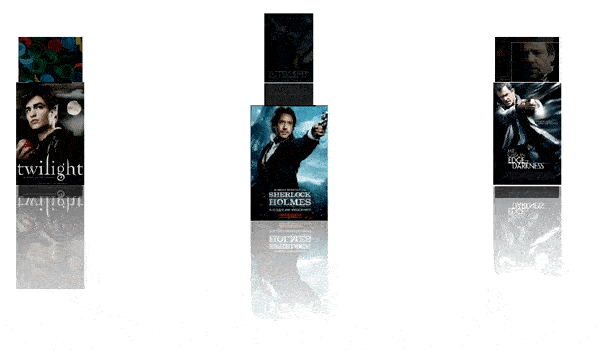

# Windows Forms Carousel Overview

The **Carousel** control is a circular conveyor in which the objects are displayed and rotated. It provides a 3-D interface for displaying objects with interactive navigation.

## Key features

* **Carousel path** - Provides wide varieties of built-in path to arrange carousel items when animated. For more details, refer to the [Path Support](https://help.syncfusion.com/windowsforms/carousel/path-support) documentation.

* **Perspective** - Provides options to enlarge and shrink the size of the elliptical view using float values. For more details, refer to the [Perspective](https://help.syncfusion.com/windowsforms/carousel/perspective) documentation.

* **Transition speed** - Provides options for setting user-defined speed for the controls to be rotated. For more details, refer to the [Transition Speed](https://help.syncfusion.com/windowsforms/carousel/transition-speed) documentation.

* **Rotate always** - Provides options to rotate the carousel items continuously. For more details, refer to the [Rotate Always](https://help.syncfusion.com/windowsforms/carousel/rotate-always) documentation.

* **Image slides** - Provides options for adding and displaying images in carousel path. For more details, refer to the [ImageSlides](https://help.syncfusion.com/windowsforms/carousel/imageslides) documentation.

* **Touch interactions** - Provides support for pan, flick, pinch, and stretch gestures to navigate the carousel items. For more details, refer to the [Touch Interactions](https://help.syncfusion.com/windowsforms/carousel/touch-interactions) documentation.
