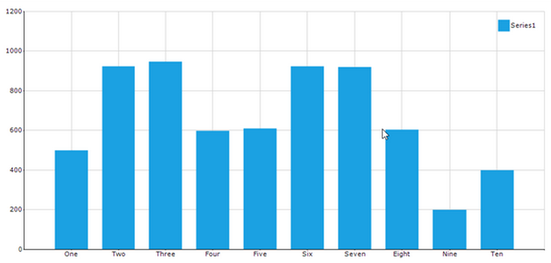

# Axis padding in Windows Forms Chart

## Point offset

Point offset adds extra space between the chart boundary at the first data point. This helps improve readability and prevents data markers from appearing too close to the chart edges.

- [PointOffset](https://help.syncfusion.com/cr/windowsforms/Syncfusion.Windows.Forms.Chart.ChartAxis.html#Syncfusion_Windows_Forms_Chart_ChartAxis_PointOffset) - Specifies the amount of spacing to add as a fraction of the axis interval. For example, a value of 0.1 adds spacing equal to 10% of the interval at the first data point of the axis.




// Set a small offset (10% of an interval)
chart.PrimaryXAxis.PointOffset = 0.1;

// Leave one full interval of padding
chart.PrimaryXAxis.PointOffset = 1;




'Set a small offset (10% of an interval)
chart.PrimaryXAxis.PointOffset = 0.1

'Leave one full interval of padding
chart.PrimaryXAxis.PointOffset = 1




N> Use small values (e.g., `0.05`–`0.2`) for subtle spacing; use integer values (e.g., `1`) to leave whole intervals.

The following screenshot illustrates the chart when `PointOffset` is set to `1` (one interval of padding).

