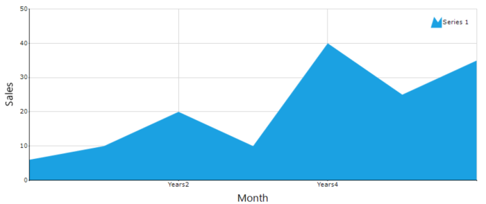
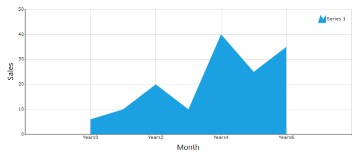

# Axis range padding in Windows Forms Chart

Axis range padding adds extra space at the beginning and end of an axis so that data points do not appear directly on the chart edges. It can be set manually or calculated automatically.

- [RangePaddingType](https://help.syncfusion.com/cr/windowsforms/Syncfusion.Windows.Forms.Chart.ChartAxis.html#Syncfusion_Windows_Forms_Chart_ChartAxis_RangePaddingType) — Determines how range padding is applied.

## Customization

- `None` — No extra space is added. The axis range starts and ends exactly at the minimum and maximum data values.
- `Calculate` — Automatically adds extra space at both ends of the axis range to prevent data points from appearing at the chart edges.

The following code snippet and screenshot show an axis configured with the `RangePaddingType` set to `None`.




// Disable automatic range padding
chart.PrimaryXAxis.RangePaddingType = ChartAxisRangePaddingType.None;




'Enable calculated padding (adds one interval to min and max)
chart.PrimaryXAxis.RangePaddingType = ChartAxisRangePaddingType.Calculate




The following code snippet and screenshot show an axis configured with the `RangePaddingType` set to `Calculate`.




// Enable calculated padding (adds one interval to min and max)
chart.PrimaryXAxis.RangePaddingType = ChartAxisRangePaddingType.Calculate;




'Enable calculated padding (adds one interval to min and max)
chart.PrimaryXAxis.RangePaddingType = ChartAxisRangePaddingType.Calculate




