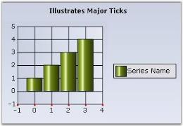
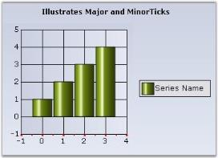

# Chart Tick Lines in Windows Forms Chart

## Major ticks

Major ticks are rendered automatically at the intersection of an axis with the interval grid lines. 

### Customization

The following properties allow you to customize the appearance and behavior of the major ticks.

- [TickSize](https://help.syncfusion.com/cr/windowsforms/Syncfusion.Windows.Forms.Chart.ChartAxis.html#Syncfusion_Windows_Forms_Chart_ChartAxis_TickSize) - Specifies the width and height of the tick rectangle. This is also a good way to hide the ticks, by default it is {1, 1}.
- [TickColor](https://help.syncfusion.com/cr/windowsforms/Syncfusion.Windows.Forms.Chart.ChartAxis.html#Syncfusion_Windows_Forms_Chart_ChartAxis_TickColor) - Color of the tick mark.
- [TickLabelGridPadding](https://help.syncfusion.com/cr/windowsforms/Syncfusion.Windows.Forms.Chart.ChartAxis.html#Syncfusion_Windows_Forms_Chart_ChartAxis_TickLabelGridPadding) - The padding between the tick mark in the axis and the label, by default it is 5.
- [TickDrawingOperationMode](https://help.syncfusion.com/cr/windowsforms/Syncfusion.Windows.Forms.Chart.ChartAxis.html#Syncfusion_Windows_Forms_Chart_ChartAxis_TickDrawingOperationMode) - Defines the number of ticks to render while zooming.
NumberOfIntervalsFixed - When you zoom, the number of visible intervals will be constant. So, as you zoom in, the total number of intervals will increase.
IntervalFixed - The number of intervals will be constant. So, as you zoom in, fewer intervals will be visible at a time.




this.chartControl1.PrimaryXAxis.TickSize = new Size(3,3);
this.chartControl1.PrimaryXAxis.TickColor = Color.DarkOrange;
this.chartControl1.PrimaryXAxis.TickLabelGridPadding = 8F;





Me.chartControl1.PrimaryXAxis.TickSize = new Size(3,3)
Me.chartControl1.PrimaryXAxis.TickColor = Color.DarkOrange
Me.chartControl1.PrimaryXAxis.TickLabelGridPadding = 8F




### Minor Ticks

Minor ticks are tick marks displayed between major ticks. They are not rendered by default.

### Customization

Use the following properties to enable minor ticks and define their frequency.

- [SmallTicksPerInterval](https://help.syncfusion.com/cr/windowsforms/Syncfusion.Windows.Forms.Chart.ChartAxis.html#Syncfusion_Windows_Forms_Chart_ChartAxis_SmallTicksPerInterval) - Specifies if and how many minor ticks, which are tick marks drawn on the axis between intervals, should be drawn.
- [SmallTickSize](https://help.syncfusion.com/cr/windowsforms/Syncfusion.Windows.Forms.Chart.ChartAxis.html#Syncfusion_Windows_Forms_Chart_ChartAxis_SmallTickSize) - Specifies the size of the tick rectangle.




this.chartControl1.PrimaryXAxis.SmallTickSize = new System.Drawing.Size(2, 2);
this.chartControl1.PrimaryXAxis.SmallTicksPerInterval = 1;





Me.chartControl1.PrimaryXAxis.SmallTickSize = New System.Drawing.Size(2, 2)
Me.chartControl1.PrimaryXAxis.SmallTicksPerInterval = 1




