# Chart Appearance in Windows Forms Chart

The following topics under this section discusses about various properties that are used to customize the appearance of the chart.

## Background Colors

EssentialChart lets you customize the background colors of different portions of the chart.

### Outside the Chart Area

Use the [BackInterior](https://help.syncfusion.com/cr/windowsforms/Syncfusion.Windows.Forms.Chart.ChartControl.html#Syncfusion_Windows_Forms_Chart_ChartControl_BackInterior) property of the chart to customize the background of the chart that is outside the chart area. This is usually where the legend and the chart title get rendered. By default, it is set to White color.





this.chartControl1.BackInterior = new Syncfusion.Drawing.BrushInfo(System.Drawing.Color.LightBlue);





Me.chartControl1.BackInterior = New Syncfusion.Drawing.BrushInfo(System.Drawing.Color.LightBlue)




### Inside the Plot Area

Use the [ChartArea.BackInterior](https://help.syncfusion.com/cr/windowsforms/Syncfusion.Windows.Forms.Chart.ChartArea.html#Syncfusion_Windows_Forms_Chart_ChartArea_BackInterior) to customize the background of the rectangular region where the points are plotted.





this.chartControl1.ChartArea.BackInterior = new Syncfusion.Drawing.BrushInfo(System.Drawing.Color.SkyBlue);





Me.chartControl1.ChartArea.BackInterior = New Syncfusion.Drawing.BrushInfo(System.Drawing.Color.SkyBlue)




### Inside the Chart Area

Use the [ChartInterior](https://help.syncfusion.com/cr/windowsforms/Syncfusion.Windows.Forms.Chart.ChartControl.html#Syncfusion_Windows_Forms_Chart_ChartControl_ChartInterior) property of the chart to customize the background of the chart area. By default, it is set to White color.





this.chartControl1.ChartInterior = new Syncfusion.Drawing.BrushInfo(Syncfusion.Drawing.GradientStyle.Horizontal, System.Drawing.Color.PaleTurquoise, System.Drawing.Color.LightBlue);





this.chartControl1.ChartInterior = New Syncfusion.Drawing.BrushInfo(Syncfusion.Drawing.GradientStyle.Horizontal, System.Drawing.Color.PaleTurquoise, System.Drawing.Color.LightBlue)





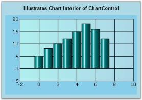

## Background Image

### Chart Settings

In Windows Forms, use the [BackgroundImage](https://help.syncfusion.com/cr/windowsforms/Syncfusion.Windows.Forms.Chart.ChartControl.html#Syncfusion_Windows_Forms_Chart_ChartControl_BackgroundImage) property to specify a custom image as the background of the chart. The image layout can also be specified using the property below.

<table>
<tr>
<th>
Chart control Property</th><th>
Description</th></tr>
<tr>
<td>
BackgroundImage</td><td>
Indicates the background image used for the control.</td></tr>
<tr>
<td>
BackgroundImageLayout</td><td>
Indicates the background image layout used for the component. Default value is Tile. Possible values are:<ul><li>Tile</li><li>Center</li><li>Stretch</li><li>Zoom</li></ul></td></tr>
</table>




this.chartControl1.BackgroundImage = ((System.Drawing.Image)(resources.GetObject("chartControl1.BackgroundImage")));

this.chartControl1.BackgroundImageLayout = System.Windows.Forms.ImageLayout.Stretch;





Me.ChartControl1.BackgroundImage = CType((Resources.GetObject("chartControl1.BackgroundImage")), System.Drawing.Image)

Me.ChartControl1.BackgroundImageLayout = System.Windows.Forms.ImageLayout.Stretch




### ChartArea Background Image

The chart area can also be rendered with a custom background image and this can be set using the [ChartAreaBackImage](https://help.syncfusion.com/cr/windowsforms/Syncfusion.Windows.Forms.Chart.ChartControl.html#Syncfusion_Windows_Forms_Chart_ChartControl_ChartAreaBackImage) property. 

<table>
<tr>
<th>
Chart control Property</th><th>
Description</th></tr>
<tr>
<td>
ChartAreaBackImage</td><td>
Specifies the image to be used as the background in the chart area.</td></tr>
</table>




this.chartControl1.ChartAreaBackImage = myCustomImage;





Me.ChartControl1.ChartAreaBackImage = myCustomImage




### Chart Interior Background Image

Chart Interior can be rendered with a custom background image using the [ChartInteriorBackImage](https://help.syncfusion.com/cr/windowsforms/Syncfusion.Windows.Forms.Chart.ChartControl.html#Syncfusion_Windows_Forms_Chart_ChartControl_ChartInteriorBackImage) property.




this.chartControl1.ChartInteriorBackImage = myCustomImage;





Me.ChartControl1.ChartInteriorBackImage = myCustomImage




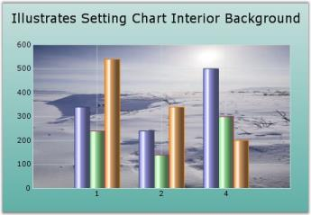

## Palettes

Chart control provides options to apply different kinds of themes or palettes to your chart. You can define the custom or predefined [`Palette`](https://help.syncfusion.com/cr/windowsforms/Syncfusion.Windows.Forms.Chart.ChartControl.html#Syncfusion_Windows_Forms_Chart_ChartControl_Palette) for the entire chart or series.

There are some predefined palettes such as:
* Default
* DefaultAlpha
* DefaultOld
* DefaultOldAlpha
* EarthTone
* Analog
* Colorful
* Nature
* Pastel
* Triad
* WarmCold
* GrayScale
* SkyBlueStyle
* RedYellowStyle
* GreenYellowStyle
* PinkVioletStyle
* Metro
* Office2016
* Custom

### Applying palette to series

Each palette applies a set of predefined brushes to the series in a predefined order. The following code example shows you how to set the Metro Palette for the chart series.




this.chartControl1.Palette = ChartColorPalette.Metro;





Me.chartControl1.Palette = ChartColorPalette.Metro




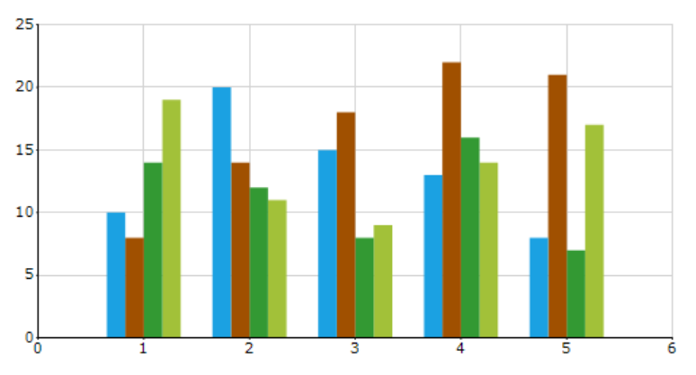

The following code example shows chart with [`GreenYellowStyle`](https://help.syncfusion.com/cr/windowsforms/Syncfusion.Windows.Forms.Chart.ChartColorPalette.html#fields) palette.




this.chartControl1.Palette = ChartColorPalette.GreenYellowStyle;





Me.chartControl1.Palette = ChartColorPalette.GreenYellowStyle




### Applying custom color to segment

You can set the individual color for each segment of the series by using the Interior property of series styles collection. The following code example shows you how to set the custom color for the chart series.



    public class SalesData
    {
        private string year;

        private double sales;

        private Color segmentColor;

        public string Year
        {
            get { return year; }

            set { year = value; }
        }

        public double Sales
        {
            get { return sales; }

            set { sales = value; }
        }

        public Color SegmentColor
        {
            get { return segmentColor; }

            set { segmentColor = value; }
        }

        public SalesData(string year, double sales, Color color)
        {
            this.year = year;

            this.sales = sales;

            this.segmentColor = color;
        }
    }
	

	

	
	BindingList<SalesData> dataSource = new BindingList<SalesData>();
	dataSource.Add(new SalesData("1999", 23, Color.Navy));
	dataSource.Add(new SalesData("2000", 17, Color.Yellow));
	dataSource.Add(new SalesData("2001", 22, Color.Cyan));
	dataSource.Add(new SalesData("2002", 18, Color.Brown));
	dataSource.Add(new SalesData("2003", 22, Color.LimeGreen));
	dataSource.Add(new SalesData("2004", 30, Color.Orange));
	
	CategoryAxisDataBindModel dataSeriesModel = new CategoryAxisDataBindModel(dataSource);
	dataSeriesModel.CategoryName = "Year";
	dataSeriesModel.YNames = new string[] { "Sales" };
	
	ChartSeries chartSeries = new ChartSeries("Sales");
	chartSeries.CategoryModel = dataSeriesModel;	
	
	for(int i = 0; i<dataSource.Count; i++)
	{
	    chartSeries.Styles[i].Interior = new BrushInfo((dataSource[i] as SalesData).SegmentColor);
	}
	
	this.chartControl1.Series.Add(chartSeries);



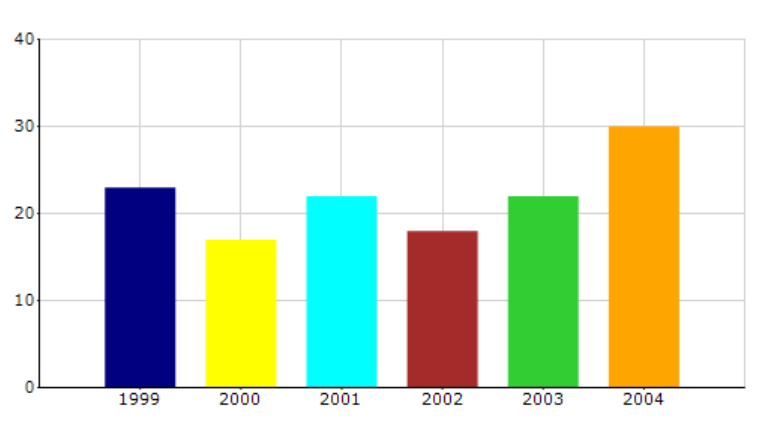

### Getting chart palette colors

The GetColor() function of ColorModel can be used to acquire a list of colors for the palette in the chart control. The following code example demonstrates how to obtain the chart palette color list.



    this.chartControl1 = new ChartControl();

    . . .
    
    int numberOfPaletteColors = this.chartControl1.Palette == ChartColorPalette.Metro ? ChartColorModel.NumColorsInMetroPalette : ChartColorModel.NumColorsInPalette;
    
    List<Color> paletteColors = new List<Color>();
    for (int i = 0; i < numberOfPaletteColors; i++)
    {
        paletteColors.Add(this.chartControl1.Model.ColorModel.GetColor(i));
    }
	


## Custom Palette

Chart control provides option which enables you to define your own color with your preferred order for the palette, using [`CustomPalette`](https://help.syncfusion.com/cr/windowsforms/Syncfusion.Windows.Forms.Chart.ChartControl.html#Syncfusion_Windows_Forms_Chart_ChartControl_CustomPalette) as shown in the following code example.




this.chartControl1.Palette = ChartColorPalette.Custom;
this.chartControl1.CustomPalette = new Color[] { Color.LightGreen, Color.LightBlue, Color.Aqua, Color.YellowGreen};





Me.chartControl1.Palette = ChartColorPalette.Custom
Me.chartControl1.CustomPalette = new Color[] { Color.LightGreen, Color.LightBlue, Color.Aqua, Color.YellowGreen}




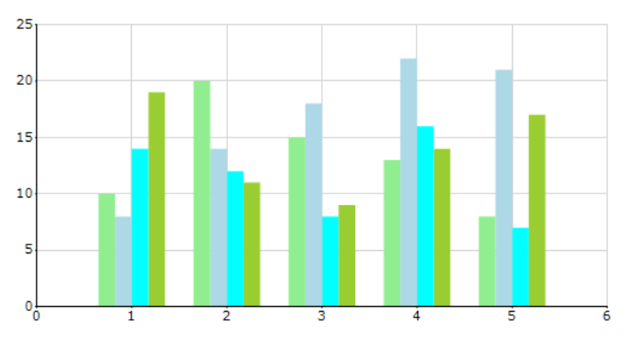

## Border and Margins

### Chart Area Border

Borders of the chart area can be customized using the below border properties.

**Properties**

<table>
<tr>
<th>
ChartArea Property</th><th>
Description</th></tr>
<tr>
<td>

{{'[BorderColor](https://help.syncfusion.com/cr/windowsforms/Syncfusion.Windows.Forms.Chart.ChartArea.html#Syncfusion_Windows_Forms_Chart_ChartArea_BorderColor)'| markdownify }}
</td><td>
Indicates the border color of the chart area.</td></tr>
<tr>
<td>

{{'[BorderStyle](https://help.syncfusion.com/cr/windowsforms/Syncfusion.Windows.Forms.Chart.ChartArea.html#Syncfusion_Windows_Forms_Chart_ChartArea_BorderStyle)'| markdownify }}
</td><td>
Indicates the border style.</td></tr>
<tr>
<td>

{{'[BorderWidth](https://help.syncfusion.com/cr/windowsforms/Syncfusion.Windows.Forms.Chart.ChartArea.html#Syncfusion_Windows_Forms_Chart_ChartArea_BorderWidth)'| markdownify }}
</td><td>
Specifies the width of the border.</td></tr>
</table>

**BorderAppearance**

<table>
<tr>
<th>
Property</th><th>
Description </th></tr>
<tr>
<td>

{{'[BaseColor](https://help.syncfusion.com/cr/windowsforms/Syncfusion.Windows.Forms.Chart.ChartBorderInfo.html#Syncfusion_Windows_Forms_Chart_ChartBorderInfo_BaseColor)'| markdownify }}
</td><td>
Gets or sets the color of the base.</td></tr>
<tr>
<td>
{{'[FrameThickness](https://help.syncfusion.com/cr/windowsforms/Syncfusion.Windows.Forms.Chart.ChartBorderInfo.html#Syncfusion_Windows_Forms_Chart_ChartBorderInfo_FrameThickness)'| markdownify }}
</td><td>
Gets or sets the frame thickness. This property setting will be effective, when SkinStyle is Frame.</td></tr>
<tr>
<td>
{{'[Interior](https://help.syncfusion.com/cr/windowsforms/Syncfusion.Windows.Forms.Chart.ChartBorderInfo.html#Syncfusion_Windows_Forms_Chart_ChartBorderInfo_Interior)'| markdownify }}
</td><td>
Sets the interior color of the border. This property settings will be effective when SkinStyle is Sunken, Etched and Raised.</td></tr>
<tr>
<td>
{{'[SkinStyle](https://help.syncfusion.com/cr/windowsforms/Syncfusion.Windows.Forms.Chart.ChartBorderInfo.html#Syncfusion_Windows_Forms_Chart_ChartBorderInfo_SkinStyle)'| markdownify }}
</td><td>
Specifies the border skin style.</td></tr>
</table>




this.chartControl1.ChartArea.BorderColor = System.Drawing.Color.Goldenrod;

this.chartControl1.ChartArea.BorderStyle = System.Windows.Forms.BorderStyle.FixedSingle;

this.chartControl1.ChartArea.BorderWidth = 1;

this.chartControl1.BorderAppearance.BaseColor = System.Drawing.Color.DarkGray;

//This property setting will be effective, when SkinStyle is 'Frame'.

this.chartControl1.BorderAppearance.FrameThickness = new Syncfusion.Windows.Forms.Chart.ChartThickness(15F, 30F, 15F, 18F);

//This interior property settings will be effective when SkinStyle is Sunken, Etched and Raised.

this.chartControl1.BorderAppearance.Interior.ForeColor = System.Drawing.Color.Maroon;

this.chartControl1.BorderAppearance.SkinStyle = Syncfusion.Windows.Forms.Chart.ChartBorderSkinStyle.Raised;





Me.ChartControl1.ChartArea.BorderColor = System.Drawing.Color.Goldenrod

Me.ChartControl1.ChartArea.BorderStyle = System.Windows.Forms.BorderStyle.FixedSingle

Me.ChartControl1.ChartArea.BorderWidth = 1

Me.chartControl1.BorderAppearance.BaseColor = System.Drawing.Color.DarkGray 

'This property setting will be effective, when SkinStyle is 'Frame'. 

Me.chartControl1.BorderAppearance.FrameThickness = New Syncfusion.Windows.Forms.Chart.ChartThickness(15F, 30F, 15F, 18F) 

'This interior property settings will be effective when SkinStyle is Sunken, Etched and Raised. 

Me.chartControl1.BorderAppearance.Interior.ForeColor = System.Drawing.Color.Maroon 

Me.chartControl1.BorderAppearance.SkinStyle = Syncfusion.Windows.Forms.Chart.ChartBorderSkinStyle.Raised 




### Chart Area Shadow

The chart area can also be rendered with a shadow. To turn this feature on, enable [ChartAreaShadow](https://help.syncfusion.com/cr/windowsforms/Syncfusion.Windows.Forms.Chart.ChartControl.html#Syncfusion_Windows_Forms_Chart_ChartControl_ChartAreaShadow) property. 

**Properties**

<table>
<tr>
<th>
Chart control Property</th><th>
Description</th></tr>
<tr>
<td>

{{'[ChartAreaShadow](https://help.syncfusion.com/cr/windowsforms/Syncfusion.Windows.Forms.Chart.ChartControl.html#Syncfusion_Windows_Forms_Chart_ChartControl_ChartAreaShadow)'| markdownify }}
</td><td>
Indicates whether chart area has a shadow.</td></tr>
<tr>
<td>
{{'[ShadowColor](https://help.syncfusion.com/cr/windowsforms/Syncfusion.Windows.Forms.Chart.ChartControl.html#Syncfusion_Windows_Forms_Chart_ChartControl_ShadowColor)'| markdownify }}
</td><td>
Specifies the color of the shadow.</td></tr>
<tr>
<td>
{{'[ShadowWidth](https://help.syncfusion.com/cr/windowsforms/Syncfusion.Windows.Forms.Chart.ChartControl.html#Syncfusion_Windows_Forms_Chart_ChartControl_ShadowWidth)'| markdownify }}
</td><td>
Specifies the width of the shadow.</td></tr>
</table>




this.chartControl1.ChartAreaShadow = true;

this.chartControl1.ShadowColor = new Syncfusion.Drawing.BrushInfo(Syncfusion.Drawing.GradientStyle.ForwardDiagonal, System.Drawing.Color.AntiqueWhite, System.Drawing.Color.Goldenrod);

this.chartControl1.ShadowWidth = 7;





Me.ChartControl1.ChartAreaShadow = True

Me.ChartControl1.ShadowColor = New Syncfusion.Drawing.BrushInfo(Syncfusion.Drawing.GradientStyle.ForwardDiagonal, System.Drawing.Color.AntiqueWhite, System.Drawing.Color.Goldenrod)

Me.chartControl1.ShadowWidth = 7




### Chart Area Margins

Margin for the chart area can be controlled using [ChartAreaMargins](https://help.syncfusion.com/cr/windowsforms/Syncfusion.Windows.Forms.Chart.ChartControl.html#Syncfusion_Windows_Forms_Chart_ChartControl_ChartAreaMargins) property. It indicates the margin that will be deduced from Chart Area's representation rectangle.

<table>
<tr>
<th>
Chart control Property</th><th>
Description</th></tr>
<tr>
<td>

{{'[ChartAreaMargins](https://help.syncfusion.com/cr/windowsforms/Syncfusion.Windows.Forms.Chart.ChartControl.html#Syncfusion_Windows_Forms_Chart_ChartControl_ChartAreaMargins)'| markdownify }}
</td><td>
Specifies the amount of pixels between the chart area border and the chart plot area. Default is {10, 10, 10, 10}.</td></tr>
</table>




this.chartControl1.ChartAreaMargins = new Syncfusion.Windows.Forms.Chart.ChartMargins(10, 10, 10, 20);





Me.ChartControl1.ChartAreaMargins = New Syncfusion.Windows.Forms.Chart.ChartMargins(10, 10, 10, 20)




### ChartPlot Area Margins

The margins for ChartPlotArea is specified in [ChartPlotAreaMargins](https://help.syncfusion.com/cr/windowsforms/Syncfusion.Windows.Forms.Chart.ChartArea.html#Syncfusion_Windows_Forms_Chart_ChartArea_ChartPlotAreaMargins) property. 

<table>
<tr>
<th>
ChartControl Property</th><th>
Description</th></tr>
<tr>
<td>

{{'[ChartPlotAreaMargins](https://help.syncfusion.com/cr/windowsforms/Syncfusion.Windows.Forms.Chart.ChartArea.html#Syncfusion_Windows_Forms_Chart_ChartArea_ChartPlotAreaMargins)'| markdownify }}
</td><td>
Indicates the margin of the axis labels. This  margin is supported for left, Top, Right and Bottom side of the chart. This property works only if EdgeLabelsDrawingMode property is set to Shift.Default is {10, 10, 10, 10}.</td></tr>
<tr>
<td>
{{'[AdjustPlotAreaMargins](https://help.syncfusion.com/cr/windowsforms/Syncfusion.Windows.Forms.Chart.ChartArea.html#Syncfusion_Windows_Forms_Chart_ChartArea_AdjustPlotAreaMargins)'| markdownify }}
</td><td>
Gets / sets the mode of drawing the edge labels. Default is AutoSet.</td></tr>
<tr>
<td>
{{'[EdgeLabelsDrawingMode ](https://help.syncfusion.com/cr/windowsforms/Syncfusion.Windows.Forms.Chart.ChartAxis.html#Syncfusion_Windows_Forms_Chart_ChartAxis_EdgeLabelsDrawingMode)'| markdownify }}
</td><td>
Gets or sets the edge labels drawing mode.</td></tr>
</table>




this.chartControl1.PrimaryYAxis.EdgeLabelsDrawingMode = Syncfusion.Windows.Forms.Chart.ChartAxisEdgeLabelsDrawingMode.Shift;

this.chartControl1.ChartArea.AdjustPlotAreaMargins = Syncfusion.Windows.Forms.Chart.ChartSetMode.UserSet;

this.chartControl1.ChartArea.ChartPlotAreaMargins.Left = 200;





Me.chartControl1.PrimaryYAxis.EdgeLabelsDrawingMode = Syncfusion.Windows.Forms.Chart.ChartAxisEdgeLabelsDrawingMode.Shift

Me.chartControl1.ChartArea.AdjustPlotAreaMargins = Syncfusion.Windows.Forms.Chart.ChartSetMode.UserSet

Me.chartControl1.ChartArea.ChartPlotAreaMargins.Left = 200




### Spacing between elements

The spacing between elements in the chart is specified using the [ElementsSpacing](https://help.syncfusion.com/cr/windowsforms/Syncfusion.Windows.Forms.Chart.ChartControl.html#Syncfusion_Windows_Forms_Chart_ChartControl_ElementsSpacing) property. For example, the space between the chart right border and legend right border if [LegendPosition](https://help.syncfusion.com/cr/windowsforms/Syncfusion.Windows.Forms.Chart.ChartLegend.html#Syncfusion_Windows_Forms_Chart_ChartLegend_Position) is set to Right.

 **Properties**

<table>
<tr>
<th>
Chart control Property</th><th>
Description</th></tr>
<tr>
<td>

{{'[ElementsSpacing](https://help.syncfusion.com/cr/windowsforms/Syncfusion.Windows.Forms.Chart.ChartControl.html#Syncfusion_Windows_Forms_Chart_ChartControl_ElementsSpacing)'| markdownify }}
</td><td>
Specifies the spacing between the elements in the chart. Default is 20.</td></tr>
</table>

## Foreground Settings

### Chart Title

The [ChartControl](https://help.syncfusion.com/cr/windowsforms/Syncfusion.Windows.Forms.Chart.ChartControl.html) provides properties to customize and align the text within the control. Below are the text properties.

Using the [ChartControl.Text](https://help.syncfusion.com/cr/windowsforms/Syncfusion.Windows.Forms.Chart.ChartControl.html#Syncfusion_Windows_Forms_Chart_ChartControl_Text) property, users can provide the title that appears at the top of the chart. [TextPosition](https://help.syncfusion.com/cr/windowsforms/Syncfusion.Windows.Forms.Chart.ChartControl.html#Syncfusion_Windows_Forms_Chart_ChartControl_TextPosition) and [TextAlignment](https://help.syncfusion.com/cr/windowsforms/Syncfusion.Windows.Forms.Chart.ChartControl.html#Syncfusion_Windows_Forms_Chart_ChartControl_TextAlignment) further lets you control the relative positioning of this title.

Here are some properties that affect the title text in the chart.

<table>
<tr>
<th>
Chart control Property</th><th>
Description</th></tr>
<tr>
<td>

{{'[Text](https://help.syncfusion.com/cr/windowsforms/Syncfusion.Windows.Forms.Chart.ChartControl.html#Syncfusion_Windows_Forms_Chart_ChartControl_Text)'| markdownify }}
</td><td>
Specifies the title for the chart.</td></tr>
<tr>
<td>
{{'[TextPosition](https://help.syncfusion.com/cr/windowsforms/Syncfusion.Windows.Forms.Chart.ChartControl.html#Syncfusion_Windows_Forms_Chart_ChartControl_TextPosition)'| markdownify }}
</td><td>
Specifies the position of the chart. Possible values are,<ul><li>Top</li><li>Bottom</li><li>Left</li><li>Right</li></ul></td></tr>
<tr>
<td>
 
{{'[TextAlignment](https://help.syncfusion.com/cr/windowsforms/Syncfusion.Windows.Forms.Chart.ChartControl.html#Syncfusion_Windows_Forms_Chart_ChartControl_TextAlignment)'| markdownify }}
</td><td>
Specifies the alignment of the title with respect to the chart borders. Possible values:<ul><li>Near</li><li>Center</li><li>Far</li></ul></td></tr>
<tr>
<td>
{{'[Font](https://help.syncfusion.com/cr/windowsforms/Syncfusion.Windows.Forms.Chart.ChartControl.html#)'| markdownify }}
</td><td>
Indicates the font style of the title.</td></tr>
<tr>
<td>
{{'[ForeColor](https://help.syncfusion.com/cr/windowsforms/Syncfusion.Windows.Forms.Chart.ChartControl.html#Syncfusion_Windows_Forms_Chart_ChartControl_ForeColor)'| markdownify }}
</td><td>
Indicates the foreground color of the title.</td></tr>
</table>




this.chartControl1.Text = "Illustrates Foreground Settings";

this.chartControl1.Font = new System.Drawing.Font("Arial", 11.25F, System.Drawing.FontStyle.Bold);

this.chartControl1.ForeColor = System.Drawing.Color.Bisque;

this.chartControl1.TextPosition = ChartTextPosition.Top;





Me.ChartControl1.Text = "Illustrates Foreground Settings"

Me.chartControl1.Font = New System.Drawing.Font("Arial", 11.25F, System.Drawing.FontStyle.Bold)

Me.chartControl1.ForeColor = System.Drawing.Color.Bisque

Me.chartControl1.TextPosition = ChartTextPosition.Top




**General Text Related settings**

The following text related properties affect all the text rendered in the chart.

**Properties**

<table>
<tr>
<th>
Chart control Property</th><th>
Description</th></tr>
<tr>
<td>

{{'[TextRenderingHint](https://help.syncfusion.com/cr/windowsforms/Syncfusion.Windows.Forms.Chart.ChartControl.html#Syncfusion_Windows_Forms_Chart_ChartControl_TextRenderingHint)'| markdownify }}
</td><td>
Specifies the way the text is drawn. Possible values:<ul><li>AntiAlias - each character is drawn using its anti-aliased glyph bitmap without hinting.</li><li>AntiAliasGridFit - each character is drawn using its anti-aliased glyph bitmap with hinting.</li><li>ClearTypeGridFit - each character is drawn using its glyph clear type bitmap with hinting.</li><li>SingleBitPerPixel - each character is drawn using its glyph bitmap.</li><li>SingleBitPerPixelGridFit - each character is drawn using its glyph bitmap.</li><li>SystemDefault - each character is drawn using its glyph bitmap with the system default rendering hint. The text will be drawn using whatever the font-smoothing settings the user had selected for the system.</li></ul></td></tr>
<tr>
<td>
 
{{'[SmoothingMode](https://help.syncfusion.com/cr/windowsforms/Syncfusion.Windows.Forms.Chart.ChartControl.html#Syncfusion_Windows_Forms_Chart_ChartControl_SmoothingMode)'| markdownify }}
</td><td>
Specifies how chart elements should be rendered. Possible values:<ul><li>AntiAlias</li><li>HighQuality</li><li>HighSpeed</li><li>Invalid</li><li>None</li><li>Default</li></ul></td></tr>
</table>



[Axis Label Text Formatting, Appearance and Positioning](/windowsforms/chart/chart-axes#axis-labels) (for info on changing axis label text settings)

[Customizing Label Text](/windowsforms/chart/chart-axes#customizing-label-text), [Intersecting Labels](/windowsforms/chart/chart-axes#intersecting-labels), [Grouping Labels](/windowsforms/chart/chart-axes#grouping-labels), (for info on changing axis label text settings)

[Series Customization/Font](/windowsforms/chart/chart-series#series-customization), (for info on changing series text settings)

[Chart Legend](/windowsforms/chart/chart-legend-and-legend-items#chartlegend) (for info on changing legend text settings)

 

## Custom Drawing

Essential Chart lets you render any data on the chart area. If the built-in features and functionality are not sufficient you can simply draw whatever you want on the chart surface.

You can do so by listening to the [ChartAreaPaint](https://help.syncfusion.com/cr/windowsforms/Syncfusion.Windows.Forms.Chart.ChartControl.html#Syncfusion_Windows_Forms_Chart_ChartControl_ChartAreaPaint) event. This event is raised both when a chart is painted as well as when the chart is exported to other image formats, SVG, etc. Remember to do your custom drawing in this event instead of in the Paint event (which will not be called during chart export).




private void chartControl1_ChartAreaPaint(object sender, PaintEventArgs e)

{

    // Get the right end of the X axis

    Point ptX = this.chartControl1.ChartArea.GetPointByValue(new ChartPoint(this.chartControl1.PrimaryXAxis.Range.Max, this.chartControl1.PrimaryYAxis.Range.Min));

    PointF ptX1 = new PointF(ptX.X - 7, ptX.Y - 4);

    PointF ptX2 = new PointF(ptX.X, ptX.Y);

    PointF ptX3 = new PointF(ptX.X - 7, ptX.Y + 4);

    // Draws an arrow at the end of the X axis

    e.Graphics.FillPolygon(Brushes.Black, new PointF[] { ptX1, ptX2, ptX3 });

    // Get the top end of the Y axis

    Point ptY = this.chartControl1.ChartArea.GetPointByValue(new ChartPoint(this.chartControl1.PrimaryXAxis.Range.Min, this.chartControl1.PrimaryYAxis.Range.Max));

    PointF ptY1 = new PointF(ptY.X - 4, ptY.Y + 7);

    PointF ptY2 = new PointF(ptY.X, ptY.Y);

    PointF ptY3 = new PointF(ptY.X + 4, ptY.Y + 7);

    // Draws an arrow at the top of the Y Axis.

    e.Graphics.FillPolygon(Brushes.Black, new PointF[] { ptY1, ptY2, ptY3 });

    // Draws a line through the center of the chart.

    e.Graphics.DrawLine(Pens.Gray, ptY.X, ptX.Y, ptX.X, ptY.Y);

}





Private Sub chartControl1_ChartAreaPaint(ByVal sender As Object, ByVal e As PaintEventArgs)

' Get the right end of the X axis 

    Dim ptX As Point = Me.chartControl1.ChartArea.GetPointByValue(New ChartPoint(Me.chartControl1.PrimaryXAxis.Range.Max, Me.chartControl1.PrimaryYAxis.Range.Min))

    Dim ptX1 As New PointF(ptX.X - 7, ptX.Y - 4)

    Dim ptX2 As New PointF(ptX.X, ptX.Y)

    Dim ptX3 As New PointF(ptX.X - 7, ptX.Y + 4)

' Draws an arrow at the end of the X axis 

    e.Graphics.FillPolygon(Brushes.Black, New PointF() {ptX1, ptX2, ptX3})

' Get the top end of the Y axis 

    Dim ptY As Point = Me.chartControl1.ChartArea.GetPointByValue(New ChartPoint(Me.chartControl1.PrimaryXAxis.Range.Min, Me.chartControl1.PrimaryYAxis.Range.Max))

    Dim ptY1 As New PointF(ptY.X - 4, ptY.Y + 7)

    Dim ptY2 As New PointF(ptY.X, ptY.Y)

    Dim ptY3 As New PointF(ptY.X + 4, ptY.Y + 7)

' Draws an arrow at the top of the Y Axis. 

    e.Graphics.FillPolygon(Brushes.Black, New PointF() {ptY1, ptY2, ptY3})

' Draws a line through the center of the chart. 

    e.Graphics.DrawLine(Pens.Gray, ptY.X, ptX.Y, ptX.X, ptY.Y)

End Sub




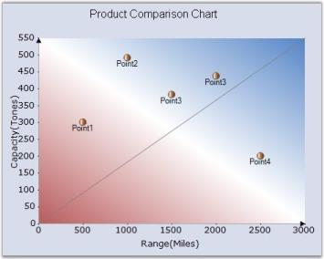



 [Chart Area Bounds](/windowsforms/chart/hit-testing#chart-area-bounds)
 
 

## Watermark Support

EssentialChart supports watermark feature using which we can show text, image, or both as watermark inside the chart area. 

Below are the WaterMark properties with descriptions.

**Watermark Properties**

<table>
<tr>
<th>
Watermark Property</th><th>
Description</th></tr>
<tr>
<td>

{{'[Text](https://help.syncfusion.com/cr/windowsforms/Syncfusion.Windows.Forms.Chart.ChartWatermark.html#Syncfusion_Windows_Forms_Chart_ChartWatermark_Text)'| markdownify }}
</td><td>
Sets the watermark text.</td></tr>
<tr>
<td>
{{'[Image](https://help.syncfusion.com/cr/windowsforms/Syncfusion.Windows.Forms.Chart.ChartWatermark.html#Syncfusion_Windows_Forms_Chart_ChartWatermark_Image)'| markdownify }}
</td><td>
Used to display image as the watermark.</td></tr>
<tr>
<td>
{{'[Opacity](https://help.syncfusion.com/cr/windowsforms/Syncfusion.Windows.Forms.Chart.ChartWatermark.html#Syncfusion_Windows_Forms_Chart_ChartWatermark_Opacity)'| markdownify }}
</td><td>
Sets the opacity of the watermark.</td></tr>
<tr>
<td>
{{'[HorizontalAlignment](https://help.syncfusion.com/cr/windowsforms/Syncfusion.Windows.Forms.Chart.ChartWatermark.html#Syncfusion_Windows_Forms_Chart_ChartWatermark_HorizontalAlignment)'| markdownify }}
</td><td>
Sets watermark horizontally in the chart area.</td></tr>
<tr>
<td>
{{'[VerticalAlignment](https://help.syncfusion.com/cr/windowsforms/Syncfusion.Windows.Forms.Chart.ChartWatermark.html#Syncfusion_Windows_Forms_Chart_ChartWatermark_VerticalAlignment)'| markdownify }}
</td><td>
Sets watermark vertically in the chart area.</td></tr>
<tr>
<td>
{{'[ZOrder](https://help.syncfusion.com/cr/windowsforms/Syncfusion.Windows.Forms.Chart.ChartWatermark.html#Syncfusion_Windows_Forms_Chart_ChartWatermark_ZOrder)'| markdownify }}</td><td>
Used to specify whether watermark should be shown on top of the chart.</td></tr>
</table>




this.chartControl1.ChartArea.WaterMark.Text="Syncfusion Chart";

this.chartControl1.ChartArea.Watermark.Image = System.Drawing.Image.FromFile("Logo.bmp");

this.chartControl1.ChartArea.Watermark.Opacity=60;

this.chartControl1.ChartArea.Watermark.HorizontalAlignment=ChartAlignment.Near;

this.chartControl1.ChartArea.Watermark.VerticalAlignment=ChartAlignment.Near;

this.chartControl1.ChartArea.Watermark.ZOrder=ChartWaterMarkOrder.Behind;





Me.chartControl1.ChartArea.WaterMark.Text="Syncfusion Chart"

Me.chartControl1.ChartArea.Watermark.Image = System.Drawing.Image.FromFile("Logo.bmp")

Me.chartControl1.ChartArea.Watermark.Opacity=60

Me.chartControl1.ChartArea.Watermark.HorizontalAlignment=ChartAlignment.Near

Me.chartControl1.ChartArea.Watermark.VerticalAlignment=ChartAlignment.Near

Me.chartControl1.ChartArea.Watermark.ZOrder=ChartWaterMarkOrder.Behind;




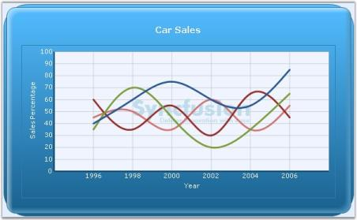

## Interlaced Grid Background

Chart supports interlaced grid which draws alternative grid background in x-axis and y-axis. The color is also customizable.




this.chartControl1.PrimaryXAxis.InterlacedGrid = true;

this.chartControl1.PrimaryXAxis.InterlacedGridInterior = new Syncfusion.Drawing.BrushInfo(System.Drawing.Color.FromArgb(166, 184, 200);

this.chartControl1.PrimaryYAxis.InterlacedGrid = True;

this.chartControl1.PrimaryYAxis.InterlacedGridInterior = new Syncfusion.Drawing.BrushInfo(System.Drawing.Color.FromArgb(124, 144, 179));





Me.chartControl1.PrimaryXAxis.InterlacedGrid = True

Me.chartControl1.PrimaryXAxis.InterlacedGridInterior = new Syncfusion.Drawing.BrushInfo(System.Drawing.Color.FromArgb(166, 184, 200)

Me.chartControl1.PrimaryYAxis.InterlacedGrid = True

Me.chartControl1.PrimaryYAxis.InterlacedGridInterior = new Syncfusion.Drawing.BrushInfo(System.Drawing.Color.FromArgb(124, 144, 179))




The preceding image illustrates interlaced grid background for the chart.

A sample which illustrates the Interlaced Grid for the Chart is available in the below sample installation location.

&lt;Sample location&gt;\Syncfusion\EssentialStudio\Version Number\Windows\Chart.Windows\Samples\Chart Appearance\Interlaced Grid

## Minor Grid Lines

Chart comes with minor lines support which will draw lines along the intervals provided. The appearance of these line is also customizable similar to the major grid lines. 




this.chartControl1.PrimaryXAxis.DrawMinorGrid = true;

this.chartControl1.PrimaryXAxis.MinorGridLineType.DashStyle = DashStyle.DashDotDot;

this.chartControl1.PrimaryXAxis.MinorGridLineType.Width = 2;

this.chartControl1.PrimaryXAxis.MinorGridLineType.ForeColor = Color.Red;

chartControl1.PrimaryXAxis.SmallTicksPerInterval = 1;





Me.chartControl1.PrimaryXAxis.DrawMinorGrid = True

Me.chartControl1.PrimaryXAxis.MinorGridLineType.DashStyle = DashStyle.DashDotDot

Me.chartControl1.PrimaryXAxis.MinorGridLineType.Width = 2

Me.chartControl1.PrimaryXAxis.MinorGridLineType.ForeColor = Color.Red

chartControl1.PrimaryXAxis.SmallTicksPerInterval = 1




## Chart Skins 

Chart Control has some pre-defined skins, which can be controlled through a single property setting. EssentialChart control allows the user to customize its appearance by applying pre-defined Interiors. 

Some of the available skins are:

* Office2007Black
* Office2007Blue
* Office2007Silver
* Almond
* Blend
* Blueberry
* Marble
* Midnight
* Monochrome
* Olive
* Sandune
* Turquoise
* Vista
* VS2010




this.chartControl1.Skins = Skins.Office2007Blue;





Me.chartControl1.Skins = Skins.Office2007Blue




The following output is displayed when the [Skins](https://help.syncfusion.com/cr/windowsforms/Syncfusion.Windows.Forms.Chart.ChartControl.html#Syncfusion_Windows_Forms_Chart_ChartControl_Skins) value is set to Office2007 Black.

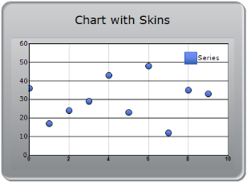

The following output is displayed when the [Skins](https://help.syncfusion.com/cr/windowsforms/Syncfusion.Windows.Forms.Chart.ChartControl.html#Syncfusion_Windows_Forms_Chart_ChartControl_Skins) value is set to Office2007 Blue.

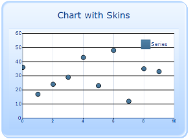

The following output is displayed when the [Skins](https://help.syncfusion.com/cr/windowsforms/Syncfusion.Windows.Forms.Chart.ChartControl.html#Syncfusion_Windows_Forms_Chart_ChartControl_Skins) value is set to Office2007 Silver.

The following output is displayed when the [Skins](https://help.syncfusion.com/cr/windowsforms/Syncfusion.Windows.Forms.Chart.ChartControl.html#Syncfusion_Windows_Forms_Chart_ChartControl_Skins) value is set to Almond.

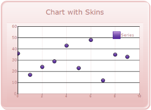

The following output is displayed when the [Skins](https://help.syncfusion.com/cr/windowsforms/Syncfusion.Windows.Forms.Chart.ChartControl.html#Syncfusion_Windows_Forms_Chart_ChartControl_Skins) value is set to Blend.

The following output is displayed when the [Skins](https://help.syncfusion.com/cr/windowsforms/Syncfusion.Windows.Forms.Chart.ChartControl.html#Syncfusion_Windows_Forms_Chart_ChartControl_Skins) value is set to Blueberry.

The following output is displayed when the [Skins](https://help.syncfusion.com/cr/windowsforms/Syncfusion.Windows.Forms.Chart.ChartControl.html#Syncfusion_Windows_Forms_Chart_ChartControl_Skins) value is set to Marble.

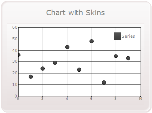

The following output is displayed when the [Skins](https://help.syncfusion.com/cr/windowsforms/Syncfusion.Windows.Forms.Chart.ChartControl.html#Syncfusion_Windows_Forms_Chart_ChartControl_Skins) value is set to Midnight.

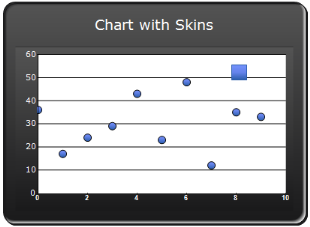

The following output is displayed when the [Skins](https://help.syncfusion.com/cr/windowsforms/Syncfusion.Windows.Forms.Chart.ChartControl.html#Syncfusion_Windows_Forms_Chart_ChartControl_Skins) value is set to Monochrome.

The following output is displayed when the [Skins](https://help.syncfusion.com/cr/windowsforms/Syncfusion.Windows.Forms.Chart.ChartControl.html#Syncfusion_Windows_Forms_Chart_ChartControl_Skins) value is set to Olive.

The following output is displayed when the [Skins](https://help.syncfusion.com/cr/windowsforms/Syncfusion.Windows.Forms.Chart.ChartControl.html#Syncfusion_Windows_Forms_Chart_ChartControl_Skins) value is set to Sandune.

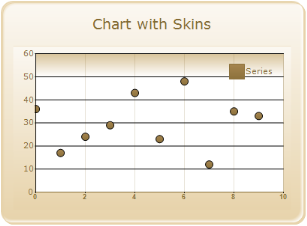

The following output is displayed when the [Skins](https://help.syncfusion.com/cr/windowsforms/Syncfusion.Windows.Forms.Chart.ChartControl.html#Syncfusion_Windows_Forms_Chart_ChartControl_Skins) value is set to Turquoise.

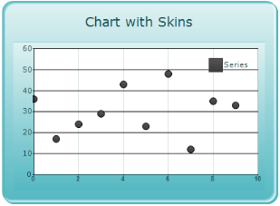

The following output is displayed when the [Skins](https://help.syncfusion.com/cr/windowsforms/Syncfusion.Windows.Forms.Chart.ChartControl.html#Syncfusion_Windows_Forms_Chart_ChartControl_Skins) value is set to Vista.

The following output is displayed when the [Skins](https://help.syncfusion.com/cr/windowsforms/Syncfusion.Windows.Forms.Chart.ChartControl.html#Syncfusion_Windows_Forms_Chart_ChartControl_Skins) value is set to VS2010.




ChartSeries ser1 = new ChartSeries("Series 1");

ser1.Type = ChartSeriesType.StackingColumn;

// specifying group name .

ser1.StackingGroup = "FirstGroup";

ChartSeries ser2 = new ChartSeries("Series 2");

ser2.Type = ChartSeriesType.StackingColumn;

// specifying group name .

ser2.StackingGroup = "SecondGroup";

ChartSeries ser3 = new ChartSeries("Series 3");

ser3.Type = ChartSeriesType.StackingColumn;

// specifying group name .

ser3.StackingGroup = "FirstGroup";





Dim ser1 As New ChartSeries("Series 1")

ser1.Type = ChartSeriesType.StackingColumn

' specifying group name .

ser1.StackingGroup = "FirstGroup"

Dim ser2 As New ChartSeries("Series 2")

ser2.Type = ChartSeriesType.StackingColumn

' specifying group name .

ser2.StackingGroup = "SecondGroup"

Dim ser3 As New ChartSeries("Series 3")

ser3.Type = ChartSeriesType.StackingColumn

' specifying group name .

ser3.StackingGroup = "FirstGroup"



