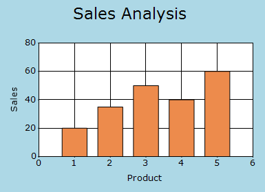

# Chart Appearance

The Windows Forms Chart allows you to customize the colors, images, palettes, borders, margins, titles, watermarks, grids, and skins used to render the chart.

## Background colors

The Windows Forms Chart allows you to customize the background colors of different regions in the chart.

### Outside the Chart Area

The [BackInterior](https://help.syncfusion.com/cr/windowsforms/Syncfusion.Windows.Forms.Chart.ChartControl.html#Syncfusion_Windows_Forms_Chart_ChartControl_BackInterior) property is used to customize the background of the chart outside the chart area. By default, the background color is `Color.White`.

The following code example customizes the background outside the chart area.




chartControl.BackInterior = new Syncfusion.Drawing.BrushInfo(System.Drawing.Color.LightBlue);




chartControl.BackInterior = New Syncfusion.Drawing.BrushInfo(System.Drawing.Color.LightBlue)




### Inside the Plot Area

The [ChartArea.BackInterior](https://help.syncfusion.com/cr/windowsforms/Syncfusion.Windows.Forms.Chart.ChartArea.html#Syncfusion_Windows_Forms_Chart_ChartArea_BackInterior) is used to customize the background of the rectangular plot area where the chart points are displayed. By default, the background color is `Color.White`.

The following code example customizes the background of the plot area.




chartControl.ChartArea.BackInterior = new Syncfusion.Drawing.BrushInfo(System.Drawing.Color.Honeydew);




chartControl.ChartArea.BackInterior = New Syncfusion.Drawing.BrushInfo(System.Drawing.Color.Honeydew)




### Inside the Chart Area

The [ChartInterior](https://help.syncfusion.com/cr/windowsforms/Syncfusion.Windows.Forms.Chart.ChartControl.html#Syncfusion_Windows_Forms_Chart_ChartControl_ChartInterior) property specifies the interior color of the chart area.




chartControl.ChartInterior = new Syncfusion.Drawing.BrushInfo( Syncfusion.Drawing.GradientStyle.Horizontal, System.Drawing.Color.Khaki, System.Drawing.Color.LightYellow);




chartControl.ChartInterior = New Syncfusion.Drawing.BrushInfo(Syncfusion.Drawing.GradientStyle.Horizontal, System.Drawing.Color.Khaki, System.Drawing.Color.LightYellow)




## Background Image

The chart supports background images for the chart control and chart area.

### Chart settings

The [BackgroundImage](https://help.syncfusion.com/cr/windowsforms/Syncfusion.Windows.Forms.Chart.ChartControl.html#Syncfusion_Windows_Forms_Chart_ChartControl_BackgroundImage) property displays an image in the background of the chart control. The [BackgroundImageLayout](https://learn.microsoft.com/en-us/dotnet/api/system.windows.forms.control.backgroundimagelayout?view=windowsdesktop-10.0#system-windows-forms-control-backgroundimagelayout) property specifies how the image is arranged. The supported values are [None](https://learn.microsoft.com/en-us/dotnet/api/system.windows.forms.imagelayout?view=windowsdesktop-10.0#system-windows-forms-imagelayout-none), [Tile](https://learn.microsoft.com/en-us/dotnet/api/system.windows.forms.imagelayout?view=windowsdesktop-10.0#system-windows-forms-imagelayout-tile), [Center](https://learn.microsoft.com/en-us/dotnet/api/system.windows.forms.imagelayout?view=windowsdesktop-10.0#system-windows-forms-imagelayout-center), [Stretch](https://learn.microsoft.com/en-us/dotnet/api/system.windows.forms.imagelayout?view=windowsdesktop-10.0#system-windows-forms-imagelayout-stretch), and [Zoom](https://learn.microsoft.com/en-us/dotnet/api/system.windows.forms.imagelayout?view=windowsdesktop-10.0#system-windows-forms-imagelayout-zoom).




chartControl.BackgroundImage =
    Image.FromFile("Images\\chart-background.png");
chartControl.BackgroundImageLayout =
    ImageLayout.Stretch;




chartControl.BackgroundImage =
    Image.FromFile("Images\\chart-background.png")
chartControl.BackgroundImageLayout =
    ImageLayout.Stretch




### ChartArea background image

The `ChartArea.BackImage` property displays an image in the chart area.




chartControl.ChartArea.BackImage =
    Image.FromFile("Images\\plot-background.png");




chartControl.ChartArea.BackImage =
    Image.FromFile("Images\\plot-background.png")




### Chart Interior Background image

Use `ChartInterior` with a texture brush to display an image within the chart interior.




Image interiorImage =
    Image.FromFile("Images\\chart-interior.png");
chartControl.ChartInterior =
    new BrushInfo(interiorImage);




Dim interiorImage As Image =
    Image.FromFile("Images\\chart-interior.png")
chartControl.ChartInterior =
    New BrushInfo(interiorImage)




## Palettes

The [Palette](https://help.syncfusion.com/cr/windowsforms/Syncfusion.Windows.Forms.Chart.ChartControl.html#Syncfusion_Windows_Forms_Chart_ChartControl_Palette) provides options to apply different kinds of themes or palettes to your chart. A palette can be applied to the entire chart or customized for individual series.

The Windows Forms Chart provides the following predefined palettes:

- [Almond](https://help.syncfusion.com/cr/windowsforms/Syncfusion.Windows.Forms.Chart.ChartColorPalette.html#Syncfusion_Windows_Forms_Chart_ChartColorPalette_Almond)
- [Default](https://help.syncfusion.com/cr/windowsforms/Syncfusion.Windows.Forms.Chart.ChartColorPalette.html#Syncfusion_Windows_Forms_Chart_ChartColorPalette_Default)
- [DefaultAlpha](https://help.syncfusion.com/cr/windowsforms/Syncfusion.Windows.Forms.Chart.ChartColorPalette.html#Syncfusion_Windows_Forms_Chart_ChartColorPalette_DefaultAlpha)
- [DefaultOld](https://help.syncfusion.com/cr/windowsforms/Syncfusion.Windows.Forms.Chart.ChartColorPalette.html#Syncfusion_Windows_Forms_Chart_ChartColorPalette_DefaultOld)
- [DefaultOldAlpha](https://help.syncfusion.com/cr/windowsforms/Syncfusion.Windows.Forms.Chart.ChartColorPalette.html#Syncfusion_Windows_Forms_Chart_ChartColorPalette_DefaultOldAlpha)
- [EarthTone](https://help.syncfusion.com/cr/windowsforms/Syncfusion.Windows.Forms.Chart.ChartColorPalette.html#Syncfusion_Windows_Forms_Chart_ChartColorPalette_EarthTone)
- [Analog](https://help.syncfusion.com/cr/windowsforms/Syncfusion.Windows.Forms.Chart.ChartColorPalette.html#Syncfusion_Windows_Forms_Chart_ChartColorPalette_Analog)
- [Colorful](https://help.syncfusion.com/cr/windowsforms/Syncfusion.Windows.Forms.Chart.ChartColorPalette.html#Syncfusion_Windows_Forms_Chart_ChartColorPalette_Colorful)
- [Nature](https://help.syncfusion.com/cr/windowsforms/Syncfusion.Windows.Forms.Chart.ChartColorPalette.html#Syncfusion_Windows_Forms_Chart_ChartColorPalette_Nature)
- [Pastel](https://help.syncfusion.com/cr/windowsforms/Syncfusion.Windows.Forms.Chart.ChartColorPalette.html#Syncfusion_Windows_Forms_Chart_ChartColorPalette_Pastel)
- [Triad](https://help.syncfusion.com/cr/windowsforms/Syncfusion.Windows.Forms.Chart.ChartColorPalette.html#Syncfusion_Windows_Forms_Chart_ChartColorPalette_Triad)
- [WarmCold](https://help.syncfusion.com/cr/windowsforms/Syncfusion.Windows.Forms.Chart.ChartColorPalette.html#Syncfusion_Windows_Forms_Chart_ChartColorPalette_WarmCold)
- [GrayScale](https://help.syncfusion.com/cr/windowsforms/Syncfusion.Windows.Forms.Chart.ChartColorPalette.html#Syncfusion_Windows_Forms_Chart_ChartColorPalette_GrayScale)
- [SkyBlueStyle](https://help.syncfusion.com/cr/windowsforms/Syncfusion.Windows.Forms.Chart.ChartColorPalette.html#Syncfusion_Windows_Forms_Chart_ChartColorPalette_SkyBlueStyle)
- [RedYellowStyle](https://help.syncfusion.com/cr/windowsforms/Syncfusion.Windows.Forms.Chart.ChartColorPalette.html#Syncfusion_Windows_Forms_Chart_ChartColorPalette_RedYellowStyle)
- [GreenYellowStyle](https://help.syncfusion.com/cr/windowsforms/Syncfusion.Windows.Forms.Chart.ChartColorPalette.html#Syncfusion_Windows_Forms_Chart_ChartColorPalette_GreenYellowStyle)
- [PinkVioletStyle](https://help.syncfusion.com/cr/windowsforms/Syncfusion.Windows.Forms.Chart.ChartColorPalette.html#Syncfusion_Windows_Forms_Chart_ChartColorPalette_PinkVioletStyle)
- [Metro](https://help.syncfusion.com/cr/windowsforms/Syncfusion.Windows.Forms.Chart.ChartColorPalette.html#Syncfusion_Windows_Forms_Chart_ChartColorPalette_Metro)
- [Office2016](https://help.syncfusion.com/cr/windowsforms/Syncfusion.Windows.Forms.Chart.ChartColorPalette.html#Syncfusion_Windows_Forms_Chart_ChartColorPalette_Office2016)
- [Custom](https://help.syncfusion.com/cr/windowsforms/Syncfusion.Windows.Forms.Chart.ChartColorPalette.html#Syncfusion_Windows_Forms_Chart_ChartColorPalette_Custom)

### Applying palette to series

Each palette applies a predefined set of colors to the chart series in a predefined order.

The following code example applies the [Metro](https://help.syncfusion.com/cr/windowsforms/Syncfusion.Windows.Forms.Chart.ChartColorPalette.html#Syncfusion_Windows_Forms_Chart_ChartColorPalette_Metro) palette to the chart.




chartControl.Palette = ChartColorPalette.Metro;




chartControl.Palette = ChartColorPalette.Metro




### Applying custom color to segment

You can set the individual color for each segment of the series by using the [Interior](https://help.syncfusion.com/cr/windowsforms/Syncfusion.Windows.Forms.Chart.ChartStyleInfo.html#Syncfusion_Windows_Forms_Chart_ChartStyleInfo_Interior) property of series styles collection.

The following code example shows you how to set the custom color for the chart series.



public class SalesData
{
    private string year;

    private double sales;

    private Color segmentColor;

    public string Year
    {
        get { return year; }

        set { year = value; }
    }

    public double Sales
    {
        get { return sales; }

        set { sales = value; }
    }

    public Color SegmentColor
    {
        get { return segmentColor; }

        set { segmentColor = value; }
    }

    public SalesData(string year, double sales, Color color)
    {
        this.year = year;

        this.sales = sales;

        this.segmentColor = color;
    }
}
	



	
BindingList<SalesData> dataSource = new BindingList<SalesData>();
dataSource.Add(new SalesData("1999", 23, Color.Navy));
dataSource.Add(new SalesData("2000", 17, Color.Yellow));
dataSource.Add(new SalesData("2001", 22, Color.Cyan));
dataSource.Add(new SalesData("2002", 18, Color.Brown));
dataSource.Add(new SalesData("2003", 22, Color.LimeGreen));
dataSource.Add(new SalesData("2004", 30, Color.Orange));

CategoryAxisDataBindModel dataSeriesModel = new CategoryAxisDataBindModel(dataSource);
dataSeriesModel.CategoryName = "Year";
dataSeriesModel.YNames = new string[] { "Sales" };
chartControl.PrimaryXAxis.ValueType = ChartValueType.Category;

ChartSeries chartSeries = new ChartSeries("Sales");
chartSeries.CategoryModel = dataSeriesModel;

for (int i = 0; i < dataSource.Count; i++)
{
    chartSeries.Styles[i].Interior = new BrushInfo((dataSource[i] as SalesData).SegmentColor);
}

chartControl.Series.Add(chartSeries);



### Getting chart palette colors

Use the [GetColor](https://help.syncfusion.com/cr/windowsforms/Syncfusion.Windows.Forms.Chart.ChartColorModel.html#Syncfusion_Windows_Forms_Chart_ChartColorModel_GetColor_System_Int32_) method of [ChartColorModel](https://help.syncfusion.com/cr/windowsforms/Syncfusion.Windows.Forms.Chart.ChartColorModel.html) can be used to acquire a list of colors for the palette in the chart control.

The following code example demonstrates how to obtain the chart palette color list.



chartControl = new ChartControl();

...

int numberOfPaletteColors = chartControl.Palette == ChartColorPalette.Metro ? ChartColorModel.NumColorsInMetroPalette : ChartColorModel.NumColorsInPalette;

List<Color> paletteColors = new List<Color>();
for (int i = 0; i < numberOfPaletteColors; i++)
{
    paletteColors.Add(chartControl.Model.ColorModel.GetColor(i));
}




## Custom Palette

The [CustomPalette](https://help.syncfusion.com/cr/windowsforms/Syncfusion.Windows.Forms.Chart.ChartControl.html#Syncfusion_Windows_Forms_Chart_ChartControl_CustomPalette) property is used to define a custom color palette for the chart. You can specify your own colors and their display order instead of using a predefined palette.

The following code example applies a custom palette to the chart.




chartControl.Palette = ChartColorPalette.Custom;
chartControl.CustomPalette = new Color[] { Color.LightGreen, Color.LightBlue, Color.Aqua, Color.YellowGreen };




chartControl.Palette = ChartColorPalette.Custom
chartControl.CustomPalette = New Color() {Color.LightGreen, Color.LightBlue, Color.Aqua, Color.YellowGreen}




## Border and margins

The chart provides properties for customizing the chart-area border, shadow, chart-area margins, plot-area margins, and spacing between elements.

### Chart area border

The following properties customize the chart-area border:
- [BorderColor](https://help.syncfusion.com/cr/windowsforms/Syncfusion.Windows.Forms.Chart.ChartArea.html#Syncfusion_Windows_Forms_Chart_ChartArea_BorderColor): Specifies the color of the chart area border. The default value is `SystemColors.ControlText`.
- [BorderStyle](https://help.syncfusion.com/cr/windowsforms/Syncfusion.Windows.Forms.Chart.ChartArea.html#Syncfusion_Windows_Forms_Chart_ChartArea_BorderStyle): Specifies the style of the chart area border. The default value is `BorderStyle.None`. The supported values are:
    - `None`: Does not display a border.
    - `FixedSingle`: Displays a single-line border.
    - `Fixed3D`: Displays a three-dimensional border.
- [BorderWidth](https://help.syncfusion.com/cr/windowsforms/Syncfusion.Windows.Forms.Chart.ChartArea.html#Syncfusion_Windows_Forms_Chart_ChartArea_BorderWidth): Specifies the width of the chart area border. The default value is `1`.

**BorderAppearance**

The chart control border can be customized using the following properties:

- [BaseColor](https://help.syncfusion.com/cr/windowsforms/Syncfusion.Windows.Forms.Chart.ChartBorderInfo.html#Syncfusion_Windows_Forms_Chart_ChartBorderInfo_BaseColor): Specifies the base color of the chart border. By default, it uses the border's default rendering color.
- [SkinStyle](https://help.syncfusion.com/cr/windowsforms/Syncfusion.Windows.Forms.Chart.ChartBorderInfo.html#Syncfusion_Windows_Forms_Chart_ChartBorderInfo_SkinStyle): Specifies the border skin style. The default value is [None](https://help.syncfusion.com/cr/windowsforms/Syncfusion.Windows.Forms.Chart.ChartBorderSkinStyle.html#Syncfusion_Windows_Forms_Chart_ChartBorderSkinStyle_None).
The supported values are:
    - [Bevel](https://help.syncfusion.com/cr/windowsforms/Syncfusion.Windows.Forms.Chart.ChartBorderSkinStyle.html#Syncfusion_Windows_Forms_Chart_ChartBorderSkinStyle_Bevel)
    - [Embed](https://help.syncfusion.com/cr/windowsforms/Syncfusion.Windows.Forms.Chart.ChartBorderSkinStyle.html#Syncfusion_Windows_Forms_Chart_ChartBorderSkinStyle_Embed)
    - [Emboss](https://help.syncfusion.com/cr/windowsforms/Syncfusion.Windows.Forms.Chart.ChartBorderSkinStyle.html#Syncfusion_Windows_Forms_Chart_ChartBorderSkinStyle_Emboss)
    - [Etched](https://help.syncfusion.com/cr/windowsforms/Syncfusion.Windows.Forms.Chart.ChartBorderSkinStyle.html#Syncfusion_Windows_Forms_Chart_ChartBorderSkinStyle_Etched)
    - [Frame](https://help.syncfusion.com/cr/windowsforms/Syncfusion.Windows.Forms.Chart.ChartBorderSkinStyle.html#Syncfusion_Windows_Forms_Chart_ChartBorderSkinStyle_Frame)
    - [Gel](https://help.syncfusion.com/cr/windowsforms/Syncfusion.Windows.Forms.Chart.ChartBorderSkinStyle.html#Syncfusion_Windows_Forms_Chart_ChartBorderSkinStyle_Gel)
    - [None](https://help.syncfusion.com/cr/windowsforms/Syncfusion.Windows.Forms.Chart.ChartBorderSkinStyle.html#Syncfusion_Windows_Forms_Chart_ChartBorderSkinStyle_None)
    - [Open](https://help.syncfusion.com/cr/windowsforms/Syncfusion.Windows.Forms.Chart.ChartBorderSkinStyle.html#Syncfusion_Windows_Forms_Chart_ChartBorderSkinStyle_Open)
    - [Pinned](https://help.syncfusion.com/cr/windowsforms/Syncfusion.Windows.Forms.Chart.ChartBorderSkinStyle.html#Syncfusion_Windows_Forms_Chart_ChartBorderSkinStyle_Pinned)
    - [Projector](https://help.syncfusion.com/cr/windowsforms/Syncfusion.Windows.Forms.Chart.ChartBorderSkinStyle.html#Syncfusion_Windows_Forms_Chart_ChartBorderSkinStyle_Projector)
    - [Raised](https://help.syncfusion.com/cr/windowsforms/Syncfusion.Windows.Forms.Chart.ChartBorderSkinStyle.html#Syncfusion_Windows_Forms_Chart_ChartBorderSkinStyle_Raised)
    - [RoundedDiagonal](https://help.syncfusion.com/cr/windowsforms/Syncfusion.Windows.Forms.Chart.ChartBorderSkinStyle.html#Syncfusion_Windows_Forms_Chart_ChartBorderSkinStyle_RoundedDiagonal)
    - [Slice](https://help.syncfusion.com/cr/windowsforms/Syncfusion.Windows.Forms.Chart.ChartBorderSkinStyle.html#Syncfusion_Windows_Forms_Chart_ChartBorderSkinStyle_Slice)
    - [Sunken](https://help.syncfusion.com/cr/windowsforms/Syncfusion.Windows.Forms.Chart.ChartBorderSkinStyle.html#Syncfusion_Windows_Forms_Chart_ChartBorderSkinStyle_Sunken)
- [FrameThickness](https://help.syncfusion.com/cr/windowsforms/Syncfusion.Windows.Forms.Chart.ChartBorderInfo.html#Syncfusion_Windows_Forms_Chart_ChartBorderInfo_FrameThickness): Specifies the thickness of the chart border frame. This property is applicable only when [SkinStyle](https://help.syncfusion.com/cr/windowsforms/Syncfusion.Windows.Forms.Chart.ChartBorderInfo.html#Syncfusion_Windows_Forms_Chart_ChartBorderInfo_SkinStyle) is set to [Frame](https://help.syncfusion.com/cr/windowsforms/Syncfusion.Windows.Forms.Chart.ChartBorderSkinStyle.html#Syncfusion_Windows_Forms_Chart_ChartBorderSkinStyle_Frame). By default, the framework defined thickness is used.
- [Interior](https://help.syncfusion.com/cr/windowsforms/Syncfusion.Windows.Forms.Chart.ChartBorderInfo.html#Syncfusion_Windows_Forms_Chart_ChartBorderInfo_Interior): Specifies the interior color of the chart border. This property is applicable only when [SkinStyle](https://help.syncfusion.com/cr/windowsforms/Syncfusion.Windows.Forms.Chart.ChartBorderInfo.html#Syncfusion_Windows_Forms_Chart_ChartBorderInfo_SkinStyle) is set to [Sunken](https://help.syncfusion.com/cr/windowsforms/Syncfusion.Windows.Forms.Chart.ChartBorderSkinStyle.html#Syncfusion_Windows_Forms_Chart_ChartBorderSkinStyle_Sunken), [Etched](https://help.syncfusion.com/cr/windowsforms/Syncfusion.Windows.Forms.Chart.ChartBorderSkinStyle.html#Syncfusion_Windows_Forms_Chart_ChartBorderSkinStyle_Etched), or [Raised](https://help.syncfusion.com/cr/windowsforms/Syncfusion.Windows.Forms.Chart.ChartBorderSkinStyle.html#Syncfusion_Windows_Forms_Chart_ChartBorderSkinStyle_Raised). By default, no custom interior brush is applied.

The following code example customizes the chart-area border and the overall chart border appearance.




chartControl.ChartArea.BorderColor = System.Drawing.Color.Goldenrod;
chartControl.ChartArea.BorderStyle = System.Windows.Forms.BorderStyle.FixedSingle;
chartControl.ChartArea.BorderWidth = 2;
chartControl.BorderAppearance.BaseColor = System.Drawing.Color.DarkGray;
//This property setting will be effective, when SkinStyle is 'Frame'.
chartControl.BorderAppearance.FrameThickness = new Syncfusion.Windows.Forms.Chart.ChartThickness(15F, 30F, 15F, 18F);
//This interior property settings will be effective when SkinStyle is Sunken, Etched and Raised.
chartControl.BorderAppearance.Interior.ForeColor = System.Drawing.Color.Maroon;
chartControl.BorderAppearance.SkinStyle = Syncfusion.Windows.Forms.Chart.ChartBorderSkinStyle.Raised;




chartControl.ChartArea.BorderColor = System.Drawing.Color.Goldenrod
chartControl.ChartArea.BorderStyle = System.Windows.Forms.BorderStyle.FixedSingle
chartControl.ChartArea.BorderWidth = 2
chartControl.BorderAppearance.BaseColor = System.Drawing.Color.DarkGray
'This property setting will be effective, when SkinStyle Is 'Frame'.
chartControl.BorderAppearance.FrameThickness = New Syncfusion.Windows.Forms.Chart.ChartThickness(15.0F, 30.0F, 15.0F, 18.0F)
'This interior property settings will be effective when SkinStyle Is Sunken, Etched And Raised
chartControl.BorderAppearance.Interior.ForeColor = System.Drawing.Color.Maroon
chartControl.BorderAppearance.SkinStyle = Syncfusion.Windows.Forms.Chart.ChartBorderSkinStyle.Raised




### Chart Area shadow

The following properties customize the shadow displayed around the chart area:

- [ChartAreaShadow](https://help.syncfusion.com/cr/windowsforms/Syncfusion.Windows.Forms.Chart.ChartControl.html#Syncfusion_Windows_Forms_Chart_ChartControl_ChartAreaShadow): Controls whether a shadow is displayed around the chart area. The default value is `false`.
- [ShadowColor](https://help.syncfusion.com/cr/windowsforms/Syncfusion.Windows.Forms.Chart.ChartControl.html#Syncfusion_Windows_Forms_Chart_ChartControl_ShadowColor): Specifies the color or gradient used for the chart-area shadow. By default, it is set to a solid brush with the color `Color.FromArgb(155, 169, 169, 169)`.
- [ShadowWidth](https://help.syncfusion.com/cr/windowsforms/Syncfusion.Windows.Forms.Chart.ChartControl.html#Syncfusion_Windows_Forms_Chart_ChartControl_ShadowWidth): Specifies the width of the chart area shadow. The default value is `5`.

The following code example displays a shadow around the chart area and customizes its appearance.




chartControl.ChartAreaShadow = true;
chartControl.ShadowColor = new Syncfusion.Drawing.BrushInfo(Syncfusion.Drawing.GradientStyle.ForwardDiagonal, System.Drawing.Color.AntiqueWhite, System.Drawing.Color.Goldenrod);
chartControl.ShadowWidth = 7;




chartControl.ChartAreaShadow = True
chartControl.ShadowColor = New Syncfusion.Drawing.BrushInfo(Syncfusion.Drawing.GradientStyle.ForwardDiagonal, System.Drawing.Color.AntiqueWhite, System.Drawing.Color.Goldenrod)
chartControl.ShadowWidth = 7



### Chart Area Margins

The [ChartAreaMargins](https://help.syncfusion.com/cr/windowsforms/Syncfusion.Windows.Forms.Chart.ChartControl.html#Syncfusion_Windows_Forms_Chart_ChartControl_ChartAreaMargins) property specifies the space between the chart area border and the chartplot area.

The following code example applies a margin of `20` pixels to all sides of the chart area.




chartControl.ChartAreaMargins = new Syncfusion.Windows.Forms.Chart.ChartMargins(20, 20, 20, 20);




chartControl.ChartAreaMargins = New Syncfusion.Windows.Forms.Chart.ChartMargins(20, 20, 20, 20)




### Spacing between elements

The [Spacing](https://help.syncfusion.com/cr/windowsforms/Syncfusion.Windows.Forms.Chart.ChartControl.html#Syncfusion_Windows_Forms_Chart_ChartControl_Spacing) property specifies the spacing between chart elements. A larger value increases the gap between elements.




chartControl.Spacing = 50;




chartControl.Spacing = 50




## Foreground settings

Foreground settings customize text and other foreground elements displayed by the chart.

### Chart title

The [ChartControl](https://help.syncfusion.com/cr/windowsforms/Syncfusion.Windows.Forms.Chart.ChartControl.html) provides properties for displaying and customizing the chart title.

The following properties are used to configure the title text, position, alignment, and appearance: 
- [Text](https://help.syncfusion.com/cr/windowsforms/Syncfusion.Windows.Forms.Chart.ChartControl.html#Syncfusion_Windows_Forms_Chart_ChartControl_Text): Specifies the chart title. By default, no title text is displayed.
- [TextPosition](https://help.syncfusion.com/cr/windowsforms/Syncfusion.Windows.Forms.Chart.ChartControl.html#Syncfusion_Windows_Forms_Chart_ChartControl_TextPosition): Specifies the position of the chart title. The supported values are:
    - [Top](https://help.syncfusion.com/cr/windowsforms/Syncfusion.Windows.Forms.Chart.ChartTextPosition.html#Syncfusion_Windows_Forms_Chart_ChartTextPosition_Top)
    - [Bottom](https://help.syncfusion.com/cr/windowsforms/Syncfusion.Windows.Forms.Chart.ChartTextPosition.html#Syncfusion_Windows_Forms_Chart_ChartTextPosition_Bottom)
    - [Left](https://help.syncfusion.com/cr/windowsforms/Syncfusion.Windows.Forms.Chart.ChartTextPosition.html#Syncfusion_Windows_Forms_Chart_ChartTextPosition_Left)
    - [Right](https://help.syncfusion.com/cr/windowsforms/Syncfusion.Windows.Forms.Chart.ChartTextPosition.html#Syncfusion_Windows_Forms_Chart_ChartTextPosition_Right)
- [TextAlignment](https://help.syncfusion.com/cr/windowsforms/Syncfusion.Windows.Forms.Chart.ChartControl.html#Syncfusion_Windows_Forms_Chart_ChartControl_TextAlignment): Specifies the alignment of the chart title relative to the chart borders. The supported values are:
    - `Near`
    - `Center`
    - `Far`
- [Font](https://help.syncfusion.com/cr/windowsforms/Syncfusion.Windows.Forms.Chart.ChartControl.html#Syncfusion_Windows_Forms_Chart_ChartControl_Font): Specifies the font style of the chart title.
- [ForeColor](https://help.syncfusion.com/cr/windowsforms/Syncfusion.Windows.Forms.Chart.ChartControl.html#Syncfusion_Windows_Forms_Chart_ChartControl_ForeColor): Specifies the foreground color of the chart title.

The following code example customizes the chart title text, position, alignment, font, and foreground color.



chartControl.Text = "Illustrates Foreground Settings";
chartControl.ForeColor = System.Drawing.Color.DarkBlue;
chartControl.TextPosition = ChartTextPosition.Top;


chartControl.Text = "Illustrates Foreground Settings"
chartControl.ForeColor = System.Drawing.Color.DarkBlue
chartControl.TextPosition = ChartTextPosition.Top



## Custom Drawing

Custom drawing can be used when the built-in appearance properties do not provide the required visual output. Draw custom content during the relevant chart paint event and use the event graphics context to render the required shapes or text.

> **NOTE**
>
> Use custom drawing only for visuals that cannot be achieved through the standard chart appearance properties.

## Watermark support

The `Watermark` property provides options for displaying text or an image in the chart area.

The following properties customize the watermark:

- `Text`: Specifies the watermark text.
- `Image`: Specifies the watermark image.
- `ImageSize`: Specifies the watermark image size.
- `Font`: Specifies the watermark font.
- `TextColor`: Specifies the watermark text color.
- `Opacity`: Specifies the watermark opacity.
- `Margin`: Specifies the space around the watermark.
- `HorizontalAlignment`: Specifies the horizontal alignment.
- `VerticalAlignment`: Specifies the vertical alignment.
- `ZOrder`: Specifies whether the watermark is displayed above or below chart content.




chartControl.Watermark.Text = "CONFIDENTIAL";
chartControl.Watermark.Font = new Font(
    "Segoe UI",
    24,
    FontStyle.Bold);
chartControl.Watermark.TextColor = Color.Gray;
chartControl.Watermark.Opacity = 40;
chartControl.Watermark.HorizontalAlignment =
    ChartAlignment.Center;
chartControl.Watermark.VerticalAlignment =
    ChartAlignment.Center;




chartControl.Watermark.Text = "CONFIDENTIAL"
chartControl.Watermark.Font = New Font(
    "Segoe UI",
    24,
    FontStyle.Bold)
chartControl.Watermark.TextColor = Color.Gray
chartControl.Watermark.Opacity = 40
chartControl.Watermark.HorizontalAlignment =
    ChartAlignment.Center
chartControl.Watermark.VerticalAlignment =
    ChartAlignment.Center




## Interlaced grid background

The `InterlacedGrid` property enables alternate grid-band shading. The `InterlacedGridInterior` property customizes the interlaced-grid background.




chartControl.PrimaryYAxis.InterlacedGrid = true;
chartControl.PrimaryYAxis.InterlacedGridInterior =
    new BrushInfo(Color.AliceBlue);




chartControl.PrimaryYAxis.InterlacedGrid = True
chartControl.PrimaryYAxis.InterlacedGridInterior =
    New BrushInfo(Color.AliceBlue)




## Minor grid lines

Minor grid lines divide the interval between major grid lines into smaller sections. Configure the minor-grid properties of the required axis to control their visibility and appearance.

> **NOTE**
>
> Minor-grid behavior depends on the axis type and interval configuration.

## Chart skins

The `Skins` property applies a built-in visual style to the chart control. A skin provides a coordinated appearance for the chart background, plot area, axes, legend, and series.




chartControl.Skins = Skins.Metro;




chartControl.Skins = Skins.Metro




## See also

- [How to customize the appearance of chart axes in WinForms Chart](https://support.syncfusion.com/kb/article/1066/how-to-customize-the-appearance-of-chart-axes-in-winforms-chart)
- [How to display an image as the background of the chart area in WinForms Chart](https://support.syncfusion.com/kb/article/1075/how-to-display-an-image-as-the-background-of-the-chartarea-in-winforms-chart)
- [How to customize background and foreground settings in WinForms Chart](https://support.syncfusion.com/kb/article/1198/how-to-customize-background-and-foreground-settings-in-winforms-chart)
