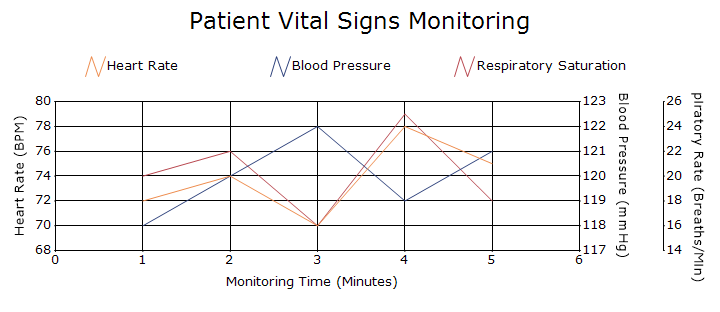
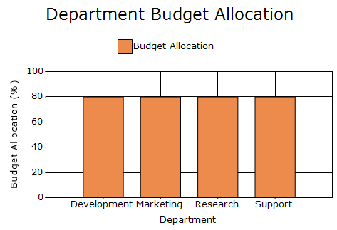
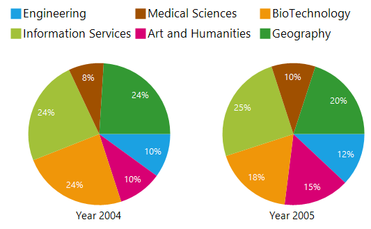
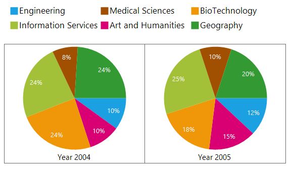

# Chart Area in Windows Forms Chart

The [ChartArea](https://help.syncfusion.com/cr/windowsforms/Syncfusion.Windows.Forms.Chart.ChartArea.html) is the rectangular plotting region in which the chart displays its axes and series.

## Axis Spacing

The [AxisSpacing](https://help.syncfusion.com/cr/windowsforms/Syncfusion.Windows.Forms.Chart.ChartArea.html#Syncfusion_Windows_Forms_Chart_ChartArea_AxisSpacing) property is useful when multiple axes are rendered on the same side of the chart area. By default, 2 pixels of spacing is applied between adjacent axes. Increasing the value adds more separation between them.

The following code adds `30` pixels of horizontal and vertical spacing between axes.



this.chartControl.ChartArea.AxisSpacing = new SizeF(30, 30);


Me.chartControl.ChartArea.AxisSpacing = New SizeF(30, 30)



## Full stack maximum

The [FullStackMax](https://help.syncfusion.com/cr/windowsforms/Syncfusion.Windows.Forms.Chart.ChartArea.html#Syncfusion_Windows_Forms_Chart_ChartArea_FullStackMax) property defines the total value represented by a complete stack in full-stacking chart types. Its default value is `100`, causing the stacked segments to be calculated against a total value of 100.

The following code sets the full-stack maximum to `80`.



chartControl.ChartArea.FullStackMax = 80;


chartControl.ChartArea.FullStackMax = 80



## Dividing the chart area

Use [DivideArea](https://help.syncfusion.com/cr/windowsforms/Syncfusion.Windows.Forms.Chart.ChartArea.html#Syncfusion_Windows_Forms_Chart_ChartArea_DivideArea) property divides a single chart area into equal sections for displaying Pie, Funnel, or Pyramid series separately. By default, the chart area is not divided.

Enabling [DivideArea](https://help.syncfusion.com/cr/windowsforms/Syncfusion.Windows.Forms.Chart.ChartArea.html#Syncfusion_Windows_Forms_Chart_ChartArea_DivideArea) allows you to:
- Display the corresponding series name as the title of each section.
- Retrieve the bounds of an individual section.
- Render Pie series with the same radius.

N> [VisibleAllPies](https://help.syncfusion.com/cr/windowsforms/Syncfusion.Windows.Forms.Chart.ChartArea.html#Syncfusion_Windows_Forms_Chart_ChartArea_VisibleAllPies) property is deprecated. Use the [DivideArea](https://help.syncfusion.com/cr/windowsforms/Syncfusion.Windows.Forms.Chart.ChartSeries.html#Syncfusion_Windows_Forms_Chart_ChartSeries_DivideArea) property instead. When [DivideArea](https://help.syncfusion.com/cr/windowsforms/Syncfusion.Windows.Forms.Chart.ChartArea.html#Syncfusion_Windows_Forms_Chart_ChartArea_DivideArea) is enabled, the `ShowSeriesTitle` property can display the title of each series in its corresponding section.

The following code divides the chart area for the supported series.



chartControl.ChartArea.DivideArea = true;


chartControl.ChartArea.DivideArea = True



### Displaying series titles

The series name can be displayed as the title of its corresponding section in a divided chart area. This helps identify the Pie, Funnel, or Pyramid series rendered in each section.

Use the [ShowSeriesTitle](https://help.syncfusion.com/cr/windowsforms/Syncfusion.Windows.Forms.Chart.ChartPieConfigItem.html#Syncfusion_Windows_Forms_Chart_ChartPieConfigItem_ShowSeriesTitle) property of the respective series configuration to display the series title.




// Displays the series title for a Pie series.
series.ConfigItems.PieItem.ShowSeriesTitle = true;
// Displays the series title for a Funnel series.
series.ConfigItems.FunnelItem.ShowSeriesTitle = true;
// Displays the series title for a Pyramid series.
series.ConfigItems.PyramidItem.ShowSeriesTitle = true;




' Displays the series title for a Pie series.
series.ConfigItems.PieItem.ShowSeriesTitle = True
' Displays the series title for a Funnel series.
series.ConfigItems.FunnelItem.ShowSeriesTitle = True
' Displays the series title for a Pyramid series.
series.ConfigItems.PyramidItem.ShowSeriesTitle = True




### Retrieving series bounds

The [GetSeriesBounds](https://help.syncfusion.com/cr/windowsforms/Syncfusion.Windows.Forms.Chart.ChartArea.html#Syncfusion_Windows_Forms_Chart_ChartArea_GetSeriesBounds_Syncfusion_Windows_Forms_Chart_ChartSeries_) method returns the rectangular bounds occupied by a series in the divided chart area.

The following code draws a border around every series section in the divided chart area.



private void chartControl_ChartAreaPaint(object sender, PaintEventArgs e)
{
    using (Pen borderPen = new Pen(Color.DimGray, 1))
    {
        foreach (ChartSeries series in this.chartControl.Series)
        {
            RectangleF seriesBounds = this.chartControl.ChartArea.GetSeriesBounds(series);
            e.Graphics.DrawRectangle(borderPen, seriesBounds.X, seriesBounds.Y, seriesBounds.Width, seriesBounds.Height);
        }
    }
}


Private Sub chartControl_ChartAreaPaint(sender As Object, e As PaintEventArgs)
    Using borderPen As New Pen(Color.DimGray, 1)
        For Each series As ChartSeries In Me.chartControl.Series
            Dim seriesBounds As RectangleF = Me.chartControl.ChartArea.GetSeriesBounds(series)
            e.Graphics.DrawRectangle(borderPen, seriesBounds.X, seriesBounds.Y, seriesBounds.Width, seriesBounds.Height)
        Next
    End Using
End Sub



## Retrieving the Axes Associated with a Series

The [GetXAxis](https://help.syncfusion.com/cr/windowsforms/Syncfusion.Windows.Forms.Chart.ChartArea.html#Syncfusion_Windows_Forms_Chart_ChartArea_GetXAxis_Syncfusion_Windows_Forms_Chart_ChartSeries_) and [GetYAxis](https://help.syncfusion.com/cr/windowsforms/Syncfusion.Windows.Forms.Chart.ChartArea.html#Syncfusion_Windows_Forms_Chart_ChartArea_GetYAxis_Syncfusion_Windows_Forms_Chart_ChartSeries_) methods retrieve the X-axis and Y-axis associated with a specified series. These methods are useful when a chart contains multiple axes and you need to determine which axes are being used by a particular series.



ChartSeries series = this.chartControl.Series[0];
ChartAxis xAxis = this.chartControl.ChartArea.GetXAxis(series);
ChartAxis yAxis = this.chartControl.ChartArea.GetYAxis(series);


Dim series As ChartSeries = Me.chartControl.Series(0)
Dim xAxis As ChartAxis = Me.chartControl.ChartArea.GetXAxis(series)
Dim yAxis As ChartAxis = Me.chartControl.ChartArea.GetYAxis(series)



## See also

- [How to display only the chart area in Windows Forms Chart](https://help.syncfusion.com/windowsforms/chart/faq/how-to-display-the-chart-area-alone)