# Chart Axes in Windows Forms Chart

An axis in EssentialChart is represented by the [ChartAxis](https://help.syncfusion.com/cr/windowsforms/Syncfusion.Windows.Forms.Chart.ChartAxis.html) class. The axes are stored in the [WinForms Chart](https://www.syncfusion.com/winforms-ui-controls/chart) control's Axes collection.

By default, this collection contains two primary axes. These two axes can also be accessed through the [PrimaryXAxis](https://help.syncfusion.com/cr/windowsforms/Syncfusion.Windows.Forms.Chart.ChartControl.html#Syncfusion_Windows_Forms_Chart_ChartControl_PrimaryXAxis) and [PrimaryYAxis](https://help.syncfusion.com/cr/windowsforms/Syncfusion.Windows.Forms.Chart.ChartControl.html#Syncfusion_Windows_Forms_Chart_ChartControl_PrimaryYAxis).

The [PrimaryXAxis](https://help.syncfusion.com/cr/windowsforms/Syncfusion.Windows.Forms.Chart.ChartControl.html#Syncfusion_Windows_Forms_Chart_ChartControl_PrimaryXAxis) is usually rendered at the bottom, horizontally, while the [PrimaryYAxis](https://help.syncfusion.com/cr/windowsforms/Syncfusion.Windows.Forms.Chart.ChartControl.html#Syncfusion_Windows_Forms_Chart_ChartControl_PrimaryYAxis) is usually rendered at the left, vertically. There might be exceptions to this rule as in the case of a Bar chart where the above x and y axis positions are reversed.

The title for an axis is set through the [Title](https://help.syncfusion.com/cr/windowsforms/Syncfusion.Windows.Forms.Chart.ChartAxis.html#Syncfusion_Windows_Forms_Chart_ChartAxis_Title) property, and the [TitleAlignment](https://help.syncfusion.com/cr/windowsforms/Syncfusion.Windows.Forms.Chart.ChartAxis.html#Syncfusion_Windows_Forms_Chart_ChartAxis_TitleAlignment) property lets you align the same.

Axes features are discussed under the following topics:

## Categorical Axis

Categorical axis displays text instead of number as labels i.e. labels are not linear in categorical axis. To use the categorical axis, you can set the **ValueType** property of the **PrimaryXAxis** to **Category**. Default value of **ValueType** property is **Double**.

N> Categorical axis is supported only for x-axis.

You can set x-axis to display categorical values using the following code




//Set axis type as Category
this.chartControl1.PrimaryXAxis.ValueType = ChartValueType.Category;





'Set axis type as Category
Me.chartControl1.PrimaryXAxis.ValueType = ChartValueType.Category




**Chart displaying categorical values in x-axis**

## Indexed X Values

By default points in a series are plotted against their x and y values. However in some cases the x values are meaningless, they simply represent categories, and you do not want to plot the points against such x values. Such an x-axis that ignores the x-values and simply uses the positional value of a point in a series is said to be indexed.

In the figure below, the first chart shows a line chart that is not-indexed while the second chart shows a line chart whose x-axis is indexed.

N> Indexing is supported only on the x-axis in Essential Chart.

You can enable x-axis indexing or categorizing through the [Indexed](https://help.syncfusion.com/cr/windowsforms/Syncfusion.Windows.Forms.Chart.ChartControl.html#Syncfusion_Windows_Forms_Chart_ChartControl_Indexed) property of the [ChartControl](https://help.syncfusion.com/cr/windowsforms/Syncfusion.Windows.Forms.Chart.ChartControl.html) as shown below. This property automatically affects all the x-axes in the chart.




this.chartControl1.Indexed = true;





Me.chartControl1.Indexed = True




You can also optionally customize the labels of the points in such an indexed series as explained in [Chart Labels Customization](#customizing-label-text).

## Inverted Axis

EssentialChart provides support for inverting the values in an axis. Data on an inverted axis is plotted in the opposite direction - top to bottom for y-axis and right to left for x-axis. To enable this behavior, set the [ChartAxis.Inversed](https://help.syncfusion.com/cr/windowsforms/Syncfusion.Windows.Forms.Chart.ChartAxis.html#Syncfusion_Windows_Forms_Chart_ChartAxis_Inversed) to true.

<table>
<tr>
<th>
Chart Axis Property</th><th>
Description</th></tr>
<tr>
<td>

{{'[Inversed](https://help.syncfusion.com/cr/windowsforms/Syncfusion.Windows.Forms.Chart.ChartAxis.html#Syncfusion_Windows_Forms_Chart_ChartAxis_Inversed)'| markdownify }}
</td><td>
Indicates whether the axis should be reversed.</td></tr>
</table>





// This inverts the specified chart axis.

this.chartControl1.PrimaryXAxis.Inversed = true;

this.chartControl1.PrimaryYAxis.Inversed = true;





' This inverts the specified chart axis.

Me.chartControl1.PrimaryXAxis.Inversed = True

Me.chartControl1.PrimaryYAxis.Inversed = True




The following image shows a chart whose x and y axes have been reversed.

## Opposed Axis

For every chart type, there is an implied x-axis and y-axis position and by default all the x-axes and y-axes will be rendered in that corresponding position. You can override this default behavior by setting the [OpposedPosition](https://help.syncfusion.com/cr/windowsforms/Syncfusion.Windows.Forms.Chart.ChartAxis.html#Syncfusion_Windows_Forms_Chart_ChartAxis_OpposedPosition) property to true for an axis which will cause it to be rendered in a side opposite to that of the implied position.





// Will cause the X axis to be rendered on top instead of the default bottom position

this.chartControl1.PrimaryXAxis.OpposedPosition = true;

// Will cause the Y axis to be rendered on the right instead of the default left position

this.chartControl1.PrimaryYAxis.OpposedPosition = true;





' Will cause the X axis to be rendered on top instead of the default bottom position

Me.chartControl1.PrimaryXAxis.OpposedPosition = True

' Will cause the Y axis to be rendered on the right instead of the default left position

Me.chartControl1.PrimaryYAxis.OpposedPosition = True




The above code snippet will place both the x and y-axes in the position opposite to their default implied position.

You can similarly set this property on any custom ChartAxis that you might add to the chart.

The [OpposedPosition](https://help.syncfusion.com/cr/windowsforms/Syncfusion.Windows.Forms.Chart.ChartAxis.html#Syncfusion_Windows_Forms_Chart_ChartAxis_OpposedPosition) along with [Inversed](https://help.syncfusion.com/cr/windowsforms/Syncfusion.Windows.Forms.Chart.ChartAxis.html#Syncfusion_Windows_Forms_Chart_ChartAxis_Inversed) setting could be useful for implementing charts for right-to-left cultures.

## Multiple Axes

Often you will have to plot multiple series on a single chart, each in it's own x or y axis. You will then need to add an x or y axis to the chart in addition to the already existing [PrimaryXAxis](https://help.syncfusion.com/cr/windowsforms/Syncfusion.Windows.Forms.Chart.ChartControl.html#Syncfusion_Windows_Forms_Chart_ChartControl_PrimaryXAxis) and [PrimaryYAxis](https://help.syncfusion.com/cr/windowsforms/Syncfusion.Windows.Forms.Chart.ChartControl.html#Syncfusion_Windows_Forms_Chart_ChartControl_PrimaryYAxis). You can do this by instantiating a [ChartAxis](https://help.syncfusion.com/cr/windowsforms/Syncfusion.Windows.Forms.Chart.ChartAxis.html) and adding it to the Axes collection. Then specify the newly created axis as the x or y axis of a particular series.

The following are the steps to include a new axis to the chart.





// Create a new instance of the chart axis.

private ChartAxis secXAxis = new ChartAxis();

// Add the secondary axis to the chart axis collection.

this.chartControl1.Axes.Add(this.secXAxis);

// Specify this axis to be the axis for an existing series

this.chartControl1.Series[1].XAxis = this.secXAxis;





' Create a new instance of the chart axis.

Private secXAxis As ChartAxis = New ChartAxis()

' Add the secondary axis to the chart axis collection.

Me.chartControl1.Axes.Add(Me.secXAxis)

' Specify this axis to be the axis for an existing series

Me.chartControl1.Series(1).XAxis = Me.secXAxis




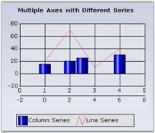

And for multiple y axis, you can set the orientation for axis.

The following are the steps to include a new y axis to the chart.





// Create a new instance of the chart axis.

private ChartAxis secYAxis = new ChartAxis();

// Change orientation to the axis

secYAxis.Orientation = ChartOrientation.Vertical;

// Add the secondary axis to the chart axis collection.

this.chartControl1.Axes.Add(this.secYAxis);

// Specify this axis to be the axis for an existing series

this.chartControl1.Series[1].YAxis = this.secYAxis;





' Create a new instance of the chart axis.

Private secYAxis As ChartAxis = New ChartAxis()

'Change orientation to the axis

Me.secYAxis.Orientation = ChartOrientation.Vertical

' Add the secondary axis to the chart axis collection.

Me.chartControl1.Axes.Add(Me.secYAxis)

' Specify this axis to be the axis for an existing series

Me.chartControl1.Series(1).YAxis = Me.secYAxis




### Opposed Position

By default, this additional axis will be rendered right next to the corresponding primary axis as seen above. This might be undesirable and you would instead want it to be rendered at the opposite side of the primary axis. This is done by setting the [OpposedPosition](https://help.syncfusion.com/cr/windowsforms/Syncfusion.Windows.Forms.Chart.ChartAxis.html#Syncfusion_Windows_Forms_Chart_ChartAxis_OpposedPosition) property to true.

### Stacked or SideBySide Position

By default, the secondary axes are rendered stacked over, or parallel, to the corresponding primary axis. And also sometimes it is rendered in a position opposite to the primary axis as shown in the above screenshots. This is because the [XAxisLayoutMode](https://help.syncfusion.com/cr/windowsforms/Syncfusion.Windows.Forms.Chart.ChartArea.html#Syncfusion_Windows_Forms_Chart_ChartArea_XAxesLayoutMode) and [YAxisLayoutMode](https://help.syncfusion.com/cr/windowsforms/Syncfusion.Windows.Forms.Chart.ChartArea.html#Syncfusion_Windows_Forms_Chart_ChartArea_YAxesLayoutMode) properties are set to Stacking by default.

However, you might want the secondary axis to be rendered in-line, side-by-side to the primary axis. You can do by setting the [XAxisLayoutMode](https://help.syncfusion.com/cr/windowsforms/Syncfusion.Windows.Forms.Chart.ChartArea.html#Syncfusion_Windows_Forms_Chart_ChartArea_XAxesLayoutMode) and [YAxisLayoutMode](https://help.syncfusion.com/cr/windowsforms/Syncfusion.Windows.Forms.Chart.ChartArea.html#Syncfusion_Windows_Forms_Chart_ChartArea_YAxesLayoutMode) properties to SideBySide.

Here is a code sample.





this.ChartControl1.ChartArea.XAxesLayoutMode = ChartAxesLayoutMode.SideBySide;





Me.ChartControl1.ChartArea.XAxesLayoutMode = ChartAxesLayoutMode.SideBySide;




### ChartAxesLayouts

You can now combine the stacking and side-by-side chart axes layouts when multiple Axes are used, as shown in the below image. Using this feature, it is possible to position the three Y axis, as one on right side and the second one on the same side and third one on the opposite side.





//Created chart axes:

ChartAxis axis = this.chartControl1.PrimaryYAxis;

ChartAxis axis0 = new ChartAxis(ChartOrientation.Vertical);

ChartAxis axis1 = new ChartAxis(ChartOrientation.Vertical);

//Added chart axes into the chart:

chartControl1.Axes.Add(axis0);

chartControl1.Axes.Add(axis1);

//Created chart axis layout using ChartAxisLayout class:(New class)

ChartAxisLayout layout1 = new ChartAxisLayout();

//Added the axes to this layout including the primary axis:

layout1.Axes.Add(axis);

layout1.Axes.Add(axis0);

layout1.Axes.Add(axis1);

//Added the layout into ChartArea.

chartControl1.ChartArea.YLayouts.Add(layout1);





'Created chart axes:

Dim axis As ChartAxis = Me.chartControl1.PrimaryYAxis

Dim axis0 As New ChartAxis(ChartOrientation.Vertical)

Dim axis1 As New ChartAxis(ChartOrientation.Vertical)

'Added chart axes into the chart:

chartControl1.Axes.Add(axis0)

chartControl1.Axes.Add(axis1)

'Created chart axis layout using ChartAxisLayout class:(New class)

Dim layout1 As New ChartAxisLayout()

'Added the axes to this layout including the primary axis:

layout1.Axes.Add(axis)

layout1.Axes.Add(axis0)

layout1.Axes.Add(axis1)

'Added the layout into ChartArea.

chartControl1.ChartArea.YLayouts.Add(layout1)




N> All the axes with the same orientation must be added to [ChartAxisLayout](https://help.syncfusion.com/cr/windowsforms/Syncfusion.Windows.Forms.Chart.ChartAxisLayout.html) (PrimaryAxis as well) as illustrated in the above code snippet.

## Axis Value Type

You can set the value type for an axis using [Axes.ValueType](https://help.syncfusion.com/cr/windowsforms/Syncfusion.Windows.Forms.Chart.ChartAxis.html#Syncfusion_Windows_Forms_Chart_ChartAxis_ValueType) property. You can set any of the following value types of which the default is double.

* double
* datetime
* logarithmic

If you set the ValueType to **Logarithmic**, then you need to specify the log base for the axis using [Axes.LogBase](https://help.syncfusion.com/cr/windowsforms/Syncfusion.Windows.Forms.Chart.ChartAxis.html#Syncfusion_Windows_Forms_Chart_ChartAxis_LogBase) property. The default value of **LogBase is 10**.





this.chartControl1.PrimaryXAxis.ValueType = ChartValueType.Logarithmic;

this.chartControl1.PrimaryXAxis.LogBase = 3;




## Axis Range and Intervals

### Automatic Range Calculation

The range and intervals for an axis are automatically calculated by the built-in **nice range calculation engine**, by default. This engine takes a raw data series and comes up with a nice human readable range of numbers in which to represent them. For example, if the data series contains points in the range 1.2 - 3.7, the engine would come up with a scale of 0 - 5 for the axis with 10 intervals of 0.5 each.

This default behavior is controlled by the [ChartAxis.RangeType](https://help.syncfusion.com/cr/windowsforms/Syncfusion.Windows.Forms.Chart.ChartAxis.html#Syncfusion_Windows_Forms_Chart_ChartAxis_RangeType) property which is set to Auto by default.

### Specifying Custom Ranges

Sometimes the automatic range generation might not be good enough for you, in which case you can specify a custom range on the axis. You should start by setting the [ChartAxis.RangeType](https://help.syncfusion.com/cr/windowsforms/Syncfusion.Windows.Forms.Chart.ChartAxis.html#Syncfusion_Windows_Forms_Chart_ChartAxis_RangeType) property to set. Then use one of the following properties to specify a custom range.

**Properties**

<table>
<tr>
<th>
ChartAxis Property</th><th>
Applies to RangeType</th><th>
Applies to ValueType</th><th>
Description</th></tr>
<tr>
<td>

{{'[Range](https://help.syncfusion.com/cr/windowsforms/Syncfusion.Windows.Forms.Chart.ChartAxis.html#Syncfusion_Windows_Forms_Chart_ChartAxis_Range)'| markdownify }}
</td><td>
Set</td><td>
Double</td><td>
Specifies the minimum, maximum and interval for the axis. Use this if the data points are of double type.</td></tr>
<tr>
<td>
{{'[DateTimeRange](https://help.syncfusion.com/cr/windowsforms/Syncfusion.Windows.Forms.Chart.ChartAxis.html#Syncfusion_Windows_Forms_Chart_ChartAxis_DateTimeRange)'| markdownify }}
</td><td>
Set</td><td>
DateTime</td><td>
Specifies the start and end dates and interval time for the axis. Use this if the data points are of datetime type.</td></tr>
</table>

Here is some sample code that shows how this is done.





// Customize the X axis range and interval which has points of type DateTime

this.chartControl1.PrimaryXAxis.RangeType = ChartAxisRangeType.Set;

this.chartControl1.PrimaryXAxis.ValueType = ChartValueType.DateTime;

this.chartControl1.PrimaryXAxis.DateTimeRange = new ChartDateTimeRange(baseDate.AddMonths(-1), baseDate.AddMonths(6), 1, ChartDateTimeIntervalType.Months);

// Customize the Y axis range and interval which has points of type double

this.chartControl1.PrimaryYAxis.RangeType = ChartAxisRangeType.Set;

this.chartControl1.PrimaryYAxis.Range = new MinMaxInfo(1, 20, 2);

// Customize the Y axis range and interval which has points of type double

this.chartControl1.PrimaryXAxis.RangeType = ChartAxisRangeType.Set;

this.chartControl1.PrimaryXAxis.Range = new MinMaxInfo(0, 6, 1);





' Customize the X axis range and interval which has points of type DateTime

Me.chartControl1.PrimaryXAxis.RangeType = ChartAxisRangeType.Set

Me.chartControl1.PrimaryXAxis.ValueType = ChartValueType.DateTime

Me.chartControl1.PrimaryXAxis.DateTimeRange = New ChartDateTimeRange(baseDate.AddMonths(-1), baseDate.AddMonths(6), 1, ChartDateTimeIntervalType.Months)

' Customize the Y axis range and interval which has points of type double

Me.chartControl1.PrimaryYAxis.RangeType = ChartAxisRangeType.Set

Me.chartControl1.PrimaryYAxis.Range = New MinMaxInfo(1, 20, 2)

' Customize the x axis range and interval which has points of type double

Me.chartControl1.PrimaryXAxis.RangeType = ChartAxisRangeType.Set

Me.chartControl1.PrimaryXAxis.Range = New MinMaxInfo(0, 6, 1)




You can however tweak the ranges and intervals that get generated through these properties.

### Changing Intervals

Use these properties to customize the intervals that get generated:

**Properties**

<table>
<tr>
<th>
ChartAxis Property</th><th>
Applies to RangeType</th><th>
Applies to ValueType</th><th>
Description</th></tr>
<tr>
<td>

{{'[DesiredIntervals](https://help.syncfusion.com/cr/windowsforms/Syncfusion.Windows.Forms.Chart.ChartAxis.html#Syncfusion_Windows_Forms_Chart_ChartAxis_DesiredIntervals)'| markdownify }}
</td><td>
Auto</td><td>
Double, DateTime</td><td>
A request for the nice-range calculation engine to come up with a nice range with so many intervals. The engine will only use this setting as a guidance. Default value is 6.</td></tr>
<tr>
<td>
{{'[IntervalType](https://help.syncfusion.com/cr/windowsforms/Syncfusion.Windows.Forms.Chart.ChartAxis.html#Syncfusion_Windows_Forms_Chart_ChartAxis_IntervalType)'| markdownify }}
</td><td>
Auto</td><td>
DateTime</td><td>
Specifies whether the interval that gets calculated should be in Years, Months, Weeks, Days, Hours, Minutes, Seconds or Milliseconds. This setting is used only if the ValueType of the axis is set to DateTime. Default value is Auto.</td></tr>
</table>

### Changing Origin

Use these properties to customize the origin of the axes:

<table>
<tr>
<th>
ChartAxis Property</th><th>
Applies to RangeType</th><th>
Applies to ValueType</th><th>
Description</th></tr>
<tr>
<td>

{{'[PreferZero](https://help.syncfusion.com/cr/windowsforms/Syncfusion.Windows.Forms.Chart.ChartAxis.html#Syncfusion_Windows_Forms_Chart_ChartAxis_PreferZero)'| markdownify }}
</td><td>
Auto</td><td>
Double</td><td>
Indicates whether one boundary of the calculated range should be tweaked to zero. Such tweaking will happen only if zero is within a reasonable distance from the calculated boundary. To ensure that one boundary is always zero, use the ForceZero setting instead. Default value is true.</td></tr>
<tr>
<td>
{{'[ForceZero](https://help.syncfusion.com/cr/windowsforms/Syncfusion.Windows.Forms.Chart.ChartAxis.html#Syncfusion_Windows_Forms_Chart_ChartAxis_ForceZero)'| markdownify }}
</td><td>
Auto</td><td>
Double</td><td>
Indicates whether one boundary of the calculated range should always be tweaked to zero. Default value is true.</td></tr>
<tr>
<td>
{{'[CustomOrigin](https://help.syncfusion.com/cr/windowsforms/Syncfusion.Windows.Forms.Chart.ChartAxis.html#Syncfusion_Windows_Forms_Chart_ChartAxis_CustomOrigin)'| markdownify }}
</td><td>
Auto and Set</td><td>
Double, DateTime</td><td>
Lets you use the properties Origin and OriginDate below. Default value is false.</td></tr>
<tr>
<td>
{{'[Origin](https://help.syncfusion.com/cr/windowsforms/Syncfusion.Windows.Forms.Chart.ChartAxis.html#Syncfusion_Windows_Forms_Chart_ChartAxis_Origin)'| markdownify }}
</td><td>
Auto and Set</td><td>
Double</td><td>
Lets you specify a custom origin (double value) for the axis. Use this property when the data points are of double type. The interval and range will then be calculated automatically. Remember to set CustomOrigin to true. Default value is 0.0.</td></tr>
<tr>
<td>
{{'[OriginDate](https://help.syncfusion.com/cr/windowsforms/Syncfusion.Windows.Forms.Chart.ChartAxis.html#Syncfusion_Windows_Forms_Chart_ChartAxis_OriginDate)'| markdownify }}
</td><td>
Auto and Set</td><td>
DateTime</td><td>
Lets you specify a custom origin (double value) for the axis. Use this property when the data points are of double type. The interval and range will then be calculated automatically. Remember to set CustomOrigin to true. Default value is DateTime.MinValue.</td></tr>
<tr>
<td>
{{'[Offset](https://help.syncfusion.com/cr/windowsforms/Syncfusion.Windows.Forms.Chart.ChartAxis.html#Syncfusion_Windows_Forms_Chart_ChartAxis_Offset)'| markdownify }}
</td><td>
Auto and Set</td><td>
Double and DateTime</td><td>
Specifies the offset that should be applied to the automatically calculated start of the range.</td></tr>
<tr>
<td>
{{'[DateTimeOffset](https://help.syncfusion.com/cr/windowsforms/Syncfusion.Windows.Forms.Chart.ChartAxis.html#Syncfusion_Windows_Forms_Chart_ChartAxis_DateTimeOffset)'| markdownify }}
</td><td>
Auto</td><td>
DateTime</td><td>
Specifies the offset that should be applied to the automatically calculated start of the range.</td></tr>
<tr>
<td>
{{'[Offset](https://help.syncfusion.com/cr/windowsforms/Syncfusion.Windows.Forms.Chart.ChartAxis.html#Syncfusion_Windows_Forms_Chart_ChartAxis_Offset)'| markdownify }}
</td><td>
Set</td><td>
DateTime</td><td>
Use this instead of Offset if you want to specify the OffsetType (see below).</td></tr>
<tr>
<td>
{{'[DateTimeInterval.OffsetType](https://help.syncfusion.com/cr/windowsforms/Syncfusion.Windows.Forms.Chart.ChartDateTimeInterval.html#Syncfusion_Windows_Forms_Chart_ChartDateTimeInterval_OffsetType)'| markdownify }}
</td><td>
Set</td><td>
DateTime</td><td>
Specifies the type of offset specified above. Could be Auto, Years, Months, Weeks, Days, Hours, Minutes, Seconds or Milliseconds.</td></tr>
<tr>
<td>
{{'[RangePaddingType](https://help.syncfusion.com/cr/windowsforms/Syncfusion.Windows.Forms.Chart.ChartAxis.html#Syncfusion_Windows_Forms_Chart_ChartAxis_RangePaddingType)'| markdownify }}
</td><td>
Auto</td><td>
Double and DateTime</td><td>
Specifies if there should be any padding applied between the points and the axes, before and after the datapoints.</td></tr>
</table>

## Axis Dimensions

The axis starting point, length and the whole rectangle (comprising the axis and it's labels) can be customized using the following properties.

<table>
<tr>
<th>
ChartAxis Property</th><th>
Description</th></tr>
<tr>
<td>

{{'[Location](https://help.syncfusion.com/cr/windowsforms/Syncfusion.Windows.Forms.Chart.ChartAxis.html#Syncfusion_Windows_Forms_Chart_ChartAxis_Location)'| markdownify }}
</td><td>
Specifies the starting location of the axis. LocationType property should be equal to Set to set the Location property.</td></tr>
<tr>
<td>
{{'[LocationType](https://help.syncfusion.com/cr/windowsforms/Syncfusion.Windows.Forms.Chart.ChartAxis.html#Syncfusion_Windows_Forms_Chart_ChartAxis_LocationType)'| markdownify }}
</td><td>
<ul><li>Set - To be able to use the above Location property.</li><li>Auto - Axis position will be automatically calculated to prevent overlap with the labels. (Default value)</li><li>AntiLabelCut - Axis thickness is calculated and the corresponding axis will be placed automatically, to prevent cutting of the labels by the sides of the control. Doing this preserves one co-ordinate of the axis location (X coordinate for horizontal axis and y coordinate for vertical axis).</li></ul></td></tr>
<tr>
<td>
 
{{'[AutoSize](https://help.syncfusion.com/cr/windowsforms/Syncfusion.Windows.Forms.Chart.ChartAxis.html#Syncfusion_Windows_Forms_Chart_ChartAxis_AutoSize)'| markdownify }}
</td><td>
Specifies whether length of an axis is calculated automatically or specified via the Size property.</td></tr>
<tr>
<td>
{{'[Size](https://help.syncfusion.com/cr/windowsforms/Syncfusion.Windows.Forms.Chart.ChartAxis.html#Syncfusion_Windows_Forms_Chart_ChartAxis_Size)'| markdownify }}
</td><td>
Lets you specify the length of the axis. Uses the x value for x-axis and y-value for y-axis. Increasing or decreasing the default length will cause the intervals to expand or shrink correspondingly. The AutoSize should be set to false for this property to be used.</td></tr>
<tr>
<td>
{{'[Rect](https://help.syncfusion.com/cr/windowsforms/Syncfusion.Windows.Forms.Chart.ChartAxis.html#Syncfusion_Windows_Forms_Chart_ChartAxis_Rect)'| markdownify }}
</td><td>
Specifies the rectangle that includes the axis and it's labels. This provides great flexibility in letting you customize the position and size of the axes.</td></tr>
</table>

### Illustrating Custom Axis Location





this.chartControl1.PrimaryYAxis.LocationType = Syncfusion.Windows.Forms.Chart.ChartAxisLocationType.Set;

this.chartControl1.PrimaryYAxis.Location = new PointF(15, 200);





Me.ChartControl1.PrimaryYAxis.LocationType = Syncfusion.Windows.Forms.Chart.ChartAxisLocationType.Set

Me.ChartControl1.PrimaryYAxis.Location = New PointF(15, 200)




### Illustrating Custom Axis Size

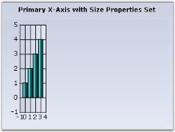





this.chartControl1.PrimaryXAxis.AutoSize = false;

this.chartControl1.PrimaryXAxis.Size = new Size(50, 20);





Me.ChartControl1.PrimaryXAxis.AutoSize = False

Me.ChartControl1.PrimaryXAxis.Size = New Size(50, 20)




## Axis Labels

This section talks about the customization of axis labels in the following topics.

### Axis Label Text Formatting, Appearance and Positioning

By default, the label texts are automatically determined based on the axis data points and the generated intervals. 

If you want to hide the axis label, you can set the [IsVisible](https://help.syncfusion.com/cr/windowsforms/Syncfusion.Windows.Forms.Chart.ChartAxis.html#Syncfusion_Windows_Forms_Chart_ChartAxis_IsVisible) property to `false`.

You can better the format, look and positioning of the labels using the properties listed below.

<table>
<tr>
<th>
ChartAxis Property</th><th>
Description</th></tr>
<tr>
<td>

{{'[Format](https://help.syncfusion.com/cr/windowsforms/Syncfusion.Windows.Forms.Chart.ChartAxis.html#Syncfusion_Windows_Forms_Chart_ChartAxis_Format)'| markdownify }}
</td><td>
If the data points are double values then use this property to specify the format in which to render the double value. The specified format will be used in the Double.ToString method to arrive at the formatted string. Search MSDN documentation for Standard Numeric Format Strings for more information on the format strings.</td></tr>
<tr>
<td>
{{'[DateTimeFormat](https://help.syncfusion.com/cr/windowsforms/Syncfusion.Windows.Forms.Chart.ChartAxis.html#Syncfusion_Windows_Forms_Chart_ChartAxis_DateTimeFormat)'| markdownify }}
</td><td>
If the data points are DateTime values, then use this property to specify the format in which to render the date. The specified format will be used in the DateTime.ToString() method to arrive at the formatted string. Search MSDN documentation for Date and Time Format Strings for more information on the format strings.</td></tr>
<tr>
<td>
{{'[ForeColor](https://help.syncfusion.com/cr/windowsforms/Syncfusion.Windows.Forms.Chart.ChartAxis.html#Syncfusion_Windows_Forms_Chart_ChartAxis_ForeColor)'| markdownify }}
</td><td>
Affects the labels and other text colors that gets rendered in the axis.</td></tr>
<tr>
<td>
{{'[Font](https://help.syncfusion.com/cr/windowsforms/Syncfusion.Windows.Forms.Chart.ChartAxis.html#Syncfusion_Windows_Forms_Chart_ChartAxis_Font)'| markdownify }}
</td><td>
Specifies the font to use for label and other texts that get rendered in the axis. By default it is set to Trebuchet, 9, regular.</td></tr>
<tr>
<td>
{{'[ScaleLabels](https://help.syncfusion.com/cr/windowsforms/Syncfusion.Windows.Forms.Chart.ChartAxis.html#Syncfusion_Windows_Forms_Chart_ChartAxis_ScaleLabels)'| markdownify }}
</td><td>
Setting this to true will automatically resize the text if the chart size is expanded by the user.</td></tr>
<tr>
<td>
{{'[LabelAlignment](https://help.syncfusion.com/cr/windowsforms/Syncfusion.Windows.Forms.Chart.ChartAxis.html#Syncfusion_Windows_Forms_Chart_ChartAxis_LabelAlignment)'| markdownify }}
</td><td>
Specifies if the label should be rendered Near, Far or Center within the available area. Default is Center.</td></tr>
<tr>
<td>
{{'[LabelRotate](https://help.syncfusion.com/cr/windowsforms/Syncfusion.Windows.Forms.Chart.ChartAxis.html#Syncfusion_Windows_Forms_Chart_ChartAxis_LabelRotate)'| markdownify }}
</td><td>
Specifies whether or not labels should be rotated. Use the LabelRotateAngle to specify the angle.</td></tr>
<tr>
<td>
{{'[LabelRotateAngle](https://help.syncfusion.com/cr/windowsforms/Syncfusion.Windows.Forms.Chart.ChartAxis.html#Syncfusion_Windows_Forms_Chart_ChartAxis_LabelRotateAngle)'| markdownify }}
</td><td>
If LabelRotate is true, this property specifies the angle of rotation.</td></tr>
</table>





//Settings datetime format to X axis

this.chartControl1.PrimaryXAxis.DateTimeFormat = "MMM";

//Settings format to Y axis

this.chartControl1.PrimaryYAxis.ValueType = ChartValueType.Double;

this.chartControl1.PrimaryYAxis.Format = "C";

//setting ForeColor and Font to axes labels

this.chartControl1.PrimaryXAxis.ForeColor = System.Drawing.Color.Navy;

this.chartControl1.PrimaryXAxis.Font = new System.Drawing.Font("Arial", 9F, System.Drawing.FontStyle.Bold);

this.chartControl1.PrimaryYAxis.ForeColor = System.Drawing.Color.Navy;

this.chartControl1.PrimaryYAxis.Font = new System.Drawing.Font("Arial", 9F, System.Drawing.FontStyle.Bold);

//Label property settings for X-Axis

this.chartControl1.PrimaryXAxis.LabelAlignment = System.Drawing.StringAlignment.Center;

this.chartControl1.PrimaryXAxis.LabelRotate = true;

this.chartControl1.PrimaryXAxis.LabelRotateAngle = 45;

//Label property settings for Y-Axis

this.chartControl1.PrimaryYAxis.LabelAlignment = System.Drawing.StringAlignment.Far;





'Settings datetime format to X axis

Me.chartControl1.PrimaryXAxis.DateTimeFormat = "MMM"

Settings format to Y axis

Me.chartControl1.PrimaryYAxis.ValueType = ChartValueType.Double

Me.chartControl1.PrimaryYAxis.Format = "D"

'Setting ForeColor and Font to axes labels

Me.chartControl1.PrimaryXAxis.ForeColor = System.Drawing.Color.Navy

Me.chartControl1.PrimaryXAxis.Font = new System.Drawing.Font("Arial", 9F, System.Drawing.FontStyle.Bold)

Me.chartControl1.PrimaryYAxis.ForeColor = System.Drawing.Color.Navy

Me.chartControl1.PrimaryYAxis.Font = new System.Drawing.Font("Arial", 9F, System.Drawing.FontStyle.Bold)

'Label property settings for X-Axis

Me.chartControl1.PrimaryXAxis.LabelAlignment = System.Drawing.StringAlignment.Center

Me.chartControl1.PrimaryXAxis.LabelRotate = true

Me.chartControl1.PrimaryXAxis.LabelRotateAngle = 45

'Label property settings for Y-Axis

Me.chartControl1.PrimaryYAxis.LabelAlignment = System.Drawing.StringAlignment.Far




### Customizing Label Text

The formatting options above will usually satisfy the label text requirements. However, there are many other scenarios where this might not be sufficient. Here are some ways to customize the text rendered in the label.

Customizing the label text for the automatically generated intervals.

<table>
<tr>
<th>
ChartAxis Event</th><th>
Description</th></tr>
<tr>
<td>

{{'[FormatAxis](https://help.syncfusion.com/cr/windowsforms/Syncfusion.Windows.Forms.Chart.ChartAxis.html#Syncfusion_Windows_Forms_Chart_ChartAxis_FormatLabel)'| markdownify }}
</td><td>
The event that gets raised for each label before getting rendered. This is a good place to customize the label text.</td></tr>
</table>

The following [ChartFormatAxisLabelEventArgs](https://help.syncfusion.com/cr/windowsforms/Syncfusion.Windows.Forms.Chart.ChartFormatAxisLabelEventArgs.html) properties provide information specific to this event.

<table>
<tr>
<th>
ChartFormatAxisLabel Property</th><th>
Description</th></tr>
<tr>
<td>

{{'[AxisOrientation](https://help.syncfusion.com/cr/windowsforms/Syncfusion.Windows.Forms.Chart.ChartFormatAxisLabelEventArgs.html#Syncfusion_Windows_Forms_Chart_ChartFormatAxisLabelEventArgs_AxisOrientation)'| markdownify }}
</td><td>
Returns the orientation of the axis for which the label is being generated.</td></tr>
<tr>
<td>
{{'[Handled](https://help.syncfusion.com/cr/windowsforms/Syncfusion.Windows.Forms.Chart.ChartFormatAxisLabelEventArgs.html#Syncfusion_Windows_Forms_Chart_ChartFormatAxisLabelEventArgs_Handled)'| markdownify }}
</td><td>
Indicates whether this event was handled and no further processing is required from the chart.</td></tr>
<tr>
<td>
{{'[IsAxisPrimary](https://help.syncfusion.com/cr/windowsforms/Syncfusion.Windows.Forms.Chart.ChartFormatAxisLabelEventArgs.html#Syncfusion_Windows_Forms_Chart_ChartFormatAxisLabelEventArgs_IsAxisPrimary)'| markdownify }}
</td><td>
Indicates whether the axis for which the label is being generated is a primary axis.</td></tr>
<tr>
<td>
{{'[Label](https://help.syncfusion.com/cr/windowsforms/Syncfusion.Windows.Forms.Chart.ChartFormatAxisLabelEventArgs.html#Syncfusion_Windows_Forms_Chart_ChartFormatAxisLabelEventArgs_Label)'| markdownify }}
</td><td>
Gets / sets the label that is to be rendered. </td></tr>
<tr>
<td>
{{'[Value](https://help.syncfusion.com/cr/windowsforms/Syncfusion.Windows.Forms.Chart.ChartFormatAxisLabelEventArgs.html#Syncfusion_Windows_Forms_Chart_ChartFormatAxisLabelEventArgs_Value)'| markdownify }}
</td><td>
Returns the value associated with the position of the label.</td></tr>
<tr>
<td>
{{'[ValueAsDate](https://help.syncfusion.com/cr/windowsforms/Syncfusion.Windows.Forms.Chart.ChartFormatAxisLabelEventArgs.html#Syncfusion_Windows_Forms_Chart_ChartFormatAxisLabelEventArgs_ValueAsDate)'| markdownify }}
</td><td>
Returns the value associated with the position of the label as DateTime.</td></tr>
<tr>
<td>
{{'[Tooltip](https://help.syncfusion.com/cr/windowsforms/Syncfusion.Windows.Forms.Chart.ChartFormatAxisLabelEventArgs.html#Syncfusion_Windows_Forms_Chart_ChartFormatAxisLabelEventArgs_ToolTip)'| markdownify }}
</td><td>
Specifies the content of the tooltip. </td></tr>
</table>





private void chartControl1_ChartFormatAxisLabel(object sender, ChartFormatAxisLabelEventArgs e)

{

    if (e.AxisOrientation == ChartOrientation.Horizontal)

    {

       if (e.ValueAsDate.Month == 1)

            e.Label = "1st Month";

        else if (e.ValueAsDate.Month == 2)

            e.Label = "2nd Month";

        else if (e.ValueAsDate.Month == 3)

            e.Label = "3rd Month";

        else if (e.ValueAsDate.Month == 4)

            e.Label = "4th Month";

        else if (e.ValueAsDate.Month == 5)

            e.Label = "5th Month";

        else if (e.ValueAsDate.Month == 6)

            e.Label = "6th Month";

        e.Handled = true;

    }

}





Private Sub chartControl1_ChartFormatAxisLabel(ByVal sender As Object, ByVal e As ChartFormatAxisLabelEventArgs)

    If e.AxisOrientation = ChartOrientation.Horizontal Then

         If e.ValueAsDate.Month = 1 Then

              e.Label = "1st Month"

          ElseIf e.ValueAsDate.Month = 2 Then

              e.Label = "2nd Month"

          ElseIf e.ValueAsDate.Month = 3 Then

              e.Label = "3rd Month"

          ElseIf e.ValueAsDate.Month = 4 Then

              e.Label = "4th Month"

          ElseIf e.ValueAsDate.Month = 5 Then

              e.Label = "5th Month"

          ElseIf e.ValueAsDate.Month = 6 Then

              e.Label = "6th Month"

          End If

           e.Handled = True

     End If

End Sub




Specify a set of custom labels thereby dictating the intervals as well

1.Using Custom Text

**Custom Text**

   <table>
   <tr>
   <th>
   ChartAxis Property</th><th>
   Description</th></tr>
   <tr>
   <td>

   {{'[TickLabelsDrawingMode](https://help.syncfusion.com/cr/windowsforms/Syncfusion.Windows.Forms.Chart.ChartAxis.html#Syncfusion_Windows_Forms_Chart_ChartAxis_TickLabelsDrawingMode)'| markdownify }}
   </td><td>
   <ul><li>AutomaticMode - Labels will be determined by the engine.</li><li>UserMode - Labels from the Labels collection will be used.</li><li>BothUserAndAutomaticMode - Both labels from the automatic mode and user mode will be rendered.</li><li>None - Labels will not be rendered.</li></ul></td></tr>
   <tr>
   <td>
   {{'[Labels](https://help.syncfusion.com/cr/windowsforms/Syncfusion.Windows.Forms.Chart.ChartAxis.html#Syncfusion_Windows_Forms_Chart_ChartAxis_Labels)'| markdownify }}
   </td><td>
   A custom collection that lets you fully customize the labels that gets generated. The TickLabelsDrawingMode should be set to UserMode or BothUserAndAutomaticMode.</td></tr>
   </table>





//Setting drawing mode

this.chartControl1.PrimaryXAxis.TickLabelsDrawingMode = ChartAxisTickLabelDrawingMode.UserMode;

//Adding new labels

this.chartControl1.PrimaryXAxis.Labels.Add(new ChartAxisLabel("Q1 Mid Point", Color.OrangeRed, new Font("Arial", 8F, System.Drawing.FontStyle.Bold), new DateTime(2007, 2, 15), "", "", ChartValueType.Custom));

this.chartControl1.PrimaryXAxis.Labels.Add(new ChartAxisLabel("Q2 Mid Point", Color.OrangeRed, new Font("Arial", 8F, System.Drawing.FontStyle.Bold), new DateTime(2007, 5, 15), "", "", ChartValueType.Custom));





'Setting drawing mode

Me.chartControl1.PrimaryXAxis.TickLabelsDrawingMode = ChartAxisTickLabelDrawingMode.UserMode

'Adding new labels

Me.chartControl1.PrimaryXAxis.Labels.Add(New ChartAxisLabel("Q1 Mid Point", Color.OrangeRed, New Font("Arial", 8F, System.Drawing.FontStyle.Bold), New DateTime(2007, 2, 15), "", "", ChartValueType.Custom))

Me.chartControl1.PrimaryXAxis.Labels.Add(New ChartAxisLabel("Q2 Mid Point", Color.OrangeRed, New Font("Arial", 8F, System.Drawing.FontStyle.Bold), New DateTime(2007, 5, 15), "", "", ChartValueType.Custom))





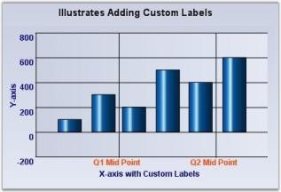

2.Using Formatted Text





//Setting drawing mode

this.chartControl1.PrimaryXAxis.TickLabelsDrawingMode = ChartAxisTickLabelDrawingMode.UserMode;

'Adding new labels

this.chartControl1.PrimaryXAxis.Labels.Add(new ChartAxisLabel("", Color.Maroon, new Font("Arial", 9F, System.Drawing.FontStyle.Bold), new DateTime(2007, 2, 15), "", "M", ChartValueType.DateTime));

this.chartControl1.PrimaryXAxis.Labels.Add(new ChartAxisLabel("", Color.Maroon, new Font("Arial", 9F, System.Drawing.FontStyle.Bold), new DateTime(2007, 05, 15), "", "M", ChartValueType.DateTime));





'Setting drawing mode

Me.chartControl1.PrimaryXAxis.TickLabelsDrawingMode = ChartAxisTickLabelDrawingMode.UserMode

'Clearing all the default labels

this.chartControl1.PrimaryXAxis.Labels.Clear()

'Adding new labels

Me.chartControl1.PrimaryXAxis.Labels.Add(New ChartAxisLabel("", Color.Maroon, New Font("Arial", 9F, System.Drawing.FontStyle.Bold), New DateTime(2007, 2, 15), "", "M", ChartValueType.DateTime))

Me.chartControl1.PrimaryXAxis.Labels.Add(New ChartAxisLabel("", Color.Maroon, New Font("Arial", 9F, System.Drawing.FontStyle.Bold), New DateTime(2007, 05, 15), "", "M", ChartValueType.DateTime))





### Intersecting Labels

Sometimes the chart dimensions could cause the labels to intersect. By default, the chart will render those texts one over the other. But, it also has some built-in capabilities to workaround this overlap and lets you dictate the technique to follow. Refer to the properties below.

**Intersecting Labels**

<table>
<tr>
<th>
ChartAxis Property</th><th>
Description</th></tr>
<tr>
<td>

{{'[LabelIntersectAction](https://help.syncfusion.com/cr/windowsforms/Syncfusion.Windows.Forms.Chart.ChartAxis.html#Syncfusion_Windows_Forms_Chart_ChartAxis_LabelIntersectAction)'| markdownify }}
</td><td>
Specifies the action to take when labels texts intersect.<ul><li> MultipleRows - Will render the labels in multiple rows.</li><li> None - Do nothing (default value)</li><li> Rotate - Rotates text so as to avoid overlap</li><li> Wrap - wraps text.</li></ul></td></tr>
<tr>
<td>
 
{{'[EdgeLabelsDrawingMode](https://help.syncfusion.com/cr/windowsforms/Syncfusion.Windows.Forms.Chart.ChartAxis.html#Syncfusion_Windows_Forms_Chart_ChartAxis_EdgeLabelsDrawingMode)'| markdownify }}
</td><td>
Affects the labels that get rendered at the edges of the axis. Possible values:<ul><li> Center - Centers the label at the interval. Default setting.</li><li> Shift - Shifts the labels so that it's within the interval boundaries</li><li>ClippingProtection - Uses some intelligent logic to avoid clipping.</li></ul></td></tr>
<tr>
<td>
 
{{'[HidePartialLabels](https://help.syncfusion.com/cr/windowsforms/Syncfusion.Windows.Forms.Chart.ChartAxis.html#Syncfusion_Windows_Forms_Chart_ChartAxis_HidePartialLabels)'| markdownify }}
</td><td>
When this property is set to true and when label overlap occurs, the chart will selectively hide certain labels (usually the min and max labels to begin with) to keep the rest of labels readable. Default value is false.</td></tr>
</table>





this.ChartWebControl1.PrimaryXAxis.HidePartialLabels = true;

this.ChartWebControl1.PrimaryXAxis.LabelIntersectAction = ChartLabelIntersectAction.Rotate;





Me.ChartWebControl1.PrimaryXAxis.HidePartialLabels = True

Me.ChartWebControl1.PrimaryXAxis.LabelIntersectAction = ChartLabelIntersectAction.Rotate




## Grouping Labels

Another interesting feature that is available is to be able to group a set of adjoining labels and mark them with a new label. For example, grouping the first three months of the year and marking them as Q1 and so on. The following properties will let you do that.

<table>
<tr>
<th>
ChartAxis Property</th><th>
Description</th></tr>
<tr>
<td>

{{'[GroupingLabels](https://help.syncfusion.com/cr/windowsforms/Syncfusion.Windows.Forms.Chart.ChartAxis.html#Syncfusion_Windows_Forms_Chart_ChartAxis_GroupingLabels)'| markdownify }}
</td><td>
Lets you group a range of default labels and provide them a custom name/label.</td></tr>
<tr>
<td>

{{'[DrawTickLabelGrid](https://help.syncfusion.com/cr/windowsforms/Syncfusion.Windows.Forms.Chart.ChartAxis.html#Syncfusion_Windows_Forms_Chart_ChartAxis_DrawTickLabelGrid)'| markdownify }}
</td><td>
Puts the labels within a grid. Though commonly used when in grouping mode, this feature can be used even otherwise.</td></tr>
</table>





ChartAxisGroupingLabel Q1 = new ChartAxisGroupingLabel(new DoubleRange(1, 3), "Q1");

Q1.BorderStyle = ChartAxisGroupingLabelBorderStyle.Rectangle;

Q1.Font = new Font("Arial", 10F, FontStyle.Bold);

this.chartControl1.PrimaryXAxis.GroupingLabels.Add(Q1);

ChartAxisGroupingLabel Q2 = new ChartAxisGroupingLabel(new DoubleRange(4, 6), "Q2");

Q2.BorderStyle = ChartAxisGroupingLabelBorderStyle.Rectangle;

Q2.Font = new Font("Arial", 10F, FontStyle.Bold);

this.chartControl1.PrimaryXAxis.GroupingLabels.Add(Q2);

this.chartControl1.PrimaryXAxis.DrawTickLabelGrid = true;





Dim Q1 As New ChartAxisGroupingLabel(New DoubleRange(1, 3), "Q1")

Q1.BorderStyle = ChartAxisGroupingLabelBorderStyle.Rectangle

Q1.Font = New Font("Arial", 10.0F, FontStyle.Bold)

Me.chartControl1.PrimaryXAxis.GroupingLabels.Add(Q1)

Dim Q2 As New ChartAxisGroupingLabel(New DoubleRange(4, 6), "Q2")

Q2.BorderStyle = ChartAxisGroupingLabelBorderStyle.Rectangle

Q2.Font = New Font("Arial", 10.0F, FontStyle.Bold)

Me.chartControl1.PrimaryXAxis.GroupingLabels.Add(Q2)

Me.chartControl1.PrimaryXAxis.DrawTickLabelGrid = True




### Tooltip Support for ChartAxisLabels

Essential Chart provides tooltip support for [ChartAxisLabel](https://help.syncfusion.com/cr/windowsforms/Syncfusion.Windows.Forms.Chart.ChartAxisLabel.html). By default [ChartAxisLabel](https://help.syncfusion.com/cr/windowsforms/Syncfusion.Windows.Forms.Chart.ChartAxisLabel.html) will be displayed as tooltip. You can also customize the tooltip to show any content you want.

#### Use Case Scenarios

If a [ChartAxisLabel](https://help.syncfusion.com/cr/windowsforms/Syncfusion.Windows.Forms.Chart.ChartAxisLabel.html) is too long and truncated, the tooltip for the label will show the full text. You can also show additional information about the [ChartAxisLabel](https://help.syncfusion.com/cr/windowsforms/Syncfusion.Windows.Forms.Chart.ChartAxisLabel.html).

##### Adding Tooltip for ChartAxisLabel

To add a tooltip for chart, set the [ShowToolTips](https://help.syncfusion.com/cr/windowsforms/Syncfusion.Windows.Forms.Chart.ChartControl.html#Syncfusion_Windows_Forms_Chart_ChartControl_ShowToolTips) property to true. By default [ChartAxisLabel](https://help.syncfusion.com/cr/windowsforms/Syncfusion.Windows.Forms.Chart.ChartAxisLabel.html) content will be taken as tooltip content.  You can also customize the tooltip content using the [FormatLabel](https://help.syncfusion.com/cr/windowsforms/Syncfusion.Windows.Forms.Chart.ChartAxis.html#Syncfusion_Windows_Forms_Chart_ChartAxis_FormatLabel) event.

The following code illustrates how to add a customized tooltip for [ChartAxisLabel](https://help.syncfusion.com/cr/windowsforms/Syncfusion.Windows.Forms.Chart.ChartAxisLabel.html):





this.chartControl1.ChartFormatAxisLabel += new ChartFormatAxisLabelEventHandler(chartControl1_ChartFormatAxisLabel);

ChartSeries series = new ChartSeries("Series");

series.Points.Add(0,120);

series.Points.Add(1,220);

series.Points.Add(2, 150);

series.Points.Add(3, 240);

this.chartControl1.Series.Add(series);

//Set label text

arrLabel.Add("India");

arrLabel.Add("Pakistan");

arrLabel.Add("China");

arrLabel.Add("Japan");

//Set tooltip content

arrTooltip.Add("IND");

arrTooltip.Add("PAK");

arrTooltip.Add("CHN");

arrTooltip.Add("JPN");

this.chartControl1.ShowToolTips = true;

this.chartControl1.Series3D = true;

this.chartControl1.PrimaryYAxis.Title = "Product sold (Millions)";

this.chartControl1.PrimaryXAxis.Title = "Country";

this.chartControl1.Title.Text = "Product Sales";

void chartControl1_ChartFormatAxisLabel(object sender, ChartFormatAxisLabelEventArgs e)

{

        int index = (int)e.Value;

        if (e.AxisOrientation == ChartOrientation.Horizontal)

        {

            if (index >= 0 && index < arrLabel.Count)

            {

                e.Label = arrLabel[index].ToString();

				//Specify arrTooltip content as chartAxisLabel Tooltip

                e.ToolTip = arrTooltip[index].ToString();

            }

        }

        e.Handled = true;

    }





AddHandler chartControl1.ChartFormatAxisLabel, AddressOf chartControl1_ChartFormatAxisLabel

Dim series As ChartSeries = New ChartSeries("Series")

series.Points.Add(0,120)

series.Points.Add(1,220)

series.Points.Add(2, 150)

series.Points.Add(3, 240)

Me.chartControl1.Series.Add(series)

' Set label text

arrLabel.Add("India")

arrLabel.Add("Pakistan")

arrLabel.Add("China")

arrLabel.Add("Japan")

' Set tooltip content

arrTooltip.Add("IND")

arrTooltip.Add("PAK")

arrTooltip.Add("CHN")

arrTooltip.Add("JPN")

Me.chartControl1.ShowToolTips = True

Me.chartControl1.Series3D = True

Me.chartControl1.PrimaryYAxis.Title = "Product sold (Millions)"

Me.chartControl1.PrimaryXAxis.Title = "Country"

Me.chartControl1.Title.Text = "Product Sales"

Private Sub chartControl1_ChartFormatAxisLabel(ByVal sender As Object, ByVal e As ChartFormatAxisLabelEventArgs)

Dim index As Integer = CInt(Fix(e.Value))

If e.AxisOrientation = ChartOrientation.Horizontal Then

If index >= 0 AndAlso index < arrLabel.Count Then

e.Label = arrLabel(index).ToString()

' Specify arrTooltip content as chartAxisLabel Tooltip

e.ToolTip = arrTooltip(index).ToString()

End If

End If

e.Handled = True

End Sub






[Customizing Label Text](https://help.syncfusion.com/windowsforms/chart/chart-axes#customizing-label-text) and [ToolTip](https://help.syncfusion.com/windowsforms/chart/chart-series#tooltip)



## Axis Title

EssentialChart provides properties to set custom titles for the axes. Set the title text for an axis using [Title](https://help.syncfusion.com/cr/windowsforms/Syncfusion.Windows.Forms.Chart.ChartAxis.html#Syncfusion_Windows_Forms_Chart_ChartAxis_Title) property. Customize this text using [TitleColor](https://help.syncfusion.com/cr/windowsforms/Syncfusion.Windows.Forms.Chart.ChartAxis.html#Syncfusion_Windows_Forms_Chart_ChartAxis_TitleColor) and [TitleFont](https://help.syncfusion.com/cr/windowsforms/Syncfusion.Windows.Forms.Chart.ChartAxis.html#Syncfusion_Windows_Forms_Chart_ChartAxis_TitleFont) properties.

<table>
<tr>
<th>
Chart Axis Property</th><th>
Description</th></tr>
<tr>
<td>

{{'[TitleColor](https://help.syncfusion.com/cr/windowsforms/Syncfusion.Windows.Forms.Chart.ChartAxis.html#Syncfusion_Windows_Forms_Chart_ChartAxis_TitleColor)'| markdownify }}
</td><td>
Sets the color for the title text of the axis.</td></tr>
<tr>
<td>
{{'[TitleFont](https://help.syncfusion.com/cr/windowsforms/Syncfusion.Windows.Forms.Chart.ChartAxis.html#Syncfusion_Windows_Forms_Chart_ChartAxis_TitleFont)'| markdownify }}
</td><td>
Sets the font style for the title text.</td></tr>
<tr>
<td>
{{'[TitleRotationAngle](https://help.syncfusion.com/cr/windowsforms/Syncfusion.Windows.Forms.Chart.ChartAxis.html#Syncfusion_Windows_Forms_Chart_ChartAxis_TitleRotationAngle)'| markdownify }}
</td><td>
Sets angle to rotate the title text.</td></tr>
</table>





//Sets custom title for x- axis.

this.chartControl1.PrimaryXAxis.Title = "x-axis";

this.chartControl1.PrimaryXAxis.TitleColor = Color.Red;

this.chartControl1.PrimaryXAxis.TitleFont = new Font("Arial", 10);

//Set custom title for y-axis in the similar method.





'Sets custom title for x- axis.

Me.chartControl1.PrimaryXAxis.Title = "x-axis"

Me.chartControl1.PrimaryXAxis.TitleColor = Color.Red

Me.chartControl1.PrimaryXAxis.TitleFont = New Font("Arial", 10)

'Set custom title for y-axis in the similar method.




### Rotating Axis Title

You can now rotate the titles of axes to 0, 90, 180, and 270 degrees using the [TitleRotationAngle](https://help.syncfusion.com/cr/windowsforms/Syncfusion.Windows.Forms.Chart.ChartAxis.html#Syncfusion_Windows_Forms_Chart_ChartAxis_TitleRotationAngle) property of [ChartAxis](https://help.syncfusion.com/cr/windowsforms/Syncfusion.Windows.Forms.Chart.ChartAxis.html).





//Rotating x-axis title by 270 degrees
this.chartControl1.PrimaryXAxis.TitleRotationAngle = AxisTitleRotationAngle.Rotate270;

//Rotating y-axis title by 0 degree
this.chartControl1.PrimaryYAxis.TitleRotationAngle = AxisTitleRotationAngle.Rotate0;





'Rotating x-axis title by 270 degrees
Me.chartControl1.PrimaryXAxis.TitleRotationAngle = AxisTitleRotationAngle.Rotate270

'Rotating y-axis title by 0 degree
Me.chartControl1.PrimaryYAxis.TitleRotationAngle = AxisTitleRotationAngle.Rotate0




The following screenshot shows how to rotate x-axis title by 270 degrees without rotating y-axis title
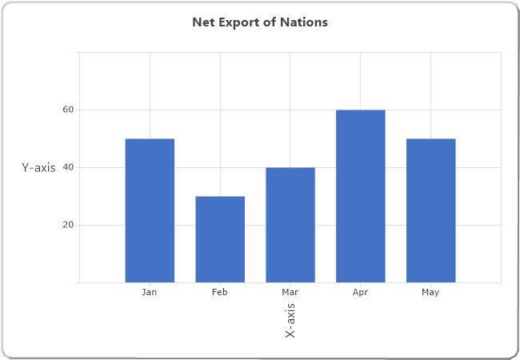

### Multiline Chart Axes Title

You can now wrap the axes titles and display them as multiline text. Set multiline title text in [Axis.Title](https://help.syncfusion.com/cr/windowsforms/Syncfusion.Windows.Forms.Chart.ChartAxis.html#Syncfusion_Windows_Forms_Chart_ChartAxis_Title) property through designer as follows. Press ENTER key to begin a new line. Press CTRL+ENTER to set the text entered.

The below screenshot illustrates a chart with multiline axes titles.

### Drawing Mode of Title Text

You can now display partial axis title with an ellipsis at the end of text, whose text length exceeds the axis length. There is also an option to wrap the title text, in addition to the multiline axes title feature, which is discussed above. The [Axes.TitleDrawMode](https://help.syncfusion.com/cr/windowsforms/Syncfusion.Windows.Forms.Chart.ChartAxis.html#Syncfusion_Windows_Forms_Chart_ChartAxis_TitleDrawMode) property is used to control this behavior.

<table>
<tr>
<th>
Chart Axis Property</th><th>
Description</th></tr>
<tr>
<td>

{{'[TitleDrawMode](https://help.syncfusion.com/cr/windowsforms/Syncfusion.Windows.Forms.Chart.ChartAxis.html#Syncfusion_Windows_Forms_Chart_ChartAxis_TitleDrawMode)'| markdownify }}
</td><td>
Sets the drawing mode of the axis title. It can be Ellipse, Wrap or None. By default it is set to None.</td></tr>
</table>





//Setting drawing mode of y-axis title

this.chartControl1.PrimaryXAxis.TitleDrawMode = ChartTitleDrawMode.Ellipsis;

//Setting drawing mode of secondary y-axis title

this.secYAxis.TitleDrawMode = ChartTitleDrawMode.Wrap;





'Setting drawing mode of y-axis title

Me.chartControl1.PrimaryXAxis.TitleDrawMode = ChartTitleDrawMode.Ellipsis

'Setting drawing mode of secondary y-axis title

Me.secYAxis.TitleDrawMode = ChartTitleDrawMode.Wrap




## Axis Ticks

### Major Ticks

Major Ticks are rendered automatically at the intersection of an axis with the interval grid lines. Here are some properties that will let you customize the look and feel, and behavior of the ticks.

<table>
<tr>
<th>
ChartAxis Property</th><th>
Description</th></tr>
<tr>
<td>

{{'[TickSize](https://help.syncfusion.com/cr/windowsforms/Syncfusion.Windows.Forms.Chart.ChartAxis.html#Syncfusion_Windows_Forms_Chart_ChartAxis_TickSize)'| markdownify }}
</td><td>
Specifies the width and height of the tick rectangle. This is also a good way to hide the ticks. Default is {1, 1}.</td></tr>
<tr>
<td>
{{'[TickColor](https://help.syncfusion.com/cr/windowsforms/Syncfusion.Windows.Forms.Chart.ChartAxis.html#Syncfusion_Windows_Forms_Chart_ChartAxis_TickColor)'| markdownify }}
</td><td>
Color of the tick mark. Default is System.ControlText.</td></tr>
<tr>
<td>

{{'[TickLabelGridPadding](https://help.syncfusion.com/cr/windowsforms/Syncfusion.Windows.Forms.Chart.ChartAxis.html#Syncfusion_Windows_Forms_Chart_ChartAxis_TickLabelGridPadding)'| markdownify }}
</td><td>
The padding between the tick mark in the axis and the label. Default is 5.</td></tr>
<tr>
<td>
{{'[TickDrawingOperationMode](https://help.syncfusion.com/cr/windowsforms/Syncfusion.Windows.Forms.Chart.ChartAxis.html#Syncfusion_Windows_Forms_Chart_ChartAxis_TickLabelsDrawingMode)'| markdownify }}
</td><td>
Defines the number of ticks to render while zooming.<ul><li>NumberOfIntervalsFixed - When you zoom, the number of visible intervals will be constant. So, as you zoom in, the total number of intervals will increase.</li><li>IntervalFixed - The number of intervals will be constant. So, as you zoom in, fewer intervals will be visible at a time.</li></ul></td></tr>
</table>





this.chartControl1.PrimaryXAxis.TickSize = new Size(3,3);

this.chartControl1.PrimaryXAxis.TickColor = Color.DarkOrange;

this.chartControl1.PrimaryXAxis.TickLabelGridPadding = 8F;





Me.chartControl1.PrimaryXAxis.TickSize = new Size(3,3)

Me.chartControl1.PrimaryXAxis.TickColor = Color.DarkOrange

Me.chartControl1.PrimaryXAxis.TickLabelGridPadding = 8F




### Minor Ticks

Minor ticks are tick marks in between major ticks. These are not rendered by default. Use the properties below to enable and define the frequency of such minor tick marks.

<table>
<tr>
<th>
ChartAxis Property</th><th>
Description</th></tr>
<tr>
<td>

{{'[SmallTicksPerInterval](https://help.syncfusion.com/cr/windowsforms/Syncfusion.Windows.Forms.Chart.ChartAxis.html#Syncfusion_Windows_Forms_Chart_ChartAxis_SmallTicksPerInterval)'| markdownify }}
</td><td>
Specifies if and how many minor ticks, which are tick marks drawn on the axis between intervals, should be drawn. </td></tr>
<tr>
<td>
{{'[SmallTickSize](https://help.syncfusion.com/cr/windowsforms/Syncfusion.Windows.Forms.Chart.ChartAxis.html#Syncfusion_Windows_Forms_Chart_ChartAxis_SmallTickSize)'| markdownify }}
</td><td>
Specifies the size of the tick rectangle.</td></tr>
</table>

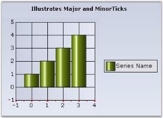





this.chartControl1.PrimaryXAxis.SmallTickSize = new System.Drawing.Size(2, 2);

this.chartControl1.PrimaryXAxis.SmallTicksPerInterval = 1;





this.chartControl1.PrimaryXAxis.SmallTickSize = new System.Drawing.Size(2, 2)

this.chartControl1.PrimaryXAxis.SmallTicksPerInterval = 1




## 3-D Related

Here are some properties that affect the rendering of an axis when in 3-D mode, which is set using the [Series3D](https://help.syncfusion.com/cr/windowsforms/Syncfusion.Windows.Forms.Chart.ChartControl.html#Syncfusion_Windows_Forms_Chart_ChartControl_Series3D) property.

**3-D Related**

<table>
<tr>
<th>
Chart Control Property</th><th>
Description</th></tr>
<tr>
<td>

{{'[Series3D](https://help.syncfusion.com/cr/windowsforms/Syncfusion.Windows.Forms.Chart.ChartControl.html#Syncfusion_Windows_Forms_Chart_ChartControl_Series3D)'| markdownify }}
</td><td>
Specifies if the chart should be rendered in 3-D mode.</td></tr>
<tr>
<td>
{{'[RealMode3D](https://help.syncfusion.com/cr/windowsforms/Syncfusion.Windows.Forms.Chart.ChartControl.html#Syncfusion_Windows_Forms_Chart_ChartControl_RealMode3D)'| markdownify }}
</td><td>
Specifies if the chart should be rendered in a 3-D plane.</td></tr>
<tr>
<td>
{{'[Depth](https://help.syncfusion.com/cr/windowsforms/Syncfusion.Windows.Forms.Chart.ChartControl.html#Syncfusion_Windows_Forms_Chart_ChartControl_Depth)'| markdownify }}
</td><td>
Specifies the depth of the axes in the z coordinate. Default value is 50f.</td></tr>
<tr>
<td>
{{'[Tilt](https://help.syncfusion.com/cr/windowsforms/Syncfusion.Windows.Forms.Chart.ChartControl.html#Syncfusion_Windows_Forms_Chart_ChartControl_Tilt)'| markdownify }}
</td><td>
Specifies the tilt angle relative to the y-axis. Default value is 30f.</td></tr>
<tr>
<td>
{{'[Rotation](https://help.syncfusion.com/cr/windowsforms/Syncfusion.Windows.Forms.Chart.ChartControl.html#Syncfusion_Windows_Forms_Chart_ChartControl_Rotation)'| markdownify }}
</td><td>
Specifies the angle of rotation relative to the x-axis. Default value is 30f.</td></tr>
<tr>
<td>
{{'[ColumnDrawMode](https://help.syncfusion.com/cr/windowsforms/Syncfusion.Windows.Forms.Chart.ChartControl.html#Syncfusion_Windows_Forms_Chart_ChartControl_ColumnDrawMode)'| markdownify }}
</td><td>
Specifies the mode of column drawing when in 3-D.<ul><li> PlaneMode - Columns from different series are drawn with the same depth.</li><li> InDepthMode - Columns from different series are drawn with different depths.</li></ul></td></tr>
<tr>
<td>
 
{{'[EnableMouseRotation](https://help.syncfusion.com/cr/windowsforms/Syncfusion.Windows.Forms.Chart.ChartControl.html#Syncfusion_Windows_Forms_Chart_ChartControl_EnableMouseRotation)'| markdownify }}
</td><td>
Enables rotation of the chart at runtime using middle/right mouse button.</td></tr>
</table>

### 3D Mode Sample





this.chartControl1.Series3D = true;

this.chartControl1.Depth = 55F;

this.chartControl1.Tilt = 55F;

this.chartControl1.Rotation = 60;





Me.chartControl1.Series3D = True

Me.chartControl1.Depth = 55F

Me.chartControl1.Tilt = 55F

Me.chartControl1.Rotation = 60




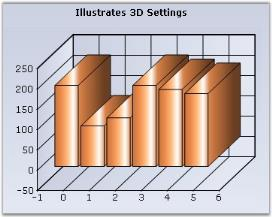

### Real 3D Mode sample





this.chartControl1.ChartArea.Series3D = true;

this.chartControl1.Tilt = 0;

this.chartControl1.Depth = 150;

this.chartControl1.Rotation = 10;

this.chartControl1.RealMode3D = true;





Me.chartControl1.ChartArea.Series3D = True

Me.chartControl1.Tilt = 0

Me.chartControl1.Depth = 150

Me.chartControl1.Rotation = 10

Me.chartControl1.RealMode3D = True




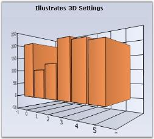

### Rotating Chart

The end-users can be allowed to rotate the chart at run-time by using the mouse (middle or right mouse button) by setting the [EnableMouseRotation](https://help.syncfusion.com/cr/windowsforms/Syncfusion.Windows.Forms.Chart.ChartControl.html#Syncfusion_Windows_Forms_Chart_ChartControl_EnableMouseRotation) property to true.

N> Rotation will not be possible with the LEFT-MOUSE button by enabling this property.





this.chartControl1.RealMode3D = true;

this.chartControl1.EnableMouseRotation = true;





Me.chartControl1.RealMode3D = True

Me.chartControl1.EnableMouseRotation = True




### Rendering Chart in 3-D Style

The interior walls of 3-D charts are enhanced with color effects to improve the chart appearance for many 3-D chart types such as column, column range, bar, area, spline area, step area, candle, and histogram. The chart can be rendered in 3-D style using the [Style3D](https://help.syncfusion.com/cr/windowsforms/Syncfusion.Windows.Forms.Chart.ChartControl.html#Syncfusion_Windows_Forms_Chart_ChartControl_Style3D) property. The following table explains this property.

<table>
<tr>
<th>
Property</th><th>
Description</th></tr>
<tr>
<td>

{{'[Style3D](https://help.syncfusion.com/cr/windowsforms/Syncfusion.Windows.Forms.Chart.ChartControl.html#Syncfusion_Windows_Forms_Chart_ChartControl_Style3D)'| markdownify }}
</td><td>
Specifies whether the chart should be rendered in 3-D style.</td></tr>
</table>

The following code example shows how to enable rendering the chart in 3-D style.





this.chartControl1.Style3D = true;





Me.chartControl1.Style3D=True




## Chart Grid Lines

The grid lines in the chart that delineates the intervals in the axes can be customized using the following properties.

**Chart grid lines**

<table>
<tr>
<th>
Chart Control Property</th><th>
Description</th></tr>
<tr>
<td>

{{'[DrawGrid](https://help.syncfusion.com/cr/windowsforms/Syncfusion.Windows.Forms.Chart.ChartAxis.html#Syncfusion_Windows_Forms_Chart_ChartAxis_DrawGrid)'| markdownify }}
</td><td>
Specifies whether or not to draw the grid lines.</td></tr>
<tr>
<td>
{{'[GridLineType.ForeColor](https://help.syncfusion.com/cr/windowsforms/Syncfusion.Windows.Forms.Chart.LineInfo.html#Syncfusion_Windows_Forms_Chart_LineInfo_ForeColor)'| markdownify }}
</td><td>
The fore color of the line.</td></tr>
<tr>
<td>
{{'[GridLineType.BackColor](https://help.syncfusion.com/cr/windowsforms/Syncfusion.Windows.Forms.Chart.LineInfo.html#Syncfusion_Windows_Forms_Chart_LineInfo_BackColor)'| markdownify }}
</td><td>
The back color of the line.</td></tr>
<tr>
<td>
{{'[GridLineType.DashStyle](https://help.syncfusion.com/cr/windowsforms/Syncfusion.Windows.Forms.Chart.LineInfo.html#Syncfusion_Windows_Forms_Chart_LineInfo_DashStyle)'| markdownify }}
</td><td>
The DashStyle to use for drawing the line.</td></tr>
<tr>
<td>
{{'[GridLineType.PenType](https://help.syncfusion.com/cr/windowsforms/Syncfusion.Windows.Forms.Chart.LineInfo.html#Syncfusion_Windows_Forms_Chart_LineInfo_PenType)'| markdownify }}
</td><td>
The PenType to use for drawing the line.</td></tr>
<tr>
<td>
{{'[GridLineType.Width](https://help.syncfusion.com/cr/windowsforms/Syncfusion.Windows.Forms.Chart.LineInfo.html#Syncfusion_Windows_Forms_Chart_LineInfo_Width)'| markdownify }}
</td><td>
The thickness of the lines.</td></tr>
</table>

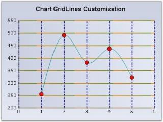

The following code snippet illustrates how to show the gridlines on both axes and how to customize them.





//Customizing X-Axis Gridlines

this.chartControl1.PrimaryXAxis.DrawGrid = true;

this.chartControl1.PrimaryXAxis.GridLineType.BackColor = System.Drawing.Color.Transparent;

this.chartControl1.PrimaryXAxis.GridLineType.DashStyle = System.Drawing.Drawing2D.DashStyle.DashDotDot;

this.chartControl1.PrimaryXAxis.GridLineType.ForeColor = System.Drawing.Color.DarkBlue;

this.chartControl1.PrimaryXAxis.GridLineType.Width = 2F;

//Customizing Y-Axis Gridlines

this.chartControl1.PrimaryYAxis.DrawGrid = true;

this.chartControl1.PrimaryYAxis.GridLineType.BackColor = System.Drawing.Color.OliveDrab;

this.chartControl1.PrimaryYAxis.GridLineType.ForeColor = System.Drawing.Color.DarkOrange;

this.chartControl1.PrimaryYAxis.GridLineType.PenType = System.Drawing.Drawing2D.PenType.LinearGradient;

this.chartControl1.PrimaryYAxis.GridLineType.Width = 2F;





'Customizing X-Axis Gridlines

Me.chartControl1.PrimaryXAxis.DrawGrid = True

Me.chartControl1.PrimaryXAxis.GridLineType.BackColor = System.Drawing.Color.Transparent

Me.chartControl1.PrimaryXAxis.GridLineType.DashStyle = System.Drawing.Drawing2D.DashStyle.DashDotDot

Me.chartControl1.PrimaryXAxis.GridLineType.ForeColor = System.Drawing.Color.DarkBlue

Me.chartControl1.PrimaryXAxis.GridLineType.Width = 2F

'Customizing Y-Axis Gridlines

Me.chartControl1.PrimaryYAxis.DrawGrid = True

Me.chartControl1.PrimaryYAxis.GridLineType.BackColor = System.Drawing.Color.OliveDrab

Me.chartControl1.PrimaryYAxis.GridLineType.ForeColor = System.Drawing.Color.DarkOrange

Me.chartControl1.PrimaryYAxis.GridLineType.PenType = System.Drawing.Drawing2D.PenType.LinearGradient

Me.chartControl1.PrimaryYAxis.GridLineType.Width = 2F




## Chart StripLines

Strip-lines are bands that are drawn at the background of the chart. They can be used to highlight areas of interest. They can be either vertical or horizontal and may be specified with a variety of options to precisely control where they are placed and how they are repeated. The strip-lines are stored in the [ChartAxis.StripLines](https://help.syncfusion.com/cr/windowsforms/Syncfusion.Windows.Forms.Chart.ChartAxis.html#Syncfusion_Windows_Forms_Chart_ChartAxis_StripLines) collection, which holds objects of class [ChartStripLine](https://help.syncfusion.com/cr/windowsforms/Syncfusion.Windows.Forms.Chart.ChartStripLine.html).

A strip-line is configurable by setting its start, end, period and width in the same value type as the axis that holds it. The interior of the strip-lines support gradients, images and different text positions and orientations.

<table>
<tr>
<th>
ChartStripline Property</th><th>
Description</th></tr>
<tr>
<td>

{{'[BackgroundImage](https://help.syncfusion.com/cr/windowsforms/Syncfusion.Windows.Forms.Chart.ChartStripLine.html#Syncfusion_Windows_Forms_Chart_ChartStripLine_BackImage)'| markdownify }}
</td><td>
Sets the background image for the stripline.</td></tr>
<tr>
<td>
{{'[DateOffset](https://help.syncfusion.com/cr/windowsforms/Syncfusion.Windows.Forms.Chart.ChartStripLine.html#Syncfusion_Windows_Forms_Chart_ChartStripLine_DateOffset)'| markdownify }}
</td><td>
Gets / sets the offset of the stripline if the chart's PrimaryX-axis is of type Datetime and StartAtAxisPosition is true. Also see Offset.</td></tr>
<tr>
<td>
{{'[Enabled](https://help.syncfusion.com/cr/windowsforms/Syncfusion.Windows.Forms.Chart.ChartStripLine.html#Syncfusion_Windows_Forms_Chart_ChartStripLine_Enabled)'| markdownify }}
</td><td>
Enables the Stripline.</td></tr>
<tr>
<td>
{{'[End](https://help.syncfusion.com/cr/windowsforms/Syncfusion.Windows.Forms.Chart.ChartStripLine.html#Syncfusion_Windows_Forms_Chart_ChartStripLine_End)'| markdownify }}
</td><td>
Gets /sets the end range (in double) of the stripline. Use this if the axis range type is Double. Also see EndDate.</td></tr>
<tr>
<td>
{{'[EndDate](https://help.syncfusion.com/cr/windowsforms/Syncfusion.Windows.Forms.Chart.ChartStripLine.html#Syncfusion_Windows_Forms_Chart_ChartStripLine_EndDate)'| markdownify }}
</td><td>
The end date of the stripline. Use this if the axis range type is DateTime. Also see End.</td></tr>
<tr>
<td>
{{'[Font](https://help.syncfusion.com/cr/windowsforms/Syncfusion.Windows.Forms.Chart.ChartStripLine.html#Syncfusion_Windows_Forms_Chart_ChartStripLine_Font)'| markdownify }}
</td><td>
The Font style in the which the stripline text if any will be rendered.</td></tr>
<tr>
<td>
{{'[FixedWidth](https://help.syncfusion.com/cr/windowsforms/Syncfusion.Windows.Forms.Chart.ChartStripLine.html#Syncfusion_Windows_Forms_Chart_ChartStripLine_FixedWidth)'| markdownify }}
</td><td>
Specifies a fixed width for the chart stripline. Normally, the width of the stripline changes when the axis range changes. You can also set the width to be fixed irrespective of the AxisRange, by specifying a width in this property. After setting a fixed width, the stripline width will not vary beyond / less than the value that is set.</td></tr>
<tr>
<td>
{{'[Interior](https://help.syncfusion.com/cr/windowsforms/Syncfusion.Windows.Forms.Chart.ChartStripLine.html#Syncfusion_Windows_Forms_Chart_ChartStripLine_Interior)'| markdownify }}
</td><td>
Interior brush information for the stripline.</td></tr>
<tr>
<td>
{{'[Offset](https://help.syncfusion.com/cr/windowsforms/Syncfusion.Windows.Forms.Chart.ChartStripLine.html#Syncfusion_Windows_Forms_Chart_ChartStripLine_Offset)'| markdownify }}
</td><td>
Gets / sets the offset of the stripline if the chart's PrimaryX-axis is of type Double and StartAtAxisPosition is true. Also see DateOffset.</td></tr>
<tr>
<td>
{{'[Period](https://help.syncfusion.com/cr/windowsforms/Syncfusion.Windows.Forms.Chart.ChartStripLine.html#Syncfusion_Windows_Forms_Chart_ChartStripLine_Period)'| markdownify }}
</td><td>
Gets / sets the period (width of the range) over which the stripline appears. </td></tr>
<tr>
<td>
{{'[PeriodDate](https://help.syncfusion.com/cr/windowsforms/Syncfusion.Windows.Forms.Chart.ChartStripLine.html#Syncfusion_Windows_Forms_Chart_ChartStripLine_PeriodDate)'| markdownify }}
</td><td>
Gets / sets the period (time span) over which the stripline appears if the value is DateTime.</td></tr>
<tr>
<td>
{{'[Start](https://help.syncfusion.com/cr/windowsforms/Syncfusion.Windows.Forms.Chart.ChartStripLine.html#Syncfusion_Windows_Forms_Chart_ChartStripLine_Start)'| markdownify }}
</td><td>
Gets / sets the start of the stripline. Also see End.</td></tr>
<tr>
<td>
{{'[StartAtAxisPosition](https://help.syncfusion.com/cr/windowsforms/Syncfusion.Windows.Forms.Chart.ChartStripLine.html#Syncfusion_Windows_Forms_Chart_ChartStripLine_StartAtAxisPosition)'| markdownify }}
</td><td>
Indicates whether the Stripline will start at the start of the axis range.</td></tr>
<tr>
<td>
{{'[StartDate](https://help.syncfusion.com/cr/windowsforms/Syncfusion.Windows.Forms.Chart.ChartStripLine.html#Syncfusion_Windows_Forms_Chart_ChartStripLine_StartDate)'| markdownify }}
</td><td>
The start date of the stripline.</td></tr>
<tr>
<td>
{{'[Text](https://help.syncfusion.com/cr/windowsforms/Syncfusion.Windows.Forms.Chart.ChartStripLine.html#Syncfusion_Windows_Forms_Chart_ChartStripLine_Text)'| markdownify }}
</td><td>
The text in the stripline.</td></tr>
<tr>
<td>
{{'[TextAlignment](https://help.syncfusion.com/cr/windowsforms/Syncfusion.Windows.Forms.Chart.ChartStripLine.html#Syncfusion_Windows_Forms_Chart_ChartStripLine_TextAlignment)'| markdownify }}
</td><td>
Alignment of the text in the stripline.</td></tr>
<tr>
<td>
{{'[TextColor](https://help.syncfusion.com/cr/windowsforms/Syncfusion.Windows.Forms.Chart.ChartStripLine.html#Syncfusion_Windows_Forms_Chart_ChartStripLine_TextColor)'| markdownify }}
</td><td>
The color of the text in the stripline.</td></tr>
<tr>
<td>
{{'[Vertical](https://help.syncfusion.com/cr/windowsforms/Syncfusion.Windows.Forms.Chart.ChartStripLine.html#Syncfusion_Windows_Forms_Chart_ChartStripLine_Vertical)'| markdownify }}
</td><td>
Indicates whether stripline is rendered vertically.</td></tr>
<tr>
<td>
{{'[Width](https://help.syncfusion.com/cr/windowsforms/Syncfusion.Windows.Forms.Chart.ChartStripLine.html#Syncfusion_Windows_Forms_Chart_ChartStripLine_Width)'| markdownify }}
</td><td>
The width of the stripline.</td></tr>
<tr>
<td>
{{'[WidthDate](https://help.syncfusion.com/cr/windowsforms/Syncfusion.Windows.Forms.Chart.ChartStripLine.html#Syncfusion_Windows_Forms_Chart_ChartStripLine_WidthDate)'| markdownify }}
</td><td>
Gets / sets the width of the stripline in a Time span.</td></tr>
</table>

The following is the code to draw a stripline from x-axis with DateTime values.





//Declaring

ChartStripLine stripLine = new ChartStripLine();

//Customizing the Stripline

stripLine.Enabled = true;

stripLine.Vertical = false;

stripLine.Start = 140;

stripLine.Width = 35;

stripLine.FixedWidth = 30;

stripLine.End = 175;

stripLine.Text = "100% of Quota";

stripLine.TextColor = Color.Cyan;

stripLine.TextAlignment = ContentAlignment.MiddleCenter;

stripLine.Font = new Font("Arial", 10, FontStyle.Bold);

stripLine.Interior = new BrushInfo(230, new BrushInfo(GradientStyle.Vertical, Color.OrangeRed, Color.DarkKhaki));

//Adding stripline to the X-axis

this.chartControl1.PrimaryYAxis.StripLines.Add(stripLine);





'Declaring

Private stripLine As ChartStripLine = New ChartStripLine()

'Customizing the Stripline

stripLine.Enabled = True

stripLine.Vertical = True

stripLine.Start = 140

stripLine.Width = 35

stripLine.FixedWidth = 30

stripLine.End = 175

stripLine.Text = "100% of Quota"

stripLine.TextColor = Color.Cyan

stripLine.TextAlignment = ContentAlignment.MiddleCenter

stripLine.Font = New Font("Arial",10,FontStyle.Bold)

stripLine.Interior = New BrushInfo(230, new BrushInfo(GradientStyle.Vertical,Color.OrangeRed, Color.DarkKhaki)))

'Adding stripline to the X-axis

Me.chartControl1.PrimaryXAxis.StripLines.Add(stripLine)




Use an image as StripLine by setting through [StripLine.BackImage](https://help.syncfusion.com/cr/windowsforms/Syncfusion.Windows.Forms.Chart.ChartStripLine.html#Syncfusion_Windows_Forms_Chart_ChartStripLine_BackImage) property.

## Chart Breaks

Breaks are very useful if you add points with too large difference in values. To enable breaks, you need to set the [ChartAxis.MakeBreaks](https://help.syncfusion.com/cr/windowsforms/Syncfusion.Windows.Forms.Chart.ChartAxis.html#Syncfusion_Windows_Forms_Chart_ChartAxis_MakeBreaks) property to true and set the break mode (ChartAxis.BreakRanges.BreaksMode property).

There are three possible modes. They are,

* ChartBreaksMode.None - If this value is set, breaks are not used.
* ChartBreaksMode.Auto - If this mode is enabled, chart will compute the breaks ranges automatically. You can use the ChartAxis.BreakRanges.BreakAmount to set the minimal relative difference between values (default value is 0.1, value range is 0.1). The ratio of empty space should be less than the property value to break the range. This mode has several exclusions.
* ChartBreaksMode.Manual (default) - If this value is set, you can manually set the breaks ranges. To do this, use following methods.
* ChartAxis.BreakRanges.Union – add a new break range.
* ChartAxis.BreakRanges.Exclude – remove the break range.
* ChartAxis.BreakRanges.Clear – remove all break ranges.
* Breaks are computed only for actual y-axis of series.
* Breaks don't work with zooming.
* Breaks don't work with stacking.

All breaks work only with Cartesian axes.

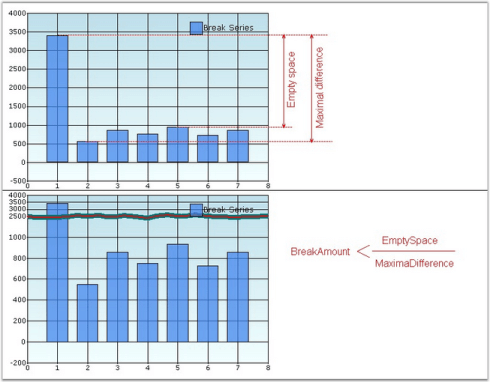

  

this.chartControl1.PrimaryYAxis.MakeBreaks = true;

this.chartControl1.PrimaryYAxis.BreakRanges.BreaksMode = ChartBreaksMode.Manual;

this.chartControl1.PrimaryYAxis.BreakRanges.Union(new DoubleRange(500, 600));

this.chartControl1.PrimaryYAxis.BreakRanges.Union(new DoubleRange(950, 3000));

this.chartControl1.PrimaryYAxis.BreakInfo.LineType = ChartBreakLineType.Wave;

this.chartControl1.PrimaryYAxis.BreakInfo.LineSpacing = 5;

this.chartControl1.PrimaryYAxis.BreakInfo.LineColor = Color.Black;

this.chartControl1.PrimaryYAxis.BreakInfo.LineWidth = 1;

this.chartControl1.PrimaryYAxis.BreakInfo.LineStyle = DashStyle.Dot;

this.chartControl1.PrimaryYAxis.BreakInfo.SpacingColor = Color.White;

this.chartControl1.PrimaryYAxis.BreakRanges.BreakAmount = 0.5;





Me.chartControl1.PrimaryYAxis.MakeBreaks = True

Me.chartControl1.PrimaryYAxis.BreakRanges.BreaksMode = ChartBreaksMode.Manual

Me.chartControl1.PrimaryYAxis.BreakRanges.Union(New DoubleRange(500, 600))

Me.chartControl1.PrimaryYAxis.BreakRanges.Union(New DoubleRange(950, 3000))

Me.chartControl1.PrimaryYAxis.BreakInfo.LineType = ChartBreakLineType.Wave

Me.chartControl1.PrimaryYAxis.BreakInfo.LineSpacing = 5

Me.chartControl1.PrimaryYAxis.BreakInfo.LineColor = Color.Black

Me.chartControl1.PrimaryYAxis.BreakInfo.LineWidth = 1

Me.chartControl1.PrimaryYAxis.BreakInfo.LineStyle = DashStyle.Dot

Me.chartControl1.PrimaryYAxis.BreakInfo.SpacingColor = Color.White

Me.chartControl1.PrimaryYAxis.BreakRanges.BreakAmount = 0.5




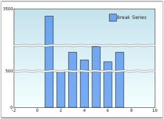

## Axis Crossing Support

Essential Chart for Windows allows the X and Y axis to intersect at a desired point. The X and Y axis will intersect at a point based on the value specified in the X axis crossing property and the Y axis crossing property respectively.

### Use Case Scenarios

This feature will be useful to customize the location of primary axes from default location, when you want to add huge number of negative and positive points in the chart.

**Properties**

<table>
<tr>
<th>
Property </th><th>
Description </th><th>
Type </th><th>
Data Type </th><th>
Reference links </th></tr>
<tr>
<td>

{{'[Crossing](https://help.syncfusion.com/cr/windowsforms/Syncfusion.Windows.Forms.Chart.ChartAxis.html#Syncfusion_Windows_Forms_Chart_ChartAxis_Crossing)'| markdownify }}
</td><td>
Specifies the point of intersect for X and Y axis based on the given data point value.   </td><td>
Server side </td><td>
Double</td><td>
NA </td></tr>
</table>

### Sample Link

To view a sample:

1. Open the Syncfusion Dashboard.
2. Click the Windows Forms drop-down list and select Run Locally Installed Samples.
3. Navigate to Chart samples-> Chart Axes -> Axis Crossing.

### Enable crossing X and Y axis

To enable crossing X and Y axis, specify the Y axis data point value, where you want the X axis to cross, in the X axisCrossing property.  Similarly specify the X axis data point value, where you want the Y axis to cross, in the Y axisCrossing property. The following code illustrates this:





this.chartControl1.PrimaryXAxis.Crossing=150;

this.chartControl1.PrimaryYAxis.Crossing = 6;

this.chartControl1.Series3D = true;





Me.chartControl1.PrimaryXAxis.Crossing = 150

Me.chartControl1.PrimaryYAxis.Crossing = 6

Me.chartControl1.Series3D = True




## Axis Label Placement

This feature enables you to specify the position of the label for an axis. You can place the label either inside or outside the plotted chart area.

### Use Case Scenarios

When you have lengthy label for the chart axis, it will occupy more space. So the plotted chart area will get reduced. You can avoid this using this feature.

**Properties**

<table>
<tr>
<th>
Property </th><th>
Description </th><th>
Type </th><th>
Data Type </th></tr>
<tr>
<td>

{{'[AxisLabelPlacement](https://help.syncfusion.com/cr/windowsforms/Syncfusion.Windows.Forms.Chart.ChartAxis.html#Syncfusion_Windows_Forms_Chart_ChartAxis_AxisLabelPlacement)'| markdownify }}
</td><td>
Specifies the position of the label in a chart axes. It can be placed inside or outside the plotted chart area using {{'[ChartPlacement](https://help.syncfusion.com/cr/windowsforms/Syncfusion.Windows.Forms.Chart.ChartPlacement.html)'| markdownify }} enum. </td><td>
    NA</td><td>
 NA	</td></tr>
</table>

### Sample Link

To view a sample:

1. Open the Syncfusion Dashboard.
2. Click the User Interface -> Windows Forms.
3. Click Run Samples.
4. Navigate to Chart samples -> Chart Axes -> ChartAxisCustomization.

### Positioning Axis Label

You can position the chart axis label using the [Axes.AxisLabelPlacement](https://help.syncfusion.com/cr/windowsforms/Syncfusion.Windows.Forms.Chart.ChartAxis.html#Syncfusion_Windows_Forms_Chart_ChartAxis_AxisLabelPlacement) property. You can specify whether the axis label should be placed inside or outside the plotted chart area using the [ChartPlacement](https://help.syncfusion.com/cr/windowsforms/Syncfusion.Windows.Forms.Chart.ChartPlacement.html) enum.

The following code illustrates how to place the chart axis label inside the plotted chart area:





this.chartControl1.PrimaryXAxis.AxisLabelPlacement = ChartPlacement.Inside;





Me.chartControl1.PrimaryXAxis.AxisLabelPlacement = ChartPlacement.Inside




### Positioning Individual Axis Labels

Essential Chart supports customizing the individual axis label position to the right or left side of the axis for a horizontal axis and to the top or bottom for a vertical axis based on the user's needs.

This feature can be achieved by using the [FormatLabel](/windowsforms/chart/chart-control-events#chartformataxislabel-event) event of the chart axis. The following code illustrates customizing the individual label position by using [AxisLabelPlacement](https://help.syncfusion.com/cr/windowsforms/Syncfusion.Windows.Forms.Chart.ChartAxis.html#Syncfusion_Windows_Forms_Chart_ChartAxis_AxisLabelPlacement) in the [FormatLabel](https://help.syncfusion.com/cr/windowsforms/Syncfusion.Windows.Forms.Chart.ChartAxis.html#Syncfusion_Windows_Forms_Chart_ChartAxis_FormatLabel) event.





this.chartControl1.PrimaryYAxis.AxisLabelPlacement = ChartPlacement.Inside;

//Sets the AxisLabelPlacement property in the ChartFormatAxisLabel event.

private void chartControl1_ChartFormatAxisLabel(object sender, ChartFormatAxisLabelEventArgs e)

        {

            if (e.AxisOrientation == ChartOrientation.Vertical)

            {

                if (e.Label == "1")

                {

                        if (series.Points[(int)e.Value - 1].YValues[0] > 0)

                            e.AxisLabelPlacement = ChartPlacement.Outside;

                        e.Label = "Canada";

                }

                else if (e.Label == "2")

                {

                   if (series.Points[(int)e.Value - 1].YValues[0] > 0)

                            e.AxisLabelPlacement = ChartPlacement.Outside;

                    e.Label = "France";

                }

                else if (e.Label == "3")

                {

                    if (series.Points[(int)e.Value - 1].YValues[0] > 0)

                            e.AxisLabelPlacement = ChartPlacement.Outside;

                    e.Label = "Japan";

                }

                else if (e.Label == "4")

                {

                    if (series.Points[(int)e.Value - 1].YValues[0] > 0)

                        e.AxisLabelPlacement = ChartPlacement.Outside;

                    e.Label = "Britain";

                }

                else if (e.Label == "5")

                {

                    if (series.Points[(int)e.Value - 1].YValues[0] > 0)

                            e.AxisLabelPlacement = ChartPlacement.Outside;

                    e.Label = "United States";

                }

                e.Handled = true;

            }

        }





Me.chartControl1.PrimaryYAxis.AxisLabelPlacement = ChartPlacement.Inside

'Sets the AxisLabelPlacement property in ChartFormatAxisLabel event.

this.chartControl1.PrimaryYAxis.AxisLabelPlacement = ChartPlacement.Inside;

Private Sub chartControl1_ChartFormatAxisLabel(ByVal sender As Object, ByVal e As ChartFormatAxisLabelEventArgs)

            If e.AxisOrientation = ChartOrientation.Vertical Then

                If e.Label = "1" Then

                    If series.Points(CInt(Fix(e.Value)) - 1).YValues(0) > 0 Then

                        e.AxisLabelPlacement = ChartPlacement.Outside

                    End If

                    e.Label = "Canada"

                ElseIf e.Label = "2" Then

                    If series.Points(CInt(Fix(e.Value)) - 1).YValues(0) > 0 Then

                        e.AxisLabelPlacement = ChartPlacement.Outside

                    End If

                    e.Label = "France"

                ElseIf e.Label = "3" Then

                    If series.Points(CInt(Fix(e.Value)) - 1).YValues(0) > 0 Then

                        e.AxisLabelPlacement = ChartPlacement.Outside

                    End If

                    e.Label = "Japan"

                ElseIf e.Label = "4" Then

                    If series.Points(CInt(Fix(e.Value)) - 1).YValues(0) > 0 Then

                        e.AxisLabelPlacement = ChartPlacement.Outside

                    End If

                    e.Label = "Britain"

                ElseIf e.Label = "5" Then

                    If series.Points(CInt(Fix(e.Value)) - 1).YValues(0) > 0 Then

                        e.AxisLabelPlacement = ChartPlacement.Outside

                    End If

                    e.Label = "United States"

                End If

                e.Handled = True

            End If

        End Sub




The following screenshot illustrates the customization options for individual label positions on the y-axis to the right or left side based on the y value of the data points. If the export value is positive, the label is rendered to the left side of the axis, and if it is negative, the label is rendered on the right side of the axis.

## ZoomFactor and ZoomPosition

Axes are scaled using zoomFactor. The position of a zoomed axis is specified by zoomPosition. Both values fall between 0 and 1.  When zoomFactor is set to 0.5, the chart is scaled by 200% along with this axis.





//Set zoomFactor and zoomPosition for axis
this.chart.PrimaryXAxis.ZoomFactor = 0.5;
this.chart.PrimaryXAxis.ZoomPosition = 0.5;





//Set zoomFactor and zoomPosition for axis
Me.chart.PrimaryXAxis.ZoomFactor = 0.5;
Me.chart.PrimaryXAxis.ZoomPosition = 0.5;




For example, when zoomFactor and zoomPosition are set to 0.5 for the chart with 6 data points, the last 3 data points in the chart will be shown. Here, the zoomFactor decides the number of points and zoomPosition decides the range of values to display.

The following screenshot illustrates a chart whose x-axis has been zoomed by setting zoomFactor and zoomPosition.

## Exclude Invisible Series Range

The data in the hidden series influencing auto range for both x and y axis can be prevented by setting ExcludeInvisibleSeriesRange property to true  to the corresponding axis.





//Set ExcludeInvisibleSeriesRange for axis
this.chart.PrimaryXAxis.ExcludeInvisibleSeriesRange = true;
this.chart.PrimaryYAxis.ExcludeInvisibleSeriesRange = true;





//Set ExcludeInvisibleSeriesRange for axis
Me.chart.PrimaryXAxis.ExcludeInvisibleSeriesRange = true;
Me.chart.PrimaryYAxis.ExcludeInvisibleSeriesRange = true;




For example, when hidden the any of the series and set the ExcludeInvisibleSeriesRange as true for corresponding axis, then the axis range will not include the hidden series while calculation ranges for that axis.

The following screenshot illustrates a chart whose x-axis and y-axis range exclude the invisible series by setting ExcludeInvisibleSeriesRange as true for corresponding axis.

## RoundingPlaces in Axis

Default rounding value for the axis label is 2. If you want to change the rounding value for the axis labels, you can set rounding values in RoundingPlaces property.





//Set RoundingPlaces for axis
this.chartControl1.PrimaryYAxis.RoundingPlaces = 3;





//Set RoundingPlaces for axis
Me.chartControl1.PrimaryYAxis.RoundingPlaces = 3;




The following screenshot illustrates a chart whose y-axis labels rendered with three decimal places.

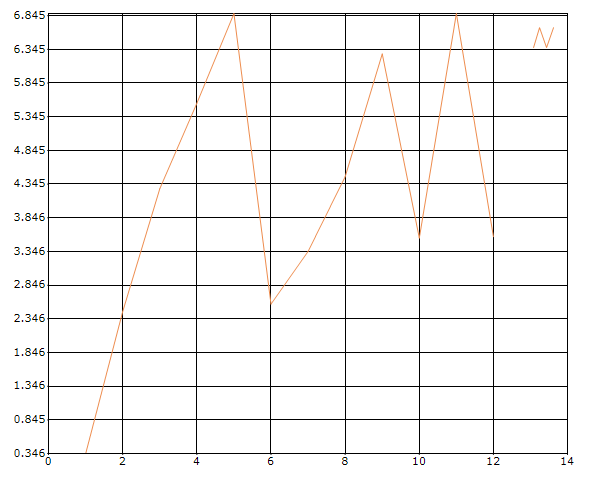

## Custom Labels Parameter

In axis labels, labels can be placed based on the CustomLabelsParameter property.

* Index
* Position.

Default value for CustomLabelsParameter is Index. By setting the CustomLabelsParameter as Position ,you can bind the custom x names properly in chart. And additionally don’t need to specify the OBJECTID “XName” for SeriesModel but alternatively you should specify the OBJECTID for “PositionName” property.





//Set CustomLabelsParameter for axis
series.SeriesModel = new ChartDataBindModel(ShowCompleteInformation, "test1")
{
    YNames = new string[] { "YValue" },
};

chart.Series.Add(series);
ChartDataBindAxisLabelModel xAxisLabelModel = new ChartDataBindAxisLabelModel(Data, "test1");
xAxisLabelModel.LabelName = "XValue";
xAxisLabelModel.PositionName = "ID";
chart.PrimaryXAxis.LabelsImpl = xAxisLabelModel;
chart.PrimaryXAxis.CustomLabelsParameter = ChartCustomLabelsParameter.Position;





//Set CustomLabelsParameter for axis
series.SeriesModel = new ChartDataBindModel(ShowCompleteInformation, "test1")
{
    YNames = new string[] { "YValue" },
};

chart.Series.Add(series);
ChartDataBindAxisLabelModel xAxisLabelModel = new ChartDataBindAxisLabelModel(Data, "test1");
xAxisLabelModel.LabelName = "XValue";
xAxisLabelModel.PositionName = "ID";
chart.PrimaryXAxis.LabelsImpl = xAxisLabelModel;
chart.PrimaryXAxis.CustomLabelsParameter = ChartCustomLabelsParameter.Position;




The following screenshot illustrates a chart whose x-axis labels rendered with CustomLabelsParameter as position.

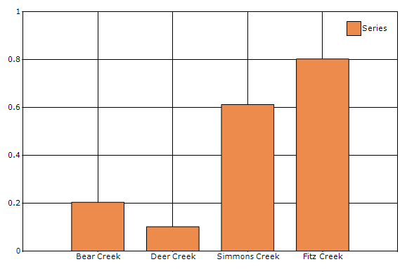

## ChartAxisEdgeLabelsDrawingMode

Labels with long text at the edges of an axis may appear partially in the chart. To avoid this, use the `EdgeLabelsDrawingMode` property in axis, which moves the label inside the chart area for better appearance or shows the clipped labels.

Chart provides the following there modes to edge label drawing mode in axis labels:

* Center
* Shift.
* ClippingProtection.

The default value of the `EdgeLabelsDrawingMode` property is Center. By setting this property to Shift, the edge labels will be placed inside the charts. While setting the `EdgeLabelDrawingMode` to ClippingProtection, the partially hidden labels will be visible.





chart.PrimaryXAxis.EdgeLabelsDrawingMode = ChartAxisEdgeLabelsDrawingMode.Shift;





chart.PrimaryXAxis.EdgeLabelsDrawingMode = ChartAxisEdgeLabelsDrawingMode.Shift;




The following screenshot illustrates the chart whose x-axis labels are rendered with EdgeLabelsDrawingMode as Shift.

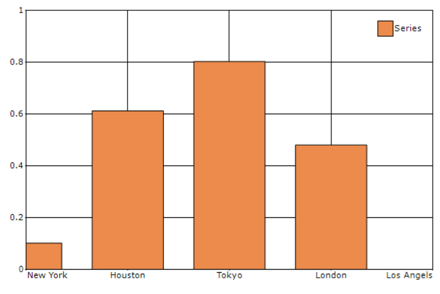

## PointOffset in axis

`PointOffset` is used to leave space between axis and the first point drawn in the chart.





chart.PrimaryXAxis.PointOffset = 0.1;





chart.PrimaryXAxis.PointOffset = 0.1;




For example, when you set PointOffset to 1, chart will leave one interval space between axis and the first point.

The following screenshot illustrates the chart whose x-axis labels are rendered with PointOffset as 1.

## RangePaddingTypes

Padding can be applied to the minimum and maximum extremes of an axis range using the `RangePaddingType` property. The types of range padding are,

* None
* Calculate

**None**

When the range padding type is set to None, padding can be applied to the minimum and maximum extremes of an axis range based on data.





chart.PrimaryXAxis.RangePaddingType = ChartAxisRangePaddingType.None;





chart.PrimaryXAxis.RangePaddingType = ChartAxisRangePaddingType.None;




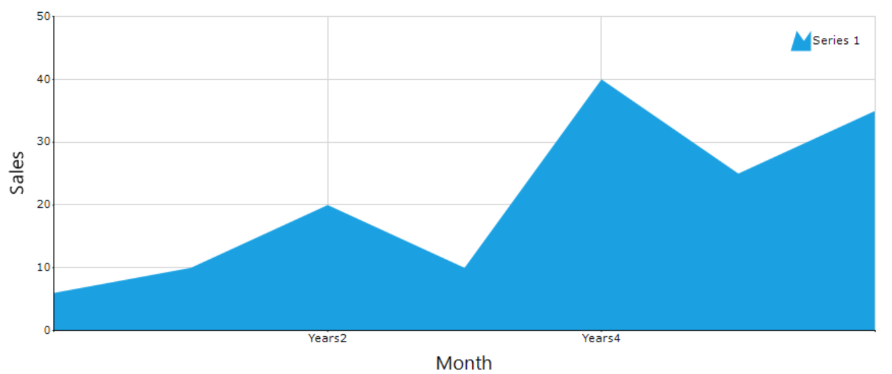

**Calculate**

When the range padding type is set to Calculate, interval of an axis will be added to the minimum and maximum of the axis range.





chart.PrimaryXAxis.RangePaddingType = ChartAxisRangePaddingType.Calculate;





chart.PrimaryXAxis.RangePaddingType = ChartAxisRangePaddingType.Calculate;




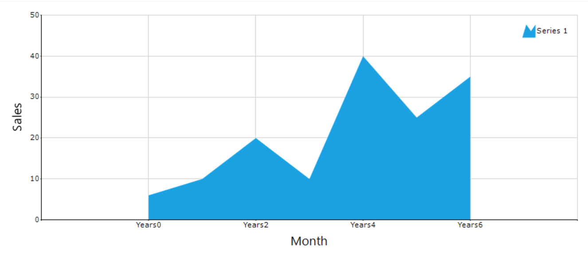

## Axis line type

The axis line can be customized using the `LineType` property in axis option. The `LineType` property has the following options to customize the axis lines: `ForeColor`, `DashStyle`, `Width` and `BackColor`.

**ForeColor**

You can change the axis line color using the `ForeColor` property.





chart.PrimaryXAxis.LineType.ForeColor = Color.Blue;





chart.PrimaryXAxis.LineType.ForeColor = Color.Blue;




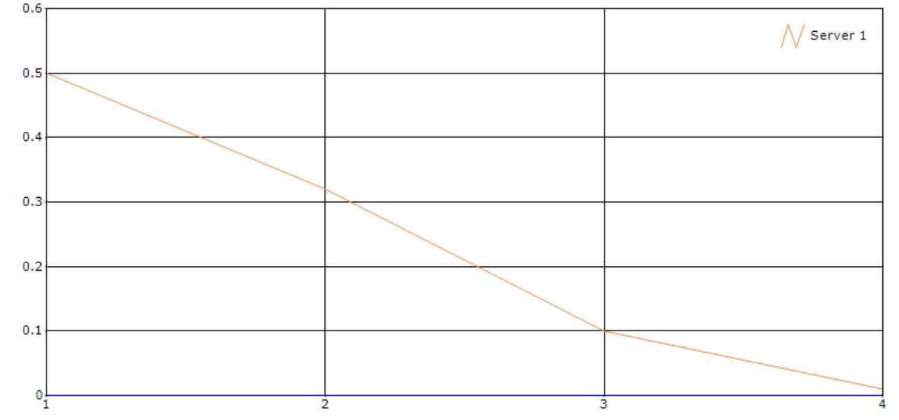

**Width**

You can change the axis line width using the `Width` property.





chart.PrimaryXAxis.LineType.Width = 3;





chart.PrimaryXAxis.LineType.Width = 3;




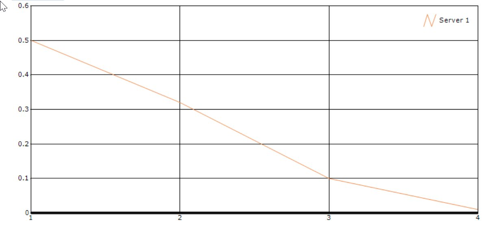

**DashStyle**

You can change the axis line dash style using the `DashStyle` property. The `DashStyle` property has the following six dash styles:

* Solid
* Dash
* Dot
* DashDot
* DashDotDot
* Custom





chart.PrimaryXAxis.LineType.DashStyle = System.Drawing.Drawing2D.DashStyle.DashDotDot;





chart.PrimaryXAxis.LineType.DashStyle = System.Drawing.Drawing2D.DashStyle.DashDotDot;




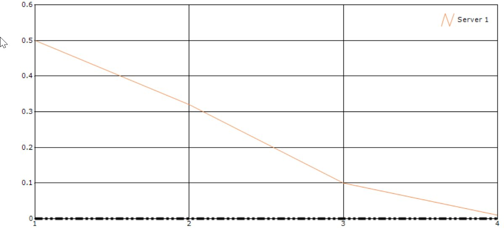

**BackColor**

When using the `HatchFill` or `LinearGradient` pen type, one more color is needed for axis line. You can use either `ForeColor` or `BackColor` for these pen types.





chart.PrimaryXAxis.LineType.BackColor = Color.Green;
chart.PrimaryXAxis.LineType.ForeColor = Color.Red;
chart.PrimaryXAxis.LineType.PenType = System.Drawing.Drawing2D.PenType.LinearGradient;





chart.PrimaryXAxis.LineType.BackColor = Color.Green;
chart.PrimaryXAxis.LineType.ForeColor = Color.Red;
chart.PrimaryXAxis.LineType.PenType = System.Drawing.Drawing2D.PenType.LinearGradient;




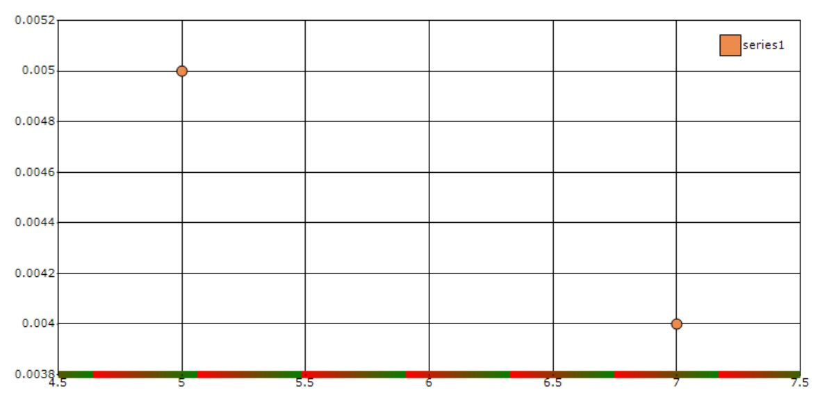

### Axis Gridline LineType

The axis grid lines can be customized using the `LineType` property in axis option. The `LineType` property has the following options to customize the axis grid lines: `ForeColor`, `DashStyle`, `Width` and `BackColor`.

**ForeColor**

You can change the axis grid line color using the `ForeColor` property.





chart.PrimaryXAxis.LineType.ForeColor = Color.Blue;





chart.PrimaryXAxis.LineType.ForeColor = Color.Blue;




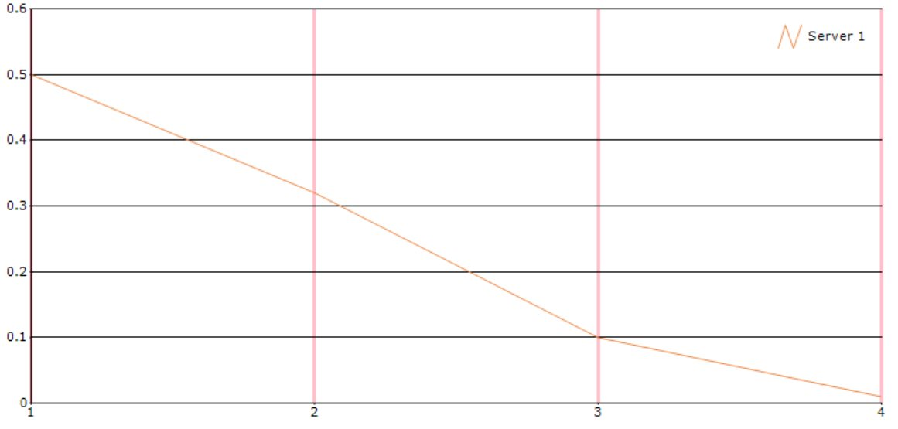

**Width**

You can change the axis grid line width using the `Width` property.





chart.PrimaryXAxis.GridLineType.Width = 4;





chart.PrimaryXAxis.GridLineType.Width = 4;




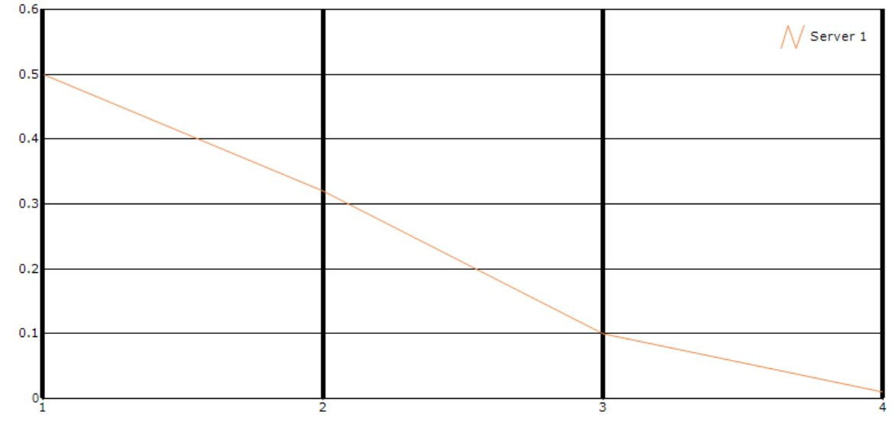

**DashStyle**

You can change the axis grid line dash style using the `DashStyle` property. The `DashStyle` property has the following six options:

* Solid
* Dash
* Dot
* DashDot
* DashDotDot
* Custom





chart.PrimaryXAxis.GridLineType.DashStyle = System.Drawing.Drawing2D.DashStyle.DashDotDot;





chart.PrimaryXAxis.GridLineType.DashStyle = System.Drawing.Drawing2D.DashStyle.DashDotDot;




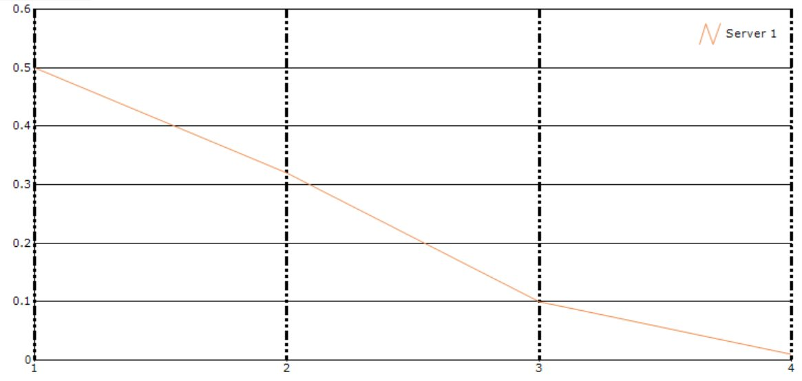

**BackColor**

When using the `HatchFill` or `LinearGradient` pen type, one more color is needed for axis line. You can use either `ForeColor` or `BackColor` for these pen types.





chart.PrimaryXAxis.LineType.BackColor = Color.Green;
chart.PrimaryXAxis.LineType.ForeColor = Color.Red;
chart.PrimaryXAxis.LineType.PenType = System.Drawing.Drawing2D.PenType.LinearGradient;





chart.PrimaryXAxis.LineType.BackColor = Color.Green;
chart.PrimaryXAxis.LineType.ForeColor = Color.Red;
chart.PrimaryXAxis.LineType.PenType = System.Drawing.Drawing2D.PenType.LinearGradient;




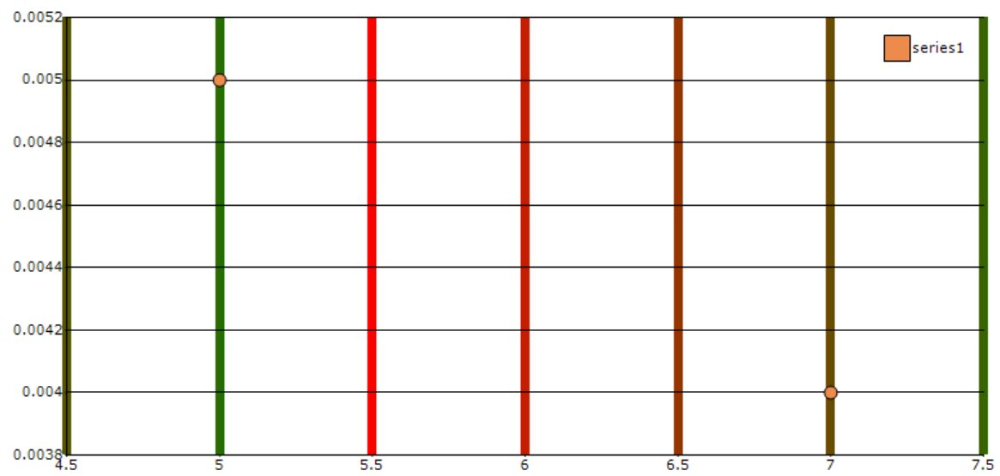

### Axis GetVisibleValue

The `GetVisibleValue` property of axis gets values on chart area by specifying chart coordinate
value.





chart.MouseMove += new System.Windows.Forms.MouseEventHandler(this.Chart_ChartRegionMouseMove);

private void Chart_ChartRegionMouseMove(object sender, MouseEventArgs e)
        {
            Point mousePoint = new Point(e.X, e.Y);
            ChartPoint point = chart.ChartArea.GetValueByPoint(new Point(e.X, e.Y));
            Point pt = chart.ChartArea.GetPointByValue(point);
            string text = null;
            text = "Result of method GetVisibleValue : {" + chart.PrimaryXAxis.GetVisibleValue(point.X) + "," + chart.PrimaryYAxis.GetVisibleValue(point.YValues[0]) + "}";
            toolTip1.SetToolTip(chart, text);
        }





chart.MouseMove += New System.Windows.Forms.MouseEventHandler(AddressOf Me.Chart_ChartRegionMouseMove);

Private Sub Chart_ChartRegionMouseMove(ByVal sender As Object, ByVal e As MouseEventArgs)
            Dim mousePoint As Point = New Point(e.X, e.Y)
            Dim point As ChartPoint = chart.ChartArea.GetValueByPoint(New Point(e.X, e.Y))
            Dim pt As Point = chart.ChartArea.GetPointByValue(point)
            Dim text As String = Nothing
            text = "Result of method GetVisibleValue : {" & chart.PrimaryXAxis.GetVisibleValue(point.X) & "," + chart.PrimaryYAxis.GetVisibleValue(point.YValues(0)) & "}"
            toolTip1.SetToolTip(chart, text)
        End Sub




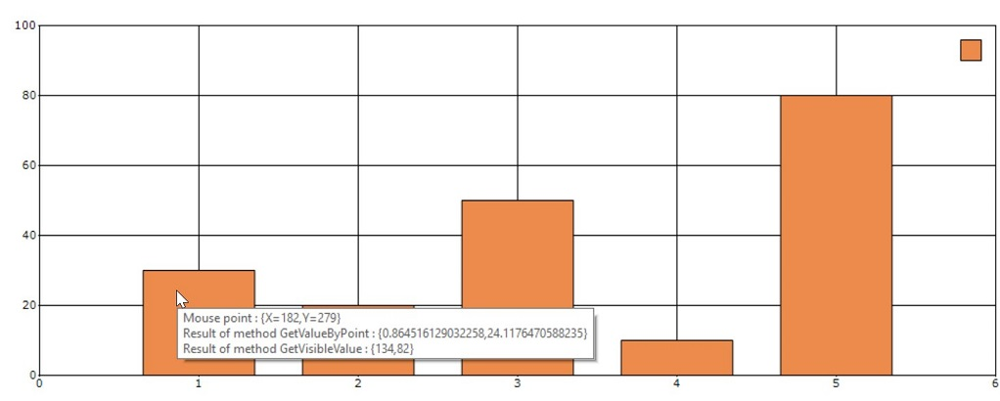
