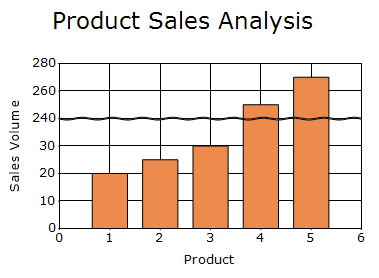
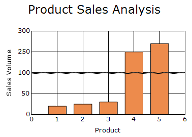
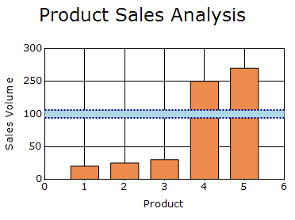

# Chart Breaks in Windows Forms Chart

Scale break is a stripe drawn in the chart area to denote the break in the continuity of data points. Scale breaks are useful when there is a large difference in the data points. Scale break allows you to have different ranges on the same axis to visualize data effectively.

The [MakeBreaks](https://help.syncfusion.com/cr/windowsforms/Syncfusion.Windows.Forms.Chart.ChartAxis.html#Syncfusion_Windows_Forms_Chart_ChartAxis_MakeBreaks) property enables axis breaks, the [BreakRanges](https://help.syncfusion.com/cr/windowsforms/Syncfusion.Windows.Forms.Chart.ChartAxis.html#Syncfusion_Windows_Forms_Chart_ChartAxis_BreakRanges) property configures automatic or manual break ranges, and the [BreakInfo](https://help.syncfusion.com/cr/windowsforms/Syncfusion.Windows.Forms.Chart.ChartAxis.html#Syncfusion_Windows_Forms_Chart_ChartAxis_BreakInfo) property customizes the appearance of break lines.

## Enable chart breaks

The [MakeBreaks](https://help.syncfusion.com/cr/windowsforms/Syncfusion.Windows.Forms.Chart.ChartAxis.html#Syncfusion_Windows_Forms_Chart_ChartAxis_MakeBreaks) property controls whether breaks are displayed on the axis. The default value is `false`.

N>
Chart breaks are computed only for the actual Y-axis associated with a series and are not supported when zooming is enabled or when using stacked series.

The following code example enables breaks on the primary Y-axis and calculates the break range automatically.




chartControl.PrimaryYAxis.MakeBreaks = true;
chartControl.PrimaryYAxis.BreakRanges.BreaksMode = ChartBreaksMode.Auto;




chartControl.PrimaryYAxis.MakeBreaks = True
chartControl.PrimaryYAxis.BreakRanges.BreaksMode = ChartBreaksMode.Auto




## Break mode

The [BreaksMode](https://help.syncfusion.com/cr/windowsforms/Syncfusion.Windows.Forms.Chart.ChartAxisRange.html#Syncfusion_Windows_Forms_Chart_ChartAxisRange_BreaksMode) property specifies how break ranges are determined. The default value is [Manual](https://help.syncfusion.com/cr/windowsforms/Syncfusion.Windows.Forms.Chart.ChartBreaksMode.html#Syncfusion_Windows_Forms_Chart_ChartBreaksMode_Manual).

The supported [ChartBreaksMode](https://help.syncfusion.com/cr/windowsforms/Syncfusion.Windows.Forms.Chart.ChartBreaksMode.html) values are:

- [Auto](https://help.syncfusion.com/cr/windowsforms/Syncfusion.Windows.Forms.Chart.ChartBreaksMode.html#Syncfusion_Windows_Forms_Chart_ChartBreaksMode_Auto):  Calculates break ranges automatically based on the series data.
- [Manual](https://help.syncfusion.com/cr/windowsforms/Syncfusion.Windows.Forms.Chart.ChartBreaksMode.html#Syncfusion_Windows_Forms_Chart_ChartBreaksMode_Manual): Applies manually specified break ranges.
- [None](https://help.syncfusion.com/cr/windowsforms/Syncfusion.Windows.Forms.Chart.ChartBreaksMode.html#Syncfusion_Windows_Forms_Chart_ChartBreaksMode_None): Does not apply chart breaks.

The following code example enables automatic break calculation.




chartControl.PrimaryYAxis.MakeBreaks = true;
chartControl.PrimaryYAxis.BreakRanges.BreaksMode = ChartBreaksMode.Auto;




chartControl.PrimaryYAxis.MakeBreaks = True
chartControl.PrimaryYAxis.BreakRanges.BreaksMode = ChartBreaksMode.Auto




## Manual chart breaks
 
The [Manual](https://help.syncfusion.com/cr/windowsforms/Syncfusion.Windows.Forms.Chart.ChartBreaksMode.html#Syncfusion_Windows_Forms_Chart_ChartBreaksMode_Manual) break mode allows you to define chart break ranges explicitly. The [BreakRanges](https://help.syncfusion.com/cr/windowsforms/Syncfusion.Windows.Forms.Chart.ChartAxis.html#Syncfusion_Windows_Forms_Chart_ChartAxis_BreakRanges) collection is used to add, remove, and manage the ranges that should be excluded from the axis.

The following methods are available:
- [Union](https://help.syncfusion.com/cr/windowsforms/Syncfusion.Windows.Forms.Chart.ChartAxisRange.html#Syncfusion_Windows_Forms_Chart_ChartAxisRange_Union_Syncfusion_Windows_Forms_Chart_DoubleRange_): Adds a break range.
- [Exclude](https://help.syncfusion.com/cr/windowsforms/Syncfusion.Windows.Forms.Chart.ChartAxisRange.html#Syncfusion_Windows_Forms_Chart_ChartAxisRange_Exclude_Syncfusion_Windows_Forms_Chart_DoubleRange_): Removes a specified break range.
- [Clear](https://help.syncfusion.com/cr/windowsforms/Syncfusion.Windows.Forms.Chart.ChartAxisRange.html#Syncfusion_Windows_Forms_Chart_ChartAxisRange_Clear): Removes all break ranges.

The following property is available:
- [Breaks](https://help.syncfusion.com/cr/windowsforms/Syncfusion.Windows.Forms.Chart.ChartAxis.html#Syncfusion_Windows_Forms_Chart_ChartAxis_Breaks): Returns the break ranges applied to the axis. This property is read-only.

The following code example adds a manual break range from `100` to `200`.




chartControl.PrimaryYAxis.MakeBreaks = true;
chartControl.PrimaryYAxis.BreakRanges.BreaksMode = ChartBreaksMode.Manual;
chartControl.PrimaryYAxis.BreakRanges.Union(new DoubleRange(100, 200));




chartControl.PrimaryYAxis.MakeBreaks = True
chartControl.PrimaryYAxis.BreakRanges.BreaksMode = ChartBreaksMode.Manual

chartControl.PrimaryYAxis.BreakRanges.Union(New DoubleRange(100, 200))




## Customizing break line appearance

The [BreakInfo](https://help.syncfusion.com/cr/windowsforms/Syncfusion.Windows.Forms.Chart.ChartAxis.html#Syncfusion_Windows_Forms_Chart_ChartAxis_BreakInfo) property provides a [ChartAxisBreakInfo](https://help.syncfusion.com/cr/windowsforms/Syncfusion.Windows.Forms.Chart.ChartAxisBreakInfo.html) object that customizes the appearance of chart break lines.

The following properties are available:

- [LineType](https://help.syncfusion.com/cr/windowsforms/Syncfusion.Windows.Forms.Chart.ChartAxisBreakInfo.html#Syncfusion_Windows_Forms_Chart_ChartAxisBreakInfo_LineType): Specifies the shape of the break line. The default value is [Straight](https://help.syncfusion.com/cr/windowsforms/Syncfusion.Windows.Forms.Chart.ChartBreakLineType.html#Syncfusion_Windows_Forms_Chart_ChartBreakLineType_Straight).
The supported [ChartBreakLineType](https://help.syncfusion.com/cr/windowsforms/Syncfusion.Windows.Forms.Chart.ChartBreakLineType.html) values are:
    - [Straight](https://help.syncfusion.com/cr/windowsforms/Syncfusion.Windows.Forms.Chart.ChartBreakLineType.html#Syncfusion_Windows_Forms_Chart_ChartBreakLineType_Straight): Displays straight break lines.
    - [Wave](https://help.syncfusion.com/cr/windowsforms/Syncfusion.Windows.Forms.Chart.ChartBreakLineType.html#Syncfusion_Windows_Forms_Chart_ChartBreakLineType_Wave): Displays wave shaped break lines.
    - [Randomize](https://help.syncfusion.com/cr/windowsforms/Syncfusion.Windows.Forms.Chart.ChartBreakLineType.html#Syncfusion_Windows_Forms_Chart_ChartBreakLineType_Randomize): Displays randomized break lines.
- [LineColor](https://help.syncfusion.com/cr/windowsforms/Syncfusion.Windows.Forms.Chart.ChartAxisBreakInfo.html#Syncfusion_Windows_Forms_Chart_ChartAxisBreakInfo_LineColor): Specifies the color of the break line. The default value is `Color.Black`.
- [LineWidth](https://help.syncfusion.com/cr/windowsforms/Syncfusion.Windows.Forms.Chart.ChartAxisBreakInfo.html#Syncfusion_Windows_Forms_Chart_ChartAxisBreakInfo_LineWidth): Specifies the width of the break line. The default value is `1f`.
- [LineStyle](https://help.syncfusion.com/cr/windowsforms/Syncfusion.Windows.Forms.Chart.ChartAxisBreakInfo.html#Syncfusion_Windows_Forms_Chart_ChartAxisBreakInfo_LineStyle): Specifies the dash style used to render the break line. The default value is `DashStyle.Solid`.
- [LineSpacing](https://help.syncfusion.com/cr/windowsforms/Syncfusion.Windows.Forms.Chart.ChartAxisBreakInfo.html#Syncfusion_Windows_Forms_Chart_ChartAxisBreakInfo_LineSpacing): Specifies the spacing between the break lines. The default value is `1.0`.
- [SpacingColor](https://help.syncfusion.com/cr/windowsforms/Syncfusion.Windows.Forms.Chart.ChartAxisBreakInfo.html#Syncfusion_Windows_Forms_Chart_ChartAxisBreakInfo_SpacingColor): Specifies the color displayed in the space between break lines. The default value is `Color.White`.

The following code example customizes the appearance of chart break lines.



chartControl.PrimaryYAxis.BreakInfo.LineType = ChartBreakLineType.Straight;
chartControl.PrimaryYAxis.BreakInfo.LineColor = Color.DarkBlue;
chartControl.PrimaryYAxis.BreakInfo.LineWidth = 2f;
chartControl.PrimaryYAxis.BreakInfo.LineStyle = DashStyle.Dot;
chartControl.PrimaryYAxis.BreakInfo.LineSpacing = 12;
chartControl.PrimaryYAxis.BreakInfo.SpacingColor = Color.LightBlue;


chartControl.PrimaryYAxis.BreakInfo.LineType = ChartBreakLineType.Straight
chartControl.PrimaryYAxis.BreakInfo.LineColor = Color.DarkBlue
chartControl.PrimaryYAxis.BreakInfo.LineWidth = 2.0F
chartControl.PrimaryYAxis.BreakInfo.LineStyle = DashStyle.Dot
chartControl.PrimaryYAxis.BreakInfo.LineSpacing = 12
chartControl.PrimaryYAxis.BreakInfo.SpacingColor = Color.LightBlue



