# Populating Data in Windows Forms Chart

### Built-in Support for data-binding

Essential® Chart has built-in support for binding to DataTables, DataSets, DataViews or any implementation of IListSource, IBindingList or ITypedList.

The [ChartSeries](https://help.syncfusion.com/cr/windowsforms/Syncfusion.Windows.Forms.Chart.ChartSeries.html) data points and the axis labels are the ones that can be data bound.

There is however no DESIGN-TIME support for data binding. This has to be setup in code.

### Data binding via custom interfaces

There is also more flexible support for implementing custom data models by implementing specific interfaces. Using this approach you can query and provide data for the chart much more flexibly and from any kind of data store.

N> One important reason you might want to use either of the above two approaches is to greatly enhance performance (speed and memory) especially while dealing with a large set of data points.

## Binding a DataSet to the Chart

The following sample code illustrates how a custom DataSet can be bound to a [ChartSeries](https://help.syncfusion.com/cr/windowsforms/Syncfusion.Windows.Forms.Chart.ChartSeries.html) to provide data points and to a [ChartAxis](https://help.syncfusion.com/cr/windowsforms/Syncfusion.Windows.Forms.Chart.ChartAxis.html) to provide label names. Note that the DataSet can easily be replaced with a DataTable or DataView.

  



ChartDataBindModel model = null;

ChartDataBindAxisLabelModel xAxisLabelModel = null;

// A custom DataSet bound to the Demographics table.

private ChartAccessDataBind.DataSet1 dataSet11;

this.oleDbDataAdapter1.Fill(this.dataSet11.Demographics);

model = new ChartDataBindModel(this.dataSet11,"Demographics");

// The column that contains the X values.

model.XName = "ID";

// The columns that contain the Y values.

model.YNames = new string[]{"Population"};

ChartSeries series = new ChartSeries ("Data Bound Series");

series.Text = series.Name;

series.SeriesModelImpl = model;

series.Style.TextColor = Color.White;

series.Style.Font.Bold = true;

this.chartControl1.Series.Add(series);

this.xAxisLabelModel = new ChartDataBindAxisLabelModel(this.dataSet11,"Demographics");

// The columns that has the label values for the corresponding X values.

this.xAxisLabelModel.LabelName = "City";

this.chartControl1.PrimaryXAxis.LabelsImpl = this.xAxisLabelModel;

this.chartControl1.PrimaryXAxis.ValueType = ChartValueType.Custom;





Dim model As ChartDataBindModel = Nothing

Dim xAxisLabelModel As ChartDataBindAxisLabelModel = Nothing

' A custom DataSet bound to the Demographics table

Private dataSet11 As ChartAccessDataBind.DataSet1

Me.oleDbDataAdapter1.Fill(Me.dataSet11.Demographics)

model = New ChartDataBindModel(Me.dataSet11,"Demographics")

' The column that contains the X values.

model.XName = "ID"

' The columns that contain the Y values.

model.YNames = New String(){"Population"}

Dim series As New ChartSeries("Data Bound Series")

series.Text = series.Name

series.SeriesModelImpl = model

series.Style.TextColor = Color.White

series.Style.Font.Bold = True

Me.chartControl1.Series.Add(series)

Me.xAxisLabelModel = New ChartDataBindAxisLabelModel(Me.dataSet11,"Demographics")

' The columns that has the label values for the corresponding X values.

Me.xAxisLabelModel.LabelName = "City"

Me.chartControl1.PrimaryXAxis.LabelsImpl = Me.xAxisLabelModel

Me.chartControl1.PrimaryXAxis.ValueType = ChartValueType.Custom




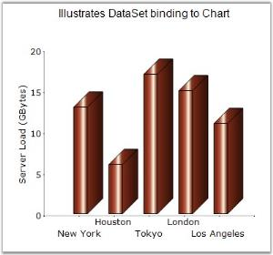

## Implementing Custom Data Binding Interfaces

Note that the [ChartDataBindModel](https://help.syncfusion.com/cr/windowsforms/Syncfusion.Windows.Forms.Chart.ChartDataBindModel.html) type in the previous topic implements a simple interface called [IChartSeriesModel](https://help.syncfusion.com/cr/windowsforms/Syncfusion.Windows.Forms.Chart.IChartSeriesModel.html). This interface requires the implementation of one property, two methods and one optional event. So, you can easily provide a custom implementation of this interface instead of using the [ChartDataBindModel](https://help.syncfusion.com/cr/windowsforms/Syncfusion.Windows.Forms.Chart.ChartDataBindModel.html).

Shown below is some sample code that implements [IChartSeriesModel](https://help.syncfusion.com/cr/windowsforms/Syncfusion.Windows.Forms.Chart.IChartSeriesModel.html) interface for use with the chart.

  



// Custom Model

public class ArrayModel : IChartSeriesModel
{
   private double[] data;

   public ArrayModel(double[] data)
   {
      this.data = data;
   }        

   // Returns the number of points in this series.

   public int Count
   { 
      get
      {
           return this.data.GetLength(0);
      }
   }

   // Returns the Y value of the series at the specified point index.

   public double[] GetY(int xIndex)
   {
      return new double[]{data[xIndex]};
   }

   // Returns the X value of the series at the specified point index.

   public double GetX(int xIndex)
   {
      return xIndex;
   }

   // Indicates whether a specified point index has a value which can be plotted.

   public bool GetEmpty(int index)
   {
      return false;
   }

// Event that should be raised by any implementation of this interface if data that it holds changes. This will cause the chart to be updated accordingly. We don't raise this event in our implementation as our data will be static.  

   public event ListChangedEventHandler Changed;

}   





' Custom Model

Public Class ArrayModel Implements IChartSeriesModel

   Private data() As Double

   Public  Sub New(ByVal data() As Double)

         Me.data = data

   End Sub

   ' Returns the number of points in this series.

   Public ReadOnly Property Count() As Integer

        Get

           Return Me.data.GetLength(0)

        End Get

   End Property

   ' Returns the Y value of the series at the specified point index.

   Public Double() GetY(Integer xIndex)

      Return New Double(){data(xIndex)}

   End Function

 ' Returns the X value of the series at the specified point index.

   Public Double GetX(Integer xIndex)

      Return xIndex

   End Function

   ' Indicates whether a specified point index has a value which can be plotted.

   Public Function GetEmpty(ByVal index As Integer) As Boolean

      Return False

   End Function

   ' Event that should be raised by any implementation of this interface if data that it holds changes. This will cause the chart to be updated accordingly. We don't raise this event in our implementation as our data will be static.

   Public event ListChangedEventHandler Changed

End Class




## Bind the above model to the ChartSeries

  



//Creating series data and binding to the array model

ChartSeries series1 = new ChartSeries("Series 1");

series1.SeriesIndexedModelImpl = new ArrayModel(new double[]{22,24,32,12,18});

series1.Type = ChartSeriesType.Bar;

this.chartControl1.Series.Add(series1);





'Creating series data and binding to the array model

Dim series1 As New ChartSeries("Series 1")

series1.SeriesIndexedModelImpl = New ArrayModel(New Double(){22,24,32,12,18})

series1.Type = ChartSeriesType.Bar

Me.chartControl1.Series.Add(series1)




### Indexed data

Note that if you have indexed data, which implies that the X values are simply categories and don't carry any cardinal value, then you can implement the [IChartSeriesIndexedModel](https://help.syncfusion.com/cr/windowsforms/Syncfusion.Windows.Forms.Chart.IChartSeriesIndexedModel.html) interface and bind it to the ChartSeries.SeriesIndexedModelImpl. The main difference in this interface is that you don't have to implement the GetX method.

## Chart Data Binding with IEnumerable

Syncfusion® chart provides an option of binding the Chart with IEnumerable, like ArrayList for Indexed or Non Indexed model data through [ChartDataBindModel](https://help.syncfusion.com/cr/windowsforms/Syncfusion.Windows.Forms.Chart.ChartDataBindModel.html) implementation.

  

class PopulationData
{
    private string city;

    public string City
    {
        get { return city; }
        set { city = value; }
    }

    private double population;

    public double Population
    {
        get { return population; }
        set { population = value; }
    }

    public PopulationData(string city, double population)
    {
        this.city = city;
        this.population = population;
    }
}





Class PopulationData

    Private m_city As String

    Public Property City() As String

        Get

            Return m_city

        End Get

        Set(ByVal value As String)

            m_city = value

        End Set

    End Property

    Private m_population As Double

    Public Property Population() As Double

        Get

            Return m_population

        End Get

        Set(ByVal value As Double)

            m_population = value

        End Set

    End Property




If you have a class like above, you will have a collection of this class instances, in an ArrayList. To bind with the Chart, you need to create a [ChartDataBindModel](https://help.syncfusion.com/cr/windowsforms/Syncfusion.Windows.Forms.Chart.ChartDataBindModel.html) instance, by supplying the instance of data source (In our case, ArrayList is the data source).

In this example, we are binding with a Non Indexed data, with YNames alone and the chart will not be rendered with x-axis values. We need to assign the x-axis values through [ChartDataBindAxisLabelModel](https://help.syncfusion.com/cr/windowsforms/Syncfusion.Windows.Forms.Chart.ChartDataBindAxisLabelModel.html) class. [ChartDataBindAxisLabelModel](https://help.syncfusion.com/cr/windowsforms/Syncfusion.Windows.Forms.Chart.ChartDataBindAxisLabelModel.html) class provides a facility to bind the axis label values through the data source like [ChartDataBindModel](https://help.syncfusion.com/cr/windowsforms/Syncfusion.Windows.Forms.Chart.ChartDataBindModel.html). 

  



ArrayList populations = new ArrayList();

populations.Add(new PopulationData("New York", 13));

populations.Add(new PopulationData("Houston", 6));

populations.Add(new PopulationData("Tokyo", 17));

populations.Add(new PopulationData("London", 15));

populations.Add(new PopulationData("Los Angels", 11));

ChartSeries series = new ChartSeries("Populations");

ChartDataBindModel dataSeriesModel = new ChartDataBindModel(populations);

// If ChartDataBindModel.XName is empty or null, X value is index of point.

//Here I have assigned the property name Population as Y axis name and ChartDataBindModel automatically detects the Population property and will bind the data from it.

dataSeriesModel.YNames = new string[] { "Population" };

//Binding the ChartDataBindModel with the Series. This is the best practice for binding with the large amount of data since it will reduce the performance issue of Chart rendering and manipulating data.

series.SeriesModel = dataSeriesModel;

//Since we have specified YNames only for the DataBind model, it will take the data source is non indexed model and it will ignore the X axis values. We need to assign the X axis values what we need to show on X axis by ChartDataBindAxisLabelModel separately. 

ChartDataBindAxisLabelModel dataLabelsModel = new ChartDataBindAxisLabelModel(populations);

dataLabelsModel.LabelName = "City";

chartControl1.Series.Add(series);

chartControl1.PrimaryXAxis.LabelsImpl = dataLabelsModel;





Dim populations As New ArrayList()

populations.Add(New PopulationData("New York", 13)) 

populations.Add(New PopulationData("Houston", 6)) 

populations.Add(New PopulationData("Tokyo", 17)) 

populations.Add(New PopulationData("London", 15)) 

populations.Add(New PopulationData("Los Angeles", 11)) 

Dim series As New ChartSeries("Populations")

Dim dataSeriesModel As New ChartDataBindModel(populations)

‘If ChartDataBindModel.XName is empty or null, X value is index of point. 

'Here I have assigned the property name Population as Y axis name and ChartDataBindModel automatically detects the Population property and will bind the data from it. 

dataSeriesModel.YNames = New String() {"Population"} 

'Binding the ChartDataBindModel with the Series. This is the best practice for binding with the large amount of data since it will reduce the performance issue of Chart rendering and manipulating data. 

series.SeriesModel = dataSeriesModel 

'Since we have specified YNames only for the DataBind model, it will take the data source is non indexed model and it will ignore the X axis values. We need to assign the X axis values what we need to show on X axis by ChartDataBindAxisLabelModel separately. 

Dim dataLabelsModel As New ChartDataBindAxisLabelModel(populations)

dataLabelsModel.LabelName = "City" 

chartControl1.Series.Add(series) 

chartControl1.PrimaryXAxis.LabelsImpl = dataLabelsModel 




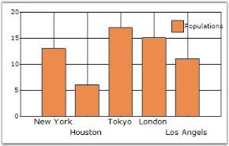

## Data Binding in Chart Through Chart Wizard

You can easily implement data binding technique at design-time, using Chart Wizard. 

The below steps lets you bind a database table with the [ChartControl](https://help.syncfusion.com/cr/windowsforms/Syncfusion.Windows.Forms.Chart.ChartControl.html).

1.Open the Chart Wizard tool, Click Series button and go to the Data Source tab as shown in the image below.

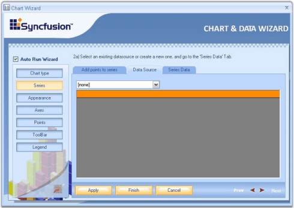

2.First step is to select the chart data source from the drop-down list. All data sources available with the form will be shown in the list. If there is no data source in the list, click the new BindingSource option from the drop-down list.
   
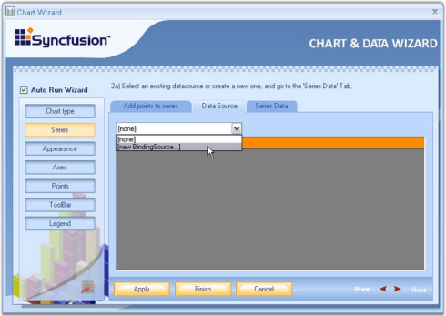

3.This opens a Data Source Configuration Wizard. Choose the Data source Type as Database, and click Next.

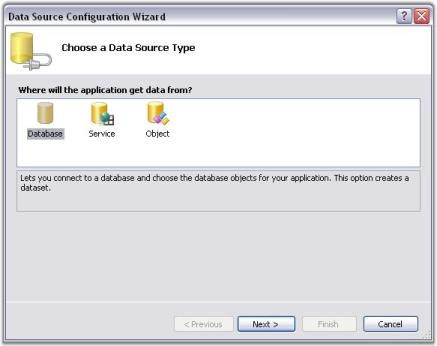

4.Then click New Connection.

5.In the Choose Data Source dialog box, select the data source as MS SQL server database or Microsoft Access database, and then click Continue button.
   
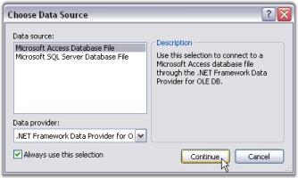

6.This opens the Add Connection dialog box. Click the Browse button and select the database file from any location. Click OK to make this connection available to the Data source Configuration Wizard.

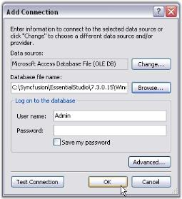

7.You will be directed to the Data Source Configuration Wizard after completing the above steps. Click Next.
   

8.Tables and Views that are available in the selected database will be listed in the Wizard. Select the appropriate table, required columns and then click Finish.
   
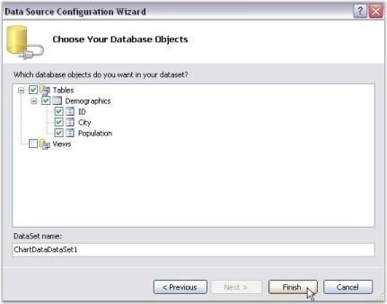
   
9.You will be directed back to the Chart Wizard now. Select the database from the Data Source list as shown in the image below.

   
10.Once the source is selected, the selected table will be visible as in the below image.

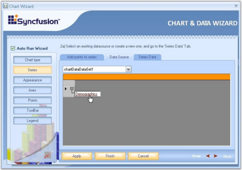

## Binding the Table Data with ChartSeries

1.Click the 'Series Data' option in the wizard to select the series to which the data is to be bound. In 'Series Data' page, select the series using the Series Data box.

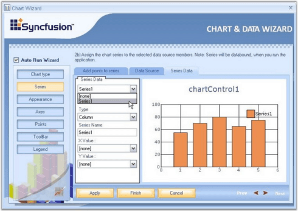

2.To assign the retrieved database column to X and Y values of the series, use X Value box and Y Value box as shown in the below screen shots.

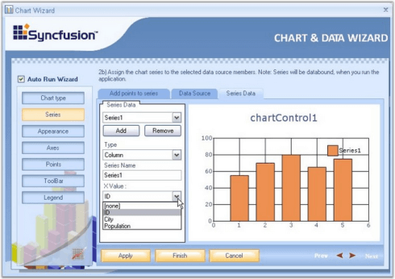

3.Click Finish to apply these data binding settings to the Chart. The below image illustrates the Chart bound with custom data.

## Binding Chart with a BindingSource

You can bind the Chart with a BindingSource in either designer or code behind.

### Bind chart with a BindingSource in designer

Follow the steps to bind the Chart with a BindingSource by using the Chart Wizard during design time.

**Step-1:**

Open the Chart Wizard in designer. Chart wizard can be opened either by right-clicking the [Chart control](https://help.syncfusion.com/cr/windowsforms/Syncfusion.Windows.Forms.Chart.ChartControl.html) and choosing the Chart Wizard option in context menu or by clicking Chart Wizard option in smart tag of the Chart control. Chart wizard appears as follows.

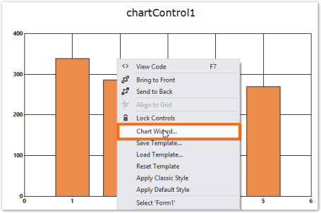

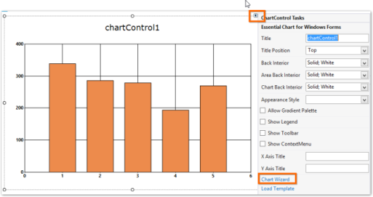

**Step-2:**

In Chart Wizard, click Series button and click Data Source tab to choose the data source.

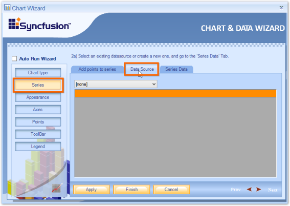

**Step-3:**

The combo box displays all the available binding sources in the Form. Choose the binding source for Chart from the binding sources available in the combo box.

N> When Form does not contain any binding source, then only [none] and [new Binding Source…] options are present in the combo box.

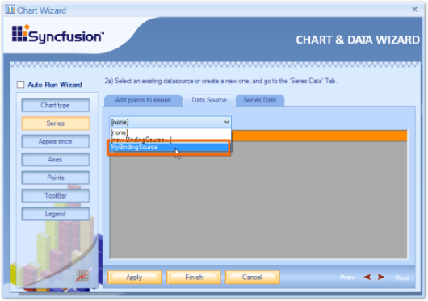

Here, MyBindingSource is a binding source present in the form.

**Step-4:**

Click Series Data tab to map the binding source fields with X and Y values of the Chart. Select a series in the combo box and other fields in this tab are enabled.

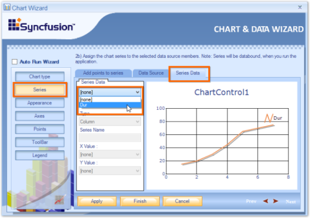

**Step-5:**

In the X Value combo box, choose the field that should be bound with the X value of series. Similarly, in Y Value combo box, choose the field that should be bound with the Y value of the series and click Finish button. 

N> You can also change series Type and Name here.

Designer displays default chart with random values but you can see the series bounded with binding source after running the application.

### Bind Chart with a binding source in code behind

Binding Chart with a BindingSource in code behind is similar to binding IEnumerable. Follow the steps to bind the BindingSource with [ChartSeries](https://help.syncfusion.com/cr/windowsforms/Syncfusion.Windows.Forms.Chart.ChartSeries.html).

**Step-1:**

Create a [ChartDataBindModel](https://help.syncfusion.com/cr/windowsforms/Syncfusion.Windows.Forms.Chart.ChartDataBindModel.html) object with BindingSource as data source.

  



//Using BindingSource as data source to the ChartDataBindModel

 ChartDataBindModel model = new ChartDataBindModel(MyBindingSource);





'Using BindingSource as data source to the ChartDataBindModel

     Dim model As New ChartDataBindModel(MyBindingSource)




**Step-2:**

Provide a field name in binding source as value to the [XName](https://help.syncfusion.com/cr/windowsforms/Syncfusion.Windows.Forms.Chart.ChartDataBindModel.html#Syncfusion_Windows_Forms_Chart_ChartDataBindModel_XName) property of the [ChartDataBindModel](https://help.syncfusion.com/cr/windowsforms/Syncfusion.Windows.Forms.Chart.ChartDataBindModel.html) object. 

 



//Using BindingSource as data source to the ChartDataBindModel

ChartDataBindModel model = new ChartDataBindModel(MyBindingSource);

//Mapping XName to a field in BindingSource object

model.XName = "Field1";





'Using BindingSource as data source to the ChartDataBindModel

      Dim model As New ChartDataBindModel(MyBindingSource)

'Mapping XName and YNames to the fields in BindingSource object

      model.XName = "Field1"




**Step-3:**

Similarly, provide a field name in binding source as value to the [YNames](https://help.syncfusion.com/cr/windowsforms/Syncfusion.Windows.Forms.Chart.ChartDataBindModel.html#Syncfusion_Windows_Forms_Chart_ChartDataBindModel_YNames) property of the [ChartDataBindModel](https://help.syncfusion.com/cr/windowsforms/Syncfusion.Windows.Forms.Chart.ChartDataBindModel.html) object. The [YNames](https://help.syncfusion.com/cr/windowsforms/Syncfusion.Windows.Forms.Chart.ChartDataBindModel.html#Syncfusion_Windows_Forms_Chart_ChartDataBindModel_YNames) property accepts an array of string as value because series types like candle, Gantt, Histogram, etc., require more than one Y Value.

As pie chart is used in this example, it is enough to use one field name for the YNames property of the [ChartDataBindModel](https://help.syncfusion.com/cr/windowsforms/Syncfusion.Windows.Forms.Chart.ChartDataBindModel.html) object.

  



//Using BindingSource as data source to the ChartDataBindModel

ChartDataBindModel model = new ChartDataBindModel(MyBindingSource);

//Mapping XName to a field in BindingSource object

model.XName = "Field1";

//Mapping YNames to a field in BindingSource object

model.YNames = new string[] { "Field2" };





'Using BindingSource as data source to the ChartDataBindModel

     Dim model As New ChartDataBindModel(MyBindingSource)

'Mapping XName and YNames to the fields in BindingSource object

      model.XName = "Field1"

'Mapping YNames to a field in BindingSource object

      model.YNames = New String() {"Field2"}




**Step-4:**

Set [ChartDataBindModel](https://help.syncfusion.com/cr/windowsforms/Syncfusion.Windows.Forms.Chart.ChartDataBindModel.html) object as value to the [ChartSeries](https://help.syncfusion.com/cr/windowsforms/Syncfusion.Windows.Forms.Chart.ChartSeries.html) object. This binds the Series with BindingSource.

  



//Using BindingSource as data source to the ChartDataBindModel

ChartDataBindModel model = new ChartDataBindModel(MyBindingSource);

//Mapping XName to a field in BindingSource object

model.XName = "Field1";

//Mapping YNames to a field in BindingSource object

model.YNames = new string[] { "Field2" };





'Using BindingSource as data source to the ChartDataBindModel

      Dim model As New ChartDataBindModel(MyBindingSource)

'Mapping XName to a field in BindingSource object

      model.XName = "Field1"

'Mapping YNames to a field in BindingSource object

      model.YNames = New String() {"Field2"}

'Bind ChartDataBindModel object with Series

      series.SeriesModel = model




The following screenshot displays a Chart bounded with binding source in code behind.

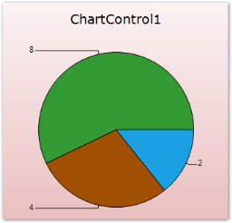

## Data Manipulation

Essential® Chart provides a series model implementation that works directly on top of grouped data. Filters, summaries and computed expressions are all supported in Essential® Chart and users can easily add custom summaries and filters and have such data displayed in the chart.

### Grouping Support

The enterprise version of Essential® Chart includes Essential® Grouping that allows Essential® Chart to implement a series model that works directly on top of grouped data. All the key advantages of Essential® Grouping carry over into the grouping support in Essential® Chart. With Essential® Chart, you are not restricted to predefined summaries or filters. You can easily add custom summaries and filters and have such data displayed in the chart.

The following image displays stock data that is grouped by symbol to calculate the total volume. The data contains discrete transaction details with symbol information, volume, and price. 

The following image displays the same data with data from transactions that occurred in the morning filtered out. Filtering is done entirely in the grouping engine and the data changes are reflected in the chart. You will never be looking at data that is a filtered and grouped copy. Instead, you are always working with live data with the grouping layer provided by the grouping engine. Any changes made in the underlying data will be immediately reflected in the chart. 

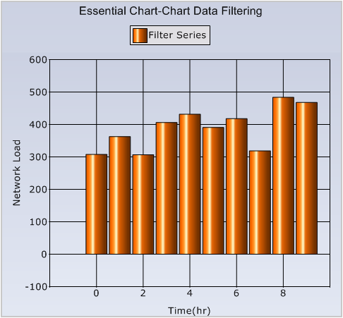

### Essential® Grid Interaction

Essential® Chart offers great interaction capabilities with Essential® Grid. You can use a common data model for the grid and chart. The grid can also serve as a data model for the chart, as shown in the following image. Selected columns are automatically mapped into the chart. All it takes few lines of code to implement a model that adapts the data in question (in this case grid cells) for display in the chart.

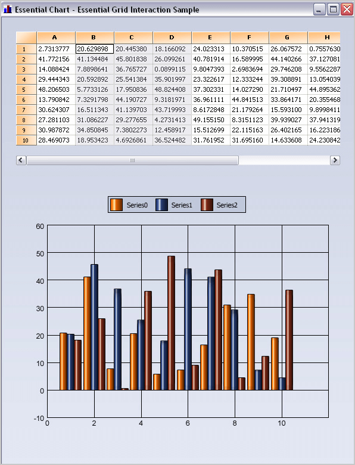

## Real time

Essential® Chart is optimized to deal with real time data. It can work with both huge and real time data and render a smooth and dynamic chart using any of the several available chart types.

Essentially, this involves updating the chart's data points list and optionally updating the chart axis ranges if the default ranges are not user-friendly.

While you can use the [ChartSeries.Points](https://help.syncfusion.com/cr/windowsforms/Syncfusion.Windows.Forms.Chart.ChartSeries.html#Syncfusion_Windows_Forms_Chart_ChartSeries_Points) to add new data points to the existing list, for best performance it's recommended to implement your own "model" to store the data points in real-time scenarios.

A sample application that illustrates real time data usage which is distributed along with the Essential® Chart installation and can be found at:

**Sample Location:** "&lt;sample installation location&gt;\Syncfusion\EssentialStudio\Version Number\Windows\Chart.Windows\Samples\Real Time\Chart Recorder"

