# Populating Data in Windows Forms Chart

## Built-in support for data-binding

Essential® Chart provides built-in support for binding `DataTable`, `DataSet`, `DataView`, or any implementation of `IListSource`, `IBindingList`, and `ITypedList` data sources. Both [ChartSeries](https://help.syncfusion.com/cr/windowsforms/Syncfusion.Windows.Forms.Chart.ChartSeries.html) data points and axis labels can be data bound. Data binding must be configured programmatically because design-time data binding is not supported.

## Data binding via custom interfaces

The chart also provides flexible support for implementing custom data models through specific interfaces. This approach allows data to be retrieved from and supplied to the chart from any type of data source.

N> One important reason to use either of these approaches is to improve performance, especially when working with a large number of data points, by reducing memory usage and increasing rendering speed.

## Binding a dataset to the chart

The following code example demonstrates how a custom `DataSet` can be bound to a [ChartSeries](https://help.syncfusion.com/cr/windowsforms/Syncfusion.Windows.Forms.Chart.ChartSeries.html) to provide data points and to a [ChartAxis](https://help.syncfusion.com/cr/windowsforms/Syncfusion.Windows.Forms.Chart.ChartAxis.html) to display axis labels. A `DataSet` can also be replaced with a `DataTable` or `DataView`.

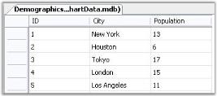





ChartDataBindModel model = null;
ChartDataBindAxisLabelModel xAxisLabelModel = null;

// A custom DataSet bound to the Demographics table.

private ChartAccessDataBind.DataSet1 dataSet11;
this.oleDbDataAdapter.Fill(this.dataSet11.Demographics);
model = new ChartDataBindModel(this.dataSet11,"Demographics");

// The column that contains the X values.

model.XName = "ID";

// The columns that contain the Y values.

model.YNames = new string[]{"Population"};
ChartSeries series = new ChartSeries ("Data Bound Series");
series.Text = series.Name;
series.SeriesModel = model;
series.Style.TextColor = Color.White;
series.Style.Font.Bold = true;
this.chartControl.Series.Add(series);

this.xAxisLabelModel = new ChartDataBindAxisLabelModel(this.dataSet11,"Demographics");

// The columns that has the label values for the corresponding X values.

this.xAxisLabelModel.LabelName = "City";
this.chartControl.PrimaryXAxis.LabelsImpl = this.xAxisLabelModel;
this.chartControl.PrimaryXAxis.ValueType = ChartValueType.Custom;





Dim model As ChartDataBindModel = Nothing
Dim xAxisLabelModel As ChartDataBindAxisLabelModel = Nothing

' A custom DataSet bound to the Demographics table

Private dataSet11 As ChartAccessDataBind.DataSet1
Me.oleDbDataAdapter.Fill(Me.dataSet11.Demographics)
model = New ChartDataBindModel(Me.dataSet11,"Demographics")

' The column that contains the X values.

model.XName = "ID"
' The columns that contain the Y values.

model.YNames = New String(){"Population"}
Dim series As New ChartSeries("Data Bound Series")
series.Text = series.Name
series.SeriesModel = model
series.Style.TextColor = Color.White
series.Style.Font.Bold = True
Me.chartControl.Series.Add(series)

Me.xAxisLabelModel = New ChartDataBindAxisLabelModel(Me.dataSet11,"Demographics")

' The columns that has the label values for the corresponding X values.

Me.xAxisLabelModel.LabelName = "City"
Me.chartControl.PrimaryXAxis.LabelsImpl = Me.xAxisLabelModel
Me.chartControl.PrimaryXAxis.ValueType = ChartValueType.Custom




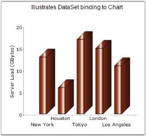

## Implementing custom data binding interfaces

The [IChartSeriesModel](https://help.syncfusion.com/cr/windowsforms/Syncfusion.Windows.Forms.Chart.IChartSeriesModel.html) interface can be implemented to provide custom data to the chart. The interface requires one property, two methods, and an optional event.

The following code example demonstrates a custom implementation of the [IChartSeriesModel](https://help.syncfusion.com/cr/windowsforms/Syncfusion.Windows.Forms.Chart.IChartSeriesModel.html) interface.





// Custom Model

public class ArrayModel : IChartSeriesModel
{
      private double[] data;

      public ArrayModel(double[] data)
      {
         this.data = data;
      }

      // Returns the number of points in this series.
      public int Count
      {
         get
         {
            return this.data.GetLength(0);
         }
      }

      // Returns the Y value of the series at the specified point index.
      public double[] GetY(int xIndex)
      {
         return new double[] { data[xIndex] };
      }

      // Returns the X value of the series at the specified point index.
      public double GetX(int xIndex)
      {
         return xIndex;
      }

      // Indicates whether a specified point index has a value which can be plotted.
      public bool GetEmpty(int index)
      {
         return false;
      }

      // Event that should be raised by any implementation of this interface if data that it holds changes. This will cause the chart to be updated accordingly. We don't raise this event in our implementation as our data will be static.  
      public event ListChangedEventHandler Changed;
}





' Custom Model

Public Class ArrayModel Implements IChartSeriesModel

   Private data() As Double

   Public  Sub New(ByVal data() As Double)
         Me.data = data

   End Sub

   ' Returns the number of points in this series.

   Public ReadOnly Property Count() As Integer

        Get
           Return Me.data.GetLength(0)
        End Get

   End Property

   ' Returns the Y value of the series at the specified point index.

   Public Double() GetY(Integer xIndex)
      Return New Double(){data(xIndex)}

   End Function

 ' Returns the X value of the series at the specified point index.

   Public Double GetX(Integer xIndex)
      Return xIndex

   End Function

   ' Indicates whether a specified point index has a value which can be plotted.

   Public Function GetEmpty(ByVal index As Integer) As Boolean
      Return False

   End Function

   ' Event that should be raised by any implementation of this interface if data that it holds changes. This will cause the chart to be updated accordingly. We don't raise this event in our implementation as our data will be static.

   Public event ListChangedEventHandler Changed

End Class




## Bind the above model to the chart series





//Creating series data and binding to the array model

ChartSeries series1 = new ChartSeries("Series 1");
series1.SeriesIndexedModelImpl = new ArrayModel(new double[]{22,24,32,12,18});
series1.Type = ChartSeriesType.Bar;
this.chartControl.Series.Add(series1);





'Creating series data and binding to the array model

Dim series1 As New ChartSeries("Series 1")
series1.SeriesIndexedModelImpl = New ArrayModel(New Double(){22,24,32,12,18})
series1.Type = ChartSeriesType.Bar
Me.chartControl.Series.Add(series1)




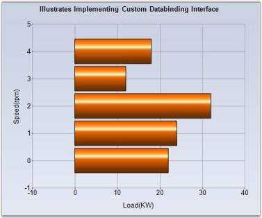

### Indexed data

If the X-values represent indexed categories, you can implement the [IChartSeriesIndexedModel](https://help.syncfusion.com/cr/windowsforms/Syncfusion.Windows.Forms.Chart.IChartSeriesIndexedModel.html) interface and bind it to the [SeriesIndexedModelImpl](https://help.syncfusion.com/cr/windowsforms/Syncfusion.Windows.Forms.Chart.ChartSeries.html#Syncfusion_Windows_Forms_Chart_ChartSeries_SeriesIndexedModelImpl) property of a [ChartSeries](https://help.syncfusion.com/cr/windowsforms/Syncfusion.Windows.Forms.Chart.ChartSeries.html). Unlike [IChartSeriesModel](https://help.syncfusion.com/cr/windowsforms/Syncfusion.Windows.Forms.Chart.IChartSeriesModel.html), this interface does not require an implementation of the [GetX](https://help.syncfusion.com/cr/windowsforms/Syncfusion.Windows.Forms.Chart.IChartSeriesModel.html#Syncfusion_Windows_Forms_Chart_IChartSeriesModel_GetX_System_Int32_) method.

## Bind IEnumerable data

The Windows Forms Chart supports binding `IEnumerable` data sources, such as `ArrayList`, for indexed and non-indexed data through the [ChartDataBindModel](https://help.syncfusion.com/cr/windowsforms/Syncfusion.Windows.Forms.Chart.ChartDataBindModel.html) class.




class PopulationData
{
    private string city;

    public string City
    {
        get { return city; }
        set { city = value; }
    }

    private double population;

    public double Population
    {
        get { return population; }
        set { population = value; }
    }

    public PopulationData(string city, double population)
    {
        this.city = city;
        this.population = population;
    }
}





Class PopulationData

    Private m_city As String

    Public Property City() As String

        Get
            Return m_city
        End Get

        Set(ByVal value As String)
            m_city = value
        End Set

    End Property

    Private m_population As Double

    Public Property Population() As Double

        Get
            Return m_population
        End Get

        Set(ByVal value As Double)
            m_population = value
        End Set

    End Property




If the data source is stored in an `ArrayList`, create a [ChartDataBindModel](https://help.syncfusion.com/cr/windowsforms/Syncfusion.Windows.Forms.Chart.ChartDataBindModel.html) by supplying the collection instance.

In this example, only the `YNames` property is mapped, so the data is treated as non-indexed and X-axis values are not displayed. To display custom X-axis labels, use the [ChartDataBindAxisLabelModel](https://help.syncfusion.com/cr/windowsforms/Syncfusion.Windows.Forms.Chart.ChartDataBindAxisLabelModel.html) class. This class binds axis labels from the same data source in a manner similar to [ChartDataBindModel](https://help.syncfusion.com/cr/windowsforms/Syncfusion.Windows.Forms.Chart.ChartDataBindModel.html).





ArrayList populations = new ArrayList();
populations.Add(new PopulationData("New York", 13));
populations.Add(new PopulationData("Houston", 6));
populations.Add(new PopulationData("Tokyo", 17));
populations.Add(new PopulationData("London", 15));
populations.Add(new PopulationData("Los Angels", 11));
ChartSeries series = new ChartSeries("Populations");
ChartDataBindModel dataSeriesModel = new ChartDataBindModel(populations);

// If ChartDataBindModel.XName is empty or null, X value is index of point.

//Here I have assigned the property name Population as Y axis name and ChartDataBindModel automatically detects the Population property and will bind the data from it.

dataSeriesModel.YNames = new string[] { "Population" };

//Binding the ChartDataBindModel with the Series. This is the best practice for binding with the large amount of data since it will reduce the performance issue of Chart rendering and manipulating data.

series.SeriesModel = dataSeriesModel;

//Since we have specified YNames only for the DataBind model, it will take the data source is non indexed model and it will ignore the X axis values. We need to assign the X axis values what we need to show on X axis by ChartDataBindAxisLabelModel separately. 

ChartDataBindAxisLabelModel dataLabelsModel = new ChartDataBindAxisLabelModel(populations);
dataLabelsModel.LabelName = "City";
chartControl.Series.Add(series);
chartControl.PrimaryXAxis.LabelsImpl = dataLabelsModel;





Dim populations As New ArrayList()
populations.Add(New PopulationData("New York", 13)) 
populations.Add(New PopulationData("Houston", 6)) 
populations.Add(New PopulationData("Tokyo", 17)) 
populations.Add(New PopulationData("London", 15)) 
populations.Add(New PopulationData("Los Angeles", 11)) 
Dim series As New ChartSeries("Populations")
Dim dataSeriesModel As New ChartDataBindModel(populations)

‘If ChartDataBindModel.XName is empty or null, X value is index of point. 

'Here I have assigned the property name Population as Y axis name and ChartDataBindModel automatically detects the Population property and will bind the data from it. 

dataSeriesModel.YNames = New String() {"Population"} 

'Binding the ChartDataBindModel with the Series. This is the best practice for binding with the large amount of data since it will reduce the performance issue of Chart rendering and manipulating data. 

series.SeriesModel = dataSeriesModel 

'Since we have specified YNames only for the DataBind model, it will take the data source is non indexed model and it will ignore the X axis values. We need to assign the X axis values what we need to show on X axis by ChartDataBindAxisLabelModel separately. 

Dim dataLabelsModel As New ChartDataBindAxisLabelModel(populations)
dataLabelsModel.LabelName = "City" 
chartControl.Series.Add(series) 
chartControl.PrimaryXAxis.LabelsImpl = dataLabelsModel 




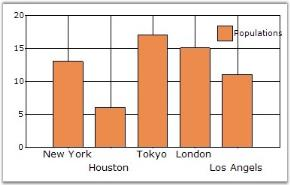

## Data binding in chart through chart wizard

The Chart Wizard provides design-time support for configuring chart data binding.

To bind a database table to the [ChartControl](https://help.syncfusion.com/cr/windowsforms/Syncfusion.Windows.Forms.Chart.ChartControl.html), follow these steps:

1. Open the **Chart Wizard**, select **Series**, and then navigate to the **Data Source** tab as shown image.

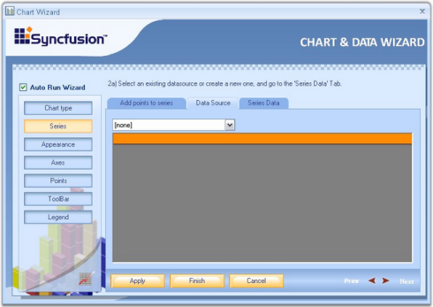

2. Select a chart data source from the drop-down list. All data sources available in the form are displayed. If no data source is available, select **New BindingSource**.
   
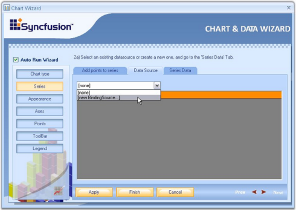

3. In the **Data Source Configuration Wizard**, select **Database** as the data source type, and then click **Next**.

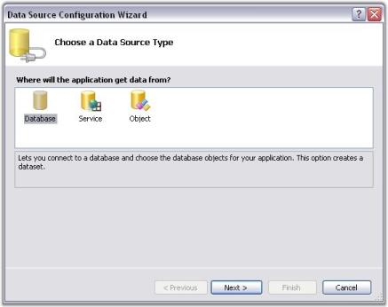

4. Then click **New Connection**.

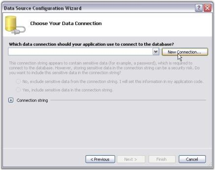

5. In the **Choose Data Source** dialog box, select either **Microsoft SQL Server** or **Microsoft Access**, and then click **Continue** button.
   
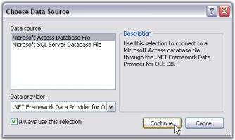

6. In the **Add Connection** dialog box, browse to the database file, and then click **OK**.

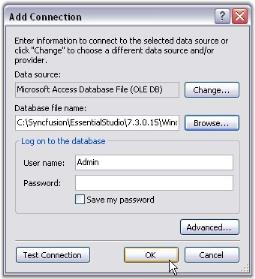

7. Return to the **Data Source Configuration Wizard** and click **Next**.
   
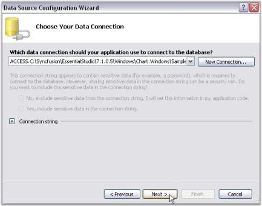

8. Select the required table and columns from the available tables and views, and then click **Finish**.

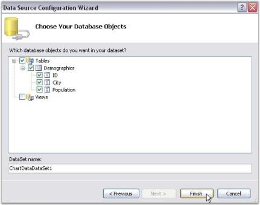
   
9. Return to the **Chart Wizard**, and then select the database from the **Data Source** list, as shown in the following image.

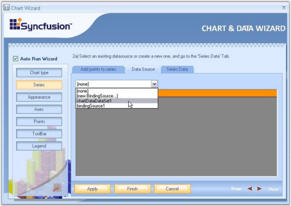
   
10. The selected table is displayed and is ready to be mapped to the chart series.

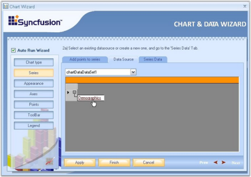

## Binding the table data with chart series

1. In the Chart Wizard, click the **Series Data** option. Then, select the series from the **Series Data** box to configure the data binding for that series.

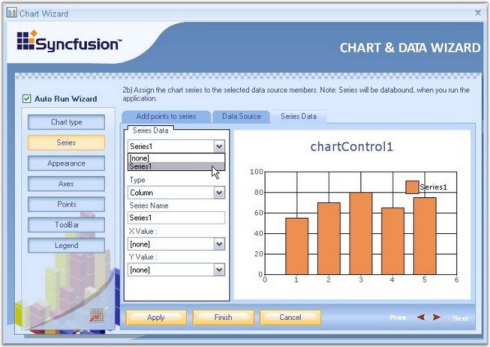

2.To map database columns to the X and Y values of the selected series, use the **X Value** and **Y Value** value boxs, as shown in the following screenshots.

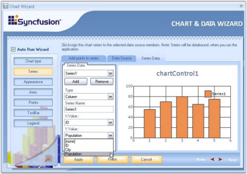

3. Click **Finish** to apply the data-binding settings to the chart.

The following image illustrates a chart bound to custom data.

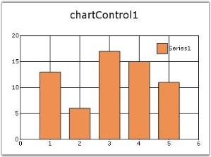

## Binding chart with a binding source

You can bind the Chart with a BindingSource in either designer or code behind.

### Bind chart with a binding source in designer

Follow the steps to bind the Chart with a BindingSource by using the Chart Wizard during design time.

**Step-1:** Open the **Chart Wizard**  in designer. Chart wizard can be opened either by right-clicking the [ChartControl](https://help.syncfusion.com/cr/windowsforms/Syncfusion.Windows.Forms.Chart.ChartControl.html) and choosing the Chart Wizard option in context menu or by clicking **Chart Wizard** option in smart tag of the Chart control. Chart wizard appears as follows.

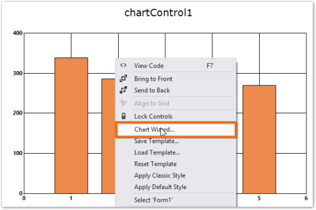

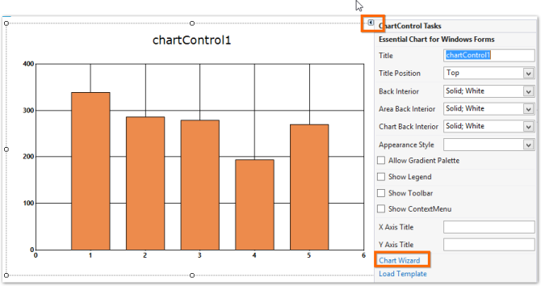

**Step-2:** In the **Chart Wizard**, click the **Series** button and open the **Data Source** tab.
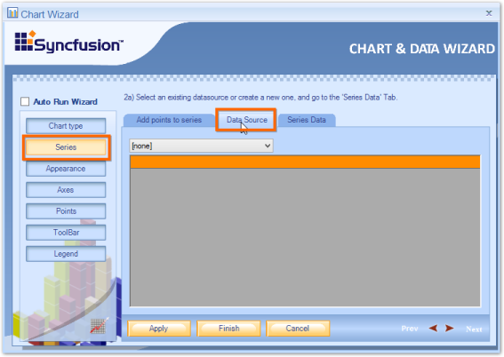

**Step-3:** The combo box displays all the available binding sources in the Form. Choose the binding source for Chart from the binding sources available in the combo box.

N> If the form does not contain a `BindingSource`, only the **[None]** and **[New BindingSource...]** options are available in the list.

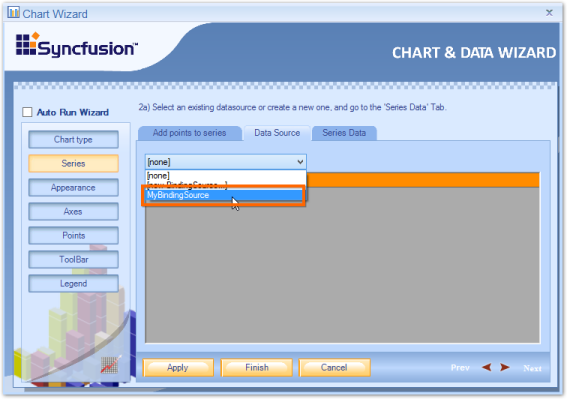

Here, MyBindingSource is a binding source present in the form.

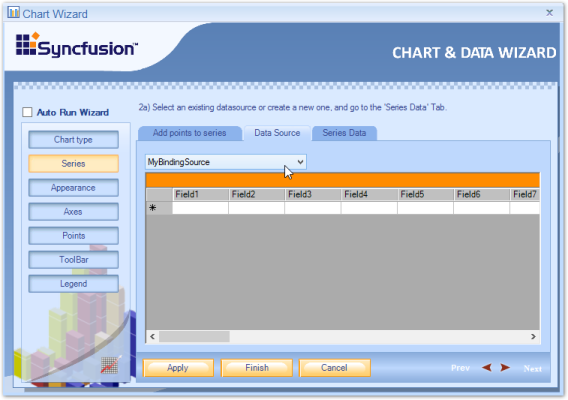

**Step-4:**

Click **Series Data** tab to map the binding source fields with X and Y values of the Chart. Select a series in the combo box and other fields in this tab are enabled.

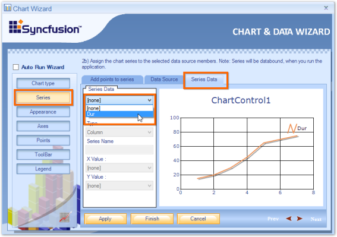

**Step-5:**

In the X Value combo box, choose the field that should be bound with the X value of series. Similarly, in Y Value combo box, choose the field that should be bound with the Y value of the series and click **Finish** button. 

N> You can also change series Type and Name here.

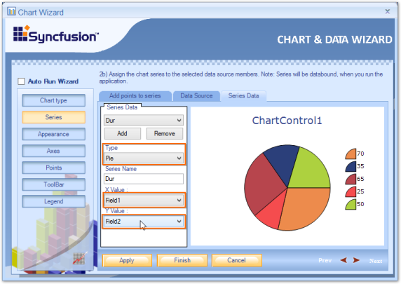

Designer displays default chart with random values but you can see the series bounded with binding source after running the application.

### Bind chart with a binding source in code behind

### Bind chart with a binding source in code

Binding a chart to a `BindingSource` in code is similar to binding an `IEnumerable` data source. The following steps demonstrate how to bind a `BindingSource` to a [ChartSeries](https://help.syncfusion.com/cr/windowsforms/Syncfusion.Windows.Forms.Chart.ChartSeries.html).

**Step-1:**

Create a [ChartDataBindModel](https://help.syncfusion.com/cr/windowsforms/Syncfusion.Windows.Forms.Chart.ChartDataBindModel.html) object with `BindingSource` as data source.





//Using BindingSource as data source to the ChartDataBindModel
 ChartDataBindModel model = new ChartDataBindModel(MyBindingSource);





'Using BindingSource as data source to the ChartDataBindModel
     Dim model As New ChartDataBindModel(MyBindingSource)




**Step-2:**

Provide a field name in binding source as value to the [XName](https://help.syncfusion.com/cr/windowsforms/Syncfusion.Windows.Forms.Chart.ChartDataBindModel.html#Syncfusion_Windows_Forms_Chart_ChartDataBindModel_XName) property of the [ChartDataBindModel](https://help.syncfusion.com/cr/windowsforms/Syncfusion.Windows.Forms.Chart.ChartDataBindModel.html) object. 





//Using BindingSource as data source to the ChartDataBindModel
ChartDataBindModel model = new ChartDataBindModel(MyBindingSource);
//Mapping XName to a field in BindingSource object

model.XName = "Field1";





'Using BindingSource as data source to the ChartDataBindModel
      Dim model As New ChartDataBindModel(MyBindingSource)
'Mapping XName and YNames to the fields in BindingSource object

      model.XName = "Field1"




**Step-3:**

Similarly, provide a field name in binding source as value to the [YNames](https://help.syncfusion.com/cr/windowsforms/Syncfusion.Windows.Forms.Chart.ChartDataBindModel.html#Syncfusion_Windows_Forms_Chart_ChartDataBindModel_YNames) property of the [ChartDataBindModel](https://help.syncfusion.com/cr/windowsforms/Syncfusion.Windows.Forms.Chart.ChartDataBindModel.html) object. The [YNames](https://help.syncfusion.com/cr/windowsforms/Syncfusion.Windows.Forms.Chart.ChartDataBindModel.html#Syncfusion_Windows_Forms_Chart_ChartDataBindModel_YNames) property accepts an array of string as value because series types like candle, Gantt, Histogram, etc., require more than one Y Value.

As this example uses a pie chart, a single field name is sufficient for the YNames property of the [ChartDataBindModel](https://help.syncfusion.com/cr/windowsforms/Syncfusion.Windows.Forms.Chart.ChartDataBindModel.html) object.





//Using BindingSource as data source to the ChartDataBindModel
ChartDataBindModel model = new ChartDataBindModel(MyBindingSource);
//Mapping XName to a field in BindingSource object
model.XName = "Field1";

//Mapping YNames to a field in BindingSource object

model.YNames = new string[] { "Field2" };





'Using BindingSource as data source to the ChartDataBindModel
     Dim model As New ChartDataBindModel(MyBindingSource)
'Mapping XName and YNames to the fields in BindingSource object
      model.XName = "Field1"

'Mapping YNames to a field in BindingSource object
      model.YNames = New String() {"Field2"}




**Step-4:**

Set [ChartDataBindModel](https://help.syncfusion.com/cr/windowsforms/Syncfusion.Windows.Forms.Chart.ChartDataBindModel.html) object as value to the [ChartSeries](https://help.syncfusion.com/cr/windowsforms/Syncfusion.Windows.Forms.Chart.ChartSeries.html) object. This binds the Series with BindingSource.





//Using BindingSource as data source to the ChartDataBindModel
ChartDataBindModel model = new ChartDataBindModel(MyBindingSource);
//Mapping XName to a field in BindingSource object
model.XName = "Field1";

//Mapping YNames to a field in BindingSource object
model.YNames = new string[] { "Field2" };





'Using BindingSource as data source to the ChartDataBindModel
      Dim model As New ChartDataBindModel(MyBindingSource)

'Mapping XName to a field in BindingSource object
      model.XName = "Field1"

'Mapping YNames to a field in BindingSource object
      model.YNames = New String() {"Field2"}

'Bind ChartDataBindModel object with Series
      series.SeriesModel = model




The following screenshot displays a Chart bounded with binding source in code behind.

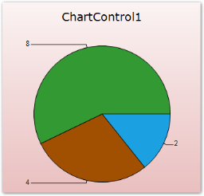

## Data manipulation

Essential® Chart provides a series model implementation that works directly with grouped data. It supports filters, summaries, and computed expressions, and also allows custom summaries and filters to be displayed in the chart.

### Grouping support

The Enterprise Edition of Essential® Chart includes grouping support that works directly with grouped data. It supports built-in and custom filters and summaries, allowing grouped data to be visualized in the chart.

The following images demonstrate stock transaction data grouped by symbol to calculate total volume and filtered to display specific transaction records. The chart works directly with live grouped data rather than a filtered or grouped copy, and any changes made to the underlying data are automatically reflected in the chart.

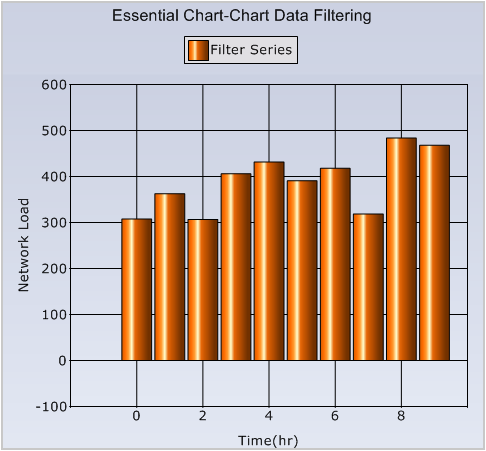

### Essential® grid interaction

Essential® Chart provides integration with Essential® Grid through a shared data model. The grid can also serve as a data source for the chart, allowing selected grid columns to be mapped automatically to chart series. The following image illustrates a chart created from grid data.

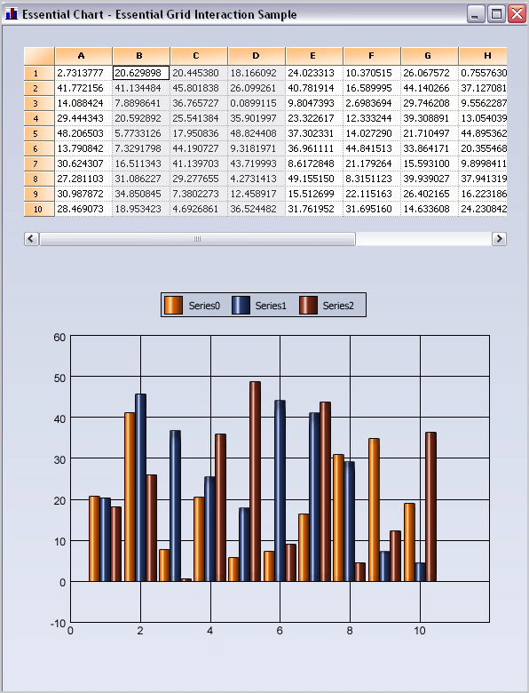

## Real time

Essential® Chart is optimized for visualizing large volumes of real-time data and supports smooth updates across the available chart types.

Real-time updates can be achieved by updating the chart data points and, when required, adjusting the chart axis ranges. Although new data points can be added through the [ChartSeries.Points](https://help.syncfusion.com/cr/windowsforms/Syncfusion.Windows.Forms.Chart.ChartSeries.html#Syncfusion_Windows_Forms_Chart_ChartSeries_Points) collection, using a custom data model is recommended for better performance in real-time scenarios.

N> For a complete real-time chart example, refer to the **Chart Recorder** sample included with the Essential® Chart installation.

## See also
- [How to create a real-time chart in WF](https://support.syncfusion.com/kb/article/8266/how-to-create-a-real-time-chart-in-wf)