# Populating Data in Windows Forms Chart

## Built-in support for data-binding

Essential® Chart provides built-in support for binding `DataTable`, `DataSet`, `DataView`, or any implementation of `IListSource`, `IBindingList`, and `ITypedList` data sources. Both [ChartSeries](https://help.syncfusion.com/cr/windowsforms/Syncfusion.Windows.Forms.Chart.ChartSeries.html) data points and axis labels can be data bound. Data binding must be configured programmatically because design-time data binding is not supported.

## Data binding via custom interfaces

The chart also provides flexible support for implementing custom data models through specific interfaces. This approach allows data to be retrieved from and supplied to the chart from any type of data source.

N> One important reason to use either of these approaches is to improve performance, especially when working with a large number of data points, by reducing memory usage and increasing rendering speed.

## Binding a dataset to the chart

The following code example demonstrates how to bind a custom `DataSet` to a [ChartSeries](https://help.syncfusion.com/cr/windowsforms/Syncfusion.Windows.Forms.Chart.ChartSeries.html) using the `ChartDataBindModel` class. The `ID` column is used for the X values, the `Population` column is used for the Y values, and the `City` column is displayed as custom X-axis labels through the `ChartDataBindAxisLabelModel` class. A `DataSet` can also be replaced with a `DataTable` or `DataView`.

The following image illustrates the DataSet structure used for chart binding.




//Custom Dataset bound to the Demographics table
DataSet dataSet1 = new DataSet("DataSet1");
DataTable demographicsTable = new DataTable("Demographics");
demographicsTable.Columns.Add("ID", typeof(int));
demographicsTable.Columns.Add("City", typeof(string));
demographicsTable.Columns.Add("Population", typeof(int));
demographicsTable.Rows.Add(1, "Chennai", 8000000);
demographicsTable.Rows.Add(2, "Mumbai", 12400000);
demographicsTable.Rows.Add(3, "Delhi", 11000000);
demographicsTable.Rows.Add(4, "Bangalore", 8500000);
demographicsTable.Rows.Add(5, "Hyderabad", 6800000);
demographicsTable.Rows.Add(6, "Kolkata", 4500000);
dataSet1.Tables.Add(demographicsTable);
ChartDataBindModel model = new ChartDataBindModel(dataSet1, "Demographics");

//Column that contains the X values
model.XName = "ID";

//Column that contains the Y values
model.YNames = new string[] { "Population" };

//Configure the chart series
ChartSeries series = new ChartSeries("Data Bound Series");
series.Type = ChartSeriesType.Line;
series.SeriesModel = model;
this.chartControl.Series.Add(series);

//The columns that has the label values corresponding X values
ChartDataBindAxisLabelModel xAxisLabelModel = new ChartDataBindAxisLabelModel(dataSet1, "Demographics");
xAxisLabelModel.LabelName = "City";
this.chartControl.PrimaryXAxis.LabelsImpl = xAxisLabelModel;
this.chartControl.PrimaryXAxis.ValueType = ChartValueType.Custom;





'Custom Dataset bound to Demographics tables
Dim dataset As New DataSet("Dataset1")
Dim demographicstable As New DataTable("Demographics")
demographicstable.Columns.Add("ID", GetType(Integer))
demographicstable.Columns.Add("City", GetType(String))
demographicstable.Columns.Add("Population", GetType(Integer))
demographicstable.Rows.Add(1, "Chennai", 8000000)
demographicstable.Rows.Add(2, "Mumbai", 12400000)
demographicstable.Rows.Add(3, "Delhi", 11000000)
demographicstable.Rows.Add(4, "Bangalore", 8500000)
demographicstable.Rows.Add(5, "Hyderabad", 6800000)
demographicstable.Rows.Add(6, "Kolkata", 4500000)
dataset.Tables.Add(demographicstable)
Dim model As New ChartDataBindModel(dataset, "Demographics")

'Column that contains the X values
model.XName = "ID"

'Column that contains the Y values
model.YNames = New String() {"Population"}

'Configure the chart series
Dim series As ChartSeries = New ChartSeries("Data Bound Series")
series.Type = ChartSeriesType.Line
series.SeriesModel = model
chartControl.Series.Add(series)

'The columns that has the label values corresponding X values
Dim xaxislabelmodel = New ChartDataBindAxisLabelModel(dataset, "Demographics")
xaxislabelmodel.LabelName = "City"
chartControl.PrimaryXAxis.LabelsImpl = xaxislabelmodel
chartControl.PrimaryXAxis.ValueType = ChartValueType.Custom




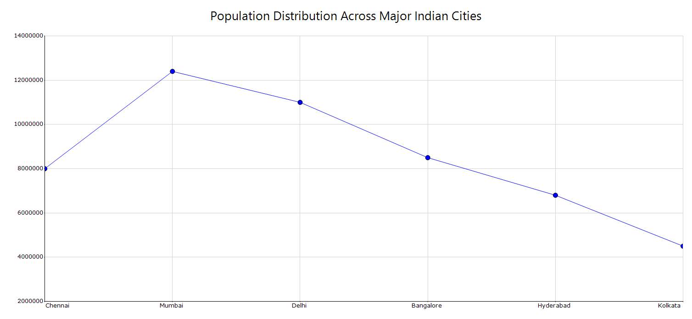{height:"350", width="350"}

## Implementing custom data binding interfaces

The [IChartSeriesModel](https://help.syncfusion.com/cr/windowsforms/Syncfusion.Windows.Forms.Chart.IChartSeriesModel.html) interface can be implemented to provide custom data to the chart. The interface requires one property, two methods, and an optional event.

The following code example demonstrates a custom implementation of the [IChartSeriesModel](https://help.syncfusion.com/cr/windowsforms/Syncfusion.Windows.Forms.Chart.IChartSeriesModel.html) interface.





// Custom Model

public class ArrayModel : IChartSeriesModel
{
      private double[] data;

      public ArrayModel(double[] data)
      {
         this.data = data;
      }

      // Returns the number of points in this series.
      public int Count
      {
         get
         {
            return this.data.GetLength(0);
         }
      }

      // Returns the Y value of the series at the specified point index.
      public double[] GetY(int xIndex)
      {
         return new double[] { data[xIndex] };
      }

      // Returns the X value of the series at the specified point index.
      public double GetX(int xIndex)
      {
         return xIndex;
      }

      // Indicates whether a specified point index has a value which can be plotted.
      public bool GetEmpty(int index)
      {
         return false;
      }

      // Event that should be raised by any implementation of this interface if data that it holds changes. This will cause the chart to be updated accordingly. We don't raise this event in our implementation as our data will be static.  
      public event ListChangedEventHandler Changed;
}





Public Class ArrayModel
    Implements IChartSeriesModel

    Private data() As Double

    Public Sub New(ByVal data() As Double)
        Me.data = data
    End Sub

    ' Returns the number of points in this series.
    Public ReadOnly Property Count() As Integer _
        Implements IChartSeriesModel.Count
        Get
            Return Me.data.Length
        End Get
    End Property

    'Public Function GetY(ByVal xIndex As Integer) As Double() _
    '    Implements IChartSeriesModel.GetY
    Public Function GetY(ByVal xIndex As Integer) As Double() _
        Implements IChartSeriesModel.GetY
        Return New Double() {data(xIndex)}
    End Function

    Public Function GetX(ByVal xIndex As Integer) As Double _
        Implements IChartSeriesModel.GetX
        Return xIndex
    End Function

    Public Function GetEmpty(ByVal index As Integer) As Boolean _
        Implements IChartSeriesModel.GetEmpty
        Return False
    End Function

    Public Event Changed As ListChangedEventHandler _
        Implements IChartSeriesModel.Changed

End Class




## Bind the above model to the chart series





//Creating series data and binding to the array model
ChartSeries series = new ChartSeries("Series");
series.SeriesModel = new ChartLegendSample.ArrayModel(new double[] { 22, 24, 32, 12, 18 });
series.Type = ChartSeriesType.Bar;
this.chartControl.Series.Add(series);





'Creating series data and binding to the array model
Dim series As New ChartSeries("Series")
series.SeriesModel = New ArrayModel(New Double() {22, 24, 32, 12, 18})
series.Type = ChartSeriesType.Bar
Me.chartControl.Series.Add(series)




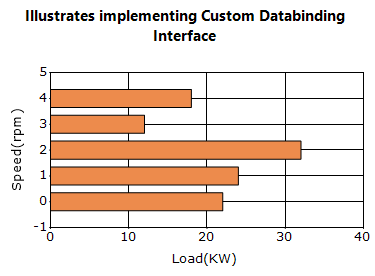

### Indexed data

If the X-values represent indexed categories, you can implement the [IChartSeriesIndexedModel](https://help.syncfusion.com/cr/windowsforms/Syncfusion.Windows.Forms.Chart.IChartSeriesIndexedModel.html) interface and bind it to the [SeriesIndexedModelImpl](https://help.syncfusion.com/cr/windowsforms/Syncfusion.Windows.Forms.Chart.ChartSeries.html#Syncfusion_Windows_Forms_Chart_ChartSeries_SeriesIndexedModelImpl) property of a [ChartSeries](https://help.syncfusion.com/cr/windowsforms/Syncfusion.Windows.Forms.Chart.ChartSeries.html). Unlike [IChartSeriesModel](https://help.syncfusion.com/cr/windowsforms/Syncfusion.Windows.Forms.Chart.IChartSeriesModel.html), this interface does not require an implementation of the [GetX](https://help.syncfusion.com/cr/windowsforms/Syncfusion.Windows.Forms.Chart.IChartSeriesModel.html#Syncfusion_Windows_Forms_Chart_IChartSeriesModel_GetX_System_Int32_) method.

## Bind IEnumerable data

The Windows Forms Chart supports binding `IEnumerable` data sources, such as `ArrayList`, for indexed and non-indexed data through the [ChartDataBindModel](https://help.syncfusion.com/cr/windowsforms/Syncfusion.Windows.Forms.Chart.ChartDataBindModel.html) class.




class PopulationData
{
    private string city;

    public string City
    {
        get { return city; }
        set { city = value; }
    }

    private double population;

    public double Population
    {
        get { return population; }
        set { population = value; }
    }

    public PopulationData(string city, double population)
    {
        this.city = city;
        this.population = population;
    }
}





Class PopulationData

    Private m_city As String

    Public Property City() As String

        Get
            Return m_city
        End Get

        Set(ByVal value As String)
            m_city = value
        End Set

    End Property

    Private m_population As Double

    Public Property Population() As Double

        Get
            Return m_population
        End Get

        Set(ByVal value As Double)
            m_population = value
        End Set

    End Property

    Public Sub New(ByVal city As String, ByVal population As Double)
        Me.City = city
        Me.Population = population
    End Sub

End Class




If the data source is stored in an `ArrayList`, create a [ChartDataBindModel](https://help.syncfusion.com/cr/windowsforms/Syncfusion.Windows.Forms.Chart.ChartDataBindModel.html) by supplying the collection instance.

In this example, only the `YNames` property is mapped, so the data is treated as non-indexed and X-axis values are not displayed. To display custom X-axis labels, use the [ChartDataBindAxisLabelModel](https://help.syncfusion.com/cr/windowsforms/Syncfusion.Windows.Forms.Chart.ChartDataBindAxisLabelModel.html) class. This class binds axis labels from the same data source in a manner similar to [ChartDataBindModel](https://help.syncfusion.com/cr/windowsforms/Syncfusion.Windows.Forms.Chart.ChartDataBindModel.html).





ArrayList populations = new ArrayList();
populations.Add(new PopulationData("New York", 13));
populations.Add(new PopulationData("Houston", 6));
populations.Add(new PopulationData("Tokyo", 17));
populations.Add(new PopulationData("London", 15));
populations.Add(new PopulationData("Los Angels", 11));
ChartSeries series = new ChartSeries("Populations");
ChartDataBindModel dataSeriesModel = new ChartDataBindModel(populations);

// If ChartDataBindModel.XName is empty or null, X value is index of point.
//Here I have assigned the property name Population as Y axis name and ChartDataBindModel automatically detects the Population property and will bind the data from it.

dataSeriesModel.YNames = new string[] { "Population" };

//Binding the ChartDataBindModel with the Series. This is the best practice for binding with the large amount of data since it will reduce the performance issue of Chart rendering and manipulating data.
series.SeriesModel = dataSeriesModel;

//Since we have specified YNames only for the DataBind model, it will take the data source is non indexed model and it will ignore the X axis values. We need to assign the X axis values what we need to show on X axis by ChartDataBindAxisLabelModel separately. 

ChartDataBindAxisLabelModel dataLabelsModel = new ChartDataBindAxisLabelModel(populations);
dataLabelsModel.LabelName = "City";
chartControl.Series.Add(series);
chartControl.PrimaryXAxis.ValueType = ChartValueType.Custom;
chartControl.PrimaryXAxis.LabelsImpl = dataLabelsModel;





Dim populations As New ArrayList()
populations.Add(New PopulationData("New York", 13))
populations.Add(New PopulationData("Houston", 6))
populations.Add(New PopulationData("Tokyo", 17))
populations.Add(New PopulationData("London", 15))
populations.Add(New PopulationData("Los Angeles", 11))
Dim series As New ChartSeries("Populations")
Dim dataSeriesModel As New ChartDataBindModel(populations)

'If ChartDataBindModel.XName is empty or null, X value is index of point. 
'Here I have assigned the property name Population as Y axis name and ChartDataBindModel automatically detects the Population property and will bind the data from it. 
dataSeriesModel.YNames = New String() {"Population"}
'Binding the ChartDataBindModel with the Series. This is the best practice for binding with the large amount of data since it will reduce the performance issue of Chart rendering and manipulating data. 

series.SeriesModel = dataSeriesModel
'Since we have specified YNames only for the DataBind model, it will take the data source is non indexed model and it will ignore the X axis values. We need to assign the X axis values what we need to show on X axis by ChartDataBindAxisLabelModel separately. 

Dim dataLabelsModel As New ChartDataBindAxisLabelModel(populations)
dataLabelsModel.LabelName = "City"
chartControl.Series.Add(series)
chartControl.PrimaryXAxis.ValueType = ChartValueType.Custom
chartControl.PrimaryXAxis.LabelsImpl = dataLabelsModel




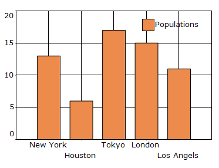

## Data binding in chart through chart wizard

The Chart Wizard allows you to bind a data source to the Windows Forms Chart control and configure the chart at design time.

Follow these steps to add the Chart control and prepare the design-time data schema:

**Step-1:** Open the Windows Forms project in Visual Studio.

**Step-2:** Open the **Toolbox**, expand **Syncfusion Windows Forms**, and drag the **ChartControl** onto the form.

**Step-3:** Select the Chart control, click the **Smart Tag (►)**, and choose **Chart Wizard**.

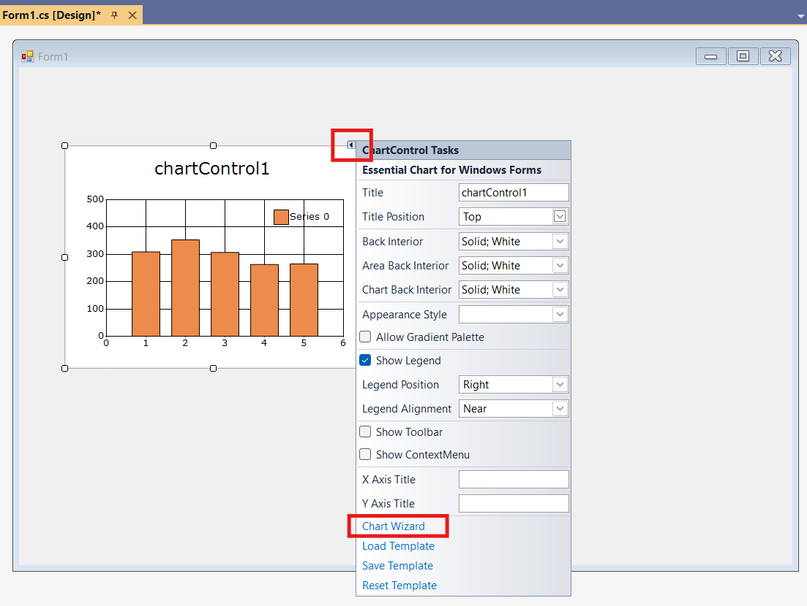{height:"350", width:"350"}

**Step-4:** Open the **Toolbox** and drag a **BindingSource** component onto the form. The component appears in the component tray as `bindingSource1`.

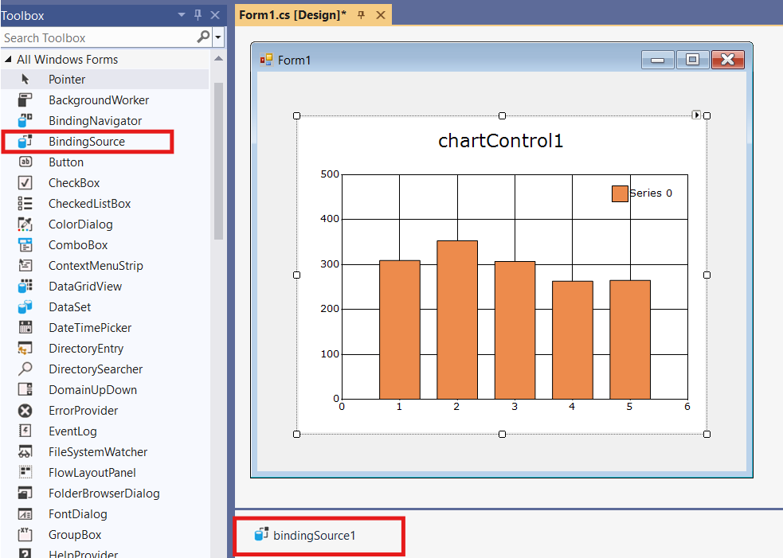{height:"350", width="350"}

**Step-5:** Open the **Project** menu and select **Add New Item**. In the **Add New Item** dialog, select **DataSet**, name it `DataSet1.xsd`, and click **Add**. The DataSet provides the design-time schema required by the Chart Wizard to identify the X and Y fields.

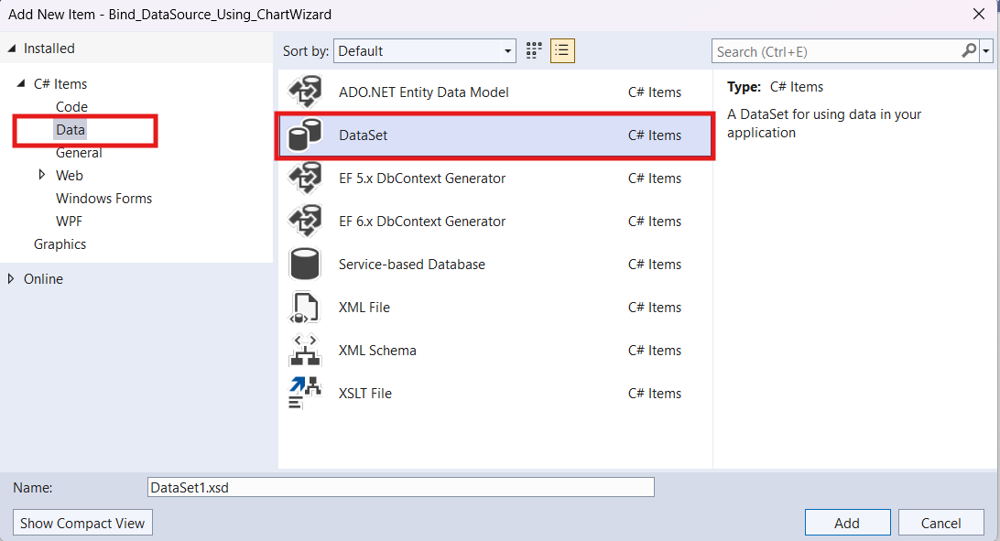{height:"350", width="350"}

**Step-6:** Open `DataSet1.xsd` in the DataSet Designer. Right-click the designer surface, choose **Add**, and select **DataTable**.

**Step-7:** Right-click the DataTable, choose **Add**, and select **Column**. Create `Month` as a `string` column and `Sales` as an `int` column.

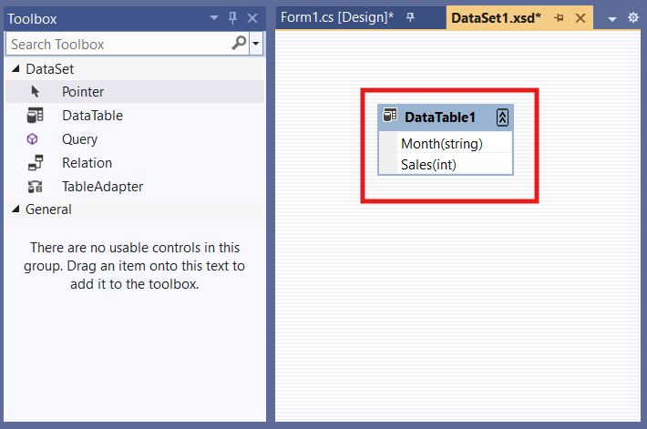{height:"350", width="350"}

N> The Chart Wizard is available only in **.NET Framework** projects and is not supported in **.NET Core** WinForms applications.

## Binding the table data with chartseries

After creating the DataTable, connect it to the BindingSource and select the data source in the Chart Wizard.

**Step-1:** Right-click `bindingSource1` in the component tray and select **Properties**.

**Step-2:** In the **Properties** window, open the **DataSource** property, expand **Form1 List Instances**, and select `dataSet1`.

**Step-3:** Open the **DataMember** property and select `DataTable1`. The BindingSource now exposes the `Month` and `Sales` fields to the Chart Wizard.
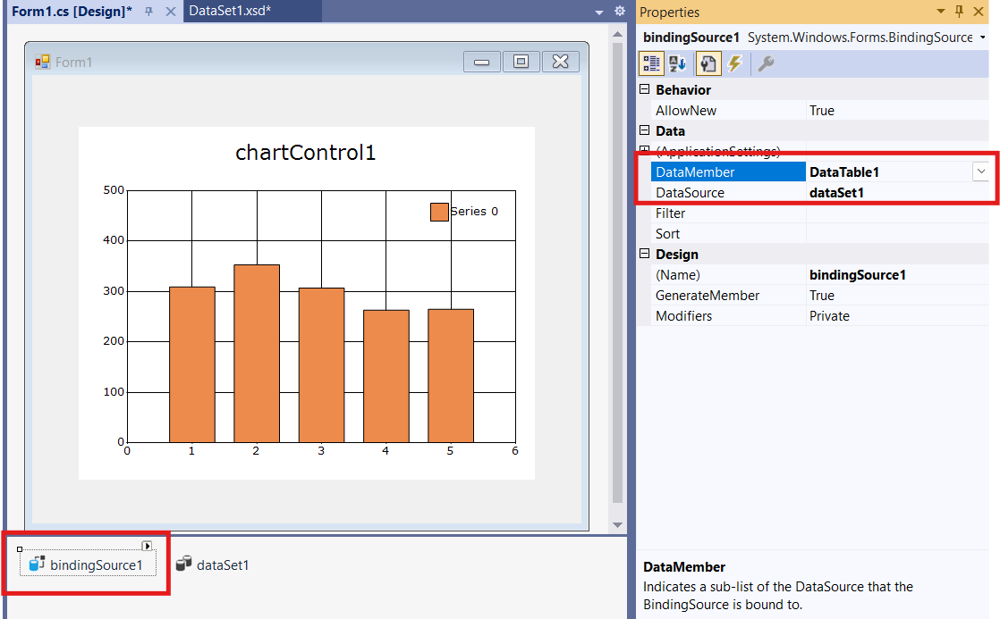{height:"350", width="350"}

**Step-4:** Select `chartControl1`, click the **Smart Tag (►)**, and choose **Chart Wizard**.

**Step-5:** In the Chart Wizard, select **Series**, and then open the **Data Source** tab.

**Step-6:** Select `bindingSource1` from the **Data Source** list. The data grid displays the `Month` and `Sales` fields exposed by the BindingSource.

N> If the form does not contain a BindingSource, only the **[None]** and **[New BindingSource...]** options are displayed in the Chart Wizard's Data Source list.

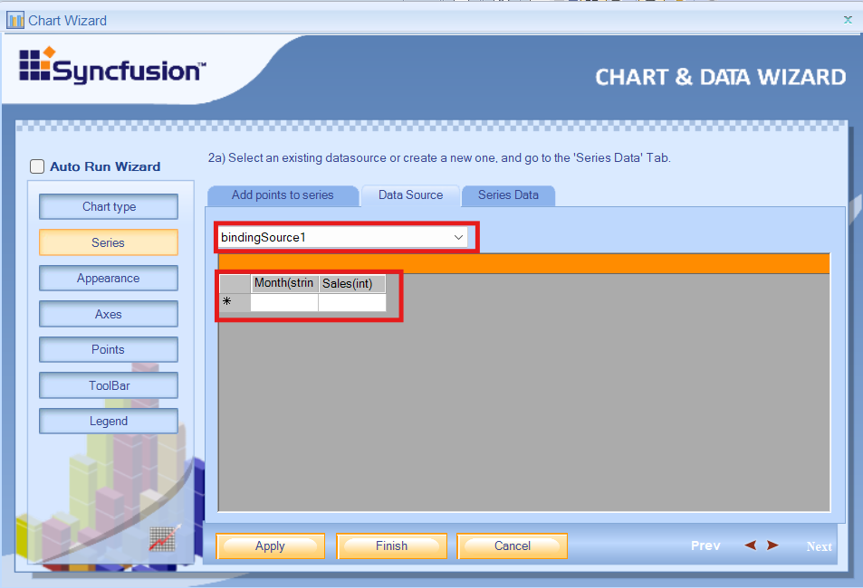{height:"350", width="350"}

## Binding chart with a binding source

You can bind the Chart with a BindingSource in either designer or code behind.

### Bind chart with a binding source in designer

After selecting the BindingSource as the chart data source, map its fields to the required chart series.

**Step-1:** In the Chart Wizard, open the **Series Data** tab.

**Step-2:** Select the required series, such as `Default0`.

**Step-3:** Select `Month` from the **X Value** list and `Sales` from the **Y Value** list.

**Step-4:** Select the required chart type, such as Line or Column. You can also modify the series name in this tab.

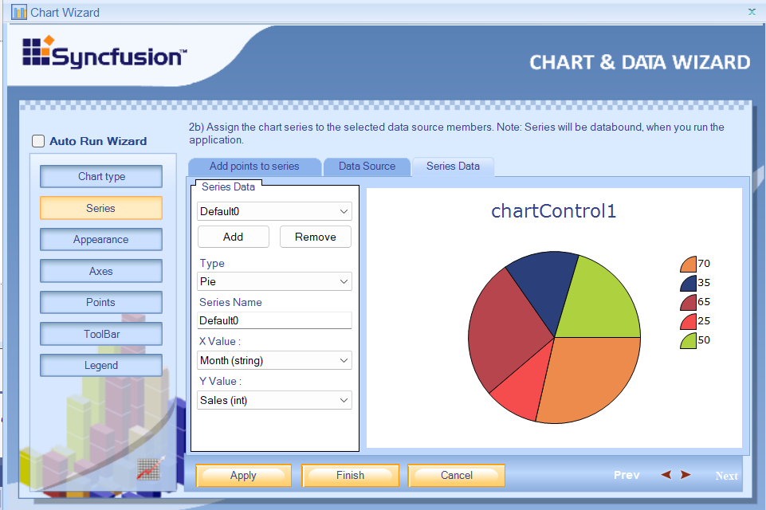{height:"350", width="350"}

***Step-5:** To add data points through the Chart Wizard, open the **Add points to series** tab under **Series**.

**Step-6:** Select `Default0` from the **Add Points** list, and then click **Edit points** to open the ChartPoint Collection Editor.

**Step-7:** In the ChartPoint Collection Editor, click **Add** and select the newly added point from the **Members** list.

**Step-8:** Specify the required values:

- Set **X** to the required X value.
- Set **YValues** to the required Y value.

**Step-9:** Repeat these steps to add the remaining data points, and then click **OK** to close the editor.

**Step-10:** Return to the Chart Wizard, click **Apply**, and then click **Finish**.

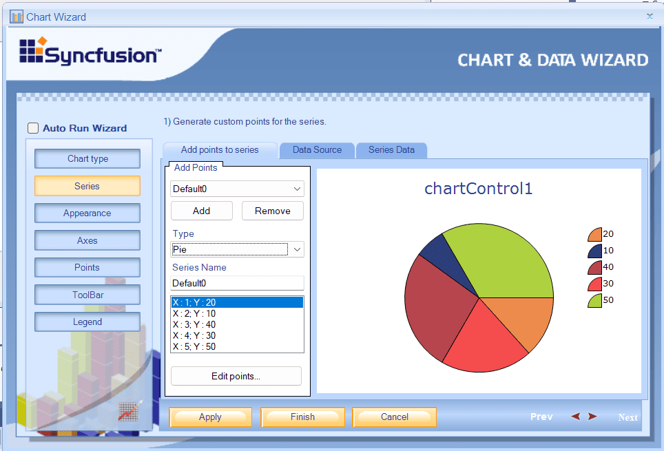{height:"350", width="350"}

The following image illustrates the pie chart configured in the Chart Wizard at design time.

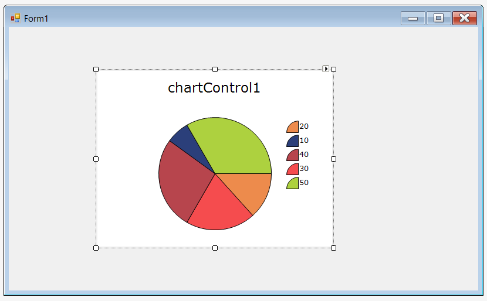{height:"350", width="350"}

The following image illustrates the pie chart displayed when the application runs.

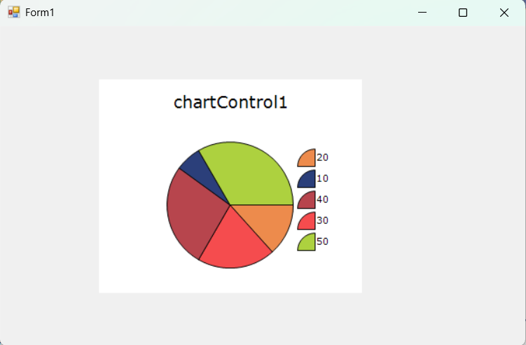{height:"350", width="350"}

For more details, refer to [How to bind a data source to a WinForms Chart using the Chart Wizard](https://support.syncfusion.com/kb/article/6867/how-to-bind-a-data-source-to-a-winforms-chart-using-the-chart-wizard).

### Bind chart with a binding source in code behind

Binding a chart to a `BindingSource` in code is similar to binding an `IEnumerable` data source. The following steps demonstrate how to bind a `BindingSource` to a [ChartSeries](https://help.syncfusion.com/cr/windowsforms/Syncfusion.Windows.Forms.Chart.ChartSeries.html).

**Step-1:**

Create a [ChartDataBindModel](https://help.syncfusion.com/cr/windowsforms/Syncfusion.Windows.Forms.Chart.ChartDataBindModel.html) object with `BindingSource` as data source.





//Using BindingSource as data source to the ChartDataBindModel
ChartDataBindModel model = new ChartDataBindModel(MyBindingSource);





'Using BindingSource as data source to the ChartDataBindModel
Dim model As New ChartDataBindModel(MyBindingSource)




**Step-2:**

Provide a field name in binding source as value to the [XName](https://help.syncfusion.com/cr/windowsforms/Syncfusion.Windows.Forms.Chart.ChartDataBindModel.html#Syncfusion_Windows_Forms_Chart_ChartDataBindModel_XName) property of the [ChartDataBindModel](https://help.syncfusion.com/cr/windowsforms/Syncfusion.Windows.Forms.Chart.ChartDataBindModel.html) object. 





//Mapping XName to a field in BindingSource object
model.XName = "Field1";





'Mapping XName to the field in BindingSource object
model.XName = "Field1"




**Step-3:**

Similarly, provide a field name in binding source as value to the [YNames](https://help.syncfusion.com/cr/windowsforms/Syncfusion.Windows.Forms.Chart.ChartDataBindModel.html#Syncfusion_Windows_Forms_Chart_ChartDataBindModel_YNames) property of the [ChartDataBindModel](https://help.syncfusion.com/cr/windowsforms/Syncfusion.Windows.Forms.Chart.ChartDataBindModel.html) object. The [YNames](https://help.syncfusion.com/cr/windowsforms/Syncfusion.Windows.Forms.Chart.ChartDataBindModel.html#Syncfusion_Windows_Forms_Chart_ChartDataBindModel_YNames) property accepts an array of string as value because series types like candle, Gantt, Histogram, etc., require more than one Y Value.

As this example uses a pie chart, a single field name is sufficient for the YNames property of the [ChartDataBindModel](https://help.syncfusion.com/cr/windowsforms/Syncfusion.Windows.Forms.Chart.ChartDataBindModel.html) object.





//Mapping YNames to a field in BindingSource object
model.YNames = new string[] { "Field2" };





'Mapping YNames to a field in BindingSource object
model.YNames = New String() {"Field2"}




**Step-4:**

Set [ChartDataBindModel](https://help.syncfusion.com/cr/windowsforms/Syncfusion.Windows.Forms.Chart.ChartDataBindModel.html) object as value to the [ChartSeries](https://help.syncfusion.com/cr/windowsforms/Syncfusion.Windows.Forms.Chart.ChartSeries.html) object. This binds the Series with BindingSource.





//Bind ChartDataBindModel object with Series
series.SeriesModel = model;




'Bind ChartDataBindModel object with Series
series.SeriesModel = model




The following screenshot displays a Chart bounded with binding source in code behind.

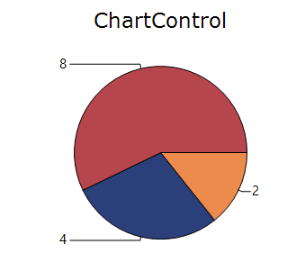

## Data manipulation

Essential® Chart provides a series model implementation that works directly with grouped data. It supports filters, summaries, and computed expressions, and also allows custom summaries and filters to be displayed in the chart.

### Grouping support

The Enterprise Edition of Essential® Chart includes grouping support that works directly with grouped data. It supports built-in and custom filters and summaries, allowing grouped data to be visualized in the chart.

The following images demonstrate stock transaction data grouped by symbol to calculate total volume and filtered to display specific transaction records. The chart works directly with live grouped data rather than a filtered or grouped copy, and any changes made to the underlying data are automatically reflected in the chart.

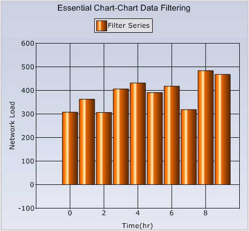

### Essential® grid interaction

Essential® Chart provides integration with Essential® Grid through a shared data model. The grid can also serve as a data source for the chart, allowing selected grid columns to be mapped automatically to chart series. The following image illustrates a chart created from grid data.

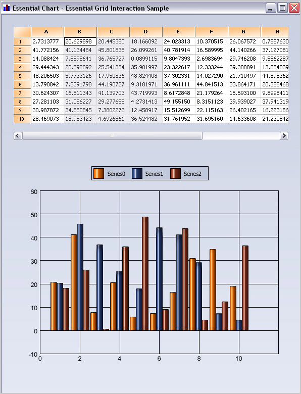

## Real time

Essential® Chart is optimized for visualizing large volumes of real-time data and supports smooth updates across the available chart types.

Real-time updates can be achieved by updating the chart data points and, when required, adjusting the chart axis ranges. Although new data points can be added through the [ChartSeries.Points](https://help.syncfusion.com/cr/windowsforms/Syncfusion.Windows.Forms.Chart.ChartSeries.html#Syncfusion_Windows_Forms_Chart_ChartSeries_Points) collection, using a custom data model is recommended for better performance in real-time scenarios.

N> For a complete real-time chart example, refer to the **Chart Recorder** sample included with the Essential® Chart installation.

## See also
- [How to create a real-time chart in WF](https://support.syncfusion.com/kb/article/8266/how-to-create-a-real-time-chart-in-wf)
- [How do I use Essential Chart to visualize data from Essential Grid](https://support.syncfusion.com/kb/article/1189/how-do-i-use-essential-chart-to-visualize-data-from-essential-grid)
- [How to bind a data source to a WinForms Chart using the chart wizard](https://support.syncfusion.com/kb/article/6867/how-to-bind-a-data-source-to-a-winforms-chart-using-the-chart-wizard)
- [How to bind a dataset from a database to the WinForms Chart](https://support.syncfusion.com/kb/article/1182/how-to-bind-a-dataset-from-a-database-to-the-winforms-chart)
- [How to I set Custom Databinding in Chart](https://support.syncfusion.com/kb/article/1180/how-to-i-set-custom-databinding-in-chart)