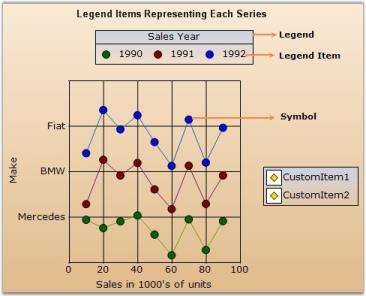
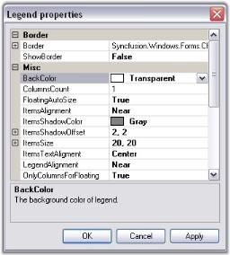
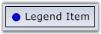
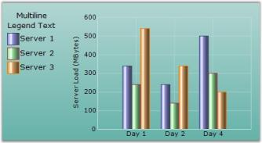
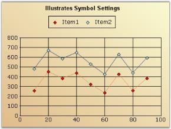
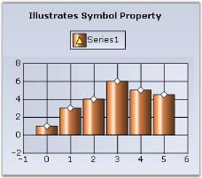
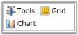

# Chart Legend in Windows Forms Chart

Essential Chart by default displays a legend with information on each series that has been plotted on the chart.

1. **Legend** - The rectangular region that lists one or more legend items.
2. **Legend Item** - Represented by an icon or image and a text; this usually gets rendered automatically corresponding to each [ChartSeries](https://help.syncfusion.com/cr/windowsforms/Syncfusion.Windows.Forms.Chart.ChartSeries.html) in the chart. You can also add custom legend items to a Legend.
3. **Symbols** - These refer to the symbols drawn at the data points in a plot. The legend items corresponding to the series can also be rendered with this symbol instead of an icon.

You can turn off the legend by setting the [ShowLegend](https://help.syncfusion.com/cr/windowsforms/Syncfusion.Windows.Forms.Chart.ChartControl.html#Syncfusion_Windows_Forms_Chart_ChartControl_ShowLegend) property in the chart to false. The legend instances in the Chart are exposed via the Legends collection. The first entry in this list is considered the "default legend" and is exposed by the [Legend](https://help.syncfusion.com/cr/windowsforms/Syncfusion.Windows.Forms.Chart.ChartControl.html#Syncfusion_Windows_Forms_Chart_ChartControl_Legend) property.

## Chart Legend

The legend is represented by the [ChartLegend](https://help.syncfusion.com/cr/windowsforms/Syncfusion.Windows.Forms.Chart.ChartLegend.html) type.

### Default Legend

By default, a custom [ChartLegend](https://help.syncfusion.com/cr/windowsforms/Syncfusion.Windows.Forms.Chart.ChartLegend.html) instance gets added to the Legends list in the control. You can access this default legend as follows. 

  



// Changing the position of the default legend

this.chartControl1.Legends[0].LegendPosition = Syncfusion.Windows.Forms.Chart.ChartDock.Top;





' Changing the position of the default legend

Me.chartControl1.Legends[0].LegendPosition = Syncfusion.Windows.Forms.Chart.ChartDock.Top




### Adding Custom Legends

You can add custom legends to the chart through the [Legends](https://help.syncfusion.com/cr/windowsforms/Syncfusion.Windows.Forms.Chart.ChartControl.html#Syncfusion_Windows_Forms_Chart_ChartControl_Legends) list as follows:

  



// Changing the position of the default legend

ChartLegend legend2 = new ChartLegend(chartControl1);

legend2.Name = "MyLegend";

chartControl1.Legends.Add(legend2);





Dim legend2 As New ChartLegend()

legend2.Name = "MyLegend"

chartControl1.Legends.Add(legend2)




You can then add custom legend items into the [ChartLegend](https://help.syncfusion.com/cr/windowsforms/Syncfusion.Windows.Forms.Chart.ChartLegend.html) through the CustomItems property as explained in the next topic **(ChartLegendItem)**.

You can also associate a [ChartSeries](https://help.syncfusion.com/cr/windowsforms/Syncfusion.Windows.Forms.Chart.ChartSeries.html) to a custom [ChartLegend](https://help.syncfusion.com/cr/windowsforms/Syncfusion.Windows.Forms.Chart.ChartLegend.html) as follows (then the legend item corresponding to that series will be rendered within the specified legend):

  



// Associate legend1with series1

series[0].LegendName = "legend1";

// Associate legend2with series2

series[1].LegendName = "legend2";





' Associate legend1with series1

series[0].LegendName = "legend1"

' Associate legend2with series2

series[1].LegendName = "legend2"




### Legend Look and Feel

Here are some common properties you could use to customize the overall legend appearance.

<table>
<tr>
<th>
ChartLegend Property</th><th>
Description</th></tr>
<tr>
<td>

{{'[BackColor](https://help.syncfusion.com/cr/windowsforms/Syncfusion.Windows.Forms.Chart.ChartLegend.html#Syncfusion_Windows_Forms_Chart_ChartLegend_BackColor)'| markdownify }}
</td><td>
Gets / sets the background color of the legend. The default value is Transparent.</td></tr>
<tr>
<td>

{{'[VisibleCheckBox](https://help.syncfusion.com/cr/windowsforms/Syncfusion.Windows.Forms.Chart.ChartLegend.html#Syncfusion_Windows_Forms_Chart_ChartLegend_VisibleCheckBox)'| markdownify }}</td><td>
If this property is set to true, a checkbox will be displayed beside each legend item. And if this checkbox is unchecked, the corresponding series will disappear from the chart plot. Default is false.</td></tr>
<tr>
<th>
Property</th><th>
Description</th></tr>
<tr>
<td>

{{'[Border](https://help.syncfusion.com/cr/windowsforms/Syncfusion.Windows.Forms.Chart.ChartLegend.html#Syncfusion_Windows_Forms_Chart_ChartLegend_Border)'| markdownify }}
</td><td>
Gets / sets the border style of the legend. ShowBorder should be true.</td></tr>
<tr>
<td>

{{'[ShowBorder](https://help.syncfusion.com/cr/windowsforms/Syncfusion.Windows.Forms.Chart.ChartLegend.html#Syncfusion_Windows_Forms_Chart_ChartLegend_ShowBorder)'| markdownify }}
</td><td>
Specifies whether a border should be drawn. By default it is set to false.</td></tr>
<tr>
<td>

{{'[Font](https://help.syncfusion.com/cr/windowsforms/Syncfusion.Windows.Forms.Chart.ChartLegend.html#Syncfusion_Windows_Forms_Chart_ChartLegend_Font)'| markdownify }}
</td><td>
Specifies the font that is to be used for the text rendered in the legend items. The default font style is Verdana, 8, Regular.</td></tr>
<tr>
<td>

{{'[BackInterior](https://help.syncfusion.com/cr/windowsforms/Syncfusion.Windows.Forms.Chart.ChartLegend.html#Syncfusion_Windows_Forms_Chart_ChartLegend_BackInterior)'| markdownify }}
</td><td>
Sets the interior appearance for the legend. This overrides the BackColor property.</td></tr>
<tr>
<td>

BackgroundImage
</td><td>
Sets the background image for the legend. This setting overrides the BackInterior property settings.</td></tr>
<tr>
<td>

BackgroundImageLayout</td><td>
Sets the layout for the background image.</td></tr>
</table>

### Legend Positioning

The legend positioning can be affected in the following ways.

<table>
<tr>
<th>ChartLegend Property</th>
<th>Description</th>
</tr>
<tr>
<td>

{{'[Position](https://help.syncfusion.com/cr/windowsforms/Syncfusion.Windows.Forms.Chart.ChartLegend.html#Syncfusion_Windows_Forms_Chart_ChartLegend_Position)'| markdownify }}
</td>
<td>
Specifies the position relative to the chart at which to render the legend.<ul>
<li>Top - above the chart</li>
<li>Left - left of the chart</li>
<li>Right - right of the chart</li>
<li>Bottom - below the chart</li>
<li>Floating - will not be docked to any specific location(default setting)</li>
</ul>
</td></tr>
<tr><td>

{{'[LegendAlignment](https://help.syncfusion.com/cr/windowsforms/Syncfusion.Windows.Forms.Chart.ChartLegend.html#Syncfusion_Windows_Forms_Chart_ChartLegend_LegendAlignment)'| markdownify }}
</td><td>
When docked to a side, this property specifies how the legend should be aligned with respect to the chart boundaries.</td></tr>
<tr>
<td>

{{'[LegendsPlacement](https://help.syncfusion.com/cr/windowsforms/Syncfusion.Windows.Forms.Chart.ChartControl.html#Syncfusion_Windows_Forms_Chart_ChartControl_LegendsPlacement)'| markdownify }}
</td><td>
Specifies the placement of a legend in a chart. It can be placed Inside or Outside the chart area using ChartPlacement enum.</td></tr>
<tr>
<td>

{{'[DockingFree](https://help.syncfusion.com/cr/windowsforms/Syncfusion.Windows.Forms.Chart.ChartDockControl.html#Syncfusion_Windows_Forms_Chart_ChartDockControl_DockingFree)'| markdownify }}
</td><td>
If set to true, the legend will be floating and cannot be dragged and docked to the sides.</td></tr>
<tr>
<td>

{{'[Behavior](https://help.syncfusion.com/cr/windowsforms/Syncfusion.Windows.Forms.Chart.ChartDockControl.html#Syncfusion_Windows_Forms_Chart_ChartDockControl_Behavior)'| markdownify }}
</td><td>
Specifies the docking behavior of the Legend.<ul>
<li>Docking - It is dockable on all four sides</li>
<li>Movable - It is movable</li>
<li>All - It is movable and dockable</li>
<li>None - It is neither movable nor dockable</li></ul>
</td></tr>
<tr>
<td>

{{'[FloatingAutoSize](https://help.syncfusion.com/cr/windowsforms/Syncfusion.Windows.Forms.Chart.ChartLegend.html#Syncfusion_Windows_Forms_Chart_ChartLegend_FloatingAutoSize)'| markdownify }}
</td><td>
Specifies whether to determine the size automatically or not, while floating.</td>
</tr>
<tr>
<td>

{{'[OnlyColumnsForFloating](https://help.syncfusion.com/cr/windowsforms/Syncfusion.Windows.Forms.Chart.ChartLegend.html#Syncfusion_Windows_Forms_Chart_ChartLegend_OnlyColumnsForFloating)'| markdownify }}
</td><td>
The legend items will be displayed vertically in columns when floating.</td></tr>
<tr>
<td>

{{'[RowsCount](https://help.syncfusion.com/cr/windowsforms/Syncfusion.Windows.Forms.Chart.ChartLegend.html#Syncfusion_Windows_Forms_Chart_ChartLegend_RowsCount)'| markdownify }}
</td><td>
Specifies the number of rows in which the legend items should be rendered.</td></tr>
<tr>
<td>

{{'[ColumnsCount](https://help.syncfusion.com/cr/windowsforms/Syncfusion.Windows.Forms.Chart.ChartLegend.html#Syncfusion_Windows_Forms_Chart_ChartLegend_ColumnsCount)'| markdownify }}
</td><td>
Specifies the number of columns in which the legend items should be rendered.
</td></tr>
</table>

Note that the user can drag the legend around during run time. He can dock it to the sides if docking is enabled. Docking behavior is controlled by [Behavior](https://help.syncfusion.com/cr/windowsforms/Syncfusion.Windows.Forms.Chart.ChartDockControl.html#Syncfusion_Windows_Forms_Chart_ChartDockControl_Behavior) property which is described in the above table.

### Changing Legend Properties at Run Time

The Legend's look and feel can also be customized during runtime. Double-clicking legend's text will pop up the below properties window. Properties set through this dialog can be applied to the chart. 

N> These settings will be lost when the application is closed.

## Chart Legend Item

The legend item is represented by the [ChartLegendItem](https://help.syncfusion.com/cr/windowsforms/Syncfusion.Windows.Forms.Chart.ChartLegendItem.html) type.

### Default Series LegendItems

Every [ChartSeries](https://help.syncfusion.com/cr/windowsforms/Syncfusion.Windows.Forms.Chart.ChartSeries.html) in the chart control has a ChartLegendItem associated with it. This legend item gets automatically added to the default [ChartLegend](https://help.syncfusion.com/cr/windowsforms/Syncfusion.Windows.Forms.Chart.ChartLegend.html). 

But, if you want to get that associated with a custom [ChartLegend](https://help.syncfusion.com/cr/windowsforms/Syncfusion.Windows.Forms.Chart.ChartLegend.html), use the [LegendName](https://help.syncfusion.com/cr/windowsforms/Syncfusion.Windows.Forms.Chart.ChartSeries.html#Syncfusion_Windows_Forms_Chart_ChartSeries_LegendName) to specify that chart legend as follows:

  



//Specifies the custom ChartLegend with which this series' legend item should be associated with

series1.LegendName = "MyLegend";





'Specifies the custom ChartLegend with which this series' legend item should be associated with

series1.LegendName = "MyLegend"




### Adding Custom Legend Items

To add your own custom legend items to a legend, use the [CustomItems](https://help.syncfusion.com/cr/windowsforms/Syncfusion.Windows.Forms.Chart.ChartLegend.html#Syncfusion_Windows_Forms_Chart_ChartLegend_CustomItems) property in the [ChartLegend](https://help.syncfusion.com/cr/windowsforms/Syncfusion.Windows.Forms.Chart.ChartLegend.html) as follows.

  



// Adding some custom items into the 2nd custom Legend

ChartLegendItem legendItem1 = new ChartLegendItem();

legendItem1.ItemStyle.ShowSymbol = true;

legendItem1.ItemStyle.Symbol.Shape = ChartSymbolShape.Circle;

legendItem1.ItemStyle.Symbol.Color = Color.Blue;

legendItem1.Text = "Legend Item";

this.chartControl1.Legends[1].CustomItems = new ChartLegendItem[] { legendItem1};





'Adding some custom items into the 2nd custom Legend

Dim legendItem1 As New ChartLegendItem()

legendItem1.ItemStyle.ShowSymbol = True

legendItem1.ItemStyle.Symbol.Shape = ChartSymbolShape.Circle

legendItem1.ItemStyle.Symbol.Color = Color.Blue

legendItem1.Text = "Legend Item"

'Adding the custom Legend item to the chart

Me.chartControl1.Legends[1].CustomItems = New ChartLegendItem() {legendItem1}




### Customizing items through event

There is also a way to specify custom legend item via events right before they get rendered. 

In this example, we reverse the order in which the legend items are rendered through the [FilterItems](https://help.syncfusion.com/cr/windowsforms/Syncfusion.Windows.Forms.Chart.ChartLegend.html#Syncfusion_Windows_Forms_Chart_ChartLegend_FilterItems) event.

  



private void Legend_FilterItems(object sender, ChartLegendFilterItemsEventArgs e)

{

    //This creates an new instance of the ChartLegendItemCollection

    ChartLegendItemsCollection items = new ChartLegendItemsCollection();

    for (int i = e.Items.Count - 1; i >= 0; i--)

        items.Add(e.Items[i]);

    e.Items = items;

}





Private Sub Legend_FilterItems(ByVal sender As Object, ByVal e As ChartLegendFilterItemsEventArgs) 

    'This creates an new instance of the ChartLegendItemCollection 

    Dim item As New ChartLegendItemsCollection() 

    For i As Integer = e.Items.Count - 1 To 0 Step -1 

        item.Add(e.Items(i)) 

    Next 

    e.Items = item 

End Sub 




### Legend Item's Look and Feel

The legend item's look and feel can be customized to a good extent using the following properties in [ChartLegend](https://help.syncfusion.com/cr/windowsforms/Syncfusion.Windows.Forms.Chart.ChartLegend.html). 

These settings affect all the items in the legend.

<table>
<tr>
<th>
ChartLegend Property</th><th>
Description</th></tr>
<tr>
<td>

{{'[RowsCount](https://help.syncfusion.com/cr/windowsforms/Syncfusion.Windows.Forms.Chart.ChartLegend.html#Syncfusion_Windows_Forms_Chart_ChartLegend_RowsCount)'| markdownify }}
</td><td>
Specifies the number of rows to be used in the legend.</td></tr>
<tr>
<td>

{{'[ColumnsCount](https://help.syncfusion.com/cr/windowsforms/Syncfusion.Windows.Forms.Chart.ChartLegend.html#Syncfusion_Windows_Forms_Chart_ChartLegend_ColumnsCount)'| markdownify }}
</td><td>
Specifies the number of columns to be used in the legend.</td></tr>
<tr>
<td>

{{'[ItemsAlignment](https://help.syncfusion.com/cr/windowsforms/Syncfusion.Windows.Forms.Chart.ChartLegend.html#Syncfusion_Windows_Forms_Chart_ChartLegend_ItemsAlignment)'| markdownify }}
</td><td>
Specifies the horizontal alignment of the items within the legend. Possible values:<ul>
<li>Near</li>
<li>Center</li>
<li>Far</li>
</ul></td></tr>
<tr>
<td>

{{'[ShowItemsShadow](https://help.syncfusion.com/cr/windowsforms/Syncfusion.Windows.Forms.Chart.ChartLegend.html#Syncfusion_Windows_Forms_Chart_ChartLegend_ShowItemsShadow)'| markdownify }}
</td><td>
Will render a shadow around the item image and text using the ItemsShadowColor. Default is false.</td></tr>
<tr>
<td>

{{'[ItemsShadowColor](https://help.syncfusion.com/cr/windowsforms/Syncfusion.Windows.Forms.Chart.ChartLegend.html#Syncfusion_Windows_Forms_Chart_ChartLegend_ItemsShadowColor)'| markdownify }}
</td><td>
Specifies the color of the shadow to use. ShowItemsShadow should be set to true. Default is Gray.</td></tr>
<tr>
<td>

{{'[ItemsShadowOffset](https://help.syncfusion.com/cr/windowsforms/Syncfusion.Windows.Forms.Chart.ChartLegend.html#Syncfusion_Windows_Forms_Chart_ChartLegend_ItemsShadowOffset)'| markdownify }}
</td><td>
Specifies the breadth of the shadow. Default is {2, 2}.</td></tr>
<tr>
<td>

{{'[ItemsSize](https://help.syncfusion.com/cr/windowsforms/Syncfusion.Windows.Forms.Chart.ChartLegend.html#Syncfusion_Windows_Forms_Chart_ChartLegend_ItemsSize)'| markdownify }}
</td><td>
Specifies the size of the legend item rectangle. If the specified size is smaller than necessary to render the text, then it's ignored.</td></tr>
<tr>
<td>

{{'[ItemsAlignment](https://help.syncfusion.com/cr/windowsforms/Syncfusion.Windows.Forms.Chart.ChartLegend.html#Syncfusion_Windows_Forms_Chart_ChartLegend_ItemsAlignment)'| markdownify }}
</td><td>
Specifies the vertical alignment of the legend item text within the item bounds. Possible Values: 
<ul>
<li>Bottom</li>
<li>Center</li>
<li>Top</li>
</ul></td></tr>
<tr>
<td>

{{'[Spacing](https://help.syncfusion.com/cr/windowsforms/Syncfusion.Windows.Forms.Chart.ChartLegend.html#Syncfusion_Windows_Forms_Chart_ChartLegend_Spacing)'| markdownify }}
</td><td>
Specifies the space between the legend borders and the legend items. Default is 4.</td></tr>
<tr>
<td>

{{'[Text](https://help.syncfusion.com/cr/windowsforms/Syncfusion.Windows.Forms.Chart.ChartLegend.html#Syncfusion_Windows_Forms_Chart_ChartLegend_Text)'| markdownify }}
</td><td>
Specifies the title text for the legend. You can set multiline text for the legend; Enter the text in the combobox and press ENTER key to begin a new line and CTRL+ENTER to set the entered multiline text.</td></tr>
<tr>
<td>

{{'[TextColor](https://help.syncfusion.com/cr/windowsforms/Syncfusion.Windows.Forms.Chart.ChartLegend.html#Syncfusion_Windows_Forms_Chart_ChartLegend_TextColor)'| markdownify }}
</td><td>
Specifies the color of the title text.</td></tr>
<tr>
<td>

{{'[TextAlignment](https://help.syncfusion.com/cr/windowsforms/Syncfusion.Windows.Forms.Chart.ChartLegend.html#Syncfusion_Windows_Forms_Chart_ChartLegend_TextAlignment)'| markdownify }}
</td><td>
Specifies the horizontal alignment of the title text. Possible Values:<ul>
<li>Center</li>
<li>Far</li>
<li>Near</li>
</ul></td></tr>
</table>

_Legend Item Properties_

<table>
<tr>
<th>
Event </th><th>
Description </th><th>
Arguments </th><th>
Type </th><th>
Reference links </th></tr>
<tr>
<td>

{{'[MinSize](https://help.syncfusion.com/cr/windowsforms/Syncfusion.Windows.Forms.Chart.ChartLegend.html#Syncfusion_Windows_Forms_Chart_ChartLegend_MinSize)'| markdownify }}
</td><td>
Used to specify a minimum rectangular size for the legend item.</td><td>
object sender, ChartLegendMinSizeEventArgs e</td><td>
NA </td><td>
NA</td></tr>
<tr>
<td>

{{'[DrawItem](https://help.syncfusion.com/cr/windowsforms/Syncfusion.Windows.Forms.Chart.ChartLegend.html#Syncfusion_Windows_Forms_Chart_ChartLegend_DrawItem)'| markdownify }}
</td><td>
Used to customize the rendering of the legend.</td><td>
object sender, ChartLegendDrawItemEventArgs e</td><td>
NA</td><td>
NA</td></tr>
<tr>
<td>

{{'[DrawItemText](https://help.syncfusion.com/cr/windowsforms/Syncfusion.Windows.Forms.Chart.ChartLegend.html#Syncfusion_Windows_Forms_Chart_ChartLegend_DrawItemText)'| markdownify }}
</td><td>
Used to customize the rendering of the legend item text.</td><td>
object sender, ChartLegendDrawItemTextEventArgs e</td><td>
NA</td><td>
NA</td></tr>
<tr>
<td>

{{'[FilterItems](https://help.syncfusion.com/cr/windowsforms/Syncfusion.Windows.Forms.Chart.ChartLegend.html#Syncfusion_Windows_Forms_Chart_ChartLegend_FilterItems)'| markdownify }}
</td><td>
Used to dynamically provide a list of legend items during runtime. </td><td>
object sender, ChartLegendFilterItemsEventArgs e</td><td>
NA</td><td>
NA</td></tr>
</table>

<table>
<tr>
<th>
ChartLegend Method</th><th>
Description</th></tr>
<tr>
<td>

{{'[GetItemBy](https://help.syncfusion.com/cr/windowsforms/Syncfusion.Windows.Forms.Chart.ChartLegend.html#Syncfusion_Windows_Forms_Chart_ChartLegend_GetItemBy_System_Drawing_Point_)'| markdownify }}
</td><td>
Gets the legend item at the specified coordinates.</td></tr>
</table>

You can also reference specific legend items and apply settings on them individually:

<table>
<tr>
<th>
LegendItem Property</th><th>
Description</th></tr>
<tr>
<td>

{{'[BorderColor](https://help.syncfusion.com/cr/windowsforms/Syncfusion.Windows.Forms.Chart.ChartLegendItem.html#Syncfusion_Windows_Forms_Chart_ChartLegendItem_BorderColor)'| markdownify }}
</td><td>
Specifies the color of the border around the legend shape.</td></tr>
<tr>
<td>

{{'[Font](https://help.syncfusion.com/cr/windowsforms/Syncfusion.Windows.Forms.Chart.ChartLegendItem.html#Syncfusion_Windows_Forms_Chart_ChartLegendItem_Font)'| markdownify }}
</td><td>
Specifies the font for the text in this legend item.</td></tr>
<tr>
<td>

{{'[Spacing](https://help.syncfusion.com/cr/windowsforms/Syncfusion.Windows.Forms.Chart.ChartLegendItem.html#Syncfusion_Windows_Forms_Chart_ChartLegendItem_Spacing)'| markdownify }}
</td><td>
Specifies the space between this item and it's adjacent items. Default is 20.
</td></tr>
<tr>
<td>

{{'[Text](https://help.syncfusion.com/cr/windowsforms/Syncfusion.Windows.Forms.Chart.ChartLegendItem.html#Syncfusion_Windows_Forms_Chart_ChartLegendItem_Text)'| markdownify }}
</td><td>
Specifies the text of the legend item. By default this will reflect the corresponding series name.</td></tr>
<tr>
<td>

{{'[TextColor](https://help.syncfusion.com/cr/windowsforms/Syncfusion.Windows.Forms.Chart.ChartLegendItem.html#Syncfusion_Windows_Forms_Chart_ChartLegendItem_TextColor)'| markdownify }}
</td><td>
Specifies the text color for this item.</td></tr>
<tr>
<td>

{{'[IconAlignment](https://help.syncfusion.com/cr/windowsforms/Syncfusion.Windows.Forms.Chart.ChartLegendItem.html#Syncfusion_Windows_Forms_Chart_ChartLegendItem_IconAlignment)'| markdownify }}
</td><td>
Specifies how the icon should be aligned within the item rectangle.</td></tr>
<tr>
<td>

{{'[TextAlignment](https://help.syncfusion.com/cr/windowsforms/Syncfusion.Windows.Forms.Chart.ChartLegendItem.html#Syncfusion_Windows_Forms_Chart_ChartLegendItem_TextAligment)'| markdownify }}
</td><td>
Specifies how the text should be aligned within the item rectangle.</td></tr>
<tr>
<td>

{{'[VisibleCheckBox](https://help.syncfusion.com/cr/windowsforms/Syncfusion.Windows.Forms.Chart.ChartLegendItem.html#Syncfusion_Windows_Forms_Chart_ChartLegendItem_VisibleCheckBox)'| markdownify }}
</td><td>
If this property is set to true, a checkbox will be shown beside the legend item through which the user can show/hide the corresponding series in the chart.
</td></tr>
<tr>
<td>

{{'[ShowShadow](https://help.syncfusion.com/cr/windowsforms/Syncfusion.Windows.Forms.Chart.ChartLegendItem.html#Syncfusion_Windows_Forms_Chart_ChartLegendItem_ShowShadow)'| markdownify }}
</td><td>
Will render a shadow around the item image and text using the ItemsShadowColor.</td></tr>
<tr>
<td>

{{'[ShadowOffset](https://help.syncfusion.com/cr/windowsforms/Syncfusion.Windows.Forms.Chart.ChartLegendItem.html#Syncfusion_Windows_Forms_Chart_ChartLegendItem_ShadowOffset)'| markdownify }}
</td><td>
Specifies the breadth of the shadow.</td></tr>
<tr>
<td>

{{'[ShadowColor](https://help.syncfusion.com/cr/windowsforms/Syncfusion.Windows.Forms.Chart.ChartLegendItem.html#Syncfusion_Windows_Forms_Chart_ChartLegendItem_ShadowColor)'| markdownify }}
</td><td>
Specifies the color of the shadow to use. ShowItemsShadow should be set to true. Default is Gray.</td></tr>
<tr>
<td>

{{'[Children](https://help.syncfusion.com/cr/windowsforms/Syncfusion.Windows.Forms.Chart.ChartLegendItem.html#Syncfusion_Windows_Forms_Chart_ChartLegendItem_Children)'| markdownify }}
</td><td>
Returns the child collection of the LegendItem.</td></tr>
<tr>
<td>

{{'[IsChecked](https://help.syncfusion.com/cr/windowsforms/Syncfusion.Windows.Forms.Chart.ChartLegendItem.html#Syncfusion_Windows_Forms_Chart_ChartLegendItem_IsChecked)'| markdownify }}
</td><td>
Gets / sets the check state of the ChartLegendItem checkbox. By default it is set to true.</td></tr>
<tr>
<td>

{{'[Visible](https://help.syncfusion.com/cr/windowsforms/Syncfusion.Windows.Forms.Chart.ChartLegendItem.html#Syncfusion_Windows_Forms_Chart_ChartLegendItem_Visible)'| markdownify }}
</td><td>
Lets you show / hide the legend item.</td></tr>
</table>

### Customizing LegendItem Image

There are several options to customize the image rendered in the [Legend](https://help.syncfusion.com/cr/windowsforms/Syncfusion.Windows.Forms.Chart.ChartControl.html#Syncfusion_Windows_Forms_Chart_ChartControl_Legend). The following properties let you do so:

<table>
<tr>
<th>
ChartLegend Property</th><th>
Description</th></tr>
<tr>
<td>

{{'[ShowSymbol](https://help.syncfusion.com/cr/windowsforms/Syncfusion.Windows.Forms.Chart.ChartLegend.html#Syncfusion_Windows_Forms_Chart_ChartLegend_ShowSymbol)'| markdownify }}
</td><td>
If true, the exact symbol rendered in the series data points will be used to render the icon in the legend as well. This overrides most of the other settings.</td></tr>
<tr>
<td>

{{'[RepresentationType](https://help.syncfusion.com/cr/windowsforms/Syncfusion.Windows.Forms.Chart.ChartLegend.html#Syncfusion_Windows_Forms_Chart_ChartLegend_RepresentationType)'| markdownify }}
</td><td>
Specifies how each legend item should be represented, as the name implies:<ul>
<li>None</li>
<li>SeriesType - An icon representing the series type.</li>
<li>SeriesImage - Will use the ImageList associated with the series style.</li>
<li>Rectangle</li>
<li>Line</li>
<li>StraightLine</li>
<li>Circle</li>
<li>Diamond</li>
<li>Hexagon</li>
<li>Pentagon</li>
<li>Triangle</li>
<li>InvertedTriangle</li>
<li>Cross</li>
</ul></td></tr>
</table>

The following [ChartLegendItem](https://help.syncfusion.com/cr/windowsforms/Syncfusion.Windows.Forms.Chart.ChartLegendItem.html) properties that can be accessed via the legend. Items list typically override the above settings set in the legend.

<table>
<tr>
<th>
ChartLegendItem Property</th><th>
Description</th></tr>
<tr>
<td>

{{'[DrawSeriesIcon](https://help.syncfusion.com/cr/windowsforms/Syncfusion.Windows.Forms.Chart.ChartSeriesLegendItem.html#Syncfusion_Windows_Forms_Chart_ChartSeriesLegendItem_DrawSeriesIcon)'| markdownify }}
</td><td>
Specifies if an icon representing the series type should be rendered for this legend item.</td></tr>
<tr>
<td>

{{'[ImageList](https://help.syncfusion.com/cr/windowsforms/Syncfusion.Windows.Forms.Chart.ChartLegendItem.html#Syncfusion_Windows_Forms_Chart_ChartLegendItem_ImageList)'| markdownify }}
</td><td>
Contains a collection of images and will be referred to, by the ImageList property.</td></tr>
<tr>
<td>

{{'[ImageIndex](https://help.syncfusion.com/cr/windowsforms/Syncfusion.Windows.Forms.Chart.ChartLegendItem.html#Syncfusion_Windows_Forms_Chart_ChartLegendItem_ImageIndex)'| markdownify }}
</td><td>
Specifies the index into the ImageList array which contains the image for this item.</td></tr>
<tr>
<td>

{{'[Interior](https://help.syncfusion.com/cr/windowsforms/Syncfusion.Windows.Forms.Chart.ChartLegendItem.html#Syncfusion_Windows_Forms_Chart_ChartLegendItem_Interior)'| markdownify }}
</td><td>
Specifies the BrushInfo used to render the interior of a Chart Symbol.</td></tr>
<tr>
<td>

{{'[RepresentationSize](https://help.syncfusion.com/cr/windowsforms/Syncfusion.Windows.Forms.Chart.ChartLegendItem.html#Syncfusion_Windows_Forms_Chart_ChartLegendItem_RepresentationSize)'| markdownify }}
</td><td>
Specifies the size of the rectangle inside which the associated image or symbol will get rendered.</td></tr>
<tr>
<td>

{{'[ShowSymbol](https://help.syncfusion.com/cr/windowsforms/Syncfusion.Windows.Forms.Chart.ChartLegendItem.html#Syncfusion_Windows_Forms_Chart_ChartLegendItem_ShowSymbol)'| markdownify }}
</td><td>
If true, the exact symbol rendered in the corresponding series data points will be used to render the icon in this legend as well. This overrides most of the other settings.</td></tr>
<tr>
<td>

{{'[Symbol](https://help.syncfusion.com/cr/windowsforms/Syncfusion.Windows.Forms.Chart.ChartLegendItem.html#Syncfusion_Windows_Forms_Chart_ChartLegendItem_Symbol)'| markdownify }}
</td><td>
Symbols rendered in the Legend item can be customized using this property.</td></tr>
<tr>
<td>

{{'[Type](https://help.syncfusion.com/cr/windowsforms/Syncfusion.Windows.Forms.Chart.ChartLegendItem.html#Syncfusion_Windows_Forms_Chart_ChartLegendItem_Type)'| markdownify }}
</td><td>
If ShowSymbol is false, you can customize the type of icon that gets rendered in the legend item. The default value will reflect the ChartLegend.RepresentationType setting. Possible Values:<ul>
<li>Area</li>
<li>Circle</li>
<li>Cross</li>
<li>Diamond</li>
<li>Hexagon</li>
<li>Image</li>
<li>InvertedTriangle</li>
<li>Line</li>
<li>None</li>
<li>Pentagon</li>
<li>PieSliceRectangle</li>
<li>Spline</li>
<li>SplineArea</li>
<li>StraightLine</li>
<li>Rectangle</li>
</ul></td></tr>
<tr>
<td>
 

{{'[ShowIcon](https://help.syncfusion.com/cr/windowsforms/Syncfusion.Windows.Forms.Chart.ChartLegendItem.html#Syncfusion_Windows_Forms_Chart_ChartLegendItem_ShowIcon)'| markdownify }}
</td><td>
If set to false, no icons will be rendered. This overrides most of the other settings including ShowSymbol.</td></tr>
</table>

### Series Type Icon

An icon representing the series type can be rendered in the legend. 

To do this for all the legend items:

  



this.chartControl1.Legend.RepresentationType = ChartLegendRepresentationType.SeriesType;





Me.chartControl1.Legend.RepresentationType = ChartLegendRepresentationType.SeriesType




To do this for specific legend items,

  



// The general setting affecting all Legend items could be anything

this.chartControl1.Legend.RepresentationType = ChartLegendRepresentationType.SeriesImage;





// This will force a specific legend item to show a series icon

this.chartControl1.Legend.Items[0].DrawSeriesIcon = true;

'The general setting affecting all Legend items could be anything

Me.chartControl1.Legend.RepresentationType = ChartLegendRepresentationType.SeriesImage

'This will force a specific legend item to show a series icon

Me.chartControl1.Legend.Items(0).DrawSeriesIcon = True




### Series Symbol

You can also choose to show the exact same symbol that is shown in the data points in a series.

To do this for all the legend items:

  



//Set symbol for first series

this.chartControl1.Series[0].Style.Symbol.Shape = ChartSymbolShape.Diamond;

this.chartControl1.Series[0].Style.Symbol.Color = Color.Red ;

this.chartControl1.Series[0].Style.Symbol.Size = new Size(7, 7);

//This will cause the legend to render with the same symbol defined above.

this.chartControl1.Legend.ShowSymbol = true;

//Setting RepresentationType to None to hide other representations

this.chartControl1.Legend.RepresentationType = ChartLegendRepresentationType.None;





'Set symbol for first series

Me.chartControl1.Series(0).Style.Symbol.Shape = ChartSymbolShape.Diamond

Me.chartControl1.Series(0).Style.Symbol.Color = Color.Red

Me.chartControl1.Series(10).Style.Symbol.Size = New Size(7, 7)

'This will cause the legend to render with the same symbol defined above.

Me.chartControl1.Legend.ShowSymbol = True

'Setting RepresentationType to None to hide other representations

Me.chartControl1.Legend.RepresentationType = ChartLegendRepresentationType.None




### Custom Representation Icon

You can also choose to use one of the built-in representation icons in the legend items.

To do this for all the legend items:

  



this.chartControl1.Legend.RepresentationType = ChartLegendRepresentationType.Diamond;





Me.chartControl1.Legend.RepresentationType = ChartLegendRepresentationType.Diamond





To do the above only on specific legend items, use the ChartLegendItem.Type property.

  



// To apply the built-in legend icon to the first legend.

this.chartControl1.Legend.Items[0].Type = ChartLegendItemType.Circle;





'To apply the built-in legend icon to the first legend.

Me.chartControl1.Legend.Items(0).Type = ChartLegendItemType.Circle





### More symbol shapes

[ChartLegendItem](https://help.syncfusion.com/cr/windowsforms/Syncfusion.Windows.Forms.Chart.ChartLegendItem.html) has the [Symbol](https://help.syncfusion.com/cr/windowsforms/Syncfusion.Windows.Forms.Chart.ChartLegendItem.html#Syncfusion_Windows_Forms_Chart_ChartLegendItem_Symbol) property, using which we can customize the symbols for particular legend items. This setting overrides the Series [0].Style.Symbol settings. 

  



//Series symbol settings

chartControl1.Legend.ShowSymbol = true;

chartControl1.Series[0].Style.Symbol.Shape = ChartSymbolShape.Diamond;

chartControl1.Series[0].Style.Symbol.Color = Color.AliceBlue;

//the above symbol settings is overridden by the following settings

chartControl1.Legend.Items[0].Symbol.Shape = ChartSymbolShape.Triangle;

chartControl1.Legend.Items[0].Symbol.Color = Color.Yellow;





'Series symbol settings

chartControl1.Legend.ShowSymbol = True

chartControl1.Series(0).Style.Symbol.Shape = ChartSymbolShape.Diamond

chartControl1.Series(0).Style.Symbol.Color = Color.AliceBlue

'the above symbol settings is overridden by the following settings

chartControl1.Legend.Items[0].Symbol.Shape = ChartSymbolShape.Triangle

chartControl1.Legend.Items[0].Symbol.Color = Color.Yellow




### Custom Images

You can also choose to show custom images in the legend items as follows:

  



// Setting the representation type for the Legend items

this.chartControl1.Legend.RepresentationType = ChartLegendRepresentationType.SeriesImage;

//Setting the image index

this.chartControl1.Legend.Items[0].ImageIndex = 0;

// The image will be picked up from this collection

series1.Style.Images = new ChartImageCollection(this.imageList1.Images);

// Or from this collection, if available

this.chartControl1.Legend.Items[0].ImageList = new ChartImageCollection(this.imageList1.Images);





'Setting the representation type for the Legend items

Me.chartControl1.Legend.RepresentationType = ChartLegendRepresentationType.SeriesImage

'Setting the image index

Me.chartControl1.Legend.Items(0).ImageIndex = 0

' The image will be picked up from this collection

series1.Style.Images = New ChartImageCollection(Me.imageList1.Images)

' Or from this collection, if available

Me.chartControl1.Legend.Items(0).ImageList = New ChartImageCollection(this.imageList1.Images)




### Hiding icons

Icons for legend items can be hidden in any of the following ways:

  



this.chartControl1.Legend.RepresentationType = ChartLegendRepresentationType.None;

// To do this for a specific legend item:

// This will not even allocate any space for the icons

this.chartControl1.Legend.Items[0].ShowIcon = false;

// Or, set this. This will not render the icons, but will allocate some empty space for it

this.chartControl1.Legend.Items[0].Type = ChartLegendItemType.None;





Me.chartControl1.Legend.RepresentationType = ChartLegendRepresentationType.None

'To do this for a specific legend item

'This will not even allocate any space for the icons

Me.chartControl1.Legend.Items(0).ShowIcon = False

'Or, set this. This will not render the icons, but will allocate some empty space for it

Me.chartControl1.Legend.Items(0).Type = ChartLegendItemType.None




### Customization of custom legend item 

The ChartLegend items can be customized by using the ItemStyle property. The following properties are used to customize the legendItem.

* ShowSymbol – Used to show the legend item symbol
* Border – Used to modify the border color, width and etc
* Symbol – Used to modify the shape, color and etc



[C#]

ChartLegendItem legendItem1 = new ChartLegendItem();

legendItem1.ItemStyle.ShowSymbol = true;

legendItem1.ItemStyle.Border.Color = Color.LightBlue;

legendItem1.ItemStyle.Border.Width = 10;

legendItem1.ItemStyle.Symbol.Shape = ChartSymbolShape.Circle;

legendItem1.ItemStyle.Symbol.Color = Color.Yellow;

legendItem1.Text = "Legend Item";

this.chartControl1.Legend.CustomItems = new ChartLegendItem[] { legendItem1 };


