## Legend in Windows Forms Chart

The legend identifies the data series and chart elements displayed in the chart. Each legend item usually represents a chart series and can display text, an icon, a symbol, an image, or a checkbox.

## Defining the legend

By default, a [ChartLegend](https://help.syncfusion.com/cr/windowsforms/Syncfusion.Windows.Forms.Chart.ChartLegend.html) instance is added to the chart's [Legends](https://help.syncfusion.com/cr/windowsforms/Syncfusion.Windows.Forms.Chart.ChartControl.html#Syncfusion_Windows_Forms_Chart_ChartControl_Legends) collection. This default legend can be accessed and customized through the [Legend](https://help.syncfusion.com/cr/windowsforms/Syncfusion.Windows.Forms.Chart.ChartControl.html#Syncfusion_Windows_Forms_Chart_ChartControl_Legend) property.

The following code customizes the default legend alignment and position.



chartControl.Legend.Alignment = ChartAlignment.Center;
chartControl.Legend.Position = ChartDock.Top;


chartControl.Legend.Alignment = ChartAlignment.Center
chartControl.Legend.Position = ChartDock.Top



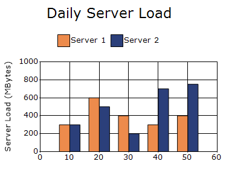

## Legend visibility

The visibility of the default legend, a legend instance, a series legend item, and an chart legend item can be controlled independently.

### Show legend

The [ShowLegend](https://help.syncfusion.com/cr/windowsforms/Syncfusion.Windows.Forms.Chart.ChartControl.html#Syncfusion_Windows_Forms_Chart_ChartControl_ShowLegend) property controls whether the chart displays the default legend. The default value is `true`.

The following code example hides the default legend.




chartControl.ShowLegend = false;




chartControl.ShowLegend = False


S

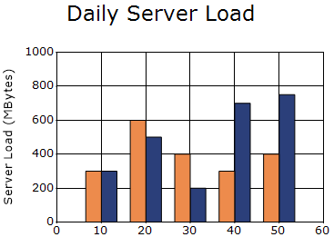

### Chart legend visiblility

The `Visible` property controls whether a specific [ChartLegend](https://help.syncfusion.com/cr/windowsforms/Syncfusion.Windows.Forms.Chart.ChartLegend.html) instance is displayed or not. This property can be used for the default legend or any additional legend added to the chart. The default value is `true`.

The following code example hides the default [ChartLegend](https://help.syncfusion.com/cr/windowsforms/Syncfusion.Windows.Forms.Chart.ChartLegend.html) instance.




chartControl.Legend.Visible = false;




chartControl.Legend.Visible = False




### Series legend item visibility

The [LegendItem](https://help.syncfusion.com/cr/windowsforms/Syncfusion.Windows.Forms.Chart.ChartSeries.html#Syncfusion_Windows_Forms_Chart_ChartSeries_LegendItem) property provides access to the legend item associated with a chart series. The `Visible` property of the legend item controls whether the legend is displayed without hiding the corresponding series. The default value is `true`.

The following code example hides the legend item associated with the series.




series.LegendItem.Visible = false;




series.LegendItem.Visible = False




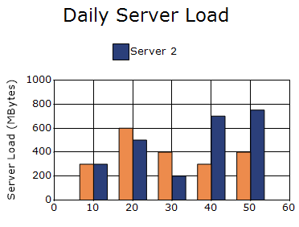

### Chart legend item visibility

The [Items](https://help.syncfusion.com/cr/windowsforms/Syncfusion.Windows.Forms.Chart.ChartLegend.html#Syncfusion_Windows_Forms_Chart_ChartLegend_Items) property returns the legend items automatically generated for the chart series. Set the [Visible](https://help.syncfusion.com/cr/windowsforms/Syncfusion.Windows.Forms.Chart.ChartLegendItem.html#Syncfusion_Windows_Forms_Chart_ChartLegendItem_Visible) property of an item to show or hide that legend item. The default value is `true`.

The following code example hides the second auto-generated legend item.




chartControl.Legend.Items[1].Visible = false;




chartControl.Legend.Items(1).Visible = False




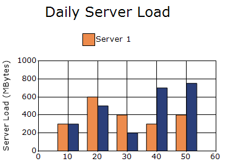

### Legend item icon visibility

The [ShowIcon](https://help.syncfusion.com/cr/windowsforms/Syncfusion.Windows.Forms.Chart.ChartLegendItem.html#Syncfusion_Windows_Forms_Chart_ChartLegendItem_ShowIcon) property controls whether the icon of an individual legend item is displayed. The default value is `true`.

The following code example hides the icon of the first legend item.



chartControl.Legend.Items[0].ShowIcon = false;




chartControl.Legend.Items(0).ShowIcon = False




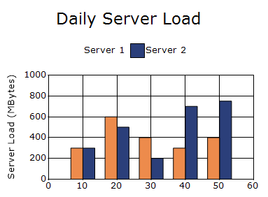

## Toggle series visibility

The legend supports checkbox-based visibility control for all series or individual legend items.

### Legend checkbox visibility

The [VisibleCheckBox](https://help.syncfusion.com/cr/windowsforms/Syncfusion.Windows.Forms.Chart.ChartLegend.html#Syncfusion_Windows_Forms_Chart_ChartLegend_VisibleCheckBox) property controls whether checkboxes are displayed for all legend items in the legend. The default value is `false`.

The following code example displays checkboxes for all legend items.




chartControl.Legend.VisibleCheckBox = true;




chartControl.Legend.VisibleCheckBox = True




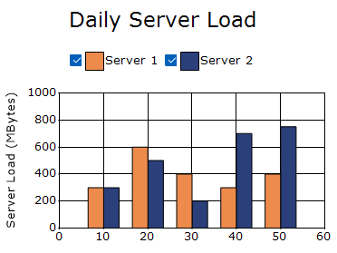

### Legend item checkbox visibility

The [VisibleCheckBox](https://help.syncfusion.com/cr/windowsforms/Syncfusion.Windows.Forms.Chart.ChartLegendItem.html#Syncfusion_Windows_Forms_Chart_ChartLegendItem_VisibleCheckBox) property controls whether the checkbox is displayed for an individual legend item. The default value is `false`.

N> [ChartLegend.VisibleCheckBox](https://help.syncfusion.com/cr/windowsforms/Syncfusion.Windows.Forms.Chart.ChartLegend.html#Syncfusion_Windows_Forms_Chart_ChartLegend_VisibleCheckBox) applies to all legend items, whereas [ChartLegendItem.VisibleCheckBox](https://help.syncfusion.com/cr/windowsforms/Syncfusion.Windows.Forms.Chart.ChartLegendItem.html#Syncfusion_Windows_Forms_Chart_ChartLegendItem_VisibleCheckBox) applies only to the specified legend item.

The following code example displays the checkbox only for the first legend item.



chartControl.Legend.Items[0].VisibleCheckBox = true;


chartControl.Legend.Items(0).VisibleCheckBox = True



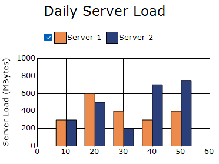

### Legend item checked state

The [IsChecked](https://help.syncfusion.com/cr/windowsforms/Syncfusion.Windows.Forms.Chart.ChartLegendItem.html#Syncfusion_Windows_Forms_Chart_ChartLegendItem_IsChecked) property specifies the checked state of an individual legend item. The default value is `true`.

N> To use the [IsChecked](https://help.syncfusion.com/cr/windowsforms/Syncfusion.Windows.Forms.Chart.ChartLegendItem.html#Syncfusion_Windows_Forms_Chart_ChartLegendItem_IsChecked) property, enable the checkbox by setting either [ChartLegend.VisibleCheckBox](https://help.syncfusion.com/cr/windowsforms/Syncfusion.Windows.Forms.Chart.ChartLegend.html#Syncfusion_Windows_Forms_Chart_ChartLegend_VisibleCheckBox) or [ChartLegendItem.VisibleCheckBox](https://help.syncfusion.com/cr/windowsforms/Syncfusion.Windows.Forms.Chart.ChartLegendItem.html#Syncfusion_Windows_Forms_Chart_ChartLegendItem_VisibleCheckBox) to `true`.

The following code example unchecks the first legend item.



chartControl.Legend.Items[0].IsChecked = false;


chartControl.Legend.Items(0).IsChecked = False



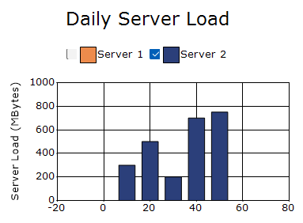

## Customizing labels

The legend title and individual item labels can be customized independently.

### Legend title customization

The following properties customize the legend title:

- [Text](https://help.syncfusion.com/cr/windowsforms/Syncfusion.Windows.Forms.Chart.ChartLegend.html#Syncfusion_Windows_Forms_Chart_ChartLegend_Text): Specifies the legend title text. The default value is `empty string`.
- [ForeColor](https://help.syncfusion.com/cr/windowsforms/Syncfusion.Windows.Forms.Chart.ChartLegend.html): Specifies the title color. The defaul value is `Color.Black`.
- [TextAlignment](https://help.syncfusion.com/cr/windowsforms/Syncfusion.Windows.Forms.Chart.ChartLegend.html#Syncfusion_Windows_Forms_Chart_ChartLegend_TextAlignment): Specifies the alignment of the legend title text. The default value is `StringAlignment.Center`.
- The supported [StringAlignment](https://learn.microsoft.com/en-us/dotnet/api/system.drawing.stringalignment?view=net-11.0-pp) values are:
  - `Near`: Aligns the title near the starting edge.
  - `Center`: Aligns the title at the center.
  - `Far`: Aligns the title near the ending edge.
- [Font](https://help.syncfusion.com/cr/windowsforms/Syncfusion.Windows.Forms.Chart.ChartLegend.html#Syncfusion_Windows_Forms_Chart_ChartLegend_Font): Specifies the font used by the legend. The default font style is `Verdana, 8f, Regular`.

N> The [TextColor](https://help.syncfusion.com/cr/windowsforms/Syncfusion.Windows.Forms.Chart.ChartLegend.html#Syncfusion_Windows_Forms_Chart_ChartLegend_TextColor) property is obsolete. Use the `ForeColor` property instead.

The following code example customizes the legend title.



chartControl.Legend.Text = "Servers";
chartControl.Legend.ForeColor = Color.Red;
chartControl.Legend.TextAlignment = StringAlignment.Center;
chartControl.Legend.Font = new Font(
    "Segoe UI",
    10,
    FontStyle.Bold);


chartControl.Legend.Text = "Servers"
chartControl.Legend.ForeColor = Color.Red
chartControl.Legend.TextAlignment = StringAlignment.Center
chartControl.Legend.Font = New Font(
    "Segoe UI",
    10,
    FontStyle.Bold)



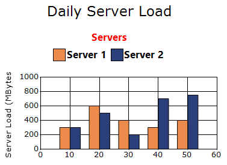

### Legend item text

The following properties customize an individual legend item label:

- [Text](https://help.syncfusion.com/cr/windowsforms/Syncfusion.Windows.Forms.Chart.ChartLegendItem.html#Syncfusion_Windows_Forms_Chart_ChartLegendItem_Text): Specifies the item text. By default, the corresponding series name is displayed.
- [TextColor](https://help.syncfusion.com/cr/windowsforms/Syncfusion.Windows.Forms.Chart.ChartLegendItem.html#Syncfusion_Windows_Forms_Chart_ChartLegendItem_TextColor): Specifies the item text color. The defaul value is `Color.Black`.
- [Font](https://help.syncfusion.com/cr/windowsforms/Syncfusion.Windows.Forms.Chart.ChartLegendItem.html#Syncfusion_Windows_Forms_Chart_ChartLegendItem_Font): Specifies the item font. The default value is `null`.
- [TextLines](https://help.syncfusion.com/cr/windowsforms/Syncfusion.Windows.Forms.Chart.ChartLegendItem.html#Syncfusion_Windows_Forms_Chart_ChartLegendItem_TextLines): Specifies multiple lines of item text. By default, it reflects the value of the [Text](https://help.syncfusion.com/cr/windowsforms/Syncfusion.Windows.Forms.Chart.ChartLegendItem.html#Syncfusion_Windows_Forms_Chart_ChartLegendItem_Text) property.
- [TextAligment](https://help.syncfusion.com/cr/windowsforms/Syncfusion.Windows.Forms.Chart.ChartLegendItem.html#Syncfusion_Windows_Forms_Chart_ChartLegendItem_TextAligment): Specifies the vertical alignment of the item text. The default value is [Center](https://help.syncfusion.com/cr/windowsforms/Syncfusion.Windows.Forms.Chart.VerticalAlignment.html#Syncfusion_Windows_Forms_Chart_VerticalAlignment_Center). The supported [VerticalAlignment](https://help.syncfusion.com/cr/windowsforms/Syncfusion.Windows.Forms.Chart.VerticalAlignment.html) values are:
    - [Top](https://help.syncfusion.com/cr/windowsforms/Syncfusion.Windows.Forms.Chart.VerticalAlignment.html#Syncfusion_Windows_Forms_Chart_VerticalAlignment_Top): Aligns the text at the top of the legend item.
    - [Center](https://help.syncfusion.com/cr/windowsforms/Syncfusion.Windows.Forms.Chart.VerticalAlignment.html#Syncfusion_Windows_Forms_Chart_VerticalAlignment_Center): Aligns the text at the center of the legend item.
    - [Bottom](https://help.syncfusion.com/cr/windowsforms/Syncfusion.Windows.Forms.Chart.VerticalAlignment.html#Syncfusion_Windows_Forms_Chart_VerticalAlignment_Bottom): Aligns the text at the bottom of the legend item.

The following code example customizes the first legend item label.



ChartLegendItem item = chartControl.Legend.Items[0];
item.Text = "First Server";
item.TextColor = Color.Red;
item.Font = new Font("Segoe UI", 9, FontStyle.Bold);


Dim item As ChartLegendItem = chartControl.Legend.Items(0)
item.Text = "First Server"
item.TextColor = Color.Red
item.Font = New Font("Segoe UI", 9, FontStyle.Bold)



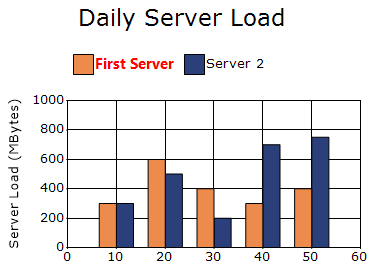

## Placement

The placement, position, alignment, orientation, and floating behavior of the legend can be configured independently.

### Legends placement

The [LegendsPlacement](https://help.syncfusion.com/cr/windowsforms/Syncfusion.Windows.Forms.Chart.ChartControl.html#Syncfusion_Windows_Forms_Chart_ChartControl_LegendsPlacement) property specifies whether legends are displayed inside or outside the chart area.

The following code example places the legend outside the chart area.



chartControl.LegendsPlacement = ChartPlacement.Outside;


chartControl.LegendsPlacement = ChartPlacement.Outside



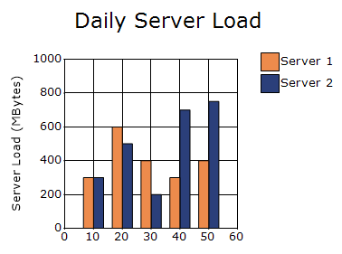

### Docking position

The [Position](https://help.syncfusion.com/cr/windowsforms/Syncfusion.Windows.Forms.Chart.ChartLegend.html#Syncfusion_Windows_Forms_Chart_ChartLegend_Position) property specifies the docking position of the legend. By default [Right](https://help.syncfusion.com/cr/windowsforms/Syncfusion.Windows.Forms.Chart.ChartDock.html#Syncfusion_Windows_Forms_Chart_ChartDock_Right) is applied.

The supported [ChartDock](https://help.syncfusion.com/cr/windowsforms/Syncfusion.Windows.Forms.Chart.ChartDock.html) values are:

- [Top](https://help.syncfusion.com/cr/windowsforms/Syncfusion.Windows.Forms.Chart.ChartDock.html#Syncfusion_Windows_Forms_Chart_ChartDock_Top): Positions the legend at the top of the chart.
- [Bottom](https://help.syncfusion.com/cr/windowsforms/Syncfusion.Windows.Forms.Chart.ChartDock.html#Syncfusion_Windows_Forms_Chart_ChartDock_Bottom): Positions the legend at the bottom of the chart.
- [Left](https://help.syncfusion.com/cr/windowsforms/Syncfusion.Windows.Forms.Chart.ChartDock.html#Syncfusion_Windows_Forms_Chart_ChartDock_Left): Positions the legend on the left side of the chart.
- [Right](https://help.syncfusion.com/cr/windowsforms/Syncfusion.Windows.Forms.Chart.ChartDock.html#Syncfusion_Windows_Forms_Chart_ChartDock_Right): Positions the legend on the right side of the chart.
- [Floating](https://help.syncfusion.com/cr/windowsforms/Syncfusion.Windows.Forms.Chart.ChartDock.html#Syncfusion_Windows_Forms_Chart_ChartDock_Floating): Displays the legend at a floating location instead of positioning it along a chart edge.

The following code example docks the legend at the top.



chartControl.Legend.Position = ChartDock.Top;


chartControl.Legend.Position = ChartDock.Top



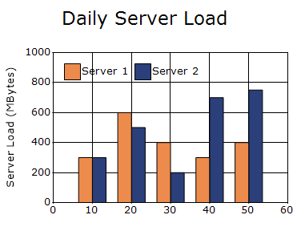

### Legend alignment

The [LegendAlignment](https://help.syncfusion.com/cr/windowsforms/Syncfusion.Windows.Forms.Chart.ChartLegend.html#Syncfusion_Windows_Forms_Chart_ChartLegend_LegendAlignment) property specifies the alignment of the legend. The default value is [Center](https://help.syncfusion.com/cr/windowsforms/Syncfusion.Windows.Forms.Chart.ChartAlignment.html).

The supported [ChartAlignment](https://help.syncfusion.com/cr/windowsforms/Syncfusion.Windows.Forms.Chart.ChartAlignment.html) values are:
 
- [Near](https://help.syncfusion.com/cr/windowsforms/Syncfusion.Windows.Forms.Chart.ChartAlignment.html): Aligns the legend near the starting edge.
- [Center](https://help.syncfusion.com/cr/windowsforms/Syncfusion.Windows.Forms.Chart.ChartAlignment.html): Aligns the legend at the center.
- [Far](https://help.syncfusion.com/cr/windowsforms/Syncfusion.Windows.Forms.Chart.ChartAlignment.html): Aligns the legend near the ending edge.

The following code example far the legend within its docking area.



chartControl.Legend.LegendAlignment = ChartAlignment.Far;


chartControl.Legend.LegendAlignment = ChartAlignment.Far



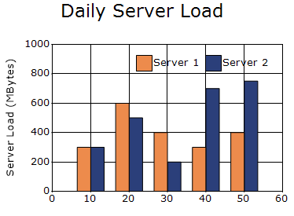

### Floating legend

The following properties customize a floating legend:

- [Location](https://help.syncfusion.com/cr/windowsforms/Syncfusion.Windows.Forms.Chart.ChartDockControl.html#Syncfusion_Windows_Forms_Chart_ChartDockControl_Location): Specifies the floating location.
- [FloatingAutoSize](https://help.syncfusion.com/cr/windowsforms/Syncfusion.Windows.Forms.Chart.ChartLegend.html#Syncfusion_Windows_Forms_Chart_ChartLegend_FloatingAutoSize): Controls whether the legend automatically adjusts its location and size while floating. The default value is `true`.
- [OnlyColumnsForFloating](https://help.syncfusion.com/cr/windowsforms/Syncfusion.Windows.Forms.Chart.ChartLegend.html#Syncfusion_Windows_Forms_Chart_ChartLegend_OnlyColumnsForFloating): Controls whether floating legend items are arranged only in columns. The default value is `true`.

The following code example displays a floating legend.



chartControl.Legend.Position = ChartDock.Floating;
chartControl.Legend.Location = new Point(100, 80);


chartControl.Legend.Position = ChartDock.Floating
chartControl.Legend.Location = New Point(100, 80)



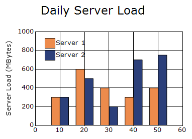

### Legend item layout

The following properties control how legend items are arranged:

- [RowsCount](https://help.syncfusion.com/cr/windowsforms/Syncfusion.Windows.Forms.Chart.ChartLegend.html#Syncfusion_Windows_Forms_Chart_ChartLegend_RowsCount): Specifies the number of rows. The default value is `1`.
- [ColumnsCount](https://help.syncfusion.com/cr/windowsforms/Syncfusion.Windows.Forms.Chart.ChartLegend.html#Syncfusion_Windows_Forms_Chart_ChartLegend_ColumnsCount): Specifies the number of columns. The default value is `1`.
- [Spacing](https://help.syncfusion.com/cr/windowsforms/Syncfusion.Windows.Forms.Chart.ChartLegend.html#Syncfusion_Windows_Forms_Chart_ChartLegend_Spacing): Specifies the spacing between the content and the legend border. The default value is `4`.
- [ItemsAlignment](https://help.syncfusion.com/cr/windowsforms/Syncfusion.Windows.Forms.Chart.ChartLegend.html#Syncfusion_Windows_Forms_Chart_ChartLegend_ItemsAlignment): Specifies the alignment of legend items. The default value is `StringAlignment.Near`.
- [ItemsTextAligment](https://help.syncfusion.com/cr/windowsforms/Syncfusion.Windows.Forms.Chart.ChartLegend.html#Syncfusion_Windows_Forms_Chart_ChartLegend_ItemsTextAligment): Specifies the vertical alignment of item text. The default value is `VerticalAlignment.Center`.
- [ItemsSize](https://help.syncfusion.com/cr/windowsforms/Syncfusion.Windows.Forms.Chart.ChartLegend.html#Syncfusion_Windows_Forms_Chart_ChartLegend_ItemsSize): Specifies the default size of legend items.

The following code example customizes the legend item layout.



chartControl.Legend.RowsCount = 2;
chartControl.Legend.ColumnsCount = 2;
chartControl.Legend.Spacing = 9;
chartControl.Legend.ItemsAlignment = StringAlignment.Near;
chartControl.Legend.ItemsTextAligment = VerticalAlignment.Center;
chartControl.Legend.ItemsSize = new Size(20, 20);


chartControl.Legend.RowsCount = 2
chartControl.Legend.ColumnsCount = 2
chartControl.Legend.Spacing = 9
chartControl.Legend.ItemsAlignment = StringAlignment.Near
chartControl.Legend.ItemsTextAligment = VerticalAlignment.Center
chartControl.Legend.ItemsSize = New Size(20, 20)



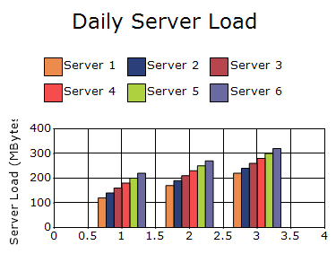

## Customize legend icon

Legend icons can be displayed using the corresponding series type, a series symbol, a predefined representation, a custom symbol, or an image.

### Series type icon

The [RepresentationType](https://help.syncfusion.com/cr/windowsforms/Syncfusion.Windows.Forms.Chart.ChartLegend.html#Syncfusion_Windows_Forms_Chart_ChartLegend_RepresentationType) property specifies how the icon of each legend item is represented. By default, the icon is rendered based on the corresponding series type.

The following code example displays an icon based on the series type.



chartControl.Legend.RepresentationType =
    ChartLegendRepresentationType.SeriesType;


chartControl.Legend.RepresentationType =
    ChartLegendRepresentationType.SeriesType



### Series symbol

The [ShowSymbol](https://help.syncfusion.com/cr/windowsforms/Syncfusion.Windows.Forms.Chart.ChartLegend.html#Syncfusion_Windows_Forms_Chart_ChartLegend_ShowSymbol) property controls whether the symbol used for series data points is displayed in the legend. The default value is `false`.

The following code example displays the series symbol in the legend.



chartControl.Legend.ShowSymbol = true;


chartControl.Legend.ShowSymbol = True



N\> When `ShowSymbol` is enabled, the series data-point symbol is used as the legend icon and can override other representation settings.

### Custom representation icon

The `RepresentationType` property supports the following `ChartLegendRepresentationType` values:

- `Circle`
- `Cross`
- `Diamond`
- `Hexagon`
- `InvertedTriangle`
- `Line`
- `None`
- `Pentagon`
- `Rectangle`
- `SeriesImage`
- `SeriesType`
- `StraightLine`
- `Triangle`

The following code example displays a diamond representation.



chartControl.Legend.RepresentationType =
    ChartLegendRepresentationType.Diamond;


chartControl.Legend.RepresentationType =
    ChartLegendRepresentationType.Diamond



### More symbol shapes

The [Symbol](https://help.syncfusion.com/cr/windowsforms/Syncfusion.Windows.Forms.Chart.ChartLegendItem.html#Syncfusion_Windows_Forms_Chart_ChartLegendItem_Symbol) and [ItemStyle](https://help.syncfusion.com/cr/windowsforms/Syncfusion.Windows.Forms.Chart.ChartLegendItem.html#Syncfusion_Windows_Forms_Chart_ChartLegendItem_ItemStyle) properties customize the shape, size, and color of an individual item symbol.

The following code example displays a pentagon symbol.



ChartLegendItem item = new ChartLegendItem("Sales");
item.ItemStyle.ShowSymbol = true;
item.ItemStyle.Symbol.Shape = ChartSymbolShape.Pentagon;
item.ItemStyle.Symbol.Size = new Size(15, 15);
item.ItemStyle.Symbol.Color = Color.RoyalBlue;

chartControl.Legend.CustomItems = new ChartLegendItem[] { item };


Dim item As New ChartLegendItem("Sales")
item.ItemStyle.ShowSymbol = True
item.ItemStyle.Symbol.Shape = ChartSymbolShape.Pentagon
item.ItemStyle.Symbol.Size = New Size(15, 15)
item.ItemStyle.Symbol.Color = Color.RoyalBlue

chartControl.Legend.CustomItems = New ChartLegendItem() {item}



### Custom images

The following properties customize an image-based legend item:

- [Image](https://help.syncfusion.com/cr/windowsforms/Syncfusion.Windows.Forms.Chart.ChartLegendItem.html#Syncfusion_Windows_Forms_Chart_ChartLegendItem_Image): Specifies an image directly.
- [ImageList](https://help.syncfusion.com/cr/windowsforms/Syncfusion.Windows.Forms.Chart.ChartLegendItem.html#Syncfusion_Windows_Forms_Chart_ChartLegendItem_ImageList): Specifies the image collection associated with the item.
- [ImageIndex](https://help.syncfusion.com/cr/windowsforms/Syncfusion.Windows.Forms.Chart.ChartLegendItem.html#Syncfusion_Windows_Forms_Chart_ChartLegendItem_ImageIndex): Specifies the image index within the collection.
- [RepresentationSize](https://help.syncfusion.com/cr/windowsforms/Syncfusion.Windows.Forms.Chart.ChartLegendItem.html#Syncfusion_Windows_Forms_Chart_ChartLegendItem_RepresentationSize): Specifies the size of the representation icon.
- [IconAlignment](https://help.syncfusion.com/cr/windowsforms/Syncfusion.Windows.Forms.Chart.ChartLegendItem.html#Syncfusion_Windows_Forms_Chart_ChartLegendItem_IconAlignment): Specifies whether the icon is displayed to the left or right of the text.

The following code example applies an image directly to a legend item.



ChartLegendItem item = new ChartLegendItem("Target");
item.Image = Image.FromFile("target.png");
item.ShowIcon = true;
item.RepresentationSize = new Size(20, 20);
item.IconAlignment = LeftRightAlignment.Left;

chartControl.Legend.CustomItems = new ChartLegendItem[] { item };


Dim item As New ChartLegendItem("Target")
item.Image = Image.FromFile("target.png")
item.ShowIcon = True
item.RepresentationSize = New Size(20, 20)
item.IconAlignment = LeftRightAlignment.Left

chartControl.Legend.CustomItems = New ChartLegendItem() {item}



### Hiding icons

Set the `ShowIcon` property to `false` to hide an individual legend-item icon. The `ChartLegendRepresentationType.None` value can be used to disable the common legend representation where supported.

The following code example hides the icon of the first legend item.



if (chartControl.Legend.Items.Length > 0)
{
    chartControl.Legend.Items[0].ShowIcon = false;
}


If chartControl.Legend.Items.Length > 0 Then
    chartControl.Legend.Items(0).ShowIcon = False
End If



## Legend appearance

The legend background, border, and item shadows can be customized independently.

### Legend background

The [BackColor](https://help.syncfusion.com/cr/windowsforms/Syncfusion.Windows.Forms.Chart.ChartLegend.html#Syncfusion_Windows_Forms_Chart_ChartLegend_BackColor) property specifies a solid legend background. The [BackInterior](https://help.syncfusion.com/cr/windowsforms/Syncfusion.Windows.Forms.Chart.ChartLegend.html#Syncfusion_Windows_Forms_Chart_ChartLegend_BackInterior) property accepts a `BrushInfo` and supports solid or gradient backgrounds.

The following code example applies a vertical gradient background.



chartControl.Legend.BackInterior = new BrushInfo(
    GradientStyle.Vertical,
    Color.White,
    Color.LightBlue);


chartControl.Legend.BackInterior = New BrushInfo(
    GradientStyle.Vertical,
    Color.White,
    Color.LightBlue)



### Legend border

The [ShowBorder](https://help.syncfusion.com/cr/windowsforms/Syncfusion.Windows.Forms.Chart.ChartLegend.html#Syncfusion_Windows_Forms_Chart_ChartLegend_ShowBorder) property controls whether the legend border is displayed. The [Border](https://help.syncfusion.com/cr/windowsforms/Syncfusion.Windows.Forms.Chart.ChartLegend.html#Syncfusion_Windows_Forms_Chart_ChartLegend_Border) property gets the `LineInfo` used to draw the border.

N\> The `Border` property is get-only. Customize its individual line settings directly.

The following code example displays and customizes the legend border.



chartControl.Legend.ShowBorder = true;
chartControl.Legend.Border.ForeColor = Color.DarkBlue;
chartControl.Legend.Border.Width = 2;
chartControl.Legend.Border.DashStyle = DashStyle.Solid;


chartControl.Legend.ShowBorder = True
chartControl.Legend.Border.ForeColor = Color.DarkBlue
chartControl.Legend.Border.Width = 2
chartControl.Legend.Border.DashStyle = DashStyle.Solid



### Legend-item shadow

The following properties apply a common shadow to all legend items:

- [ShowItemsShadow](https://help.syncfusion.com/cr/windowsforms/Syncfusion.Windows.Forms.Chart.ChartLegend.html#Syncfusion_Windows_Forms_Chart_ChartLegend_ShowItemsShadow): Controls whether item shadows are displayed.
- [ItemsShadowColor](https://help.syncfusion.com/cr/windowsforms/Syncfusion.Windows.Forms.Chart.ChartLegend.html#Syncfusion_Windows_Forms_Chart_ChartLegend_ItemsShadowColor): Specifies the shadow color.
- [ItemsShadowOffset](https://help.syncfusion.com/cr/windowsforms/Syncfusion.Windows.Forms.Chart.ChartLegend.html#Syncfusion_Windows_Forms_Chart_ChartLegend_ItemsShadowOffset): Specifies the shadow offset.

The following code example applies a shadow to all legend items.



chartControl.Legend.ShowItemsShadow = true;
chartControl.Legend.ItemsShadowColor = Color.Gray;
chartControl.Legend.ItemsShadowOffset = new Size(2, 2);


chartControl.Legend.ShowItemsShadow = True
chartControl.Legend.ItemsShadowColor = Color.Gray
chartControl.Legend.ItemsShadowOffset = New Size(2, 2)



## Adding custom legends

Additional [ChartLegend](https://help.syncfusion.com/cr/windowsforms/Syncfusion.Windows.Forms.Chart.ChartLegend.html) instances can be added when separate legends are required for different series. Assign the legend name to the series [LegendName](https://help.syncfusion.com/cr/windowsforms/Syncfusion.Windows.Forms.Chart.ChartSeries.html#Syncfusion_Windows_Forms_Chart_ChartSeries_LegendName) property.

The following code example creates two legends and associates a series with each legend.



chartControl.Legend.Visible = false;
chartControl.LegendsPlacement = ChartPlacement.Outside;

ChartLegend salesLegend = new ChartLegend(chartControl);
salesLegend.Name = "Sales";
salesLegend.Position = ChartDock.Top;

ChartLegend targetLegend = new ChartLegend(chartControl);
targetLegend.Name = "Target";
targetLegend.Position = ChartDock.Bottom;

salesSeries.LegendName = "Sales";
targetSeries.LegendName = "Target";

chartControl.Legends.Add(salesLegend);
chartControl.Legends.Add(targetLegend);


chartControl.Legend.Visible = False
chartControl.LegendsPlacement = ChartPlacement.Outside

Dim salesLegend As New ChartLegend(chartControl)
salesLegend.Name = "Sales"
salesLegend.Position = ChartDock.Top

Dim targetLegend As New ChartLegend(chartControl)
targetLegend.Name = "Target"
targetLegend.Position = ChartDock.Bottom

salesSeries.LegendName = "Sales"
targetSeries.LegendName = "Target"

chartControl.Legends.Add(salesLegend)
chartControl.Legends.Add(targetLegend)



## Adding custom legend items

The [ChartLegendItem](https://help.syncfusion.com/cr/windowsforms/Syncfusion.Windows.Forms.Chart.ChartLegendItem.html) class creates legend items that are not generated from chart series. Assign the items to the [CustomItems](https://help.syncfusion.com/cr/windowsforms/Syncfusion.Windows.Forms.Chart.ChartLegend.html#Syncfusion_Windows_Forms_Chart_ChartLegend_CustomItems) property.

The following code example adds two custom legend items.



ChartLegendItem plannedItem = new ChartLegendItem("Planned");
plannedItem.Interior = new BrushInfo(Color.SteelBlue);

ChartLegendItem actualItem = new ChartLegendItem("Actual");
actualItem.Interior = new BrushInfo(Color.Orange);

chartControl.Legend.CustomItems = new ChartLegendItem[]
{
    plannedItem,
    actualItem
};


Dim plannedItem As New ChartLegendItem("Planned")
plannedItem.Interior = New BrushInfo(Color.SteelBlue)

Dim actualItem As New ChartLegendItem("Actual")
actualItem.Interior = New BrushInfo(Color.Orange)

chartControl.Legend.CustomItems = New ChartLegendItem() {
    plannedItem,
    actualItem
}



## Customization of custom legend item

The following `ChartLegendItem` properties customize an individual custom legend item:

- `Text`, `TextColor`, `TextLines`, and `Font`
- `Interior`, `Border`, and `BorderColor`
- `ShowIcon`, `Image`, `ImageList`, and `ImageIndex`
- `ShowSymbol`, `Symbol`, and `RepresentationSize`
- `Visible`, `VisibleCheckBox`, and `IsChecked`
- `ShowShadow`, `ShadowColor`, and `ShadowOffset`
- `IconAlignment`, `Spacing`, and `ItemStyle`

The following code example customizes the appearance of a custom legend item.



ChartLegendItem item = new ChartLegendItem("Target");
item.ItemStyle.Interior = new BrushInfo(Color.LightBlue);
item.ItemStyle.BorderColor = Color.DarkBlue;
item.ItemStyle.TextColor = Color.Navy;
item.ItemStyle.Font = new Font("Segoe UI", 9, FontStyle.Bold);
item.ItemStyle.ShowSymbol = true;
item.ItemStyle.Symbol.Shape = ChartSymbolShape.Diamond;
item.ShowShadow = true;
item.ShadowColor = Color.Gray;

chartControl.Legend.CustomItems = new ChartLegendItem[] { item };


Dim item As New ChartLegendItem("Target")
item.ItemStyle.Interior = New BrushInfo(Color.LightBlue)
item.ItemStyle.BorderColor = Color.DarkBlue
item.ItemStyle.TextColor = Color.Navy
item.ItemStyle.Font = New Font("Segoe UI", 9, FontStyle.Bold)
item.ItemStyle.ShowSymbol = True
item.ItemStyle.Symbol.Shape = ChartSymbolShape.Diamond
item.ShowShadow = True
item.ShadowColor = Color.Gray

chartControl.Legend.CustomItems = New ChartLegendItem() {item}



N\> The `SetDefSizeForCustom` property is obsolete. Do not use it in new applications.

## Customizing items through event

The following events support advanced legend-item customization:

- [DrawItem](https://help.syncfusion.com/cr/windowsforms/Syncfusion.Windows.Forms.Chart.ChartLegend.html#Syncfusion_Windows_Forms_Chart_ChartLegend_DrawItem): Occurs when a legend item is drawn.
- [DrawItemText](https://help.syncfusion.com/cr/windowsforms/Syncfusion.Windows.Forms.Chart.ChartLegend.html#Syncfusion_Windows_Forms_Chart_ChartLegend_DrawItemText): Occurs when legend-item text is drawn.
- [FilterItems](https://help.syncfusion.com/cr/windowsforms/Syncfusion.Windows.Forms.Chart.ChartLegend.html#Syncfusion_Windows_Forms_Chart_ChartLegend_FilterItems): Occurs before legend items are rendered and allows the collection to be filtered.
- [MinSize](https://help.syncfusion.com/cr/windowsforms/Syncfusion.Windows.Forms.Chart.ChartLegend.html#Syncfusion_Windows_Forms_Chart_ChartLegend_MinSize): Occurs when the minimum legend size is calculated.

The following code example registers the legend-item customization events.



chartControl.Legend.DrawItem += Legend_DrawItem;
chartControl.Legend.DrawItemText += Legend_DrawItemText;
chartControl.Legend.FilterItems += Legend_FilterItems;
chartControl.Legend.MinSize += Legend_MinSize;


AddHandler chartControl.Legend.DrawItem,
    AddressOf Legend_DrawItem

AddHandler chartControl.Legend.DrawItemText,
    AddressOf Legend_DrawItemText

AddHandler chartControl.Legend.FilterItems,
    AddressOf Legend_FilterItems

AddHandler chartControl.Legend.MinSize,
    AddressOf Legend_MinSize



## Changing legend properties at run time

Legend appearance, position, layout, items, and visibility can be changed at run time. Use the [Refresh](https://help.syncfusion.com/cr/windowsforms/Syncfusion.Windows.Forms.Chart.ChartLegend.html#Syncfusion_Windows_Forms_Chart_ChartLegend_Refresh) method when an immediate visual update is required.

The following code example changes legend properties at run time.



chartControl.Legend.Position = ChartDock.Right;
chartControl.Legend.BackColor = Color.AliceBlue;
chartControl.Legend.ShowBorder = true;
chartControl.Legend.Refresh();


chartControl.Legend.Position = ChartDock.Right
chartControl.Legend.BackColor = Color.AliceBlue
chartControl.Legend.ShowBorder = True
chartControl.Legend.Refresh()



## Find a legend item by location

The [GetItemBy](https://help.syncfusion.com/cr/windowsforms/Syncfusion.Windows.Forms.Chart.ChartLegend.html) method returns the legend item at a specified client coordinate.

The following code example retrieves the legend item under the mouse pointer.



Point point = chartControl.Legend.PointToClient(Cursor.Position);
ChartLegendItem item = chartControl.Legend.GetItemBy(point);

if (item != null)
{
    MessageBox.Show(item.Text);
}


Dim point As Point =
    chartControl.Legend.PointToClient(Cursor.Position)

Dim item As ChartLegendItem =
    chartControl.Legend.GetItemBy(point)

If item IsNot Nothing Then
    MessageBox.Show(item.Text)
End If



## Legend size

The [GetMinSize](https://help.syncfusion.com/cr/windowsforms/Syncfusion.Windows.Forms.Chart.ChartLegend.html) method calculates the minimum size required to display all legend items. Use the `MinSize` event when the calculated minimum size must be customized.

## See also

- [How to customize ChartLegend items in WinForms Chart](https://support.syncfusion.com/kb/article/1266/how-to-customize-chartlegend-items-in-a-winforms-chart)
- [How to create multiple legends for a ChartControl](https://support.syncfusion.com/kb/article/1067/how-to-create-multiple-legends-for-a-chart-control-in-winforms)
- [ChartLegend API reference](https://help.syncfusion.com/cr/windowsforms/Syncfusion.Windows.Forms.Chart.ChartLegend.html)
- [ChartLegendItem API reference](https://help.syncfusion.com/cr/windowsforms/Syncfusion.Windows.Forms.Chart.ChartLegendItem.html)