# Legend in Windows Forms Chart

The legend identifies the data series and chart elements displayed in the chart. Each legend item usually represents a chart series and can display text, an icon, a symbol, an image, or a checkbox.

## Defining the legend

By default, a [ChartLegend](https://help.syncfusion.com/cr/windowsforms/Syncfusion.Windows.Forms.Chart.ChartLegend.html) instance is added to the chart's [Legends](https://help.syncfusion.com/cr/windowsforms/Syncfusion.Windows.Forms.Chart.ChartControl.html#Syncfusion_Windows_Forms_Chart_ChartControl_Legends) collection. This default legend can be accessed and customized through the [Legend](https://help.syncfusion.com/cr/windowsforms/Syncfusion.Windows.Forms.Chart.ChartControl.html#Syncfusion_Windows_Forms_Chart_ChartControl_Legend) property.

The following code customizes the default legend alignment and position.



chartControl.Legend.Alignment = ChartAlignment.Center;
chartControl.Legend.Position = ChartDock.Top;


chartControl.Legend.Alignment = ChartAlignment.Center
chartControl.Legend.Position = ChartDock.Top



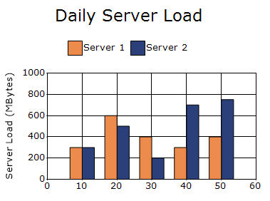

## Chart legend item

A legend item is represented by the [ChartLegendItem](https://help.syncfusion.com/cr/windowsforms/Syncfusion.Windows.Forms.Chart.ChartLegendItem.html) class.

### Default series legend items

Each [ChartSeries](https://help.syncfusion.com/cr/windowsforms/Syncfusion.Windows.Forms.Chart.ChartSeries.html) is associated with a [ChartLegendItem](https://help.syncfusion.com/cr/windowsforms/Syncfusion.Windows.Forms.Chart.ChartLegendItem.html), which is automatically displayed in the default [ChartLegend](https://help.syncfusion.com/cr/windowsforms/Syncfusion.Windows.Forms.Chart.ChartLegend.html).
 
To display the series in a custom legend, set the [LegendName](https://help.syncfusion.com/cr/windowsforms/Syncfusion.Windows.Forms.Chart.ChartSeries.html#Syncfusion_Windows_Forms_Chart_ChartSeries_LegendName) property to the name of the target legend.
 
The following code example associates a series with a custom legend.



//Specifies the custom ChartLegend with which this series' legend item should be associated with
series1.LegendName = "MyLegend";


'Specifies the custom ChartLegend with which this series' legend item should be associated with
series1.LegendName = "MyLegend"



## Legend visibility

The visibility of the default legend, a legend instance, a series legend item, and an chart legend item can be controlled independently.

### Show legend

The [ShowLegend](https://help.syncfusion.com/cr/windowsforms/Syncfusion.Windows.Forms.Chart.ChartControl.html#Syncfusion_Windows_Forms_Chart_ChartControl_ShowLegend) property controls whether the chart displays the default legend. The default value is `true`.

The following code example hides the default legend.




chartControl.ShowLegend = false;




chartControl.ShowLegend = False


S

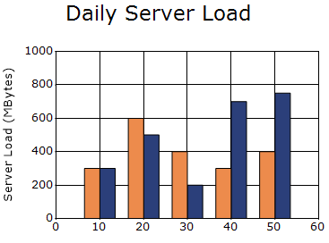

### Chart legend visibility

The `Visible` property controls whether a specific [ChartLegend](https://help.syncfusion.com/cr/windowsforms/Syncfusion.Windows.Forms.Chart.ChartLegend.html) instance is displayed or not. This property can be used for the default legend or any additional legend added to the chart. The default value is `true`.

The following code example hides the default [ChartLegend](https://help.syncfusion.com/cr/windowsforms/Syncfusion.Windows.Forms.Chart.ChartLegend.html) instance.




chartControl.Legend.Visible = false;




chartControl.Legend.Visible = False




### Series legend item visibility

The [LegendItem](https://help.syncfusion.com/cr/windowsforms/Syncfusion.Windows.Forms.Chart.ChartSeries.html#Syncfusion_Windows_Forms_Chart_ChartSeries_LegendItem) property provides access to the legend item associated with a chart series. The `Visible` property of the legend item controls whether the legend is displayed without hiding the corresponding series. The default value is `true`.

The following code example hides the legend item associated with the series.




series.LegendItem.Visible = false;




series.LegendItem.Visible = False




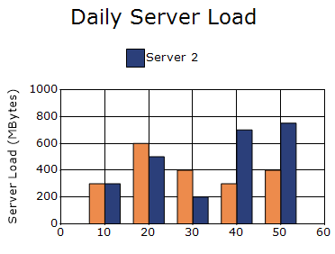

### Chart legend item visibility

The [Items](https://help.syncfusion.com/cr/windowsforms/Syncfusion.Windows.Forms.Chart.ChartLegend.html#Syncfusion_Windows_Forms_Chart_ChartLegend_Items) property returns the legend items automatically generated for the chart series. Set the [Visible](https://help.syncfusion.com/cr/windowsforms/Syncfusion.Windows.Forms.Chart.ChartLegendItem.html#Syncfusion_Windows_Forms_Chart_ChartLegendItem_Visible) property of an item to show or hide that legend item. The default value is `true`.

The following code example hides the second auto-generated legend item.




chartControl.Legend.Items[1].Visible = false;




chartControl.Legend.Items(1).Visible = False




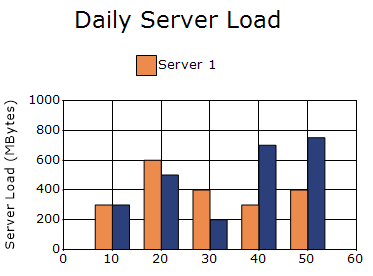

### Legend item icon visibility

The [ShowIcon](https://help.syncfusion.com/cr/windowsforms/Syncfusion.Windows.Forms.Chart.ChartLegendItem.html#Syncfusion_Windows_Forms_Chart_ChartLegendItem_ShowIcon) property controls whether the icon of an individual legend item is displayed. The default value is `true`.

The following code example hides the icon of the first legend item.



chartControl.Legend.Items[0].ShowIcon = false;




chartControl.Legend.Items(0).ShowIcon = False




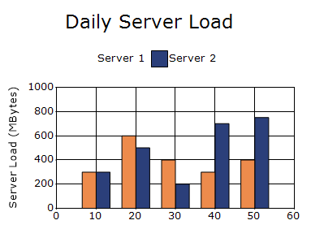

## Toggle series visibility

The legend supports checkbox-based visibility control for all series or individual legend items.

### Legend checkbox visibility

The [VisibleCheckBox](https://help.syncfusion.com/cr/windowsforms/Syncfusion.Windows.Forms.Chart.ChartLegend.html#Syncfusion_Windows_Forms_Chart_ChartLegend_VisibleCheckBox) property controls whether checkboxes are displayed for all legend items in the legend. If this checkbox is unchecked, the corresponding series will disappear from the chart plot. The default value is `false`.

The following code example displays checkboxes for all legend items.




chartControl.Legend.VisibleCheckBox = true;




chartControl.Legend.VisibleCheckBox = True




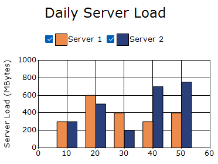

### Legend item checkbox visibility

The [VisibleCheckBox](https://help.syncfusion.com/cr/windowsforms/Syncfusion.Windows.Forms.Chart.ChartLegendItem.html#Syncfusion_Windows_Forms_Chart_ChartLegendItem_VisibleCheckBox) property controls whether the checkbox is displayed for an individual legend item. The default value is `false`.

N> [ChartLegend.VisibleCheckBox](https://help.syncfusion.com/cr/windowsforms/Syncfusion.Windows.Forms.Chart.ChartLegend.html#Syncfusion_Windows_Forms_Chart_ChartLegend_VisibleCheckBox) applies to all legend items, whereas [ChartLegendItem.VisibleCheckBox](https://help.syncfusion.com/cr/windowsforms/Syncfusion.Windows.Forms.Chart.ChartLegendItem.html#Syncfusion_Windows_Forms_Chart_ChartLegendItem_VisibleCheckBox) applies only to the specified legend item.

The following code example displays the checkbox only for the first legend item.



chartControl.Legend.Items[0].VisibleCheckBox = true;


chartControl.Legend.Items(0).VisibleCheckBox = True



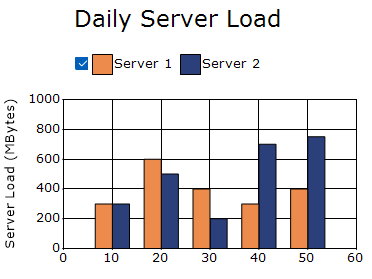

### Legend item checked state

The [IsChecked](https://help.syncfusion.com/cr/windowsforms/Syncfusion.Windows.Forms.Chart.ChartLegendItem.html#Syncfusion_Windows_Forms_Chart_ChartLegendItem_IsChecked) property specifies the checked state of an individual legend item. The default value is `true`.

N> To use the [IsChecked](https://help.syncfusion.com/cr/windowsforms/Syncfusion.Windows.Forms.Chart.ChartLegendItem.html#Syncfusion_Windows_Forms_Chart_ChartLegendItem_IsChecked) property, enable the checkbox by setting either [ChartLegend.VisibleCheckBox](https://help.syncfusion.com/cr/windowsforms/Syncfusion.Windows.Forms.Chart.ChartLegend.html#Syncfusion_Windows_Forms_Chart_ChartLegend_VisibleCheckBox) or [ChartLegendItem.VisibleCheckBox](https://help.syncfusion.com/cr/windowsforms/Syncfusion.Windows.Forms.Chart.ChartLegendItem.html#Syncfusion_Windows_Forms_Chart_ChartLegendItem_VisibleCheckBox) to `true`.

The following code example unchecks the first legend item.



chartControl.Legend.Items[0].IsChecked = false;


chartControl.Legend.Items(0).IsChecked = False



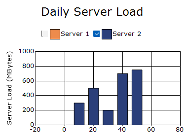

## Customizing labels

The legend title and individual item labels can be customized independently.

### Legend title customization

The following properties customize the legend title:

- [Text](https://help.syncfusion.com/cr/windowsforms/Syncfusion.Windows.Forms.Chart.ChartLegend.html#Syncfusion_Windows_Forms_Chart_ChartLegend_Text): Specifies the legend title text. The default value is `empty string`.
- [ForeColor](https://help.syncfusion.com/cr/windowsforms/Syncfusion.Windows.Forms.Chart.ChartLegend.html): Specifies the title color. The default value is `Color.Black`.
- [TextAlignment](https://help.syncfusion.com/cr/windowsforms/Syncfusion.Windows.Forms.Chart.ChartLegend.html#Syncfusion_Windows_Forms_Chart_ChartLegend_TextAlignment): Specifies the alignment of the legend title text. The default value is `StringAlignment.Center`.
- The supported [StringAlignment](https://learn.microsoft.com/en-us/dotnet/api/system.drawing.stringalignment?view=net-11.0-pp) values are:
  - `Near`: Aligns the title near the starting edge.
  - `Center`: Aligns the title at the center.
  - `Far`: Aligns the title near the ending edge.
- [Font](https://help.syncfusion.com/cr/windowsforms/Syncfusion.Windows.Forms.Chart.ChartLegend.html#Syncfusion_Windows_Forms_Chart_ChartLegend_Font): Specifies the font used by the legend. The default font style is `Verdana, 8f, Regular`.

N> The [TextColor](https://help.syncfusion.com/cr/windowsforms/Syncfusion.Windows.Forms.Chart.ChartLegend.html#Syncfusion_Windows_Forms_Chart_ChartLegend_TextColor) property is obsolete. Use the [ForeColor](https://help.syncfusion.com/cr/windowsforms/Syncfusion.Windows.Forms.Chart.ChartLegend.html) property instead.

The following code example customizes the legend title.



chartControl.Legend.Text = "Servers";
chartControl.Legend.ForeColor = Color.Red;
chartControl.Legend.TextAlignment = StringAlignment.Center;
chartControl.Legend.Font = new Font("Segoe UI", 10, FontStyle.Bold);


chartControl.Legend.Text = "Servers"
chartControl.Legend.ForeColor = Color.Red
chartControl.Legend.TextAlignment = StringAlignment.Center
chartControl.Legend.Font = New Font("Segoe UI", 10, FontStyle.Bold)



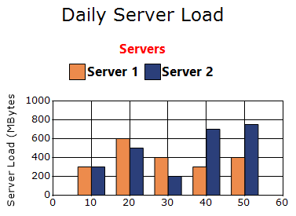

### Legend item text

The following properties customize an individual legend item label:

- [Text](https://help.syncfusion.com/cr/windowsforms/Syncfusion.Windows.Forms.Chart.ChartLegendItem.html#Syncfusion_Windows_Forms_Chart_ChartLegendItem_Text): Specifies the item text. By default, the corresponding series name is displayed.
- [TextColor](https://help.syncfusion.com/cr/windowsforms/Syncfusion.Windows.Forms.Chart.ChartLegendItem.html#Syncfusion_Windows_Forms_Chart_ChartLegendItem_TextColor): Specifies the item text color. The default value is `Color.Black`.
- [Font](https://help.syncfusion.com/cr/windowsforms/Syncfusion.Windows.Forms.Chart.ChartLegendItem.html#Syncfusion_Windows_Forms_Chart_ChartLegendItem_Font): Specifies the item font. The default value is `null`.
- [TextLines](https://help.syncfusion.com/cr/windowsforms/Syncfusion.Windows.Forms.Chart.ChartLegendItem.html#Syncfusion_Windows_Forms_Chart_ChartLegendItem_TextLines): Specifies multiple lines of item text. By default, it reflects the value of the [Text](https://help.syncfusion.com/cr/windowsforms/Syncfusion.Windows.Forms.Chart.ChartLegendItem.html#Syncfusion_Windows_Forms_Chart_ChartLegendItem_Text) property.
- [TextAligment](https://help.syncfusion.com/cr/windowsforms/Syncfusion.Windows.Forms.Chart.ChartLegendItem.html#Syncfusion_Windows_Forms_Chart_ChartLegendItem_TextAligment): Specifies the vertical alignment of the item text. The default value is [Center](https://help.syncfusion.com/cr/windowsforms/Syncfusion.Windows.Forms.Chart.VerticalAlignment.html#Syncfusion_Windows_Forms_Chart_VerticalAlignment_Center). The supported [VerticalAlignment](https://help.syncfusion.com/cr/windowsforms/Syncfusion.Windows.Forms.Chart.VerticalAlignment.html) values are:
    - [Top](https://help.syncfusion.com/cr/windowsforms/Syncfusion.Windows.Forms.Chart.VerticalAlignment.html#Syncfusion_Windows_Forms_Chart_VerticalAlignment_Top): Aligns the text at the top of the legend item.
    - [Center](https://help.syncfusion.com/cr/windowsforms/Syncfusion.Windows.Forms.Chart.VerticalAlignment.html#Syncfusion_Windows_Forms_Chart_VerticalAlignment_Center): Aligns the text at the center of the legend item.
    - [Bottom](https://help.syncfusion.com/cr/windowsforms/Syncfusion.Windows.Forms.Chart.VerticalAlignment.html#Syncfusion_Windows_Forms_Chart_VerticalAlignment_Bottom): Aligns the text at the bottom of the legend item.

The following code example customizes the first legend item label.



ChartLegendItem item = chartControl.Legend.Items[0];
item.Text = "First Server";
item.TextColor = Color.Red;
item.Font = new Font("Segoe UI", 9, FontStyle.Bold);


Dim item As ChartLegendItem = chartControl.Legend.Items(0)
item.Text = "First Server"
item.TextColor = Color.Red
item.Font = New Font("Segoe UI", 9, FontStyle.Bold)



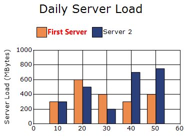

## Legends placement

The [LegendsPlacement](https://help.syncfusion.com/cr/windowsforms/Syncfusion.Windows.Forms.Chart.ChartControl.html#Syncfusion_Windows_Forms_Chart_ChartControl_LegendsPlacement) property specifies whether legends are displayed inside or outside the chart area. The default value is [Inside](https://help.syncfusion.com/cr/windowsforms/Syncfusion.Windows.Forms.Chart.ChartPlacement.html#Syncfusion_Windows_Forms_Chart_ChartPlacement_Inside).

The following values are supported:
 
- [Inside](https://help.syncfusion.com/cr/windowsforms/Syncfusion.Windows.Forms.Chart.ChartPlacement.html#Syncfusion_Windows_Forms_Chart_ChartPlacement_Inside): Displays the legend within the chart area.
- [Outside](https://help.syncfusion.com/cr/windowsforms/Syncfusion.Windows.Forms.Chart.ChartPlacement.html#Syncfusion_Windows_Forms_Chart_ChartPlacement_Outside): Displays the legend outside the chart area.

The following code example places the legend outside the chart area.



chartControl.LegendsPlacement = ChartPlacement.Outside;


chartControl.LegendsPlacement = ChartPlacement.Outside



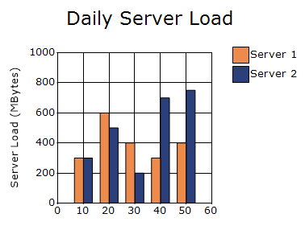

## Docking position

The [Position](https://help.syncfusion.com/cr/windowsforms/Syncfusion.Windows.Forms.Chart.ChartLegend.html#Syncfusion_Windows_Forms_Chart_ChartLegend_Position) property specifies the docking position of the legend. By default [Right](https://help.syncfusion.com/cr/windowsforms/Syncfusion.Windows.Forms.Chart.ChartDock.html#Syncfusion_Windows_Forms_Chart_ChartDock_Right) is applied.

The supported [ChartDock](https://help.syncfusion.com/cr/windowsforms/Syncfusion.Windows.Forms.Chart.ChartDock.html) values are:

- [Top](https://help.syncfusion.com/cr/windowsforms/Syncfusion.Windows.Forms.Chart.ChartDock.html#Syncfusion_Windows_Forms_Chart_ChartDock_Top): Positions the legend at the top of the chart.
- [Bottom](https://help.syncfusion.com/cr/windowsforms/Syncfusion.Windows.Forms.Chart.ChartDock.html#Syncfusion_Windows_Forms_Chart_ChartDock_Bottom): Positions the legend at the bottom of the chart.
- [Left](https://help.syncfusion.com/cr/windowsforms/Syncfusion.Windows.Forms.Chart.ChartDock.html#Syncfusion_Windows_Forms_Chart_ChartDock_Left): Positions the legend on the left side of the chart.
- [Right](https://help.syncfusion.com/cr/windowsforms/Syncfusion.Windows.Forms.Chart.ChartDock.html#Syncfusion_Windows_Forms_Chart_ChartDock_Right): Positions the legend on the right side of the chart.
- [Floating](https://help.syncfusion.com/cr/windowsforms/Syncfusion.Windows.Forms.Chart.ChartDock.html#Syncfusion_Windows_Forms_Chart_ChartDock_Floating): Displays the legend at a floating location instead of positioning it along a chart edge.

The following code example docks the legend at the top.



chartControl.Legend.Position = ChartDock.Top;


chartControl.Legend.Position = ChartDock.Top



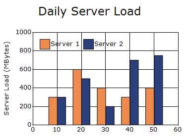

## Legend alignment

The [LegendAlignment](https://help.syncfusion.com/cr/windowsforms/Syncfusion.Windows.Forms.Chart.ChartLegend.html#Syncfusion_Windows_Forms_Chart_ChartLegend_LegendAlignment) property specifies the alignment of the legend. The default value is [Center](https://help.syncfusion.com/cr/windowsforms/Syncfusion.Windows.Forms.Chart.ChartAlignment.html).

The supported [ChartAlignment](https://help.syncfusion.com/cr/windowsforms/Syncfusion.Windows.Forms.Chart.ChartAlignment.html) values are:
 
- [Near](https://help.syncfusion.com/cr/windowsforms/Syncfusion.Windows.Forms.Chart.ChartAlignment.html): Aligns the legend near the starting edge.
- [Center](https://help.syncfusion.com/cr/windowsforms/Syncfusion.Windows.Forms.Chart.ChartAlignment.html): Aligns the legend at the center.
- [Far](https://help.syncfusion.com/cr/windowsforms/Syncfusion.Windows.Forms.Chart.ChartAlignment.html): Aligns the legend near the ending edge.

The following code example far the legend within its docking area.



chartControl.Legend.LegendAlignment = ChartAlignment.Far;


chartControl.Legend.LegendAlignment = ChartAlignment.Far



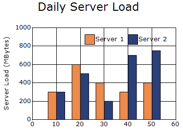

## Floating legend

The following properties customize a floating legend:

- [Location](https://help.syncfusion.com/cr/windowsforms/Syncfusion.Windows.Forms.Chart.ChartDockControl.html#Syncfusion_Windows_Forms_Chart_ChartDockControl_Location): Specifies the floating location.
- [FloatingAutoSize](https://help.syncfusion.com/cr/windowsforms/Syncfusion.Windows.Forms.Chart.ChartLegend.html#Syncfusion_Windows_Forms_Chart_ChartLegend_FloatingAutoSize): Controls whether the legend automatically adjusts its location and size while floating. The default value is `true`.

The following code example displays a floating legend.



chartControl.Legend.Position = ChartDock.Floating;
chartControl.Legend.Location = new Point(100, 80);


chartControl.Legend.Position = ChartDock.Floating
chartControl.Legend.Location = New Point(100, 80)



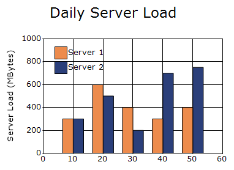

## Legend layout

The following properties control how legend items are arranged:

- [RowsCount](https://help.syncfusion.com/cr/windowsforms/Syncfusion.Windows.Forms.Chart.ChartLegend.html#Syncfusion_Windows_Forms_Chart_ChartLegend_RowsCount): Specifies the number of rows for the legend. The default value is `1`.
- [ColumnsCount](https://help.syncfusion.com/cr/windowsforms/Syncfusion.Windows.Forms.Chart.ChartLegend.html#Syncfusion_Windows_Forms_Chart_ChartLegend_ColumnsCount): Specifies the number of columns for the legend. The default value is `1`.
- [Spacing](https://help.syncfusion.com/cr/windowsforms/Syncfusion.Windows.Forms.Chart.ChartLegend.html#Syncfusion_Windows_Forms_Chart_ChartLegend_Spacing): Specifies the spacing between the content and the legend border. The default value is `4`.
- [ItemsAlignment](https://help.syncfusion.com/cr/windowsforms/Syncfusion.Windows.Forms.Chart.ChartLegend.html#Syncfusion_Windows_Forms_Chart_ChartLegend_ItemsAlignment): Specifies the alignment of legend items. The default value is `StringAlignment.Near`. It support the following values:
    - Near
    - Center
    - Far
- [ItemsTextAligment](https://help.syncfusion.com/cr/windowsforms/Syncfusion.Windows.Forms.Chart.ChartLegend.html#Syncfusion_Windows_Forms_Chart_ChartLegend_ItemsTextAligment): Specifies the vertical alignment of item text. The default value is [Center](https://help.syncfusion.com/cr/windowsforms/Syncfusion.Windows.Forms.Chart.VerticalAlignment.html#Syncfusion_Windows_Forms_Chart_VerticalAlignment_Center).
The following vertical alignment options are supported:
    - [Top](https://help.syncfusion.com/cr/windowsforms/Syncfusion.Windows.Forms.Chart.VerticalAlignment.html#Syncfusion_Windows_Forms_Chart_VerticalAlignment_Top) - Aligns the legend item text to the top of the legend item area.
    - [Center](https://help.syncfusion.com/cr/windowsforms/Syncfusion.Windows.Forms.Chart.VerticalAlignment.html#Syncfusion_Windows_Forms_Chart_VerticalAlignment_Center) - Centers the legend item text vertically within the legend item area.
    - [Bottom](https://help.syncfusion.com/cr/windowsforms/Syncfusion.Windows.Forms.Chart.VerticalAlignment.html#Syncfusion_Windows_Forms_Chart_VerticalAlignment_Bottom) - Aligns the legend item text to the bottom of the legend item area.
- [ItemsSize](https://help.syncfusion.com/cr/windowsforms/Syncfusion.Windows.Forms.Chart.ChartLegend.html#Syncfusion_Windows_Forms_Chart_ChartLegend_ItemsSize): Specifies the default size of legend item rectangle. The specified size is ignored if it is insufficient to render the legend item text.

The following code example customizes the legend item layout.



chartControl.Legend.RowsCount = 2;
chartControl.Legend.ColumnsCount = 2;
chartControl.Legend.ItemsAlignment = StringAlignment.Near;
chartControl.Legend.ItemsTextAligment = VerticalAlignment.Center;
chartControl.Legend.ItemsSize = new Size(20, 20);


chartControl.Legend.RowsCount = 2
chartControl.Legend.ColumnsCount = 2
chartControl.Legend.ItemsAlignment = StringAlignment.Near
chartControl.Legend.ItemsTextAligment = VerticalAlignment.Center
chartControl.Legend.ItemsSize = New Size(20, 20)



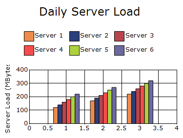

## Customize legend icon

Legend icons can be displayed using the corresponding series type, a series symbol, a predefined representation, a custom symbol, or an image.

### Series type icon

The [RepresentationType](https://help.syncfusion.com/cr/windowsforms/Syncfusion.Windows.Forms.Chart.ChartLegend.html#Syncfusion_Windows_Forms_Chart_ChartLegend_RepresentationType) property specifies how the icon of each legend item is represented. By default, the icon is rendered based on the corresponding series type.

The following code example displays an icon based on the series type.



chartControl.Legend.RepresentationType =  ChartLegendRepresentationType.SeriesType;


chartControl.Legend.RepresentationType = ChartLegendRepresentationType.SeriesType



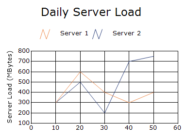

### Series symbol

The [ShowSymbol](https://help.syncfusion.com/cr/windowsforms/Syncfusion.Windows.Forms.Chart.ChartLegend.html#Syncfusion_Windows_Forms_Chart_ChartLegend_ShowSymbol) property controls whether the symbol used for series data points is displayed in the legend. The default value is `false`.

N> To show the series symbol set the [RepresentationType](https://help.syncfusion.com/cr/windowsforms/Syncfusion.Windows.Forms.Chart.ChartLegend.html#Syncfusion_Windows_Forms_Chart_ChartLegend_RepresentationType) to [None](https://help.syncfusion.com/cr/windowsforms/Syncfusion.Windows.Forms.Chart.ChartLegendRepresentationType.html#Syncfusion_Windows_Forms_Chart_ChartLegendRepresentationType_None)

The following code example displays the series symbol in the legend.



chartControl.Legend.ShowSymbol = true;
chartControl.Series[0].Style.Symbol.Shape = ChartSymbolShape.Diamond;
chartControl.Series[0].Style.Symbol.Color = Color.Red;
chartControl.Series[0].Style.Symbol.Size = new Size(7, 7);
chartControl.Legend.RepresentationType = ChartLegendRepresentationType.None;


chartControl.Legend.ShowSymbol = True
chartControl.Series(0).Style.Symbol.Shape = ChartSymbolShape.Diamond
chartControl.Series(0).Style.Symbol.Color = Color.Red
chartControl.Series(0).Style.Symbol.Size = New Size(7, 7)
chartControl.Legend.RepresentationType = ChartLegendRepresentationType.None



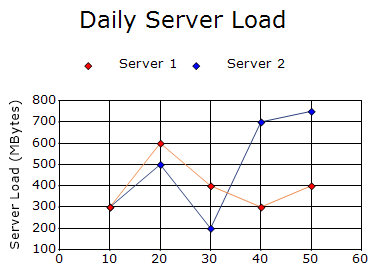

### Custom representation icon

The [RepresentationType](https://help.syncfusion.com/cr/windowsforms/Syncfusion.Windows.Forms.Chart.ChartLegend.html#Syncfusion_Windows_Forms_Chart_ChartLegend_RepresentationType) property controls how chart series are represented in the legend. By default, legend items are represented using the series type [SeriesType](https://help.syncfusion.com/cr/windowsforms/Syncfusion.Windows.Forms.Chart.ChartLegendRepresentationType.html#Syncfusion_Windows_Forms_Chart_ChartLegendRepresentationType_SeriesType).

The RepresentationType property supports the following [ChartLegendRepresentationType](https://help.syncfusion.com/cr/windowsforms/Syncfusion.Windows.Forms.Chart.ChartLegendRepresentationType.html) values:
- [Circle](https://help.syncfusion.com/cr/windowsforms/Syncfusion.Windows.Forms.Chart.ChartLegendRepresentationType.html#Syncfusion_Windows_Forms_Chart_ChartLegendRepresentationType_Circle)
- [Cross](https://help.syncfusion.com/cr/windowsforms/Syncfusion.Windows.Forms.Chart.ChartLegendRepresentationType.html#Syncfusion_Windows_Forms_Chart_ChartLegendRepresentationType_Cross)
- [Diamond](https://help.syncfusion.com/cr/windowsforms/Syncfusion.Windows.Forms.Chart.ChartLegendRepresentationType.html#Syncfusion_Windows_Forms_Chart_ChartLegendRepresentationType_Diamond)
- [Hexagon](https://help.syncfusion.com/cr/windowsforms/Syncfusion.Windows.Forms.Chart.ChartLegendRepresentationType.html#Syncfusion_Windows_Forms_Chart_ChartLegendRepresentationType_Hexagon)
- [InvertedTriangle](https://help.syncfusion.com/cr/windowsforms/Syncfusion.Windows.Forms.Chart.ChartLegendRepresentationType.html#Syncfusion_Windows_Forms_Chart_ChartLegendRepresentationType_InvertedTriangle)
- [Line](https://help.syncfusion.com/cr/windowsforms/Syncfusion.Windows.Forms.Chart.ChartLegendRepresentationType.html#Syncfusion_Windows_Forms_Chart_ChartLegendRepresentationType_Line)
- [None](https://help.syncfusion.com/cr/windowsforms/Syncfusion.Windows.Forms.Chart.ChartLegendRepresentationType.html#Syncfusion_Windows_Forms_Chart_ChartLegendRepresentationType_None)
- [Pentagon](https://help.syncfusion.com/cr/windowsforms/Syncfusion.Windows.Forms.Chart.ChartLegendRepresentationType.html#Syncfusion_Windows_Forms_Chart_ChartLegendRepresentationType_Pentagon)
- [Rectangle](https://help.syncfusion.com/cr/windowsforms/Syncfusion.Windows.Forms.Chart.ChartLegendRepresentationType.html#Syncfusion_Windows_Forms_Chart_ChartLegendRepresentationType_Rectangle)
- [SeriesImage](https://help.syncfusion.com/cr/windowsforms/Syncfusion.Windows.Forms.Chart.ChartLegendRepresentationType.html#Syncfusion_Windows_Forms_Chart_ChartLegendRepresentationType_SeriesImage)
- [SeriesType](https://help.syncfusion.com/cr/windowsforms/Syncfusion.Windows.Forms.Chart.ChartLegendRepresentationType.html#Syncfusion_Windows_Forms_Chart_ChartLegendRepresentationType_SeriesType)
- [StraightLine](https://help.syncfusion.com/cr/windowsforms/Syncfusion.Windows.Forms.Chart.ChartLegendRepresentationType.html#Syncfusion_Windows_Forms_Chart_ChartLegendRepresentationType_StraightLine)
- [Triangle](https://help.syncfusion.com/cr/windowsforms/Syncfusion.Windows.Forms.Chart.ChartLegendRepresentationType.html#Syncfusion_Windows_Forms_Chart_ChartLegendRepresentationType_Triangle)

The following code example displays a diamond representation.



chartControl.Legend.RepresentationType = ChartLegendRepresentationType.Diamond;


chartControl.Legend.RepresentationType = ChartLegendRepresentationType.Diamond



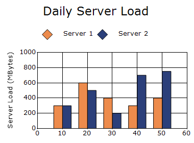

### More symbol shapes

The [Symbol](https://help.syncfusion.com/cr/windowsforms/Syncfusion.Windows.Forms.Chart.ChartLegendItem.html#Syncfusion_Windows_Forms_Chart_ChartLegendItem_Symbol) and [ItemStyle](https://help.syncfusion.com/cr/windowsforms/Syncfusion.Windows.Forms.Chart.ChartLegendItem.html#Syncfusion_Windows_Forms_Chart_ChartLegendItem_ItemStyle) properties customize the shape, size, and color of an individual item symbol.

The following code example displays a triangle symbol.



chartControl.Legend.ShowSymbol = true;
chartControl.Legend.Items[0].Symbol.Shape = ChartSymbolShape.Triangle;
chartControl.Legend.Items[0].Symbol.Size = new Size(11, 11);
chartControl.Legend.Items[0].Symbol.Color = Color.Yellow;


chartControl.Legend.ShowSymbol = True
chartControl.Legend.Items(0).Symbol.Shape = ChartSymbolShape.Triangle
chartControl.Legend.Items(0).Symbol.Size = New Size(11, 11)
chartControl.Legend.Items(0).Symbol.Color = Color.Yellow



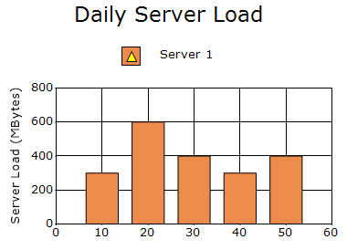

### Custom images

The following properties customize an image-based legend item:

- [Image](https://help.syncfusion.com/cr/windowsforms/Syncfusion.Windows.Forms.Chart.ChartLegendItem.html#Syncfusion_Windows_Forms_Chart_ChartLegendItem_Image): Specifies an image directly. The default value is `null`.
- [ImageList](https://help.syncfusion.com/cr/windowsforms/Syncfusion.Windows.Forms.Chart.ChartLegendItem.html#Syncfusion_Windows_Forms_Chart_ChartLegendItem_ImageList): Specifies the image collection associated with the item. The default value is `null`.
- [ImageIndex](https://help.syncfusion.com/cr/windowsforms/Syncfusion.Windows.Forms.Chart.ChartLegendItem.html#Syncfusion_Windows_Forms_Chart_ChartLegendItem_ImageIndex): Specifies the image index within the collection. The default value is `-1`.
- [RepresentationSize](https://help.syncfusion.com/cr/windowsforms/Syncfusion.Windows.Forms.Chart.ChartLegendItem.html#Syncfusion_Windows_Forms_Chart_ChartLegendItem_RepresentationSize): Specifies the size of the representation icon. By default, the legend item uses the standard representation size.
- [IconAlignment](https://help.syncfusion.com/cr/windowsforms/Syncfusion.Windows.Forms.Chart.ChartLegendItem.html#Syncfusion_Windows_Forms_Chart_ChartLegendItem_IconAlignment): Specifies whether the icon is displayed to the left or right of the text. The default value is `HorizontalAlignment.Left`

The following code example applies an image directly to a legend item.



chartControl.Legend.Items[0].Image = Image.FromFile(@"D:\winforms\cloud-server.png");
chartControl.Legend.Items[0].RepresentationSize = new Size(20, 20);
chartControl.Legend.Items[0].IconAlignment = LeftRightAlignment.Right;


chartControl.Legend.Items(0).Image = Image.FromFile(@"D:\winforms\cloud-server.png")
chartControl.Legend.Items(0).RepresentationSize = New Size(20, 20)
chartControl.Legend.Items(0).IconAlignment = LeftRightAlignment.Right

chartControl.Legend.CustomItems = New ChartLegendItem() {item}



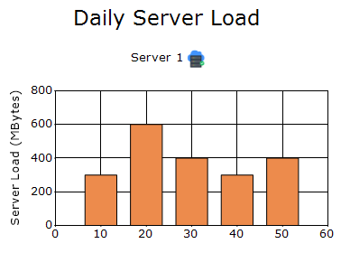

### Hiding icons

Icons for legend items can be hidden in any of the following ways:

The following code example hides the icon of the first legend item.



chartControl.Legend.RepresentationType = ChartLegendRepresentationType.None;
chartControl.Legend.Items[0].ShowIcon = false;
chartControl1.Legend.Items[0].Type = ChartLegendItemType.None;


chartControl.Legend.RepresentationType = ChartLegendRepresentationType.None
chartControl.Legend.Items(0).ShowIcon = False
chartControl.Legend.Items(0).Type = ChartLegendItemType.None



## Legend appearance

The legend background, border, and item shadows can be customized independently.

### Legend background

The [BackColor](https://help.syncfusion.com/cr/windowsforms/Syncfusion.Windows.Forms.Chart.ChartLegend.html#Syncfusion_Windows_Forms_Chart_ChartLegend_BackColor) property specifies a solid legend background. The default value is `Color.Transparent`. The [BackInterior](https://help.syncfusion.com/cr/windowsforms/Syncfusion.Windows.Forms.Chart.ChartLegend.html#Syncfusion_Windows_Forms_Chart_ChartLegend_BackInterior) property accepts a `BrushInfo` and supports solid or gradient backgrounds. By default, no custom brush is applied, and the legend uses its [BackColor](https://help.syncfusion.com/cr/windowsforms/Syncfusion.Windows.Forms.Chart.ChartLegend.html#Syncfusion_Windows_Forms_Chart_ChartLegend_BackColor) setting for rendering.

The following code example applies a vertical gradient background.



chartControl.Legend.BackInterior = new BrushInfo(GradientStyle.Vertical, Color.White, Color.LightBlue);


chartControl.Legend.BackInterior = New BrushInfo(GradientStyle.Vertical, Color.White, Color.LightBlue)



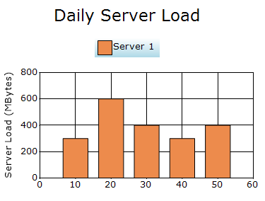

### Legend border

The [ShowBorder](https://help.syncfusion.com/cr/windowsforms/Syncfusion.Windows.Forms.Chart.ChartLegend.html#Syncfusion_Windows_Forms_Chart_ChartLegend_ShowBorder) property controls whether the legend border is displayed. The default value is `false`.The [Border](https://help.syncfusion.com/cr/windowsforms/Syncfusion.Windows.Forms.Chart.ChartLegend.html#Syncfusion_Windows_Forms_Chart_ChartLegend_Border) property gets the [LineInfo](https://help.syncfusion.com/cr/windowsforms/Syncfusion.Windows.Forms.Chart.LineInfo.html) used to draw the border.

N> The [Border](https://help.syncfusion.com/cr/windowsforms/Syncfusion.Windows.Forms.Chart.ChartLegend.html#Syncfusion_Windows_Forms_Chart_ChartLegend_Border) property is get-only. Customize its individual line settings directly.

The following code example displays and customizes the legend border.



chartControl.Legend.ShowBorder = true;
chartControl.Legend.Border.ForeColor = Color.DarkBlue;
chartControl.Legend.Border.Width = 2;
chartControl.Legend.Border.DashStyle = DashStyle.Solid;


chartControl.Legend.ShowBorder = True
chartControl.Legend.Border.ForeColor = Color.DarkBlue
chartControl.Legend.Border.Width = 2
chartControl.Legend.Border.DashStyle = DashStyle.Solid



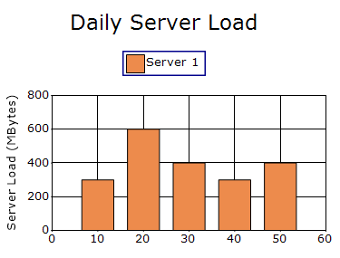

### Legend item shadow

The following properties apply a common shadow to all legend items:

- [ShowItemsShadow](https://help.syncfusion.com/cr/windowsforms/Syncfusion.Windows.Forms.Chart.ChartLegend.html#Syncfusion_Windows_Forms_Chart_ChartLegend_ShowItemsShadow): Controls whether item shadows are displayed. The default value is `false`.
- [ItemsShadowColor](https://help.syncfusion.com/cr/windowsforms/Syncfusion.Windows.Forms.Chart.ChartLegend.html#Syncfusion_Windows_Forms_Chart_ChartLegend_ItemsShadowColor): Specifies the shadow color. he default value is `Color.Gray`.
- [ItemsShadowOffset](https://help.syncfusion.com/cr/windowsforms/Syncfusion.Windows.Forms.Chart.ChartLegend.html#Syncfusion_Windows_Forms_Chart_ChartLegend_ItemsShadowOffset): Specifies the shadow offset. The default value is `Size(2, 2)`.

The following code example applies a shadow to all legend items.



chartControl.Legend.ShowItemsShadow = true;
chartControl.Legend.ItemsShadowColor = Color.Gray;
chartControl.Legend.ItemsShadowOffset = new Size(2, 2);


chartControl.Legend.ShowItemsShadow = True
chartControl.Legend.ItemsShadowColor = Color.Gray
chartControl.Legend.ItemsShadowOffset = New Size(2, 2)



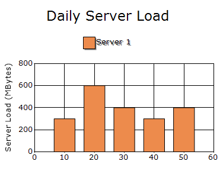

## Adding custom legends

You can add custom legends to the chart through the [Legends](https://help.syncfusion.com/cr/windowsforms/Syncfusion.Windows.Forms.Chart.ChartControl.html#Syncfusion_Windows_Forms_Chart_ChartControl_Legends) list as follows:

N> The [SetDefSizeForCustom](https://help.syncfusion.com/cr/windowsforms/Syncfusion.Windows.Forms.Chart.ChartLegend.html#Syncfusion_Windows_Forms_Chart_ChartLegend_SetDefSizeForCustom) property is obsolete. For more information about customizing custom legend, refer to the [Custom Legend](https://support.syncfusion.com/kb/article/1067/how-to-create-multiple-legends-for-a-chart-control-in-winforms) KB article.



// Changing the position of the default legend
ChartLegend legend2 = new ChartLegend(chartControl);
legend2.Name = "MyLegend";
chartControl.Legends.Add(legend2);


Dim legend2 As New ChartLegend()
legend2.Name = "MyLegend"
chartControl.Legends.Add(legend2)



## Adding custom legend item

The [ChartLegendItem](https://help.syncfusion.com/cr/windowsforms/Syncfusion.Windows.Forms.Chart.ChartLegendItem.html) class creates legend items that are not generated from chart series. Assign the items to the [CustomItems](https://help.syncfusion.com/cr/windowsforms/Syncfusion.Windows.Forms.Chart.ChartLegend.html#Syncfusion_Windows_Forms_Chart_ChartLegend_CustomItems) property.

N> For more information about customizing a [Custom Legend Item](https://support.syncfusion.com/kb/article/1228/how-to-customize-chart-legend-items-in-winforms-chart) base article.



ChartLegendItem legendItem = new ChartLegendItem();
legendItem.ItemStyle.ShowSymbol = true;
legendItem.ItemStyle.Symbol.Shape = ChartSymbolShape.Circle;
legendItem.ItemStyle.Symbol.Color = Color.Blue;
legendItem.Text = "Legend Item";
chartControl.Legends[0].CustomItems = new ChartLegendItem[] { legendItem };


Dim legendItem As New ChartLegendItem()
legendItem.ItemStyle.ShowSymbol = True
legendItem.ItemStyle.Symbol.Shape = ChartSymbolShape.Circle
legendItem.ItemStyle.Symbol.Color = Color.Blue
legendItem.Text = "Legend Item"
chartControl.Legends(0).CustomItems = New ChartLegendItem() {legendItem}



## Customizing items through event

The following events support advanced legend-item customization:

- [DrawItem](https://help.syncfusion.com/cr/windowsforms/Syncfusion.Windows.Forms.Chart.ChartLegend.html#Syncfusion_Windows_Forms_Chart_ChartLegend_DrawItem): Occurs when a legend item is drawn.
- [DrawItemText](https://help.syncfusion.com/cr/windowsforms/Syncfusion.Windows.Forms.Chart.ChartLegend.html#Syncfusion_Windows_Forms_Chart_ChartLegend_DrawItemText): Occurs when legend-item text is drawn.
- [FilterItems](https://help.syncfusion.com/cr/windowsforms/Syncfusion.Windows.Forms.Chart.ChartLegend.html#Syncfusion_Windows_Forms_Chart_ChartLegend_FilterItems): Occurs before legend items are rendered and allows the collection to be filtered.
- [MinSize](https://help.syncfusion.com/cr/windowsforms/Syncfusion.Windows.Forms.Chart.ChartLegend.html#Syncfusion_Windows_Forms_Chart_ChartLegend_MinSize): Occurs when the minimum legend size is calculated.

The following code example registers the legend-item customization events.



chartControl.Legend.DrawItem += Legend_DrawItem;
private void Legend_DrawItem(object sender, ChartLegendDrawItemEventArgs e)
{
    Rectangle symbolRect = new Rectangle(e.Bounds.X, e.Bounds.Y + 2, 12, 12);
    e.Graphics.FillRectangle(Brushes.RoyalBlue, symbolRect);
    e.Graphics.DrawRectangle(Pens.Black, symbolRect);
    e.Handled = true;
}



' DrawItem Event
AddHandler chartControl.Legend.DrawItem, AddressOf Legend_DrawItem
 
Private Sub Legend_DrawItem(ByVal sender As Object, ByVal e As ChartLegendDrawItemEventArgs)
    Dim symbolRect As New Rectangle(e.Bounds.X, e.Bounds.Y + 2, 12, 12)
    e.Graphics.FillRectangle(Brushes.RoyalBlue, symbolRect)
    e.Graphics.DrawRectangle(Pens.Black, symbolRect)
    e.Handled = True
End Sub



chartControl.Legend.DrawItemText += Legend_DrawItemText;

private void Legend_DrawItemText(object sender, ChartLegendDrawItemTextEventArgs e)
{
    e.Graphics.DrawString(e.Text, new Font("Segoe UI", 9, FontStyle.Bold), Brushes.DarkBlue, e.TextRect);
    e.Handled = true;
}



' DrawItemText Event
AddHandler chartControl.Legend.DrawItemText, AddressOf Legend_DrawItemText
 
Private Sub Legend_DrawItemText(ByVal sender As Object, ByVal e As ChartLegendDrawItemTextEventArgs)
    e.Graphics.DrawString(e.Text, New Font("Segoe UI", 9, FontStyle.Bold), Brushes.DarkBlue, e.TextRect)
    e.Handled = True
End Sub



chartControl.Legend.FilterItems += Legend_FilterItems;

private void Legend_FilterItems(object sender, ChartLegendFilterItemsEventArgs e)
{
    for (int i = e.Items.Count - 1; i >= 0; i--)
    {
        if (e.Items[i].Text == "Series2")
        {
            e.Items.RemoveAt(i);
        }
    }
}



' FilterItems Event
AddHandler chartControl.Legend.FilterItems, AddressOf Legend_FilterItems
 
Private Sub Legend_FilterItems(ByVal sender As Object, ByVal e As ChartLegendFilterItemsEventArgs)
    For i As Integer = e.Items.Count - 1 To 0 Step -1
        If e.Items(i).Text = "Series2" Then
        e.Items.RemoveAt(i)
    End If
Next
 
End Sub



chartControl.Legend.MinSize += Legend_MinSize;

private void Legend_MinSize(object sender, ChartLegendMinSizeEventArgs e)
{
    Size size = e.Size
}



' MinSize Event
AddHandler chartControl.Legend.MinSize, AddressOf Legend_MinSize
 
Private Sub Legend_MinSize(ByVal sender As Object, ByVal e As ChartLegendMinSizeEventArgs)
    Dim size As Size = e.Size
End Sub



## Changing legend properties at run time

The legend appearance can be customized at run time. Double-click the legend text to open the Legend Properties dialog box, where you can modify the legend settings and apply the changes to the chart.

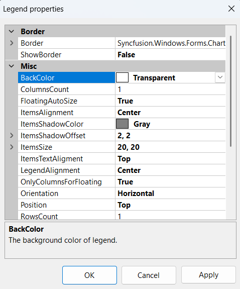{height:"350", width="350"}

## See also

- [How to manipulate the chart legend in WinForms Chart](https://support.syncfusion.com/kb/article/1062/how-to-manipulate-the-chart-legend-in-winforms-chart)
- [How to customize ChartLegend items in WinForms Chart](https://support.syncfusion.com/kb/article/1266/how-to-customize-chartlegend-items-in-a-winforms-chart)
- [How to create multiple legends for a ChartControl](https://support.syncfusion.com/kb/article/1067/how-to-create-multiple-legends-for-a-chart-control-in-winforms)
- [How to represent an image in a legend item in WinForms Chart](https://support.syncfusion.com/kb/article/1210/how-to-customize-the-chart-title-in-winforms-chart-control)
- [How to customize the order of the legend in a WinForms Chart](https://support.syncfusion.com/kb/article/1050/how-to-customize-the-order-of-the-legend-in-a-winforms-chart)
- [How to add custom legend items to the legend instead of automated legend items](https://support.syncfusion.com/kb/article/1169/how-to-add-custom-legend-items-to-the-legend-instead-of-automated-legend-items)
- [How to specify the position of a floating legend in WinForms Chart](https://support.syncfusion.com/kb/article/1260/how-to-specify-the-position-of-a-floating-legend-in-winforms-chart)