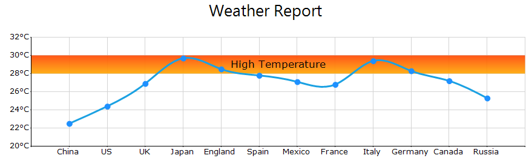
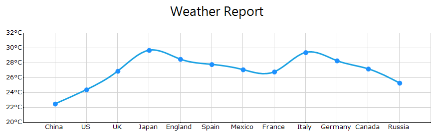
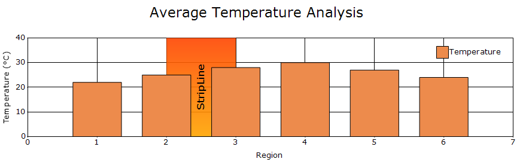

# Strip Lines in Windows Forms Chart

Windows Forms Chart allows you to add strip lines that shade specific regions or ranges in the plot area background at regular or custom intervals.

## Adding strip lines to an axis

Create a [ChartStripLine](https://help.syncfusion.com/cr/windowsforms/Syncfusion.Windows.Forms.Chart.ChartStripLine.html), configure its range and appearance, and add it to the required axis.

The following code example adds a horizontal strip line to the primary Y-axis and highlights the high-temperature range.




ChartStripLine stripLine = new ChartStripLine();

stripLine.Enabled = true;
stripLine.Vertical = false;

stripLine.Start = 28;
stripLine.End = 30;
stripLine.Width = 2;

stripLine.Text = "High Temperature";
stripLine.TextAlignment = ContentAlignment.MiddleCenter;

stripLine.Interior = new BrushInfo(230, new BrushInfo(GradientStyle.Vertical, Color.OrangeRed, Color.Orange));

chartControl.PrimaryYAxis.StripLines.Add(stripLine);




Dim stripLine As New ChartStripLine()

stripLine.Enabled = True
stripLine.Vertical = False

stripLine.Start = 28
stripLine.End = 30
stripLine.Width = 2

stripLine.Text = "High Temperature"
stripLine.TextAlignment = ContentAlignment.MiddleCenter

stripLine.Interior = New BrushInfo(230, New BrushInfo( GradientStyle.Vertical, Color.OrangeRed, Color.Orange))

chartControl.PrimaryYAxis.StripLines.Add(stripLine)




## Visibility

The [Enabled](https://help.syncfusion.com/cr/windowsforms/Syncfusion.Windows.Forms.Chart.ChartStripLine.html#Syncfusion_Windows_Forms_Chart_ChartStripLine_Enabled) property controls whether the strip line is displayed. The default value is `true`.

The following code example hides the strip line.




stripLine.Enabled = false;




stripLine.Enabled = False




## Strip line orientation

The [Vertical](https://help.syncfusion.com/cr/windowsforms/Syncfusion.Windows.Forms.Chart.ChartStripLine.html#Syncfusion_Windows_Forms_Chart_ChartStripLine_Vertical) property specifies the orientation of the strip line. The default value is `false`.

The following code example displays a vertical strip line.




stripLine.Vertical = true;




stripLine.Vertical = True




## Strip line position

Strip lines can be positioned using numeric or DateTime values.

The following properties are available:

- `Start`: Specifies the starting value of the strip line.
- `End`: Specifies the ending value of the strip line.
- `Width`: Specifies the width of the strip line.
- `FixedWidth`: Specifies a fixed width using actual axis values.
- `StartAtAxisPosition`: Specifies whether the strip line starts from the beginning of the axis range.
- `Offset`: Specifies the offset from the beginning of a numeric axis.
- `DateOffset`: Specifies the offset from the beginning of a DateTime axis.

N> Strip lines can be rendered on both numeric and DateTime axes. Use `Start`, `End`, `Offset`, and `Period` for numeric axes, and `StartDate`, `EndDate`, `DateOffset`, and `PeriodDate` for DateTime axes.

### Numeric strip lines

The following properties are used to define the strip-line range on a numeric axis:
- [Start](https://help.syncfusion.com/cr/windowsforms/Syncfusion.Windows.Forms.Chart.ChartStripLine.html#Syncfusion_Windows_Forms_Chart_ChartStripLine_Start): Specifies the value at which the strip line begins.
- [End](https://help.syncfusion.com/cr/windowsforms/Syncfusion.Windows.Forms.Chart.ChartStripLine.html#Syncfusion_Windows_Forms_Chart_ChartStripLine_End): Specifies the value at which the strip line ends.
- [Width](https://help.syncfusion.com/cr/windowsforms/Syncfusion.Windows.Forms.Chart.ChartStripLine.html#Syncfusion_Windows_Forms_Chart_ChartStripLine_Width): Specifies the width of the strip line.

The following code example highlights the range between `28` and `30`.




stripLine.Start = 28;
stripLine.End = 30;
stripLine.Width = 2;




stripLine.Start = 28
stripLine.End = 30
stripLine.Width = 2




### DateTime strip lines

Use the `StartDate` and `EndDate` properties to position a strip line on a DateTime axis.




ChartStripLine dateStripLine =
    new ChartStripLine();

dateStripLine.Enabled = true;
dateStripLine.Vertical = true;

dateStripLine.StartDate =
    new DateTime(2025, 1, 1);

dateStripLine.EndDate =
    new DateTime(2025, 1, 2);

chartControl.PrimaryXAxis.StripLines.Add(
    dateStripLine);




Dim dateStripLine As New ChartStripLine()

dateStripLine.Enabled = True
dateStripLine.Vertical = True

dateStripLine.StartDate =
    New DateTime(2025, 1, 1)

dateStripLine.EndDate =
    New DateTime(2025, 1, 2)

chartControl.PrimaryXAxis.StripLines.Add(
    dateStripLine)




## Repeated strip lines

Strip lines can be repeated at regular intervals on numeric and DateTime axes.

### Numeric interval

The `Period` property specifies the interval at which a strip line is repeated on a numeric axis.




stripLine.Start = 0;
stripLine.Width = 1;
stripLine.Period = 5;




stripLine.Start = 0
stripLine.Width = 1
stripLine.Period = 5




### DateTime interval

The `PeriodDate` property specifies the interval at which a strip line is repeated on a DateTime axis.




dateStripLine.PeriodDate =
    TimeSpan.FromDays(7);




dateStripLine.PeriodDate =
    TimeSpan.FromDays(7)




### DateTime offset

The `DateOffset` property specifies the offset of a strip line from the beginning of a DateTime axis when `StartAtAxisPosition` is enabled.




dateStripLine.StartAtAxisPosition = true;
dateStripLine.DateOffset =
    TimeSpan.FromDays(2);




dateStripLine.StartAtAxisPosition = True
dateStripLine.DateOffset =
    TimeSpan.FromDays(2)




## Customizing appearance

The appearance of a strip line can be customized using fill, text, and background image settings.

### Fill

The `Interior` property specifies the fill of a strip line. Solid colors, gradients, patterns, and textures are supported.




stripLine.Interior = new BrushInfo(
    GradientStyle.Vertical,
    Color.LightYellow,
    Color.Yellow);




stripLine.Interior = New BrushInfo(
    GradientStyle.Vertical,
    Color.LightYellow,
    Color.Yellow)




### Background image

The `BackImage` property specifies the image displayed in the strip-line background.




stripLine.BackImage =
    Image.FromFile("background.png");




stripLine.BackImage =
    Image.FromFile("background.png")




### Text

The following properties customize the text displayed in a strip line:

- `Text`
- `TextColor`
- `TextAlignment`
- `Font`




stripLine.Text = "Target Zone";

stripLine.TextColor = Color.Blue;

stripLine.TextAlignment =
    ContentAlignment.MiddleCenter;

stripLine.Font =
    new Font(
        "Segoe UI",
        10,
        FontStyle.Bold);




stripLine.Text = "Target Zone"

stripLine.TextColor = Color.Blue

stripLine.TextAlignment =
    ContentAlignment.MiddleCenter

stripLine.Font =
    New Font(
        "Segoe UI",
        10,
        FontStyle.Bold)




## Multiple strip lines

Multiple strip lines can be added to the same axis to highlight different ranges.




ChartStripLine lowRange =
    new ChartStripLine();

lowRange.Start = 0;
lowRange.End = 40;
lowRange.Text = "Below Target";
lowRange.Interior =
    new BrushInfo(Color.MistyRose);

ChartStripLine targetRange =
    new ChartStripLine();

targetRange.Start = 40;
targetRange.End = 60;
targetRange.Text = "Target Zone";
targetRange.Interior =
    new BrushInfo(Color.Honeydew);

ChartStripLine highRange =
    new ChartStripLine();

highRange.Start = 60;
highRange.End = 100;
highRange.Text = "Above Target";
highRange.Interior =
    new BrushInfo(Color.LightCyan);

chartControl.PrimaryYAxis.StripLines.Add(
    lowRange);

chartControl.PrimaryYAxis.StripLines.Add(
    targetRange);

chartControl.PrimaryYAxis.StripLines.Add(
    highRange);




Dim lowRange As New ChartStripLine()

lowRange.Start = 0
lowRange.End = 40
lowRange.Text = "Below Target"
lowRange.Interior =
    New BrushInfo(Color.MistyRose)

Dim targetRange As New ChartStripLine()

targetRange.Start = 40
targetRange.End = 60
targetRange.Text = "Target Zone"
targetRange.Interior =
    New BrushInfo(Color.Honeydew)

Dim highRange As New ChartStripLine()

highRange.Start = 60
highRange.End = 100
highRange.Text = "Above Target"
highRange.Interior =
    New BrushInfo(Color.LightCyan)

chartControl.PrimaryYAxis.StripLines.Add(
    lowRange)

chartControl.PrimaryYAxis.StripLines.Add(
    targetRange)

chartControl.PrimaryYAxis.StripLines.Add(
    highRange)




## See also

- [How to add striplines to an axis in a WinForms Chart](https://support.syncfusion.com/kb/article/1232/how-to-add-striplines-to-an-axis-in-a-winforms-chart)