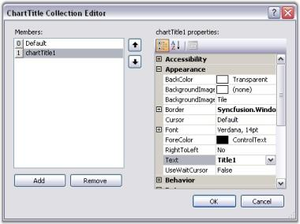
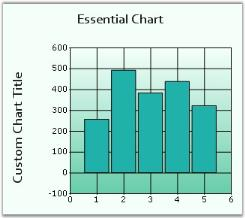
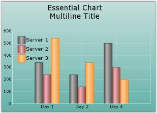

# Chart Title in Windows Forms Chart

## Default Title

EssentialChart's [Title](https://help.syncfusion.com/cr/windowsforms/Syncfusion.Windows.Forms.Chart.ChartControl.html#Syncfusion_Windows_Forms_Chart_ChartControl_Title) property lets you edit the default title for a chart. We can set font style for the title using [Title.Font](https://help.syncfusion.com/cr/windowsforms/Syncfusion.Windows.Forms.Chart.ChartTitle.html#Syncfusion_Windows_Forms_Chart_ChartTitle_Font) property. The default value is **Verdana, 14, Regular**.





//Default title

chartControl1.Title.Text = "Essential Chart";

this.chartControl1.Title.Font = new System.Drawing.Font("Candara", 9F, System.Drawing.FontStyle.Bold);





'Default title

chartControl1.Title.Text = "Essential Chart"

chartControl1.Title.Font = New System.Drawing.Font("Candara", 9F, System.Drawing.FontStyle.Bold)





The above default chart title is simply the first in the list of titles that can be specified for the Chart.

## Multiple Titles

* Multiple custom Chart Titles can be added to [Chart.Titles](https://help.syncfusion.com/cr/windowsforms/Syncfusion.Windows.Forms.Chart.ChartControl.html#Syncfusion_Windows_Forms_Chart_ChartControl_Titles) Collection.
* Supports numerous docking styles **(Floating, Left, Right, Bottom or Top)** for each title.
* Each of the custom Titles can be aligned to any position as required.

## Titles Positioning

Below listed properties will help you to modify the positioning of the [Chart Title](https://help.syncfusion.com/cr/windowsforms/Syncfusion.Windows.Forms.Chart.ChartTitle.html).

<table>
<tr>
<th>
ChartTitle Property</th><th>
Description</th></tr>
<tr>
<td>

{{'[Position](https://help.syncfusion.com/cr/windowsforms/Syncfusion.Windows.Forms.Chart.ChartTitle.html#Syncfusion_Windows_Forms_Chart_ChartTitle_Position)'| markdownify }}
</td><td>
Specifies the position relative to the chart at which to render the chart title panel.<ul><li> Top - above the chart(Default setting)</li><li> Left - left of the chart</li><li> Right - right of the chart</li><li>Bottom - below the chart</li><li>Floating - will not be docked to any specific location. Can be docked manually by dragging the title panel.</li></ul></td></tr>
<tr>
<td>
 {{'[Alignment](https://help.syncfusion.com/cr/windowsforms/Syncfusion.Windows.Forms.Chart.ChartDockControl.html#Syncfusion_Windows_Forms_Chart_ChartDockControl_Alignment)'| markdownify }}</td><td>
When docked to a side, this property specifies how the title panel should be aligned with respect to the chart boundaries.<ul><li> Center - will be aligned to center(default setting).</li><li> Far - will be aligned Far.</li><li> Near - will be aligned Near.</li></ul></td></tr>
<tr>
<td>
 {{'[Behavior](https://help.syncfusion.com/cr/windowsforms/Syncfusion.Windows.Forms.Chart.ChartDockControl.html#Syncfusion_Windows_Forms_Chart_ChartDockControl_Behavior)'| markdownify }}</td><td>
Specifies the docking behavior of the title.<ul><li> Docking - It is dockable on all four sides.</li><li> Movable - It is movable.</li><li> All - It is movable and dockable.</li><li>None - It is neither movable nor dockable.</li></ul></td></tr>
</table>

## Title Look and Feel

There are several appearance options that can be applied on the [ChartTitle](https://help.syncfusion.com/cr/windowsforms/Syncfusion.Windows.Forms.Chart.ChartTitle.html) instance as illustrated in this [ChartTitle](https://help.syncfusion.com/cr/windowsforms/Syncfusion.Windows.Forms.Chart.ChartTitle.html) Collection Editor.

In code, you can add more titles to this list as follows.




//Default title (the first entry in the Titles list)

chartControl1.Title.Text = "Essential Chart";

// Add the title to the Chart control's Titles collection.                

ChartTitle title = new Syncfusion.Windows.Forms.Chart.ChartTitle();

title.Text = "Custom Chart Title";

this.chartControl1.Titles.Add(title);





'Default title (the first entry in the Titles list)

chartControl1.Title.Text = "Essential Chart"

' Add the title to the Chart control's Titles collection.                

Dim title As New Syncfusion.Windows.Forms.Chart.ChartTitle

title.Text = "Custom Chart Title"

Me.ChartControl1.Titles.Add(title)




## Multiline Chart Title

You can now wrap the Chart titles and display them as multiline text. Set multiline title text in [ChartTitle.Text](https://help.syncfusion.com/cr/windowsforms/Syncfusion.Windows.Forms.Chart.ChartTitle.html#Syncfusion_Windows_Forms_Chart_ChartTitle_Text) property through designer as follows. Press ENTER key to begin a new line. Press CTRL+ENTER to set the text entered.

