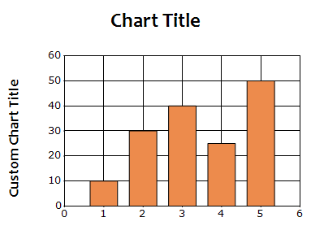
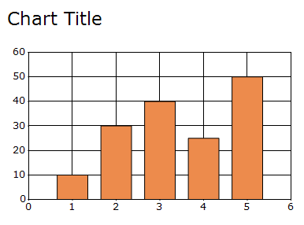

# Title in Windows Forms Chart

## Default title

The [Title](https://help.syncfusion.com/cr/windowsforms/Syncfusion.Windows.Forms.Chart.ChartControl.html#Syncfusion_Windows_Forms_Chart_ChartControl_Title) property is used to set the default title for the chart. The chart does not display title text by default.

The following code example displays the default chart title.




chartControl.Title.Text = "Chart Title";




chartControl.Title.Text = "Chart Title"




## Multiple titles

The [Titles](https://help.syncfusion.com/cr/windowsforms/Syncfusion.Windows.Forms.Chart.ChartControl.html#Syncfusion_Windows_Forms_Chart_ChartControl_Titles) collection is used to display multiple chart titles. Create a [ChartTitle](https://help.syncfusion.com/cr/windowsforms/Syncfusion.Windows.Forms.Chart.ChartTitle.html) object for each additional title and add it to the collection.

The following code example configures a custom chart title.




ChartTitle chartTitle = new ChartTitle();
chartTitle.Text = "Custom Chart Title";
chartControl.Titles.Add(chartTitle);




' Creates an additional chart title.
Dim chartTitle As New ChartTitle()
chartTitle.Text = "Custom Chart Title"
' Adds the additional title to the chart.
chartControl.Titles.Add(chartTitle)




## Title visibility

The [Visible](https://help.syncfusion.com/cr/windowsforms/Syncfusion.Windows.Forms.Chart.ChartTitle.html#Syncfusion_Windows_Forms_Chart_ChartTitle_Visible) property controls whether a chart title is displayed.




chartTitle.Visible = true;




chartTitle.Visible = True




## Title alignment

The [Alignment](https://help.syncfusion.com/cr/windowsforms/Syncfusion.Windows.Forms.Chart.ChartDockControl.html#Syncfusion_Windows_Forms_Chart_ChartDockControl_Alignment) property aligns the title within its docked area. The default value is [Center](https://help.syncfusion.com/cr/windowsforms/Syncfusion.Windows.Forms.Chart.ChartAlignment.html). The supported values are:

- [Near](https://help.syncfusion.com/cr/windowsforms/Syncfusion.Windows.Forms.Chart.ChartAlignment.html#Syncfusion_Windows_Forms_Chart_ChartAlignment_Near): Aligns the title near the beginning of the docked area.
- [Center](https://help.syncfusion.com/cr/windowsforms/Syncfusion.Windows.Forms.Chart.ChartAlignment.html#Syncfusion_Windows_Forms_Chart_ChartAlignment_Center): Aligns the title at the center of the docked area.
- [Far](https://help.syncfusion.com/cr/windowsforms/Syncfusion.Windows.Forms.Chart.ChartAlignment.html#Syncfusion_Windows_Forms_Chart_ChartAlignment_Far): Aligns the title near the end of the docked area.

The following code example aligns the chart title near the beginning of its docked area




chartControl.Title.Alignment = ChartAlignment.Near;




chartControl.Title.Alignment = ChartAlignment.Near




## Title position

The [Position](https://help.syncfusion.com/cr/windowsforms/Syncfusion.Windows.Forms.Chart.ChartTitle.html#Syncfusion_Windows_Forms_Chart_ChartTitle_Position) property specifies where the title is placed.  By default [Top](https://help.syncfusion.com/cr/windowsforms/Syncfusion.Windows.Forms.Chart.ChartDock.html#Syncfusion_Windows_Forms_Chart_ChartDock_Top) is applied. The supported values are: 
- [Top](https://help.syncfusion.com/cr/windowsforms/Syncfusion.Windows.Forms.Chart.ChartDock.html#Syncfusion_Windows_Forms_Chart_ChartDock_Top): Positions the title at the top.
- [Bottom](https://help.syncfusion.com/cr/windowsforms/Syncfusion.Windows.Forms.Chart.ChartDock.html#Syncfusion_Windows_Forms_Chart_ChartDock_Bottom): Positions the title at the bottom.
- [Left](https://help.syncfusion.com/cr/windowsforms/Syncfusion.Windows.Forms.Chart.ChartDock.html#Syncfusion_Windows_Forms_Chart_ChartDock_Left): Positions the title on the left.
- [Right](https://help.syncfusion.com/cr/windowsforms/Syncfusion.Windows.Forms.Chart.ChartDock.html#Syncfusion_Windows_Forms_Chart_ChartDock_Right): Positions the title on the right.
- [Floating](https://help.syncfusion.com/cr/windowsforms/Syncfusion.Windows.Forms.Chart.ChartDock.html#Syncfusion_Windows_Forms_Chart_ChartDock_Floating): Positions the title at a custom location.

The following code example displays the title on the left side of the chart.
 


 
chartControl.Title.Position = ChartDock.Left;
 


 
chartControl.Title.Position = ChartDock.Left
 



## Floating title

Set the `Position` property to `ChartDock.Floating` and use the [Location](https://help.syncfusion.com/cr/windowsforms/Syncfusion.Windows.Forms.Chart.ChartTitle.html#Syncfusion_Windows_Forms_Chart_ChartTitle_Location) property to place a title at a custom location.




chartTitle.Position = ChartDock.Floating;
chartTitle.Location = new Point(200, 20);




chartTitle.Position = ChartDock.Floating
chartTitle.Location = New Point(200, 20)




## Customizing the title

The following properties customize the appearance and layout of a chart title:

- [Text](https://help.syncfusion.com/cr/windowsforms/Syncfusion.Windows.Forms.Chart.ChartTitle.html#Syncfusion_Windows_Forms_Chart_ChartTitle_Text): Specifies the title text.
- [Font](https://help.syncfusion.com/cr/windowsforms/Syncfusion.Windows.Forms.Chart.ChartTitle.html#Syncfusion_Windows_Forms_Chart_ChartTitle_Font): Specifies the font family, size, and style of the title text.
- `ForeColor`: Specifies the title text color.
- [BackColor](https://help.syncfusion.com/cr/windowsforms/Syncfusion.Windows.Forms.Chart.ChartTitle.html#Syncfusion_Windows_Forms_Chart_ChartTitle_BackColor): Specifies the title background color. The default value is `Color.Transparent`.
- [Margin](https://help.syncfusion.com/cr/windowsforms/Syncfusion.Windows.Forms.Chart.ChartTitle.html#Syncfusion_Windows_Forms_Chart_ChartTitle_Margin): Specifies the margin around the title text. The default value is `4`.
- [AutoSize](https://help.syncfusion.com/cr/windowsforms/Syncfusion.Windows.Forms.Chart.ChartTitle.html#Syncfusion_Windows_Forms_Chart_ChartTitle_AutoSize): Specifies whether the title size is calculated automatically based on its text.
- [Size](https://help.syncfusion.com/cr/windowsforms/Syncfusion.Windows.Forms.Chart.ChartTitle.html#Syncfusion_Windows_Forms_Chart_ChartTitle_Size): Specifies the height and width of the title when a custom size is required.
- [Orientation](https://help.syncfusion.com/cr/windowsforms/Syncfusion.Windows.Forms.Chart.ChartTitle.html#Syncfusion_Windows_Forms_Chart_ChartTitle_Orientation): Specifies the orientation of the title.
- [ShowBorder](https://help.syncfusion.com/cr/windowsforms/Syncfusion.Windows.Forms.Chart.ChartTitle.html#Syncfusion_Windows_Forms_Chart_ChartTitle_ShowBorder): Controls whether the title border is displayed.
- [Border](https://help.syncfusion.com/cr/windowsforms/Syncfusion.Windows.Forms.Chart.ChartTitle.html#Syncfusion_Windows_Forms_Chart_ChartTitle_Border): Returns the `LineInfo` object used to customize the title border.

The following code example customizes the chart title.




chartTitle.Font = new Font(
    "Segoe UI",
    14,
    FontStyle.Bold);

chartTitle.ForeColor = Color.DarkBlue;
chartTitle.BackColor = Color.LightBlue;
chartTitle.Margin = 8;
chartTitle.AutoSize = true;
chartTitle.Orientation = ChartOrientation.Horizontal;

chartTitle.ShowBorder = true;
chartTitle.Border.Color = Color.DarkBlue;
chartTitle.Border.Width = 2;
chartTitle.Border.DashStyle = DashStyle.Solid;




chartTitle.Font = New Font(
    "Segoe UI",
    14,
    FontStyle.Bold)

chartTitle.ForeColor = Color.DarkBlue
chartTitle.BackColor = Color.LightBlue
chartTitle.Margin = 8
chartTitle.AutoSize = True
chartTitle.Orientation = ChartOrientation.Horizontal

chartTitle.ShowBorder = True
chartTitle.Border.Color = Color.DarkBlue
chartTitle.Border.Width = 2
chartTitle.Border.DashStyle = DashStyle.Solid




## See also

- [How to customize the Chart Title in WinForms Chart control](https://support.syncfusion.com/kb/article/1210/how-to-customize-the-chart-title-in-winforms-chart-control)
- [How to add multiple Chart titles in WinForms](https://support.syncfusion.com/kb/article/1215/how-to-add-multiple-chart-titles-in-winforms)