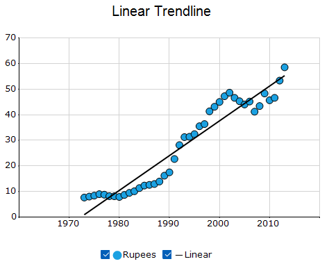
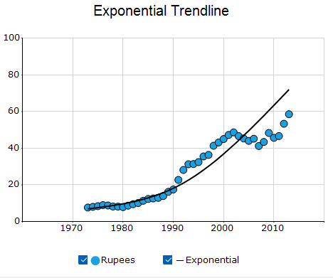
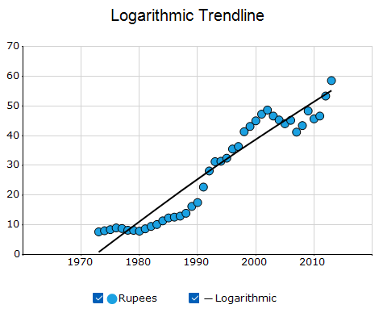
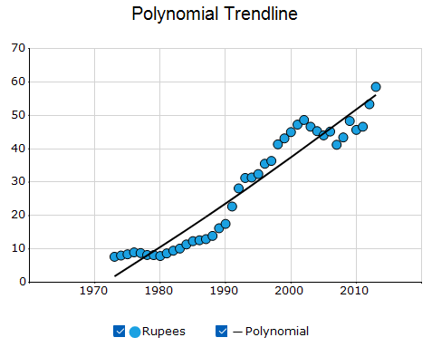
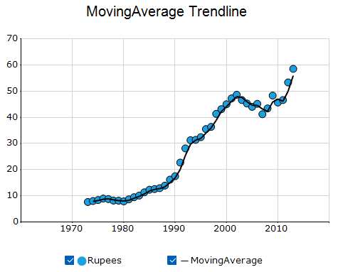
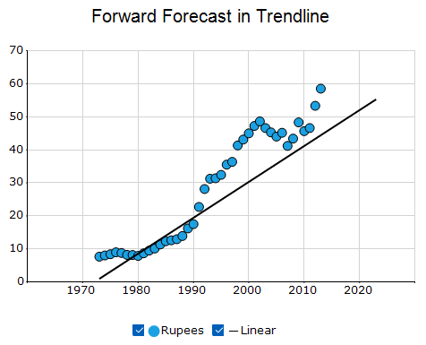
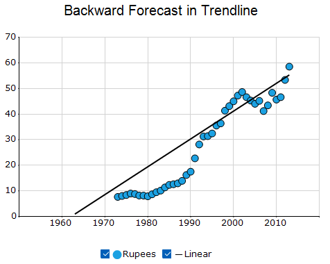
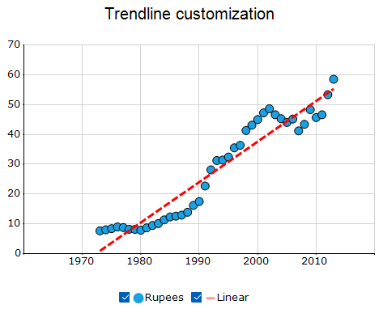
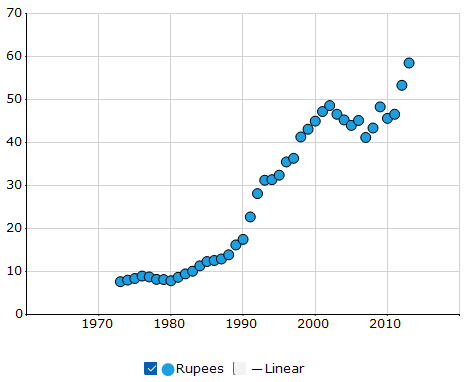
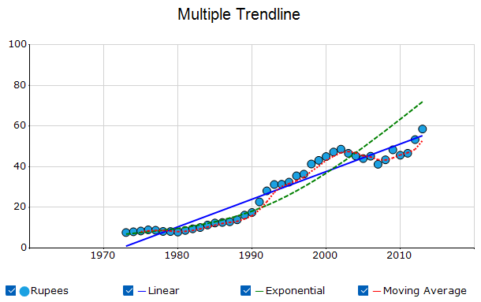

# Trendlines in Windows Forms Chart

A [Trendline](https://help.syncfusion.com/cr/windowsforms/Syncfusion.Windows.Forms.Chart.Trendline.html) is a visual representation of the relationship between data points in a chart series. It helps identify the overall direction and trend of the data by fitting a line or curve through the data points.

N> Trendlines are supported in Scatter Chart, HiLo Open Close Chart, Column Charts, Bar Charts, Bubble Chart, Line Charts, Box and Whisker Chart, Combination Chart, Candle Chart, Area Charts, ColumnRange Chart, Stacking Column Chart, Stacking Bar Chart, Stacking Area, and Stacking Area100 chart types.

The following code example adds a linear trendline.




Trendline trendline = new Trendline();
//Customizing the Trendline
trendline.Name = "Linear";
trendline.Visible = true;
trendline.Style = DashStyle.Solid;
trendline.Width = 2f;
trendline.Color = Color.Black;
trendline.Type = TrendlineType.Linear;
//Adding Trendline to the series
this.chartControl.Series[0].Trendlines.Add(trendline);




Dim trendline As New Trendline()

' Customize the trendline.
trendline.Name = "Linear"
trendline.Visible = True
trendline.Style = DashStyle.Solid
trendline.Width = 2.0F
trendline.Color = Color.Black
trendline.Type = TrendlineType.Linear

' Add the trendline to the series.
Me.chartcontrol.Series(0).Trendlines.Add(trendline)




## Trendline type

Winforms Charts supports the following type of trendlines.

The supported [TrendlineType](https://help.syncfusion.com/cr/windowsforms/Syncfusion.Windows.Forms.Chart.TrendlineType.html) values are:

- [Linear](https://help.syncfusion.com/cr/windowsforms/Syncfusion.Windows.Forms.Chart.TrendlineType.html#Syncfusion_Windows_Forms_Chart_TrendlineType_Linear)
- [Exponential](https://help.syncfusion.com/cr/windowsforms/Syncfusion.Windows.Forms.Chart.TrendlineType.html#Syncfusion_Windows_Forms_Chart_TrendlineType_Exponential)
- [Logarithmic](https://help.syncfusion.com/cr/windowsforms/Syncfusion.Windows.Forms.Chart.TrendlineType.html#Syncfusion_Windows_Forms_Chart_TrendlineType_Logarithmic)
- [Polynomial](https://help.syncfusion.com/cr/windowsforms/Syncfusion.Windows.Forms.Chart.TrendlineType.html#Syncfusion_Windows_Forms_Chart_TrendlineType_Polynomial)
- [MovingAverage](https://help.syncfusion.com/cr/windowsforms/Syncfusion.Windows.Forms.Chart.TrendlineType.html#Syncfusion_Windows_Forms_Chart_TrendlineType_MovingAverage)

### Linear trendline

A [linear trendline](https://help.syncfusion.com/cr/windowsforms/Syncfusion.Windows.Forms.Chart.TrendlineType.html#Syncfusion_Windows_Forms_Chart_TrendlineType_Linear) displays a straight line that represents a steady increase or decrease in the data. This is the default trendline type used in the chart.

The following code example displays a linear trendline.




trendline.Type = TrendlineType.Linear;




trendline.Type = TrendlineType.Linear




### Exponential trendline

An [exponential trendline]([Exponential](https://help.syncfusion.com/cr/windowsforms/Syncfusion.Windows.Forms.Chart.TrendlineType.html#Syncfusion_Windows_Forms_Chart_TrendlineType_Exponential)) shows data that grows or shrinks at an increasingly fast rate. It is commonly used to identify trends in data that increase or decrease exponentially over time.

N> An exponential trendline cannot be used when the series contains zero or negative values.

The following code example displays an exponential trendline.




trendline.Type = TrendlineType.Exponential;




trendline.Type = TrendlineType.Exponential




### Logarithmic trendline

A [logarithmic trendline]((https://help.syncfusion.com/cr/windowsforms/Syncfusion.Windows.Forms.Chart.TrendlineType.html#Syncfusion_Windows_Forms_Chart_TrendlineType_Logarithmic)) shows data that changes rapidly at first and then levels off over time. It is commonly used to identify trends where growth or decline occurs quickly in the beginning and gradually stabilizes as the values increase.

The following code example displays a logarithmic trendline.




trendline.Type = TrendlineType.Logarithmic;




trendline.Type = TrendlineType.Logarithmic




### Polynomial trendline

A [polynomial trendline](https://help.syncfusion.com/cr/windowsforms/Syncfusion.Windows.Forms.Chart.TrendlineType.html#Syncfusion_Windows_Forms_Chart_TrendlineType_Polynomial) is used to show data that fluctuates over time. It displays a curved line that follows the variations in the data and is useful for identifying trends when the data does not follow a straight line pattern. The [PolynomialOrder](https://help.syncfusion.com/cr/windowsforms/Syncfusion.Windows.Forms.Chart.Trendline.html#Syncfusion_Windows_Forms_Chart_Trendline_PolynomialOrder) property specifies the degree of the polynomial. The default value is 2.

The following code example displays a polynomial trendline.




trendline.Type = TrendlineType.Polynomial;




trendline.Type = TrendlineType.Polynomial




### Moving average trendline

A [moving average trendline]((https://help.syncfusion.com/cr/windowsforms/Syncfusion.Windows.Forms.Chart.TrendlineType.html#Syncfusion_Windows_Forms_Chart_TrendlineType_MovingAverage)) smooths out fluctuations in data to highlight the overall trend. The [Period](https://help.syncfusion.com/cr/windowsforms/Syncfusion.Windows.Forms.Chart.Trendline.html#Syncfusion_Windows_Forms_Chart_Trendline_Period) property specifies the number of data points used to calculate the moving average. The default value is 2.

The following code example displays a moving average trendline.




trendline.Type = TrendlineType.MovingAverage;
trendline.Period = 3;




trendline.Type = TrendlineType.MovingAverage
trendline.Period = 3




## Forecasting

Chart supports forecasting for trendlines, which is used to display trends for future and past values based on the existing data.

The following forecasting types are available:
* Forward Forecasting: Extends the trendline forward to predict future values.
* Backward Forecasting: Extends the trendline backward to estimate past values.

### Forward forecasting

The [ForwardForecast](https://help.syncfusion.com/cr/windowsforms/Syncfusion.Windows.Forms.Chart.Trendline.html#Syncfusion_Windows_Forms_Chart_Trendline_ForwardForecast) extends the trendline in the forward direction to predict future trends.

The following code example demonstrates how to set the Forward Forecast property.




trendline.ForwardForecast = 10;




trendline.ForwardForecast = 10




### Backward forecasting

The [BackwardForecast](https://help.syncfusion.com/cr/windowsforms/Syncfusion.Windows.Forms.Chart.Trendline.html#Syncfusion_Windows_Forms_Chart_Trendline_BackwardForecast) is used to determine past trends by extending the trendline in the backward direction.

The following code example demonstrates how to set the BackwardForecast property.




trendline.BackwardForecast = 10;




trendline.BackwardForecast = 10




## Trendline customization
The trendline appearance and visibility can be customized using the following properties.

* [Name](https://help.syncfusion.com/cr/windowsforms/Syncfusion.Windows.Forms.Chart.Trendline.html#Syncfusion_Windows_Forms_Chart_Trendline_Name): Specifies the name of the trendline. The default value is an `empty string`.
* [Visible](https://help.syncfusion.com/cr/windowsforms/Syncfusion.Windows.Forms.Chart.Trendline.html#Syncfusion_Windows_Forms_Chart_Trendline_Visible): Specifies whether the trendline is visible. The default value is `true`.
* [Color](https://help.syncfusion.com/cr/windowsforms/Syncfusion.Windows.Forms.Chart.Trendline.html#Syncfusion_Windows_Forms_Chart_Trendline_Color): Specifies the trendline color. The default value is `Color.Black`.
* [Width](https://help.syncfusion.com/cr/windowsforms/Syncfusion.Windows.Forms.Chart.Trendline.html#Syncfusion_Windows_Forms_Chart_Trendline_Width): Specifies the trendline width. The default value is `1f`.
* [Style](https://help.syncfusion.com/cr/windowsforms/Syncfusion.Windows.Forms.Chart.Trendline.html#Syncfusion_Windows_Forms_Chart_Trendline_Style): Specifies the DashStyle used to render the trendline. The default value is DashStyle.Solid.
The available values are:
    * `Solid`
    * `Dash`
    * `Dot`
    * `DashDot`
    * `DashDotDot`

The following code example customizes the trendline appearance




trendline.Name = "Linear";
trendline.Visible = true;
trendline.Color = Color.Red;
trendline.Width = 3f;
trendline.Style = DashStyle.Dash;




trendline.Name = "Linear"
trendline.Visible = True
trendline.Color = Color.Red
trendline.Width = 3.0F
trendline.Style = DashStyle.Dash




## Trendline legend

The visibility of a trendline can be controlled using the legend checkbox. Unchecking the checkbox hides the trendline, and checking it displays the trendline.

N> In order to enable the checkboxes in the trendline legend, [VisibleCheckBox](https://help.syncfusion.com/cr/windowsforms/Syncfusion.Windows.Forms.Chart.ChartLegend.html#Syncfusion_Windows_Forms_Chart_ChartLegend_VisibleCheckBox) property should be enabled in the legend.

## Multiple trendlines

Multiple trendlines can be added to a single series to compare different trend models and analyze the data from different perspectives. Each trendline can be customized independently using its appearance and forecasting properties.

The following code example adds linear and moving average trendlines to one series.




Trendline linearTrendline = new Trendline();
linearTrendline.Name = "Linear";
linearTrendline.Visible = true;
linearTrendline.Style = DashStyle.Solid;
linearTrendline.Width = 2f;
linearTrendline.Color = Color.Blue;
linearTrendline.Type = TrendlineType.Linear;

// Exponential Trendline
Trendline exponentialTrendline = new Trendline();
exponentialTrendline.Name = "Exponential";
exponentialTrendline.Visible = true;
exponentialTrendline.Style = DashStyle.Dash;
exponentialTrendline.Width = 2f;
exponentialTrendline.Color = Color.Green;
exponentialTrendline.Type = TrendlineType.Exponential;

// Moving Average Trendline
Trendline movingAverageTrendline = new Trendline();
movingAverageTrendline.Name = "Moving Average";
movingAverageTrendline.Visible = true;
movingAverageTrendline.Style = DashStyle.Dot;
movingAverageTrendline.Width = 2f;
movingAverageTrendline.Color = Color.Red;
movingAverageTrendline.Type = TrendlineType.MovingAverage;
movingAverageTrendline.Period = 3;

// Add trendlines to the series
chartControl.Series[0].Trendlines.Add(linearTrendline);
chartControl.Series[0].Trendlines.Add(exponentialTrendline);
chartControl.Series[0].Trendlines.Add(movingAverageTrendline);




' Linear Trendline
Dim linearTrendline As New Trendline()
linearTrendline.Name = "Linear"
linearTrendline.Visible = True
linearTrendline.Style = DashStyle.Solid
linearTrendline.Width = 2.0F
linearTrendline.Color = Color.Blue
linearTrendline.Type = TrendlineType.Linear

' Exponential Trendline
Dim exponentialTrendline As New Trendline()
exponentialTrendline.Name = "Exponential"
exponentialTrendline.Visible = True
exponentialTrendline.Style = DashStyle.Dash
exponentialTrendline.Width = 2.0F
exponentialTrendline.Color = Color.Green
exponentialTrendline.Type = TrendlineType.Exponential

' Moving Average Trendline
Dim movingAverageTrendline As New Trendline()
movingAverageTrendline.Name = "Moving Average"
movingAverageTrendline.Visible = True
movingAverageTrendline.Style = DashStyle.Dot
movingAverageTrendline.Width = 2.0F
movingAverageTrendline.Color = Color.Red
movingAverageTrendline.Type = TrendlineType.MovingAverage
movingAverageTrendline.Period = 3

' Add trendlines to the series.
chartControl.Series(0).Trendlines.Add(linearTrendline)
chartControl.Series(0).Trendlines.Add(exponentialTrendline)
chartControl.Series(0).Trendlines.Add(movingAverageTrendline)




## See also

- [How to add a custom trend line in WinForms Chart](https://support.syncfusion.com/kb/article/1238/how-to-add-a-custom-trend-line-in-winforms-chart)