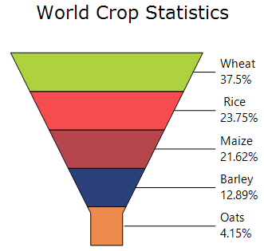
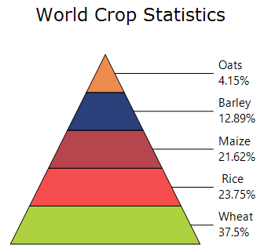

# Accumulation Charts in Windows Forms Chart

Accumulation Charts display data as parts of a whole, where each segment represents a percentage of the total value. These charts typically use a single data series and do not require axes. Essential® Chart provides two types of Accumulation Charts: **Pyramid Chart** and **Funnel Chart**..

You can also customize the following feature:

* **Chart 3-D Mode**: A chart can be rendered in 3-D mode by enabling the [Series3D](https://help.syncfusion.com/cr/windowsforms/Syncfusion.Windows.Forms.Chart.ChartControl.html#Syncfusion_Windows_Forms_Chart_ChartControl_Series3D) property.

## Funnel Chart

A Funnel Chart is a single-series chart that represents data as portions of 100% and does not use axes. It is commonly used to visualize stages in a process, such as a sales pipeline, and can be displayed in 2D or 3D mode.

N>
* Number of Y values per point - 1.
* Number of Series - One.
* Cannot be combined with - Any other chart types.

The following code example demonstrates how to create a Funnel Chart.




ChartSeries series = new ChartSeries("Funnel chart", ChartSeriesType.Funnel);
series.Points.Add(0, 25);
series.Points.Add(1, 25);
series.Points.Add(2, 25);
series.Points.Add(3, 25);
series.Points.Add(4, 25);
chartControl.Series.Add(series);

series.Styles[0].Text = "Oats\n4.15%";
series.Styles[1].Text = "Barley\n12.89%";
series.Styles[2].Text = "Maize\n21.62%";
series.Styles[3].Text = " Rice\n23.75%";
series.Styles[4].Text = "Wheat\n37.5%";

series.Style.DisplayText = true;
series.Style.TextColor = Color.Black;

series.ConfigItems.FunnelItem.LabelStyle = ChartAccumulationLabelStyle.OutsideInColumn;
series.ConfigItems.FunnelItem.LabelPlacement = ChartAccumulationLabelPlacement.Center;




Dim series As New ChartSeries("Funnel chart", ChartSeriesType.Funnel)

series.Points.Add(0, 25)
series.Points.Add(1, 25)
series.Points.Add(2, 25)
series.Points.Add(3, 25)
series.Points.Add(4, 25)

chartControl.Series.Add(series)

series.Styles(0).Text = "Oats" & vbLf & "4.15%"
series.Styles(1).Text = "Barley" & vbLf & "12.89%"
series.Styles(2).Text = "Maize" & vbLf & "21.62%"
series.Styles(3).Text = "Rice" & vbLf & "23.75%"
series.Styles(4).Text = "Wheat" & vbLf & "37.5%"

series.Style.DisplayText = True
series.Style.TextColor = Color.Black

series.ConfigItems.FunnelItem.LabelStyle = ChartAccumulationLabelStyle.OutsideInColumn
series.ConfigItems.FunnelItem.LabelPlacement = ChartAccumulationLabelPlacement.Center




## Pyramid Chart
A Pyramid Chart is a single-series chart that represents data as portions of 100% and does not use axes. It is similar to a Funnel Chart and is often used to display hierarchical or geographical data. Pyramid charts can be displayed in 2D or 3D mode.

N>
Chart Details
* Number of Y values per point - 1.
* Number of Series - One.
* Cannot be combined with - Any other chart types.

The following code example demonstrates how to create a Pyramid Chart.




ChartSeries series = new ChartSeries("Pyramid chart", ChartSeriesType.Pyramid);
series.Points.Add(0, 25);
series.Points.Add(1, 25);
series.Points.Add(2, 25);
series.Points.Add(3, 25);
series.Points.Add(4, 25);
chartControl.Series.Add(series);

series.Styles[0].Text = "Oats\n4.15%";
series.Styles[1].Text = "Barley\n12.89%";
series.Styles[2].Text = "Maize\n21.62%";
series.Styles[3].Text = " Rice\n23.75%";
series.Styles[4].Text = "Wheat\n37.5%";

series.Style.DisplayText = true;
series.Style.TextColor = Color.Black;

series.ConfigItems.PyramidItem.LabelStyle = ChartAccumulationLabelStyle.OutsideInColumn;
series.ConfigItems.PyramidItem.LabelPlacement = ChartAccumulationLabelPlacement.Center;




Dim series As New ChartSeries("Pyramid chart", ChartSeriesType.Pyramid)

series.Points.Add(0, 25)
series.Points.Add(1, 25)
series.Points.Add(2, 25)
series.Points.Add(3, 25)
series.Points.Add(4, 25)

chartControl.Series.Add(series)

series.Styles(0).Text = "Oats" & vbLf & "4.15%"
series.Styles(1).Text = "Barley" & vbLf & "12.89%"
series.Styles(2).Text = "Maize" & vbLf & "21.62%"
series.Styles(3).Text = "Rice" & vbLf & "23.75%"
series.Styles(4).Text = "Wheat" & vbLf & "37.5%"

series.Style.DisplayText = True
series.Style.TextColor = Color.Black

series.ConfigItems.PyramidItem.LabelStyle = ChartAccumulationLabelStyle.OutsideInColumn
series.ConfigItems.PyramidItem.LabelPlacement = ChartAccumulationLabelPlacement.Center




## Customization Options

The following chart series properties are used as customization options for accumulation chart types.

[Border](https://help.syncfusion.com/windowsforms/chart/chart-series#border), [DisplayText](https://help.syncfusion.com/windowsforms/chart/chart-series#displaytext), [DrawSeriesNameInDepth](https://help.syncfusion.com/windowsforms/chart/chart-series#drawseriesnameindepth), [FigureBase](https://help.syncfusion.com/windowsforms/chart/chart-series#figurebase), [GapRatio](https://help.syncfusion.com/windowsforms/chart/chart-series#gapratio), [HighlightInterior](https://help.syncfusion.com/windowsforms/chart/chart-series#highlightinterior), [LabelPlacement](https://help.syncfusion.com/windowsforms/chart/chart-series#labelplacement), [LabelStyle](https://help.syncfusion.com/windowsforms/chart/chart-series#labelstyle), [FancyToolTip](https://help.syncfusion.com/windowsforms/chart/chart-series#fancytooltip), [Font](https://help.syncfusion.com/windowsforms/chart/chart-series#font), [Interior](https://help.syncfusion.com/windowsforms/chart/chart-series#interior), [LegendItem](https://help.syncfusion.com/windowsforms/chart/chart-series#legenditem), [Name](https://help.syncfusion.com/windowsforms/chart/chart-series#name), [PointsToolTipFormat](https://help.syncfusion.com/windowsforms/chart/chart-series#pointstooltipformat), [SmartLabels](https://help.syncfusion.com/windowsforms/chart/chart-series#smartlabels), [Summary](https://help.syncfusion.com/windowsforms/chart/chart-series#summary), [Text](https://help.syncfusion.com/windowsforms/chart/chart-series#text-series), [TextColor](https://help.syncfusion.com/windowsforms/chart/chart-series#textcolor), [TextFormat](https://help.syncfusion.com/windowsforms/chart/chart-series#textformat), [TextOffset](https://help.syncfusion.com/windowsforms/chart/chart-series#textoffset), [TextOrientation](https://help.syncfusion.com/windowsforms/chart/chart-series#textorientation), [Visible](https://help.syncfusion.com/windowsforms/chart/chart-series#visible), [ShowDataBindLabels](https://help.syncfusion.com/windowsforms/chart/chart-series#showdatabindlabels).

N>

* The [PyramidMode](https://help.syncfusion.com/windowsforms/chart/chart-series#pyramidmode) property is supported only in the `Pyramid Chart` as a customization option.

* The [FunnelMode](https://help.syncfusion.com/windowsforms/chart/chart-series#funnelmode) property is supported only in the `Funnel Chart` as a customization option.