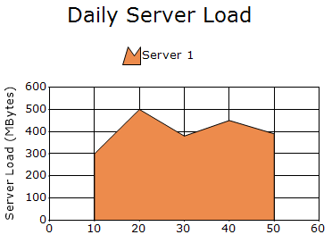
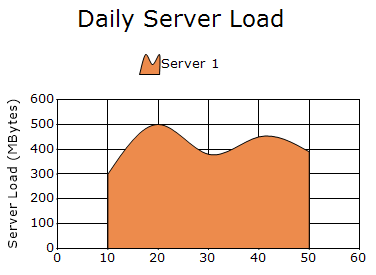
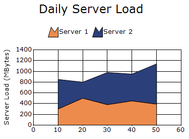
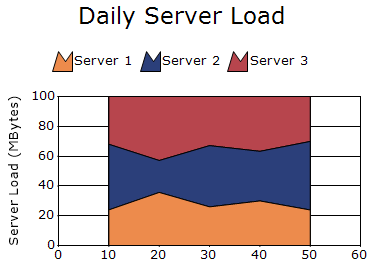
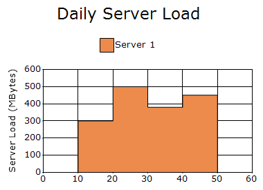

# Area Charts in Windows Forms Chart

Area charts highlight the magnitude of change over time by rendering data in a continuous, flowing pattern rather than using discrete bars or columns. They feature support for alpha-blending multiple series and provide extensive customization options for the chart's appearance.

You can also customize the following features for area charts:

* Series Color Settings: Background and foreground colors for area charts are customized through the [Interior](https://help.syncfusion.com/cr/windowsforms/Syncfusion.Windows.Forms.Chart.ChartStyleInfo.html#Syncfusion_Windows_Forms_Chart_ChartStyleInfo_Interior) property of the [ChartStyleInfo](https://help.syncfusion.com/cr/windowsforms/Syncfusion.Windows.Forms.Chart.ChartStyleInfo.html) class.
* Chart 3-D Mode: A chart is rendered in 3-D mode by enabling the [Series3D](https://help.syncfusion.com/cr/windowsforms/Syncfusion.Windows.Forms.Chart.ChartControl.html#Syncfusion_Windows_Forms_Chart_ChartControl_Series3D) property.
* Border Settings: Border color and width of an area chart can be changed through the [Color](https://help.syncfusion.com/cr/windowsforms/Syncfusion.Windows.Forms.Chart.ChartLineInfo.html#Syncfusion_Windows_Forms_Chart_ChartLineInfo_Color) and [Width](https://help.syncfusion.com/cr/windowsforms/Syncfusion.Windows.Forms.Chart.ChartLineInfo.html#Syncfusion_Windows_Forms_Chart_ChartLineInfo_Width) properties.
 
 ## Area Chart
 
An Area Chart connects data points with straight lines, creating a shaded region between the lines and the x-axis. Alpha-blending allows multiple series to be plotted on a single chart while keeping overlapping areas clearly visible.

N>
chart details for area chart.
* Number of Y values per point - 1.
* Number of Series - One or More.
* Cannot be combined with - Pie, Bar, Polar, Radar, Gantt, Stacked Bar.




ChartSeries firstServer = new ChartSeries("Server 1", Area);
firstServer.Points.Add(10, 300);
firstServer.Points.Add(20, 500);
firstServer.Points.Add(30, 380);
firstServer.Points.Add(40, 450);
firstServer.Points.Add(50, 390);

chartControl.Series.Add(firstServer);




Dim firstServer As New ChartSeries("Server 1", ChartSeriesType.Area)
firstServer.Points.Add(10, 300)
firstServer.Points.Add(20, 500)
firstServer.Points.Add(30, 380)
firstServer.Points.Add(40, 450)
firstServer.Points.Add(50, 390)

chartControl.Series.Add(firstServer)




## Spline Area Chart

A Spline Area Chart connects data points with smooth spline curves, filling the enclosed area with a specified interior brush. Multiple series can be plotted using alpha-blending to ensure visibility of overlapping areas.

N>
chart details for spline area chart.
* Number of Y values per point - 1.
* Number of Series - One or More.
* Cannot be Combined with - Pie, Bar, Polar, Radar, Stacked Bar.




ChartSeries firstServer = new ChartSeries("Server 1", ChartSeriesType.SplineArea);
firstServer.Points.Add(10, 300);
firstServer.Points.Add(20, 500);
firstServer.Points.Add(30, 380);
firstServer.Points.Add(40, 450);
firstServer.Points.Add(50, 390);

chartControl.Series.Add(firstServer);




Dim firstServer As New ChartSeries("Server 1", ChartSeriesType.SplineArea)
firstServer.Points.Add(10, 300)
firstServer.Points.Add(20, 500)
firstServer.Points.Add(30, 380)
firstServer.Points.Add(40, 450)
firstServer.Points.Add(50, 390)

chartControl.Series.Add(firstServer)




## Stacking Area Chart

Stacking Area Charts are similar to standard area charts, but the Y-values of each series are stacked on top of one another in a specified order. This makes it easier to visualize the relationship between individual parts and the total sum.

N>
chart details for stacking area chart.
* Number of Y values per point - 1.
* Number of Series - One or More.
* Cannot be combined with - Pie, Bar, Polar, Radar, Stacked Bar.




ChartSeries firstServer = new ChartSeries("Server 1", ChartSeriesType.StackingArea);
firstServer.Points.Add(10, 300);
firstServer.Points.Add(20, 500);
firstServer.Points.Add(30, 380);
firstServer.Points.Add(40, 450);
firstServer.Points.Add(50, 390);

ChartSeries secondServer = new ChartSeries("Server 2", ChartSeriesType.StackingArea);

secondServer.Points.Add(10, 550);
secondServer.Points.Add(20, 300);
secondServer.Points.Add(30, 600);
secondServer.Points.Add(40, 500);
secondServer.Points.Add(50, 750);

chartControl.Series.Add(firstServer);
chartControl.Series.Add(secondServer);




Dim firstServer As New ChartSeries("Server 1", ChartSeriesType.StackingArea)
firstServer.Points.Add(10, 300)
firstServer.Points.Add(20, 500)
firstServer.Points.Add(30, 380)
firstServer.Points.Add(40, 450)
firstServer.Points.Add(50, 390)

chartControl.Series.Add(firstServer)

Dim secondServer As New ChartSeries("Server 2", ChartSeriesType.StackingArea)
secondServer.Points.Add(10, 550)
secondServer.Points.Add(20, 300)
secondServer.Points.Add(30, 600)
secondServer.Points.Add(40, 500)
secondServer.Points.Add(50, 750)

chartControl.Series.Add(firstServer)
chartControl.Series.Add(secondServer)




## Stacking Area100 Chart

This chart type displays multiple data series as stacked areas, ensuring the cumulative proportion of each element always totals 100%. Consequently, the y-axis is always rendered within the 0 to 100 range.

N>
chart details for stacking area100 chart.
* Number of Y values per point - 1.
* Number of Series - One.
* SupportMarker - No.
* Cannot be Combined with - Any other chart types.




ChartSeries firstServer = new ChartSeries("Server 1", ChartSeriesType.StackingArea100);
firstServer.Points.Add(10, 300);
firstServer.Points.Add(20, 500);
firstServer.Points.Add(30, 380);
firstServer.Points.Add(40, 450);
firstServer.Points.Add(50, 390);

ChartSeries secondServer = new ChartSeries("Server 2", ChartSeriesType.StackingArea100);

secondServer.Points.Add(10, 550);
secondServer.Points.Add(20, 300);
secondServer.Points.Add(30, 600);
secondServer.Points.Add(40, 500);
secondServer.Points.Add(50, 750);
ChartSeries thirdServer = new ChartSeries("Server 3", ChartSeriesType.StackingArea100);

thirdServer.Points.Add(10, 400);
thirdServer.Points.Add(20, 600);
thirdServer.Points.Add(30, 480);
thirdServer.Points.Add(40, 550);
thirdServer.Points.Add(50, 490);

chartControl.Series.Add(firstServer);
chartControl.Series.Add(secondServer);
chartControl.Series.Add(thirdServer);




Dim firstServer As New ChartSeries("Server 1", ChartSeriesType.StackingArea100)
firstServer.Points.Add(10, 300)
firstServer.Points.Add(20, 500)
firstServer.Points.Add(30, 380)
firstServer.Points.Add(40, 450)
firstServer.Points.Add(50, 390)

chartControl.Series.Add(firstServer)

Dim secondServer As New ChartSeries("Server 2", ChartSeriesType.StackingArea100)
secondServer.Points.Add(10, 550)
secondServer.Points.Add(20, 300)
secondServer.Points.Add(30, 600)
secondServer.Points.Add(40, 500)
secondServer.Points.Add(50, 750)

Dim thirdServer As New ChartSeries("Server 3", ChartSeriesType.StackingArea100)

thirdServer.Points.Add(10, 400)
thirdServer.Points.Add(20, 600)
thirdServer.Points.Add(30, 480)
thirdServer.Points.Add(40, 550)
thirdServer.Points.Add(50, 490)

chartControl.Series.Add(firstServer)
chartControl.Series.Add(secondServer)
chartControl.Series.Add(thirdServer)




## Step Area Chart

Step Area Chart is similar to a standard area chart, but instead of connecting data points with straight lines, it uses horizontal and vertical lines to create a step-like pattern between values.

N>
chart details for step area chart.
* Number of Y values per point - 1.
* Number of Series - One or More.
* Cannot be combined with - Pie, Bar, Polar, Radar, Stacked Bar.




ChartSeries firstServer = new ChartSeries("Server 1", ChartSeriesType.StepArea);
firstServer.Points.Add(10, 300);
firstServer.Points.Add(20, 500);
firstServer.Points.Add(30, 380);
firstServer.Points.Add(40, 450);
firstServer.Points.Add(50, 390);

chartControl.Series.Add(firstServer);




Dim firstServer As New ChartSeries("Server 1", ChartSeriesType.StepArea)
firstServer.Points.Add(10, 300)
firstServer.Points.Add(20, 500)
firstServer.Points.Add(30, 380)
firstServer.Points.Add(40, 450)
firstServer.Points.Add(50, 390)

chartControl.Series.Add(firstServer)




## Customization option
The following chart series properties are used as customization options for all area chart types.

[Border](https://help.syncfusion.com/windowsforms/chart/chart-series#border), [DisplayText](https://help.syncfusion.com/windowsforms/chart/chart-series#displaytext), [DrawSeriesNameInDepth](https://help.syncfusion.com/windowsforms/chart/chart-series#drawseriesnameindepth), [ElementBorders](https://help.syncfusion.com/windowsforms/chart/chart-series#elementborders), [FancyToolTip](https://help.syncfusion.com/windowsforms/chart/chart-series#fancytooltip), [Font](https://help.syncfusion.com/windowsforms/chart/chart-series#font),  [ImageIndex](https://help.syncfusion.com/windowsforms/chart/chart-series#imageindex), [Images](https://help.syncfusion.com/windowsforms/chart/chart-series#images), [Interior](https://help.syncfusion.com/windowsforms/chart/chart-series#interior), [LegendItem](https://help.syncfusion.com/windowsforms/chart/chart-series#legenditem), N[Name](https://help.syncfusion.com/windowsforms/chart/chart-series#name), [PointsToolTipFormat](https://help.syncfusion.com/windowsforms/chart/chart-series#pointstooltipformat), [Rotate](https://help.syncfusion.com/windowsforms/chart/chart-series#rotate), SeriesToolTipFormat, [SmartLabels](https://help.syncfusion.com/windowsforms/chart/chart-series#smartlabels), [Spacing Between Series](https://help.syncfusion.com/windowsforms/chart/chart-series#spacingbetweenseries), [Summary](https://help.syncfusion.com/windowsforms/chart/chart-series#summary), [Text](https://help.syncfusion.com/windowsforms/chart/chart-series#text-series), [TextColor](https://help.syncfusion.com/windowsforms/chart/chart-series#textcolor), [TextFormat](https://help.syncfusion.com/windowsforms/chart/chart-series#textformat), [TextOffset](https://help.syncfusion.com/windowsforms/chart/chart-series#textoffset), [TextOrientation](https://help.syncfusion.com/windowsforms/chart/chart-series#textorientation), [Visible](https://help.syncfusion.com/windowsforms/chart/chart-series#visible).

N>
* The [StepItem.Inverted](https://help.syncfusion.com/windowsforms/chart/chart-series#stepiteminverted) property is supported only in the `Step Area Chart` as a customization option.
* The [DisplayShadow](https://help.syncfusion.com/windowsforms/chart/chart-series#displayshadow) property is supported only in the `Area Chart` as a customization option.
* The [ZOrder](https://help.syncfusion.com/windowsforms/chart/chart-series#zorder) property is supported only in the `Stacking Area` and `Stacking Area100` Chart as a customization option.
* The [HighlightInterior](https://help.syncfusion.com/windowsforms/chart/chart-series#highlightinterior) property is supported in all area chart types, except `Spline Area` and `Step Area` charts, as a customization option.