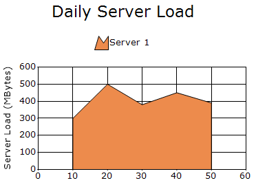
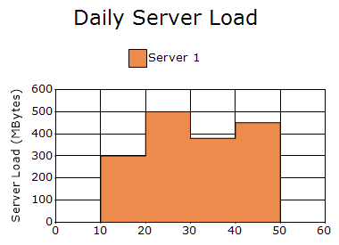

# Area charts in windows forms chart

Area charts highlight the magnitude of change over time by rendering data in a continuous, flowing pattern rather than using discrete bars or columns. They feature support for alpha-blending multiple series and provide extensive customization options for the chart's appearance.

You can also customize the following features for area charts:

* **Series Color Settings**: Background and foreground colors for area charts are customized through the [Interior](https://help.syncfusion.com/cr/windowsforms/Syncfusion.Windows.Forms.Chart.ChartStyleInfo.html#Syncfusion_Windows_Forms_Chart_ChartStyleInfo_Interior) property of the [ChartStyleInfo](https://help.syncfusion.com/cr/windowsforms/Syncfusion.Windows.Forms.Chart.ChartStyleInfo.html) class.
* **Chart 3-D Mode**: A chart is rendered in 3-D mode by enabling the [Series3D](https://help.syncfusion.com/cr/windowsforms/Syncfusion.Windows.Forms.Chart.ChartControl.html#Syncfusion_Windows_Forms_Chart_ChartControl_Series3D) property.
* **Border Settings**: Border color and width of an area chart can be changed through the [Color](https://help.syncfusion.com/cr/windowsforms/Syncfusion.Windows.Forms.Chart.ChartLineInfo.html#Syncfusion_Windows_Forms_Chart_ChartLineInfo_Color) and [Width](https://help.syncfusion.com/cr/windowsforms/Syncfusion.Windows.Forms.Chart.ChartLineInfo.html#Syncfusion_Windows_Forms_Chart_ChartLineInfo_Width) properties.
 
 ## Area chart
 
An Area chart connects data points with straight lines, creating a shaded region between the lines and the x-axis. Alpha-blending allows multiple series to be plotted on a single chart while keeping overlapping areas clearly visible.

N>
Chart details for area chart.
* Number of Y values per point - 1.
* Number of Series - One or More.
* Cannot be combined with - Pie, Bar, Polar, Radar, Gantt, Stacked Bar.

The following code example demonstrates how to create an Area chart.




ChartSeries firstServer = new ChartSeries("Server 1", ChartSeriesType.Area);
firstServer.Points.Add(10, 300);
firstServer.Points.Add(20, 500);
firstServer.Points.Add(30, 380);
firstServer.Points.Add(40, 450);
firstServer.Points.Add(50, 390);

chartControl.Series.Add(firstServer);




' Area Series
Dim firstServer As New ChartSeries("Server 1", ChartSeriesType.Area)

firstServer.Points.Add(10, 300)
firstServer.Points.Add(20, 500)
firstServer.Points.Add(30, 380)
firstServer.Points.Add(40, 450)
firstServer.Points.Add(50, 390)

chartControl.Series.Add(firstServer)




### Customization option

The following chart series properties are used as customization options for Area chart:

- [Border](https://help.syncfusion.com/windowsforms/chart/chart-series#border)
- [DisplayShadow](https://help.syncfusion.com/windowsforms/chart/chart-series#displayshadow)
- [DisplayText](https://help.syncfusion.com/windowsforms/chart/chart-series#displaytext)
- [DrawSeriesNameInDepth](https://help.syncfusion.com/windowsforms/chart/chart-series#drawseriesnameindepth)
- [ElementBorders](https://help.syncfusion.com/windowsforms/chart/chart-series#elementborders)
- [HighlightInterior](https://help.syncfusion.com/windowsforms/chart/chart-series#highlightinterior)
- [ImageIndex](https://help.syncfusion.com/windowsforms/chart/chart-series#imageindex)
- [Rotate](https://help.syncfusion.com/windowsforms/chart/chart-series#rotate)
- [SeriesToolTipFormat](https://help.syncfusion.com/windowsforms/chart/chart-series#seriestooltipformat)
- [Spacing Between Series](https://help.syncfusion.com/windowsforms/chart/chart-series#spacingbetweenseries)
- [FancyToolTip](https://help.syncfusion.com/windowsforms/chart/chart-series#fancytooltip)
- [Font](https://help.syncfusion.com/windowsforms/chart/chart-series#font)
- [Interior](https://help.syncfusion.com/windowsforms/chart/chart-series#interior)
- [LegendItem](https://help.syncfusion.com/windowsforms/chart/chart-series#legenditem)
- [Name](https://help.syncfusion.com/windowsforms/chart/chart-series#name)
- [PointsToolTipFormat](https://help.syncfusion.com/windowsforms/chart/chart-series#pointstooltipformat)
- [SmartLabels](https://help.syncfusion.com/windowsforms/chart/chart-series#smartlabels)
- [Summary](https://help.syncfusion.com/windowsforms/chart/chart-series#summary)
- [Text](https://help.syncfusion.com/windowsforms/chart/chart-series#text-series)
- [TextColor](https://help.syncfusion.com/windowsforms/chart/chart-series#textcolor)
- [TextFormat](https://help.syncfusion.com/windowsforms/chart/chart-series#textformat)
- [TextOffset](https://help.syncfusion.com/windowsforms/chart/chart-series#textoffset)
- [TextOrientation](https://help.syncfusion.com/windowsforms/chart/chart-series#textorientation)
- [Visible](https://help.syncfusion.com/windowsforms/chart/chart-series#visible)

## Spline area chart

A Spline Area Chart connects data points with smooth spline curves, filling the enclosed area with a specified interior brush. Multiple series can be plotted using alpha-blending to ensure visibility of overlapping areas.

N>
Chart details for spline area chart.
* Number of Y values per point - 1.
* Number of Series - One or More.
* Cannot be Combined with - Pie, Bar, Polar, Radar, Stacked Bar.

The following code example demonstrates how to create a Spline Area chart.




ChartSeries firstServer = new ChartSeries("Server 1", ChartSeriesType.SplineArea);
firstServer.Points.Add(10, 300);
firstServer.Points.Add(20, 500);
firstServer.Points.Add(30, 380);
firstServer.Points.Add(40, 450);
firstServer.Points.Add(50, 390);

chartControl.Series.Add(firstServer);




Dim firstServer As New ChartSeries("Server 1", ChartSeriesType.SplineArea)
firstServer.Points.Add(10, 300)
firstServer.Points.Add(20, 500)
firstServer.Points.Add(30, 380)
firstServer.Points.Add(40, 450)
firstServer.Points.Add(50, 390)

chartControl.Series.Add(firstServer)




### Customization option

The following chart series properties are used as customization options for Spline Area chart:

- [Border](https://help.syncfusion.com/windowsforms/chart/chart-series#border)
- [DisplayText](https://help.syncfusion.com/windowsforms/chart/chart-series#displaytext)
- [DrawSeriesNameInDepth](https://help.syncfusion.com/windowsforms/chart/chart-series#drawseriesnameindepth)
- [ElementBorders](https://help.syncfusion.com/windowsforms/chart/chart-series#elementborders)
- [ImageIndex](https://help.syncfusion.com/windowsforms/chart/chart-series#imageindex)
- [Rotate](https://help.syncfusion.com/windowsforms/chart/chart-series#rotate)
- [SeriesToolTipFormat](https://help.syncfusion.com/windowsforms/chart/chart-series#seriestooltipformat)
- [Spacing Between Series](https://help.syncfusion.com/windowsforms/chart/chart-series#spacingbetweenseries)
- [FancyToolTip](https://help.syncfusion.com/windowsforms/chart/chart-series#fancytooltip)
- [Font](https://help.syncfusion.com/windowsforms/chart/chart-series#font)
- [Interior](https://help.syncfusion.com/windowsforms/chart/chart-series#interior)
- [LegendItem](https://help.syncfusion.com/windowsforms/chart/chart-series#legenditem)
- [Name](https://help.syncfusion.com/windowsforms/chart/chart-series#name)
- [PointsToolTipFormat](https://help.syncfusion.com/windowsforms/chart/chart-series#pointstooltipformat)
- [SmartLabels](https://help.syncfusion.com/windowsforms/chart/chart-series#smartlabels)
- [Summary](https://help.syncfusion.com/windowsforms/chart/chart-series#summary)
- [Text](https://help.syncfusion.com/windowsforms/chart/chart-series#text-series)
- [TextColor](https://help.syncfusion.com/windowsforms/chart/chart-series#textcolor)
- [TextFormat](https://help.syncfusion.com/windowsforms/chart/chart-series#textformat)
- [TextOffset](https://help.syncfusion.com/windowsforms/chart/chart-series#textoffset)
- [TextOrientation](https://help.syncfusion.com/windowsforms/chart/chart-series#textorientation)
- [Visible](https://help.syncfusion.com/windowsforms/chart/chart-series#visible)

## Step area chart

Step Area chart is similar to a standard area chart, but instead of connecting data points with straight lines, it uses horizontal and vertical lines to create a step-like pattern between values.

N>
Chart details for step area chart.
* Number of Y values per point - 1.
* Number of Series - One or More.
* Cannot be combined with - Pie, Bar, Polar, Radar, Stacked Bar.

The following code example demonstrates how to create a Step Area chart.




ChartSeries firstServer = new ChartSeries("Server 1", ChartSeriesType.StepArea);
firstServer.Points.Add(10, 300);
firstServer.Points.Add(20, 500);
firstServer.Points.Add(30, 380);
firstServer.Points.Add(40, 450);
firstServer.Points.Add(50, 390);

chartControl.Series.Add(firstServer);




Dim firstServer As New ChartSeries("Server 1", ChartSeriesType.StepArea)
firstServer.Points.Add(10, 300)
firstServer.Points.Add(20, 500)
firstServer.Points.Add(30, 380)
firstServer.Points.Add(40, 450)
firstServer.Points.Add(50, 390)

chartControl.Series.Add(firstServer)




### Customization option

The following chart series properties are used as customization options for Step Area chart:

- [Border](https://help.syncfusion.com/windowsforms/chart/chart-series#border)
- [DisplayText](https://help.syncfusion.com/windowsforms/chart/chart-series#displaytext)
- [DrawSeriesNameInDepth](https://help.syncfusion.com/windowsforms/chart/chart-series#drawseriesnameindepth)
- [ElementBorders](https://help.syncfusion.com/windowsforms/chart/chart-series#elementborders)
- [ImageIndex](https://help.syncfusion.com/windowsforms/chart/chart-series#imageindex)
- [Rotate](https://help.syncfusion.com/windowsforms/chart/chart-series#rotate)
- [SeriesToolTipFormat](https://help.syncfusion.com/windowsforms/chart/chart-series#seriestooltipformat)
- [Spacing Between Series](https://help.syncfusion.com/windowsforms/chart/chart-series#spacingbetweenseries)
- [StepItem.Inverted](https://help.syncfusion.com/windowsforms/chart/chart-series#stepitem)
- [FancyToolTip](https://help.syncfusion.com/windowsforms/chart/chart-series#fancytooltip)
- [Font](https://help.syncfusion.com/windowsforms/chart/chart-series#font)
- [Interior](https://help.syncfusion.com/windowsforms/chart/chart-series#interior)
- [LegendItem](https://help.syncfusion.com/windowsforms/chart/chart-series#legenditem)
- [Name](https://help.syncfusion.com/windowsforms/chart/chart-series#name)
- [PointsToolTipFormat](https://help.syncfusion.com/windowsforms/chart/chart-series#pointstooltipformat)
- [SmartLabels](https://help.syncfusion.com/windowsforms/chart/chart-series#smartlabels)
- [Summary](https://help.syncfusion.com/windowsforms/chart/chart-series#summary)
- [Text](https://help.syncfusion.com/windowsforms/chart/chart-series#text-series)
- [TextColor](https://help.syncfusion.com/windowsforms/chart/chart-series#textcolor)
- [TextFormat](https://help.syncfusion.com/windowsforms/chart/chart-series#textformat)
- [TextOffset](https://help.syncfusion.com/windowsforms/chart/chart-series#textoffset)
- [TextOrientation](https://help.syncfusion.com/windowsforms/chart/chart-series#textorientation)
- [Visible](https://help.syncfusion.com/windowsforms/chart/chart-series#visible)