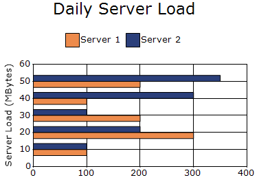
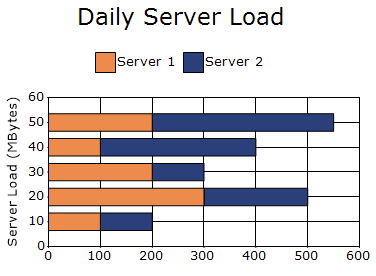
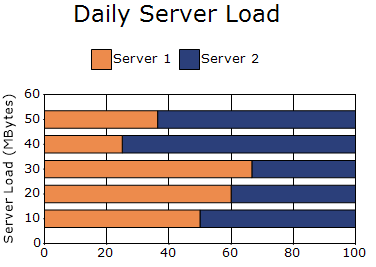

# Bar Charts in Windows Forms Chart

A bar chart is a graphical representation of data that uses rectangular bars to compare values across different categories. The length of each bar indicates the magnitude of the value, making it easy to visualize and compare data. They operate similarly to column charts, which display vertical bars.

You can also customize the following features for line charts:
* Chart 3-D Mode: Render the chart in 3-D mode by enabling the [Series3D](https://help.syncfusion.com/cr/windowsforms/Syncfusion.Windows.Forms.Chart.ChartControl.html#Syncfusion_Windows_Forms_Chart_ChartControl_Series3D) property
* Chart Series Points: Display series points using the [DisplayText](https://help.syncfusion.com/cr/windowsforms/Syncfusion.Windows.Forms.Chart.ChartStyleInfo.html#Syncfusion_Windows_Forms_Chart_ChartStyleInfo_DisplayText) property in a chart control.
* Series Color Settings: Change series colors using the [Interior](https://help.syncfusion.com/cr/windowsforms/Syncfusion.Windows.Forms.Chart.ChartStyleInfo.html#Syncfusion_Windows_Forms_Chart_ChartStyleInfo_Interior) property in a chart control.

## Bar Chart

Bar charts display data with horizontal bars to compare values across categories. They support multiple series and can be shown with a 3D visual effect. The following code shows how to define a bar chart in ChartControl.

N>
chart details for bar chart.
* Number of Y values per point - 1.
* Number of Series - One or More.
* Cannot be combined with - Any chart type except Bar and Stacked Bar charts.




ChartSeries firstServer = new ChartSeries("Server 1", ChartSeriesType.Bar);
firstServer.Points.Add(10, 100);
firstServer.Points.Add(20, 300);
firstServer.Points.Add(30, 200);
firstServer.Points.Add(40, 100);
firstServer.Points.Add(50, 200);

ChartSeries secondServer = new ChartSeries("Server 2", ChartSeriesType.Bar);

secondServer.Points.Add(10, 100);
secondServer.Points.Add(20, 200);
secondServer.Points.Add(30, 100);
secondServer.Points.Add(40, 300);
secondServer.Points.Add(50, 350);

chartControl.Series.Add(firstServer);
chartControl.Series.Add(secondServer);




Dim firstServer As New ChartSeries("Server 1", ChartSeriesType.Bar)
firstServer.Points.Add(10, 100)
firstServer.Points.Add(20, 300)
firstServer.Points.Add(30, 200)
firstServer.Points.Add(40, 100)
firstServer.Points.Add(50, 200)

Dim secondServer As New ChartSeries("Server 2", ChartSeriesType.Bar)
secondServer.Points.Add(10, 100)
secondServer.Points.Add(20, 200)
secondServer.Points.Add(30, 100)
secondServer.Points.Add(40, 300)
secondServer.Points.Add(50, 350)

chartControl.Series.Add(firstServer)
chartControl.Series.Add(secondServer)




## Stacking Bar Chart

Stacking bar charts are similar to regular bar charts, but the Y values are stacked on top of each other in the specified series order. This helps visualize the relationship of parts to a whole. The following code shows how to define a stacking bar chart in ChartControl.

N>
chart details for stacking bar chart.
* Number of Y values per point - 1.
* Number of Series - Two or More (Single series is rendered just as a bar).
* Cannot be Combined with - Any chart type except Bar and Stacked Bar charts.




ChartSeries firstServer = new ChartSeries("Server 1", ChartSeriesType.StackingBar);
firstServer.Points.Add(10, 100);
firstServer.Points.Add(20, 300);
firstServer.Points.Add(30, 200);
firstServer.Points.Add(40, 100);
firstServer.Points.Add(50, 200);

ChartSeries secondServer = new ChartSeries("Server 2", ChartSeriesType.StackingBar);

secondServer.Points.Add(10, 100);
secondServer.Points.Add(20, 200);
secondServer.Points.Add(30, 100);
secondServer.Points.Add(40, 300);
secondServer.Points.Add(50, 350);

chartControl.Series.Add(firstServer);
chartControl.Series.Add(secondServer);




Dim firstServer As New ChartSeries("Server 1", ChartSeriesType.StackingBar)
firstServer.Points.Add(10, 100)
firstServer.Points.Add(20, 300)
firstServer.Points.Add(30, 200)
firstServer.Points.Add(40, 100)
firstServer.Points.Add(50, 200)

Dim secondServer As New ChartSeries("Server 2", ChartSeriesType.StackingBar)
secondServer.Points.Add(10, 100)
secondServer.Points.Add(20, 200)
secondServer.Points.Add(30, 100)
secondServer.Points.Add(40, 300)
secondServer.Points.Add(50, 350)

chartControl.Series.Add(firstServer)
chartControl.Series.Add(secondServer)




## Stacking Bar100 Chart

This chart type displays multiple series of data as stacked Bars ensuring that the cumulative proportion of each stacked element always totals 100%. The y-axis will hence always be rendered with the range 0 - 100. The following code shows how to define a stacking bar100 chart in ChartControl.

N>
chart details for stacking bar100 chart.
* Number of Y values per point - 1.
* Number of Series - Two or More.
* MarkerSupport - No.
* Cannot be combined with - Any other chart types.




ChartSeries firstServer = new ChartSeries("Server 1", ChartSeriesType.StackingBar100);
firstServer.Points.Add(10, 100);
firstServer.Points.Add(20, 300);
firstServer.Points.Add(30, 200);
firstServer.Points.Add(40, 100);
firstServer.Points.Add(50, 200);

ChartSeries secondServer = new ChartSeries("Server 2", ChartSeriesType.StackingBar100);

secondServer.Points.Add(10, 100);
secondServer.Points.Add(20, 200);
secondServer.Points.Add(30, 100);
secondServer.Points.Add(40, 300);
secondServer.Points.Add(50, 350);

chartControl.Series.Add(firstServer);
chartControl.Series.Add(secondServer);




Dim firstServer As New ChartSeries("Server 1", ChartSeriesType.StackingBar100)
firstServer.Points.Add(10, 100)
firstServer.Points.Add(20, 300)
firstServer.Points.Add(30, 200)
firstServer.Points.Add(40, 100)
firstServer.Points.Add(50, 200)

Dim secondServer As New ChartSeries("Server 2", ChartSeriesType.StackingBar100)
secondServer.Points.Add(10, 100)
secondServer.Points.Add(20, 200)
secondServer.Points.Add(30, 100)
secondServer.Points.Add(40, 300)
secondServer.Points.Add(50, 350)

chartControl.Series.Add(firstServer)
chartControl.Series.Add(secondServer)




## Customization Option
The following chart series properties are used as customization options for all bar chart types.

[Border](https://help.syncfusion.com/windowsforms/chart/chart-series#border), [ColumnDrawMode](https://help.syncfusion.com/windowsforms/chart/chart-series#columndrawmode), [DisplayText](https://help.syncfusion.com/windowsforms/chart/chart-series#displaytext), [DrawSeriesNameInDepth](https://help.syncfusion.com/windowsforms/chart/chart-series#drawseriesnameindepth), [ElementBorders](https://help.syncfusion.com/windowsforms/chart/chart-series#elementborders), [FancyToolTip](https://help.syncfusion.com/windowsforms/chart/chart-series#fancytooltip), [Font](https://help.syncfusion.com/windowsforms/chart/chart-series#font), [HighlightInterior](https://help.syncfusion.com/windowsforms/chart/chart-series#highlightinterior), [ImageIndex](https://help.syncfusion.com/windowsforms/chart/chart-series#imageindex), [Images](https://help.syncfusion.com/windowsforms/chart/chart-series#images), [Interior](https://help.syncfusion.com/windowsforms/chart/chart-series#interior), [LegendItem](https://help.syncfusion.com/windowsforms/chart/chart-series#legenditem), [LightAngle](https://help.syncfusion.com/windowsforms/chart/chart-series#lightangle), [LightColor](https://help.syncfusion.com/windowsforms/chart/chart-series#lightcolor), [Name](https://help.syncfusion.com/windowsforms/chart/chart-series#name), [PointsToolTipFormat](https://help.syncfusion.com/windowsforms/chart/chart-series#pointstooltipformat), [Rotate](https://help.syncfusion.com/windowsforms/chart/chart-series#rotate), [ShadingMode](https://help.syncfusion.com/windowsforms/chart/chart-series#shadingmode), [ShadowInterior](https://help.syncfusion.com/windowsforms/chart/chart-series#shadowinterior), [ShadowOffset](https://help.syncfusion.com/windowsforms/chart/chart-series#shadowoffset),  [SmartLabels](https://help.syncfusion.com/windowsforms/chart/chart-series#smartlabels), [Spacing](https://help.syncfusion.com/windowsforms/chart/chart-series#spacing), [Spacing Between Series](https://help.syncfusion.com/windowsforms/chart/chart-series#spacingbetweenseries), [Summary](https://help.syncfusion.com/windowsforms/chart/chart-series#summary), [Text](https://help.syncfusion.com/windowsforms/chart/chart-series#text-series), [TextColor](https://help.syncfusion.com/windowsforms/chart/chart-series#textcolor), [TextFormat](https://help.syncfusion.com/windowsforms/chart/chart-series#textformat), [TextOffset](https://help.syncfusion.com/windowsforms/chart/chart-series#textoffset), [TextOrientation](https://help.syncfusion.com/windowsforms/chart/chart-series#textorientation), [Visible](https://help.syncfusion.com/windowsforms/chart/chart-series#visible).

N>
* [DisplayShadow](https://help.syncfusion.com/windowsforms/chart/chart-series#displayshadow), [PhongAlpha](https://help.syncfusion.com/windowsforms/chart/chart-series#phongalpha) are used only in the customization options for `Bar chart`.
* [ZOrder](https://help.syncfusion.com/windowsforms/chart/chart-series#zorder) used only in `Stacking Bar` and `Stacking Bar100` chart customization options.