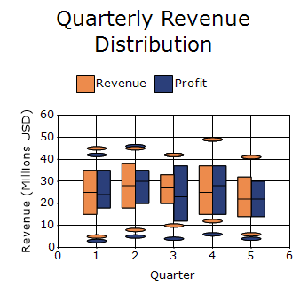
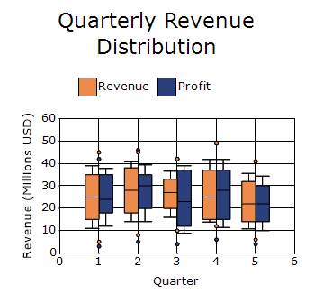
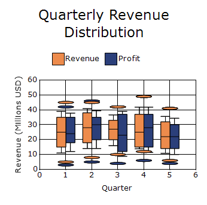

# Box and Whisker Chart in Windows Forms Charts

A Box and Whisker chart renders a combination of boxes and lines to show how the values are distributed in a dataset.

The chart supports **Normal mode** and **Percentile mode** for determining the whisker range and outliers. In Normal mode, values beyond 1.5 times the interquartile range are treated as outliers. In Percentile mode, use the [PercentileMode](https://help.syncfusion.com/cr/windowsforms/Syncfusion.Windows.Forms.Chart.ChartBoxAndWhiskerConfigItem.html#Syncfusion_Windows_Forms_Chart_ChartBoxAndWhiskerConfigItem_PercentileMode) and [Percentile](https://help.syncfusion.com/cr/windowsforms/Syncfusion.Windows.Forms.Chart.ChartBoxAndWhiskerConfigItem.html#Syncfusion_Windows_Forms_Chart_ChartBoxAndWhiskerConfigItem_Percentile) properties to define the whisker limits. Use the [OutLierWidth](https://help.syncfusion.com/cr/windowsforms/Syncfusion.Windows.Forms.Chart.ChartBoxAndWhiskerConfigItem.html#Syncfusion_Windows_Forms_Chart_ChartBoxAndWhiskerConfigItem_OutLierWidth) property to adjust the width of the outliers.

N>1.The percentile value should lie between 0.0 and 0.25.
N>
N>2.It is not possible to set upper Percentile value. It is calculated automatically based on the Percentile value.
N>
N>For example: Percentile = 0.15
N>
N>Upper Percentile = 1 - Percentile = 0.85.
N>
N>In Normal mode, Outliers are present in which case the whiskers extend to a maximum of 1.5 times the inter-quartile range. But in Percentile mode, Outliers will be calculated based on the Percentile value.
N>
N>For example: Percentile = 0.15
N>
N>Outliers are present in which case the whiskers extend to minimum and maximum of 15th and 85th percentile of overall data set, respectively. If 'Percentile' value is Zero, then, there is no outliers in the Chart.
N>
N>3.The width of the Outliers can be adjusted by using this 'Series1.ConfigItems.BoxAndWhiskerItem.OutLierWidth' property. If it is zero, the width of the outlier will be calculated based on the data points range.




The following code example demonstrates how to create a Box and Whisker chart.

ChartSeries revenueSeries = new ChartSeries("Revenue", ChartSeriesType.BoxAndWhisker);

revenueSeries.Points.Add(1, 5, 15, 25, 35, 45);
revenueSeries.Points.Add(2, 8, 18, 28, 38, 45);
revenueSeries.Points.Add(3, 10, 20, 27, 33, 42);
revenueSeries.Points.Add(4, 12, 15, 25, 37, 49);
revenueSeries.Points.Add(5, 6, 14, 22, 32, 41);

ChartSeries profitSeries = new ChartSeries("Profit", ChartSeriesType.BoxAndWhisker);

profitSeries.Points.Add(1, 3, 18, 24, 35, 42);
profitSeries.Points.Add(2, 5, 20, 30, 35, 46);
profitSeries.Points.Add(3, 4, 12, 23, 37, 42);
profitSeries.Points.Add(4, 6, 15, 28, 37, 49);
profitSeries.Points.Add(5, 4, 14, 22, 30, 41);

chartControl.Series.Add(revenueSeries);
chartControl.Series.Add(profitSeries);




' Revenue Series
Dim revenueSeries As New ChartSeries("Revenue", ChartSeriesType.BoxAndWhisker)

revenueSeries.Points.Add(1, 5, 15, 25, 35, 45)
revenueSeries.Points.Add(2, 8, 18, 28, 38, 45)
revenueSeries.Points.Add(3, 10, 20, 27, 33, 42)
revenueSeries.Points.Add(4, 12, 15, 25, 37, 49)
revenueSeries.Points.Add(5, 6, 14, 22, 32, 41)

' Profit Series
Dim profitSeries As New ChartSeries("Profit", ChartSeriesType.BoxAndWhisker)

profitSeries.Points.Add(1, 3, 18, 24, 35, 42)
profitSeries.Points.Add(2, 5, 20, 30, 35, 46)
profitSeries.Points.Add(3, 4, 12, 23, 37, 42)
profitSeries.Points.Add(4, 6, 15, 28, 37, 49)
profitSeries.Points.Add(5, 4, 14, 22, 30, 41)

' Add Series
chartControl.Series.Add(revenueSeries)
chartControl.Series.Add(profitSeries)




## Percentile mode

The [PercentileMode](https://help.syncfusion.com/cr/windowsforms/Syncfusion.Windows.Forms.Chart.ChartBoxAndWhiskerConfigItem.html#Syncfusion_Windows_Forms_Chart_ChartBoxAndWhiskerConfigItem_PercentileMode) property controls whether the Box and Whisker chart is rendered in percentile mode or normal mode and is set to `false` by default.

The following code enables percentile mode.




chartControl.Series[0].ConfigItems.BoxAndWhiskerItem.PercentileMode = true;
chartControl.Series[1].ConfigItems.BoxAndWhiskerItem.PercentileMode = true;
chartControl.Series[0].ConfigItems.BoxAndWhiskerItem.Percentile = 0.25;

chartControl.Series[1].ConfigItems.BoxAndWhiskerItem.Percentile = 0.25;

chartControl.Series[0].ConfigItems.BoxAndWhiskerItem.OutLierWidth = 50;

chartControl.Series[1].ConfigItems.BoxAndWhiskerItem.OutLierWidth = 50;




chartControl.Series(0).ConfigItems.BoxAndWhiskerItem.PercentileMode = True

chartControl.Series(1).ConfigItems.BoxAndWhiskerItem.PercentileMode = True

chartControl.Series(0).ConfigItems.BoxAndWhiskerItem.Percentile = 0.25

chartControl.Series(1).ConfigItems.BoxAndWhiskerItem.Percentile = 0.25

chartControl.Series(0).ConfigItems.BoxAndWhiskerItem.OutLierWidth = 50

chartControl.Series(1).ConfigItems.BoxAndWhiskerItem.OutLierWidth = 50




## Percentile

The [Percentile](https://help.syncfusion.com/cr/windowsforms/Syncfusion.Windows.Forms.Chart.ChartBoxAndWhiskerConfigItem.html#Syncfusion_Windows_Forms_Chart_ChartBoxAndWhiskerConfigItem_Percentile) property specifies the percentile value used to determine outliers in a Box and Whisker chart. The default percentile value is `0`.

N> The [Percentile](https://help.syncfusion.com/cr/windowsforms/Syncfusion.Windows.Forms.Chart.ChartBoxAndWhiskerConfigItem.html#Syncfusion_Windows_Forms_Chart_ChartBoxAndWhiskerConfigItem_Percentile) property is applicable only when [PercentileMode](https://help.syncfusion.com/cr/windowsforms/Syncfusion.Windows.Forms.Chart.ChartBoxAndWhiskerConfigItem.html#Syncfusion_Windows_Forms_Chart_ChartBoxAndWhiskerConfigItem_PercentileMode) is enabled.

The following code sets the percentile value to `0.15`.



chartControl.Series[0].ConfigItems.BoxAndWhiskerItem.Percentile = 0.15;

chartControl.Series[1].ConfigItems.BoxAndWhiskerItem.Percentile = 0.15;




chartControl.Series(0).ConfigItems.BoxAndWhiskerItem.Percentile = 0.15
chartControl.Series(1).ConfigItems.BoxAndWhiskerItem.Percentile = 0.15




## Outlier width

The [OutLierWidth](https://help.syncfusion.com/cr/windowsforms/Syncfusion.Windows.Forms.Chart.ChartBoxAndWhiskerConfigItem.html#Syncfusion_Windows_Forms_Chart_ChartBoxAndWhiskerConfigItem_OutLierWidth) property specifies the width of the outlier marker in a Box and Whisker chart. By default, the outlier width is set to `0`.

N>The [OutLierWidth](https://help.syncfusion.com/cr/windowsforms/Syncfusion.Windows.Forms.Chart.ChartBoxAndWhiskerConfigItem.html#Syncfusion_Windows_Forms_Chart_ChartBoxAndWhiskerConfigItem_OutLierWidth) property is applicable only when [PercentileMode](https://help.syncfusion.com/cr/windowsforms/Syncfusion.Windows.Forms.Chart.ChartBoxAndWhiskerConfigItem.html#Syncfusion_Windows_Forms_Chart_ChartBoxAndWhiskerConfigItem_PercentileMode) is set to `true` and the [Percentile](https://help.syncfusion.com/cr/windowsforms/Syncfusion.Windows.Forms.Chart.ChartBoxAndWhiskerConfigItem.html#Syncfusion_Windows_Forms_Chart_ChartBoxAndWhiskerConfigItem_Percentile) property is assigned a value greater than `0`.

The following code sets the outlier width to `60`.




chartControl.Series[0].ConfigItems.BoxAndWhiskerItem.PercentileMode = true;
chartControl.Series[1].ConfigItems.BoxAndWhiskerItem.PercentileMode = true;

chartControl.Series[0].ConfigItems.BoxAndWhiskerItem.Percentile = 0.15;
chartControl.Series[1].ConfigItems.BoxAndWhiskerItem.Percentile = 0.15;

chartControl.Series[0].ConfigItems.BoxAndWhiskerItem.OutLierWidth = 60;
chartControl.Series[1].ConfigItems.BoxAndWhiskerItem.OutLierWidth = 60;




chartControl.Series(0).ConfigItems.BoxAndWhiskerItem.PercentileMode = True
chartControl.Series(1).ConfigItems.BoxAndWhiskerItem.PercentileMode = True

chartControl.Series(0).ConfigItems.BoxAndWhiskerItem.Percentile = 0.15
chartControl.Series(1).ConfigItems.BoxAndWhiskerItem.Percentile = 0.15

chartControl.Series(0).ConfigItems.BoxAndWhiskerItem.OutLierWidth = 60
chartControl.Series(1).ConfigItems.BoxAndWhiskerItem.OutLierWidth = 60




## Customization option

The following chart series properties are used as customization options for Box and Whisker chart:

- [Border](https://help.syncfusion.com/windowsforms/chart/chart-series#border)
- [ColumnDrawMode](https://help.syncfusion.com/windowsforms/chart/chart-series#columndrawmode)
- [DisplayShadow](https://help.syncfusion.com/windowsforms/chart/chart-series#displayshadow)
- [DisplayText](https://help.syncfusion.com/windowsforms/chart/chart-series#displaytext)
- [ElementBorders](https://help.syncfusion.com/windowsforms/chart/chart-series#elementborders)
- [FancyToolTip](https://help.syncfusion.com/windowsforms/chart/chart-series#fancytooltip)
- [Font](https://help.syncfusion.com/windowsforms/chart/chart-series#font)
- [HighlightInterior](https://help.syncfusion.com/windowsforms/chart/chart-series#highlightinterior)
- [ImageIndex](https://help.syncfusion.com/windowsforms/chart/chart-series#imageindex)
- [Images](https://help.syncfusion.com/windowsforms/chart/chart-series#images)
- [Interior](https://help.syncfusion.com/windowsforms/chart/chart-series#interior)
- [LegendItem](https://help.syncfusion.com/windowsforms/chart/chart-series#legenditem)
- [LightAngle](https://help.syncfusion.com/windowsforms/chart/chart-series#lightangle)
- [LightColor](https://help.syncfusion.com/windowsforms/chart/chart-series#lightcolor)
- [Name](https://help.syncfusion.com/windowsforms/chart/chart-series#name)
- [PhongAlpha](https://help.syncfusion.com/windowsforms/chart/chart-series#phongalpha)
- [PointsToolTipFormat](https://help.syncfusion.com/windowsforms/chart/chart-series#pointstooltipformat)
- [Rotate](https://help.syncfusion.com/windowsforms/chart/chart-series#rotate)
- [ShadingMode](https://help.syncfusion.com/windowsforms/chart/chart-series#shadingmode)
- [ShadowInterior](https://help.syncfusion.com/windowsforms/chart/chart-series#shadowinterior)
- [ShadowOffset](https://help.syncfusion.com/windowsforms/chart/chart-series#shadowoffset)
- [SmartLabels](https://help.syncfusion.com/windowsforms/chart/chart-series#smartlabels)
- [Spacing](https://help.syncfusion.com/windowsforms/chart/chart-series#spacing)
- [Spacing Between Series](https://help.syncfusion.com/windowsforms/chart/chart-series#spacingbetweenseries)
- [Summary](https://help.syncfusion.com/windowsforms/chart/chart-series#summary)
- [Text](https://help.syncfusion.com/windowsforms/chart/chart-series#text-series)
- [TextColor](https://help.syncfusion.com/windowsforms/chart/chart-series#textcolor)
- [TextFormat](https://help.syncfusion.com/windowsforms/chart/chart-series#textformat)
- [TextOffset](https://help.syncfusion.com/windowsforms/chart/chart-series#textoffset)
- [TextOrientation](https://help.syncfusion.com/windowsforms/chart/chart-series#textorientation)
- [Visible](https://help.syncfusion.com/windowsforms/chart/chart-series#visible)