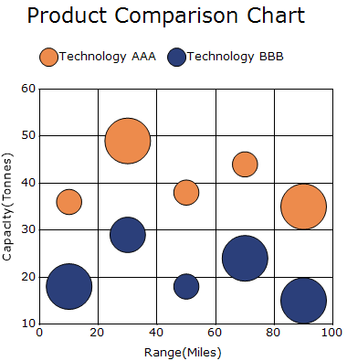
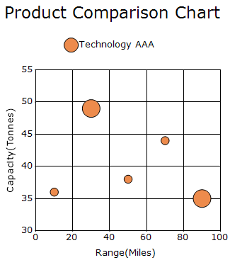
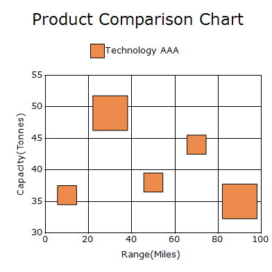
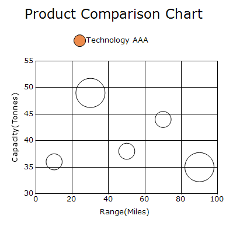
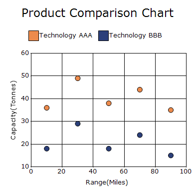
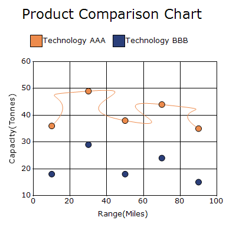

# Bubble and Scatter in Windows Forms Chart

## Bubble chart

A bubble chart is an extension of a scatter chart that displays three variables. The X and Y coordinates determine the position of each data point, while the size of the bubble represents a third value. 

The following code example demonstrates how to create a bubble Chart.




ChartSeries series = new ChartSeries("Technology AAA", ChartSeriesType.Bubble);
series.Text = series.Name;

series.Points.Add(10, 36, 3);
series.Points.Add(30, 49, 4);
series.Points.Add(50, 38, 3);
series.Points.Add(70, 44, 3);
series.Points.Add(90, 35, 4);

chartControl.Series.Add(series);

ChartSeries ChartSeries = new ChartSeries("Technology BBB", ChartSeriesType.Bubble);
ChartSeries.Text = ChartSeries.Name;

ChartSeries.Points.Add(10, 18, 4);
ChartSeries.Points.Add(30, 29, 3);
ChartSeries.Points.Add(50, 18, 2);
ChartSeries.Points.Add(70, 24, 4);
ChartSeries.Points.Add(90, 15, 4);

chartControl.Series.Add(ChartSeries);




Dim series As New ChartSeries("Technology AAA", ChartSeriesType.Bubble)
series.Text = series.Name

series.Points.Add(10, 36, 3)
series.Points.Add(30, 49, 4)
series.Points.Add(50, 38, 3)
series.Points.Add(70, 44, 3)
series.Points.Add(90, 35, 4)

chartControl.Series.Add(series)

Dim series2 As New ChartSeries("Technology BBB", ChartSeriesType.Bubble)
series2.Text = series2.Name

series2.Points.Add(10, 18, 4)
series2.Points.Add(30, 29, 3)
series2.Points.Add(50, 18, 2)
series2.Points.Add(70, 24, 4)
series2.Points.Add(90, 15, 4)

chartControl.Series.Add(series2)




### Min bounds and max bounds

The size of the bubbles depends on [MinBounds](https://help.syncfusion.com/cr/windowsforms/Syncfusion.Windows.Forms.Chart.ChartBubbleConfigItem.html#Syncfusion_Windows_Forms_Chart_ChartBubbleConfigItem_MinBounds) and [MaxBounds](https://help.syncfusion.com/cr/windowsforms/Syncfusion.Windows.Forms.Chart.ChartBubbleConfigItem.html#Syncfusion_Windows_Forms_Chart_ChartBubbleConfigItem_MaxBounds) of the bubbleItem in series. By default, the minBounds is (20, 20) and MaxBounds is (50, 50), so the width and height of the bubbles lie between 20 and 50.

You can change the minBounds and maxBounds using the [MinBounds](https://help.syncfusion.com/cr/windowsforms/Syncfusion.Windows.Forms.Chart.ChartBubbleConfigItem.html#Syncfusion_Windows_Forms_Chart_ChartBubbleConfigItem_MinBounds) and [MaxBounds](https://help.syncfusion.com/cr/windowsforms/Syncfusion.Windows.Forms.Chart.ChartBubbleConfigItem.html#Syncfusion_Windows_Forms_Chart_ChartBubbleConfigItem_MaxBounds) properties in series options.

The following code example demonstrates how to set the minimum and maximum bounds for bubble chart elements.




series.ConfigItems.BubbleItem.MinBounds = new RectangleF(0, 0, 10, 10);
series.ConfigItems.BubbleItem.MaxBounds = new RectangleF(0, 0, 25, 25);




series.ConfigItems.BubbleItem.MinBounds = New RectangleF(0, 0, 10, 10)
series.ConfigItems.BubbleItem.MaxBounds = New RectangleF(0, 0, 25, 25)




### Bubble type

The [BubbleType](https://help.syncfusion.com/cr/windowsforms/Syncfusion.Windows.Forms.Chart.ChartBubbleConfigItem.html#Syncfusion_Windows_Forms_Chart_ChartBubbleConfigItem_BubbleType) property determines the appearance of bubbles in a bubble chart. The supported values are [Circle](https://help.syncfusion.com/cr/windowsforms/Syncfusion.Windows.Forms.Chart.ChartBubbleType.html#Syncfusion_Windows_Forms_Chart_ChartBubbleType_Circle), [Square](https://help.syncfusion.com/cr/windowsforms/Syncfusion.Windows.Forms.Chart.ChartBubbleType.html#Syncfusion_Windows_Forms_Chart_ChartBubbleType_Square), and [Image](https://help.syncfusion.com/cr/windowsforms/Syncfusion.Windows.Forms.Chart.ChartBubbleType.html#Syncfusion_Windows_Forms_Chart_ChartBubbleType_Image). The default value is [Circle](https://help.syncfusion.com/cr/windowsforms/Syncfusion.Windows.Forms.Chart.ChartBubbleType.html#Syncfusion_Windows_Forms_Chart_ChartBubbleType_Circle).

The following code example demonstrates how to set the bubble type to Square.




chartControl.Series[0].ConfigItems.BubbleItem.BubbleType =
ChartBubbleType.Square;




chartControl.Series(0).ConfigItems.BubbleItem.BubbleType =
ChartBubbleType.Square




### Enable phong style 

The [EnablePhongStyle](https://help.syncfusion.com/cr/windowsforms/Syncfusion.Windows.Forms.Chart.ChartBubbleConfigItem.html#Syncfusion_Windows_Forms_Chart_ChartBubbleConfigItem_EnablePhongStyle) property specifies whether Phong-style shading is applied to bubble chart elements. The default value is `true`, which renders bubbles with a three-dimensional lighting effect.

The following code example demonstrates how to disable Phong-style shading for bubble chart elements.



chartControl.Series[0].ConfigItems.BubbleItem.EnablePhongStyle = false;


chartControl.Series(0).ConfigItems.BubbleItem.EnablePhongStyle = False



## Scatter chart

A scatter chart (XY Chart) displays the relationship between two numerical variables by plotting data points on X and Y axes. The points are not connected by lines. 

The following code example demonstrates how to create a scatter Chart.




ChartSeries series = new ChartSeries("Technology AAA", ChartSeriesType.Scatter);
series.Text = series.Name;

series.Points.Add(10, 36, 3);
series.Points.Add(30, 49, 4);
series.Points.Add(50, 38, 3);
series.Points.Add(70, 44, 3);
series.Points.Add(90, 35, 4);

chartControl.Series.Add(series);

ChartSeries ChartSeries = new ChartSeries("Technology BBB", ChartSeriesType.Scatter);
ChartSeries.Text = ChartSeries.Name;

ChartSeries.Points.Add(10, 18, 4);
ChartSeries.Points.Add(30, 29, 3);
ChartSeries.Points.Add(50, 18, 2);
ChartSeries.Points.Add(70, 24, 4);
ChartSeries.Points.Add(90, 15, 4);

chartControl.Series.Add(ChartSeries);




' Technology AAA Series
Dim series As New ChartSeries("Technology AAA", ChartSeriesType.Scatter)

series.Text = series.Name

series.Points.Add(10, 36, 3)
series.Points.Add(30, 49, 4)
series.Points.Add(50, 38, 3)
series.Points.Add(70, 44, 3)
series.Points.Add(90, 35, 4)

chartControl.Series.Add(series)

' Technology BBB Series
Dim chartSeries As New ChartSeries("Technology BBB", ChartSeriesType.Scatter)

chartSeries.Text = chartSeries.Name

chartSeries.Points.Add(10, 18, 4)
chartSeries.Points.Add(30, 29, 3)
chartSeries.Points.Add(50, 18, 2)
chartSeries.Points.Add(70, 24, 4)
chartSeries.Points.Add(90, 15, 4)

chartControl.Series.Add(chartSeries)




### Scatter connection type

The [ScatterConnectType](https://help.syncfusion.com/cr/windowsforms/Syncfusion.Windows.Forms.Chart.ChartSeries.html#Syncfusion_Windows_Forms_Chart_ChartSeries_ScatterConnectType) property specifies how the data points in a scatter series are connected. The default value is [None](https://help.syncfusion.com/cr/windowsforms/Syncfusion.Windows.Forms.Chart.ScatterConnectType.html).

The following values are supported:

- [None](https://help.syncfusion.com/cr/windowsforms/Syncfusion.Windows.Forms.Chart.ScatterConnectType.html): Displays the scatter chart without connecting its data points.
- [Line](https://help.syncfusion.com/cr/windowsforms/Syncfusion.Windows.Forms.Chart.ScatterConnectType.html): Connects the scatter data points using straight lines.
- [Spline](https://help.syncfusion.com/cr/windowsforms/Syncfusion.Windows.Forms.Chart.ScatterConnectType.html): Connects the scatter data points using a spline curve.

The following code connects the scatter data points using a spline curve.



chartControl.Series[0].ScatterConnectType =
    ScatterConnectType.Spline;


chartControl.Series(0).ScatterConnectType =
    ScatterConnectType.Spline



### Scatter spline tension

The [ScatterSplineTension](https://help.syncfusion.com/cr/windowsforms/Syncfusion.Windows.Forms.Chart.ChartSeries.html#Syncfusion_Windows_Forms_Chart_ChartSeries_ScatterSplineTension) property specifies the tension of the spline curve connecting the scatter data points.

N> The [ScatterSplineTension](https://help.syncfusion.com/cr/windowsforms/Syncfusion.Windows.Forms.Chart.ChartSeries.html#Syncfusion_Windows_Forms_Chart_ChartSeries_ScatterSplineTension) property takes effect when the [ScatterConnectType](https://help.syncfusion.com/cr/windowsforms/Syncfusion.Windows.Forms.Chart.ChartSeries.html#Syncfusion_Windows_Forms_Chart_ChartSeries_ScatterConnectType) property is set to [Spline](https://help.syncfusion.com/cr/windowsforms/Syncfusion.Windows.Forms.Chart.ScatterConnectType.html).

The following code configures the spline connection and its tension.



chartControl.Series[0].ScatterConnectType =
    ScatterConnectType.Spline;

chartControl.Series[0].ScatterSplineTension = 0.5;


chartControl.Series(0).ScatterConnectType =
    ScatterConnectType.Spline

chartControl.Series(0).ScatterSplineTension = 0.5



