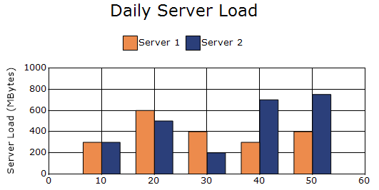
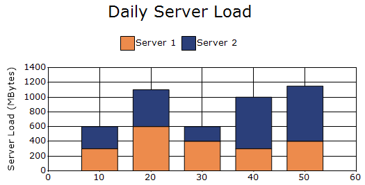
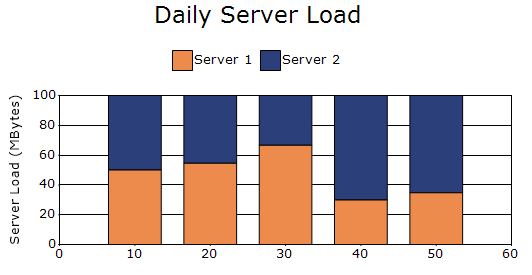

# Column Charts in Windows Forms Chart

A Column Chart is one of the most widely used chart types for visualizing data. It represents values using vertical bars (columns), making it easy to compare different categories or track changes over time. When multiple data series are present, the columns are displayed side by side for comparison. Common types of column charts include `Column`, `Column Range`, and `Stacking Column` charts.

Column charts are similar to Bar Charts, except that bar charts use `horizontal bars`.

You can also customize the following features for column charts:
* Column-Width Mode - The [ColumnWidthMode](https://help.syncfusion.com/cr/windowsforms/Syncfusion.Windows.Forms.Chart.ChartControl.html#Syncfusion_Windows_Forms_Chart_ChartControl_ColumnWidthMode) property provides three modes for calculating column widths: [DefaultWidthMode](https://help.syncfusion.com/cr/windowsforms/Syncfusion.Windows.Forms.Chart.ChartColumnWidthMode.html#Syncfusion_Windows_Forms_Chart_ChartColumnWidthMode_DefaultWidthMode), [FixedWidthMode](https://help.syncfusion.com/cr/windowsforms/Syncfusion.Windows.Forms.Chart.ChartColumnWidthMode.html#Syncfusion_Windows_Forms_Chart_ChartColumnWidthMode_FixedWidthMode), and [RelativeWidthMode](https://help.syncfusion.com/cr/windowsforms/Syncfusion.Windows.Forms.Chart.ChartColumnWidthMode.html#Syncfusion_Windows_Forms_Chart_ChartColumnWidthMode_RelativeWidthMode).
* DefaultWidthMode - Automatically calculates column widths to fill the available space between columns.
* FixedWidthMode - Allows column widths to be specified using the measurement units of the X-axis.
* RelativeWidthMode - Sets column widths relative to the X-axis range. A width value of 1.0 corresponds to one unit on the axis range.
* Column Spacing - The [Spacing](https://help.syncfusion.com/cr/windowsforms/Syncfusion.Windows.Forms.Chart.ChartControl.html#Syncfusion_Windows_Forms_Chart_ChartControl_Spacing) property is used to control the gap between columns from different data series.
* 3D Style - Enable the [Style3D](https://help.syncfusion.com/cr/windowsforms/Syncfusion.Windows.Forms.Chart.ChartControl.html#Syncfusion_Windows_Forms_Chart_ChartControl_Style3D) property to render the chart in a 3D view with enhanced colors and depth effects.

## Column Chart

A chart that uses vertical bars (columns) to compare values across different categories or to show changes in data over time. It is useful for comparing counts, totals, averages, or frequencies between groups. The following code shows how to define a column chart in ChartControl.

N>
chart details for column chart.
* Number of Y values per point - 1.
* Number of Series - One or More.
* Cannot be combined with - Pie, Bar, Stacked Bar, Polar, Radar.




// Create chart series and add data points into it.
ChartSeries firstServer = new ChartSeries("Server 1", ChartSeriesType.Column);
firstServer.Points.Add(10, 300);
firstServer.Points.Add(20, 600);
firstServer.Points.Add(30, 400);
firstServer.Points.Add(40, 300);
firstServer.Points.Add(50, 400);

ChartSeries secondServer = new ChartSeries("Server 2", ChartSeriesType.Column);

secondServer.Points.Add(10, 300);
secondServer.Points.Add(20, 500);
secondServer.Points.Add(30, 200);
secondServer.Points.Add(40, 700);
secondServer.Points.Add(50, 750);

chartControl.Series.Add(firstServer);
chartControl.Series.Add(secondServer);




// Create chart series and add data points into it.
Dim firstServer As New ChartSeries("Server 1", ChartSeriesType.Column)
firstServer.Points.Add(10, 300)
firstServer.Points.Add(20, 600)
firstServer.Points.Add(30, 400)
firstServer.Points.Add(40, 300)
firstServer.Points.Add(50, 400)

Dim secondServer As New ChartSeries("Server 2", ChartSeriesType.Column)
secondServer.Points.Add(10, 300)
secondServer.Points.Add(20, 500)
secondServer.Points.Add(30, 200)
secondServer.Points.Add(40, 700)
secondServer.Points.Add(50, 750)

chartControl.Series.Add(firstServer)
chartControl.Series.Add(secondServer)




## Column Range Chart

Column Range Chart is similar to the Column Chart, except that each column is rendered over a range. Therefore, the user must specify the starting and ending Y-axis values for each data point. The following code shows how to define a column range chart in ChartControl.

N>
Chart details for column range chart.
* Number of Y values per point - 2.
* Number of Series - One or More.
* Cannot be combined with - Pie, Bar, Stacked Bar, Polar, Radar.




// Create chart series and add data points into it.
ChartSeries firstServer = new ChartSeries("Server 1", ChartSeriesType.ColumnRange);
firstServer.Points.Add(10, 300, 0);
firstServer.Points.Add(20, 600, 0);
firstServer.Points.Add(30, 400, 0);
firstServer.Points.Add(40, 300, 0);
firstServer.Points.Add(50, 400, 0);

ChartSeries secondServer = new ChartSeries("Server 2", ChartSeriesType.ColumnRange);

secondServer.Points.Add(10, 300, 0);
secondServer.Points.Add(20, 500, 0);
secondServer.Points.Add(30, 200, 0);
secondServer.Points.Add(40, 700, 0);
secondServer.Points.Add(50, 750, 0);

chartControl.Series.Add(firstServer);
chartControl.Series.Add(secondServer);




// Create chart series and add data points into it.
Dim firstServer As New ChartSeries("Server 1", ChartSeriesType.ColumnRange)
firstServer.Points.Add(10, 300, 0)
firstServer.Points.Add(20, 600, 0)
firstServer.Points.Add(30, 400, 0)
firstServer.Points.Add(40, 300, 0)
firstServer.Points.Add(50, 400, 0)

Dim secondServer As New ChartSeries("Server 2", ChartSeriesType.ColumnRange)

secondServer.Points.Add(10, 300, 0)
secondServer.Points.Add(20, 500, 0)
secondServer.Points.Add(30, 200, 0)
secondServer.Points.Add(40, 700, 0)
secondServer.Points.Add(50, 750, 0)

chartControl.Series.Add(firstServer)
chartControl.Series.Add(secondServer)




## Stacking Column Chart

Stacking Column charts are similar to regular column charts, except that the Y values are stacked on top of each other in the order of the series. This helps visualize how each part contributes to the whole. The following code shows how to define a stacking column chart in ChartControl.

N>
Chart details for stacking column chart.
* Number of Y values per point - 1.
* Number of Series - Two or More (A single series will render just like a bar chart).
* Cannot be combined with - Pie, Bar, Stacked Bar, Polar, Radar.




// Create chart series and add data points into it.
ChartSeries firstServer = new ChartSeries("Server 1", ChartSeriesType.StackingColumn);
firstServer.Points.Add(10, 300);
firstServer.Points.Add(20, 600);
firstServer.Points.Add(30, 400);
firstServer.Points.Add(40, 300);
firstServer.Points.Add(50, 400);

ChartSeries secondServer = new ChartSeries("Server 2", ChartSeriesType.StackingColumn);

secondServer.Points.Add(10, 300);
secondServer.Points.Add(20, 500);
secondServer.Points.Add(30, 200);
secondServer.Points.Add(40, 700);
secondServer.Points.Add(50, 750);

chartControl.Series.Add(firstServer);
chartControl.Series.Add(secondServer);




// Create chart series and add data points into it.
Dim firstServer As New ChartSeries("Server 1", ChartSeriesType.StackingColumn)
firstServer.Points.Add(10, 300)
firstServer.Points.Add(20, 600)
firstServer.Points.Add(30, 400)
firstServer.Points.Add(40, 300)
firstServer.Points.Add(50, 400)

Dim secondServer As New ChartSeries("Server 2", ChartSeriesType.StackingColumn)
secondServer.Points.Add(10, 300)
secondServer.Points.Add(20, 500)
secondServer.Points.Add(30, 200)
secondServer.Points.Add(40, 700)
secondServer.Points.Add(50, 750)

chartControl.Series.Add(firstServer)
chartControl.Series.Add(secondServer)




## Stacking Column 100 Chart

This chart type presents multiple series as stacked columns so that the total proportion of all stacked elements sums to 100%. As a result, the y-axis is always displayed from 0 to 100. The following code shows how to define a stacking column100 chart in ChartControl.

N>
Chart details for stacking column100 chart.
* Number of Y values per point - 1.
* Number of Series - Two or More.
* SupportMarker - No.
* Cannot be combined with - Doughnut, Pie, Bar, Stacked Bar charts, Polar, Radar, Pyramid, or Funnel.




// Create chart series and add data points into it.
ChartSeries firstServer = new ChartSeries("Server 1", ChartSeriesType.StackingColumn100);
firstServer.Points.Add(10, 300);
firstServer.Points.Add(20, 600);
firstServer.Points.Add(30, 400);
firstServer.Points.Add(40, 300);
firstServer.Points.Add(50, 400);

ChartSeries secondServer = new ChartSeries("Server 2", ChartSeriesType.StackingColumn100);

secondServer.Points.Add(10, 300);
secondServer.Points.Add(20, 500);
secondServer.Points.Add(30, 200);
secondServer.Points.Add(40, 700);
secondServer.Points.Add(50, 750);

chartControl.Series.Add(firstServer);
chartControl.Series.Add(secondServer);




// Create chart series and add data points into it.
Dim firstServer As New ChartSeries("Server 1", ChartSeriesType.StackingColumn100)
firstServer.Points.Add(10, 300)
firstServer.Points.Add(20, 600)
firstServer.Points.Add(30, 400)
firstServer.Points.Add(40, 300)
firstServer.Points.Add(50, 400)

Dim secondServer As New ChartSeries("Server 2", ChartSeriesType.StackingColumn100)
secondServer.Points.Add(10, 300)
secondServer.Points.Add(20, 500)
secondServer.Points.Add(30, 200)
secondServer.Points.Add(40, 700)
secondServer.Points.Add(50, 750)

chartControl.Series.Add(firstServer)
chartControl.Series.Add(secondServer)




## Customization option

The following chart series properties are used to customize column charts:

[Border](https://help.syncfusion.com/windowsforms/chart/chart-series#border), [ColumnFixedWidth](https://help.syncfusion.com/windowsforms/chart/chart-series#columnfixedwidth), [ColumnWidthMode](https://help.syncfusion.com/windowsforms/chart/chart-series#columnwidthmode), [DisplayText](https://help.syncfusion.com/windowsforms/chart/chart-series#displaytext), [DrawSeriesNameInDepth](https://help.syncfusion.com/windowsforms/chart/chart-series#drawseriesnameindepth), [ElementBorders](https://help.syncfusion.com/windowsforms/chart/chart-series#elementborders), [FancyToolTip](https://help.syncfusion.com/windowsforms/chart/chart-series#fancytooltip), [Font](https://help.syncfusion.com/windowsforms/chart/chart-series#font), [ImageIndex](https://help.syncfusion.com/windowsforms/chart/chart-series#imageindex), [Images](https://help.syncfusion.com/windowsforms/chart/chart-series#images), [Interior](https://help.syncfusion.com/windowsforms/chart/chart-series#interior), [LegendItem](https://help.syncfusion.com/windowsforms/chart/chart-series#legenditem), [LightAngle](https://help.syncfusion.com/windowsforms/chart/chart-series#lightangle), [LightColor](https://help.syncfusion.com/windowsforms/chart/chart-series#lightcolor), [Name](https://help.syncfusion.com/windowsforms/chart/chart-series#name), [PointsToolTipFormat](https://help.syncfusion.com/windowsforms/chart/chart-series#pointstooltipformat), [Rotate](https://help.syncfusion.com/windowsforms/chart/chart-series#rotate), [ShadingMode](https://help.syncfusion.com/windowsforms/chart/chart-series#shadingmode), [ShadowInterior](https://help.syncfusion.com/windowsforms/chart/chart-series#shadowinterior), [ShadowOffset](https://help.syncfusion.com/windowsforms/chart/chart-series#shadowoffset), [SmartLabels](https://help.syncfusion.com/windowsforms/chart/chart-series#smartlabels), [Spacing](https://help.syncfusion.com/windowsforms/chart/chart-series#spacing), [Spacing Between Series](https://help.syncfusion.com/windowsforms/chart/chart-series#spacingbetweenseries), [Summary](https://help.syncfusion.com/windowsforms/chart/chart-series#summary), [Text](https://help.syncfusion.com/windowsforms/chart/chart-series#text-series), [TextColor](https://help.syncfusion.com/windowsforms/chart/chart-series#textcolor), [TextFormat](https://help.syncfusion.com/windowsforms/chart/chart-series#textformat), [TextOffset](https://help.syncfusion.com/windowsforms/chart/chart-series#textoffset), [TextOrientation](https://help.syncfusion.com/windowsforms/chart/chart-series#textorientation), [Visible](https://help.syncfusion.com/windowsforms/chart/chart-series#visible).

### Column chart customization properties only

The following properties are specific to Column charts and are not available in other column chart types, such as `Column Range`, `Stacked Column`, and `Stacking Column 100` charts.

[ColumnDrawMode](https://help.syncfusion.com/windowsforms/chart/chart-series#columndrawmode), [ColumnType](https://help.syncfusion.com/windowsforms/chart/chart-series#columntype), [DrawColumnSeparatingLines](https://help.syncfusion.com/windowsforms/chart/chart-series#drawcolumnseparatinglines), [DrawErrorBars](https://help.syncfusion.com/windowsforms/chart/chart-series#drawerrorbars), [ErrorBarsSymbolShape](https://help.syncfusion.com/cr/windowsforms/Syncfusion.Windows.Forms.Chart.ChartSeries.html#Syncfusion_Windows_Forms_Chart_ChartSeries_ErrorBarsSymbolShape), [HighlightInterior](https://help.syncfusion.com/windowsforms/chart/chart-series#highlightinterior), [PhongAlpha](https://help.syncfusion.com/windowsforms/chart/chart-series#phongalpha).

N>
* [DisplayShadow](https://help.syncfusion.com/windowsforms/chart/chart-series#displayshadow) used in all column chart customization options except `Column Range`.
* [ColumnDrawMode](https://help.syncfusion.com/windowsforms/chart/chart-series#columndrawmode) used only in `Column` and `Column Range` chart customization options.
* [ZOrder](https://help.syncfusion.com/windowsforms/chart/chart-series#zorder) used only in `Stacked Column` and `Stacking Column 100` chart customization options.
