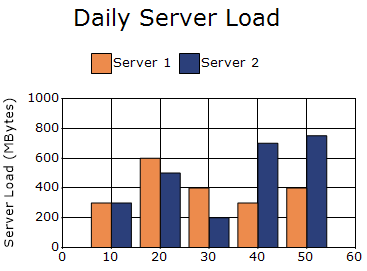

# Column charts in windows forms chart

A Column Chart is one of the most widely used chart types for visualizing data. It represents values using vertical bars (columns), making it easy to compare different categories or track changes over time. When multiple data series are present, the columns are displayed side by side for comparison. Common types of column charts include `Column`, `Column Range`, and `Stacking Column` charts.

Column charts are similar to Bar Charts, except that bar charts use `horizontal bars`.

You can also customize the following features for column charts:
* **Column-Width Mode**: The [ColumnWidthMode](https://help.syncfusion.com/cr/windowsforms/Syncfusion.Windows.Forms.Chart.ChartControl.html#Syncfusion_Windows_Forms_Chart_ChartControl_ColumnWidthMode) property provides three modes for calculating column widths: [DefaultWidthMode](https://help.syncfusion.com/cr/windowsforms/Syncfusion.Windows.Forms.Chart.ChartColumnWidthMode.html#Syncfusion_Windows_Forms_Chart_ChartColumnWidthMode_DefaultWidthMode), [FixedWidthMode](https://help.syncfusion.com/cr/windowsforms/Syncfusion.Windows.Forms.Chart.ChartColumnWidthMode.html#Syncfusion_Windows_Forms_Chart_ChartColumnWidthMode_FixedWidthMode), and [RelativeWidthMode](https://help.syncfusion.com/cr/windowsforms/Syncfusion.Windows.Forms.Chart.ChartColumnWidthMode.html#Syncfusion_Windows_Forms_Chart_ChartColumnWidthMode_RelativeWidthMode).
* **DefaultWidthMode**: Automatically calculates column widths to fill the available space between columns.
* **FixedWidthMode**: Allows column widths to be specified using the measurement units of the X-axis.
* **RelativeWidthMode**: Sets column widths relative to the X-axis range. A width value of 1.0 corresponds to one unit on the axis range.
* **Column Spacing**: The [Spacing](https://help.syncfusion.com/cr/windowsforms/Syncfusion.Windows.Forms.Chart.ChartControl.html#Syncfusion_Windows_Forms_Chart_ChartControl_Spacing) property is used to control the gap between columns from different data series.
* **3D Style**: Enable the [Style3D](https://help.syncfusion.com/cr/windowsforms/Syncfusion.Windows.Forms.Chart.ChartControl.html#Syncfusion_Windows_Forms_Chart_ChartControl_Style3D) property to render the chart in a 3D view with enhanced colors and depth effects.

## Column chart

A chart that uses vertical bars (columns) to compare values across different categories or to show changes in data over time. It is useful for comparing counts, totals, averages, or frequencies between groups. The following code shows how to define a column chart in ChartControl.

N>
Chart details for column chart.
* Number of Y values per point - 1.
* Number of Series - One or More.
* Cannot be combined with - Pie, Bar, Stacked Bar, Polar, Radar.

The following code example demonstrates how to create a Column Chart.




// Create chart series and add data points into it.
ChartSeries firstServer = new ChartSeries("Server 1", ChartSeriesType.Column);
firstServer.Points.Add(10, 300);
firstServer.Points.Add(20, 600);
firstServer.Points.Add(30, 400);
firstServer.Points.Add(40, 300);
firstServer.Points.Add(50, 400);

ChartSeries secondServer = new ChartSeries("Server 2", ChartSeriesType.Column);

secondServer.Points.Add(10, 300);
secondServer.Points.Add(20, 500);
secondServer.Points.Add(30, 200);
secondServer.Points.Add(40, 700);
secondServer.Points.Add(50, 750);

chartControl.Series.Add(firstServer);
chartControl.Series.Add(secondServer);




// Create chart series and add data points into it.
Dim firstServer As New ChartSeries("Server 1", ChartSeriesType.Column)
firstServer.Points.Add(10, 300)
firstServer.Points.Add(20, 600)
firstServer.Points.Add(30, 400)
firstServer.Points.Add(40, 300)
firstServer.Points.Add(50, 400)

Dim secondServer As New ChartSeries("Server 2", ChartSeriesType.Column)
secondServer.Points.Add(10, 300)
secondServer.Points.Add(20, 500)
secondServer.Points.Add(30, 200)
secondServer.Points.Add(40, 700)
secondServer.Points.Add(50, 750)

chartControl.Series.Add(firstServer)
chartControl.Series.Add(secondServer)




### Customization option

The following chart series properties are used as customization options for Column chart:

- [Border](https://help.syncfusion.com/windowsforms/chart/chart-series#border)
- [ColumnDrawMode](https://help.syncfusion.com/windowsforms/chart/chart-series#columndrawmode)
- [ColumnWidthMode](https://help.syncfusion.com/windowsforms/chart/chart-series#columnwidthmode)
- [ColumnFixedWidth](https://help.syncfusion.com/windowsforms/chart/chart-series#columnfixedwidth)
- [DisplayShadow](https://help.syncfusion.com/windowsforms/chart/chart-series#displayshadow)
- [DisplayText](https://help.syncfusion.com/windowsforms/chart/chart-series#displaytext)
- [DrawColumnSeparatingLines](https://help.syncfusion.com/windowsforms/chart/chart-series#drawcolumnseparatinglines)
- [ColumnType](https://help.syncfusion.com/windowsforms/chart/chart-series#columntype)
- [DrawErrorBars](https://help.syncfusion.com/windowsforms/chart/chart-series#drawerrorbars)
- [DrawSeriesNameInDepth](https://help.syncfusion.com/windowsforms/chart/chart-series#drawseriesnameindepth)
- [ElementBorders](https://help.syncfusion.com/windowsforms/chart/chart-series#elementborders)
- [ErrorBarsSymbolShape](https://help.syncfusion.com/windowsforms/chart/chart-series#errorbarssymbolshape)
- [HighlightInterior](https://help.syncfusion.com/windowsforms/chart/chart-series#highlightinterior)
- [ImageIndex](https://help.syncfusion.com/windowsforms/chart/chart-series#imageindex)
- [Images](https://help.syncfusion.com/windowsforms/chart/chart-series#images)
- [LightAngle](https://help.syncfusion.com/windowsforms/chart/chart-series#lightangle)
- [LightColor](https://help.syncfusion.com/windowsforms/chart/chart-series#lightcolor)
- [PhongAlpha](https://help.syncfusion.com/windowsforms/chart/chart-series#phongalpha)
- [Rotate](https://help.syncfusion.com/windowsforms/chart/chart-series#rotate)
- [Spacing](https://help.syncfusion.com/windowsforms/chart/chart-series#spacing)
- [Spacing Between Series](https://help.syncfusion.com/windowsforms/chart/chart-series#spacingbetweenseries)
- [ShadingMode](https://help.syncfusion.com/windowsforms/chart/chart-series#shadingmode)
- [ShadowInterior](https://help.syncfusion.com/windowsforms/chart/chart-series#shadowinterior)
- [ShadowOffset](https://help.syncfusion.com/windowsforms/chart/chart-series#shadowoffset)
- [FancyToolTip](https://help.syncfusion.com/windowsforms/chart/chart-series#fancytooltip)
- [Font](https://help.syncfusion.com/windowsforms/chart/chart-series#font)
- [Interior](https://help.syncfusion.com/windowsforms/chart/chart-series#interior)
- [LegendItem](https://help.syncfusion.com/windowsforms/chart/chart-series#legenditem)
- [Name](https://help.syncfusion.com/windowsforms/chart/chart-series#name)
- [PointsToolTipFormat](https://help.syncfusion.com/windowsforms/chart/chart-series#pointstooltipformat)
- [SmartLabels](https://help.syncfusion.com/windowsforms/chart/chart-series#smartlabels)
- [Summary](https://help.syncfusion.com/windowsforms/chart/chart-series#summary)
- [Text](https://help.syncfusion.com/windowsforms/chart/chart-series#text-series)
- [TextColor](https://help.syncfusion.com/windowsforms/chart/chart-series#textcolor)
- [TextFormat](https://help.syncfusion.com/windowsforms/chart/chart-series#textformat)
- [TextOffset](https://help.syncfusion.com/windowsforms/chart/chart-series#textoffset)
- [TextOrientation](https://help.syncfusion.com/windowsforms/chart/chart-series#textorientation)
- [Visible](https://help.syncfusion.com/windowsforms/chart/chart-series#visible)

## Column range chart

Column Range Chart is similar to the Column Chart, except that each column is rendered over a range. Therefore, the user must specify the starting and ending Y-axis values for each data point. The following code shows how to define a column range chart in ChartControl.

N>
Chart details for column range chart.
* Number of Y values per point - 2.
* Number of Series - One or More.
* Cannot be combined with - Pie, Bar, Stacked Bar, Polar, Radar.

The following code example demonstrates how to create a Column Range Chart.




// Create chart series and add data points into it.
ChartSeries firstServer = new ChartSeries("Server 1", ChartSeriesType.ColumnRange);
firstServer.Points.Add(10, 300, 0);
firstServer.Points.Add(20, 600, 0);
firstServer.Points.Add(30, 400, 0);
firstServer.Points.Add(40, 300, 0);
firstServer.Points.Add(50, 400, 0);

ChartSeries secondServer = new ChartSeries("Server 2", ChartSeriesType.ColumnRange);

secondServer.Points.Add(10, 300, 0);
secondServer.Points.Add(20, 500, 0);
secondServer.Points.Add(30, 200, 0);
secondServer.Points.Add(40, 700, 0);
secondServer.Points.Add(50, 750, 0);

chartControl.Series.Add(firstServer);
chartControl.Series.Add(secondServer);




// Create chart series and add data points into it.
Dim firstServer As New ChartSeries("Server 1", ChartSeriesType.ColumnRange)
firstServer.Points.Add(10, 300, 0)
firstServer.Points.Add(20, 600, 0)
firstServer.Points.Add(30, 400, 0)
firstServer.Points.Add(40, 300, 0)
firstServer.Points.Add(50, 400, 0)

Dim secondServer As New ChartSeries("Server 2", ChartSeriesType.ColumnRange)

secondServer.Points.Add(10, 300, 0)
secondServer.Points.Add(20, 500, 0)
secondServer.Points.Add(30, 200, 0)
secondServer.Points.Add(40, 700, 0)
secondServer.Points.Add(50, 750, 0)

chartControl.Series.Add(firstServer)
chartControl.Series.Add(secondServer)




### Customization option

The following chart series properties are used as customization options for Column Range chart:

- [Border](https://help.syncfusion.com/windowsforms/chart/chart-series#border)
- [ColumnDrawMode](https://help.syncfusion.com/windowsforms/chart/chart-series#columndrawmode)
- [ColumnWidthMode](https://help.syncfusion.com/windowsforms/chart/chart-series#columnwidthmode)
- [ColumnFixedWidth](https://help.syncfusion.com/windowsforms/chart/chart-series#columnfixedwidth)
- [DisplayText](https://help.syncfusion.com/windowsforms/chart/chart-series#displaytext)
- [DrawSeriesNameInDepth](https://help.syncfusion.com/windowsforms/chart/chart-series#drawseriesnameindepth)
- [ElementBorders](https://help.syncfusion.com/windowsforms/chart/chart-series#elementborders)
- [ImageIndex](https://help.syncfusion.com/windowsforms/chart/chart-series#imageindex)
- [Images](https://help.syncfusion.com/windowsforms/chart/chart-series#images)
- [LightAngle](https://help.syncfusion.com/windowsforms/chart/chart-series#lightangle)
- [LightColor](https://help.syncfusion.com/windowsforms/chart/chart-series#lightcolor)
- [Rotate](https://help.syncfusion.com/windowsforms/chart/chart-series#rotate)
- [Spacing](https://help.syncfusion.com/windowsforms/chart/chart-series#spacing)
- [Spacing Between Series](https://help.syncfusion.com/windowsforms/chart/chart-series#spacingbetweenseries)
- [ShadingMode](https://help.syncfusion.com/windowsforms/chart/chart-series#shadingmode)
- [ShadowInterior](https://help.syncfusion.com/windowsforms/chart/chart-series#shadowinterior)
- [ShadowOffset](https://help.syncfusion.com/windowsforms/chart/chart-series#shadowoffset)
- [FancyToolTip](https://help.syncfusion.com/windowsforms/chart/chart-series#fancytooltip)
- [Font](https://help.syncfusion.com/windowsforms/chart/chart-series#font)
- [Interior](https://help.syncfusion.com/windowsforms/chart/chart-series#interior)
- [LegendItem](https://help.syncfusion.com/windowsforms/chart/chart-series#legenditem)
- [Name](https://help.syncfusion.com/windowsforms/chart/chart-series#name)
- [PointsToolTipFormat](https://help.syncfusion.com/windowsforms/chart/chart-series#pointstooltipformat)
- [SmartLabels](https://help.syncfusion.com/windowsforms/chart/chart-series#smartlabels)
- [Summary](https://help.syncfusion.com/windowsforms/chart/chart-series#summary)
- [Text](https://help.syncfusion.com/windowsforms/chart/chart-series#text-series)
- [TextColor](https://help.syncfusion.com/windowsforms/chart/chart-series#textcolor)
- [TextFormat](https://help.syncfusion.com/windowsforms/chart/chart-series#textformat)
- [TextOffset](https://help.syncfusion.com/windowsforms/chart/chart-series#textoffset)
- [TextOrientation](https://help.syncfusion.com/windowsforms/chart/chart-series#textorientation)
- [Visible](https://help.syncfusion.com/windowsforms/chart/chart-series#visible)