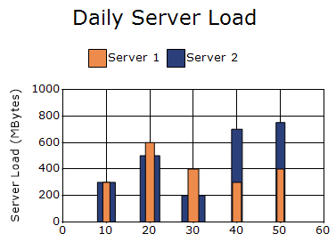
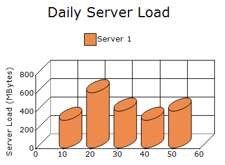
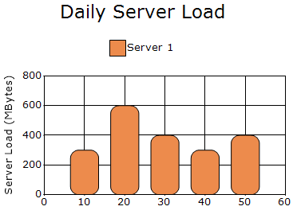

# Column and Bar in Windows Forms Charts

## Column chart

A Column chart renders discrete vertical rectangles for the given data points.

The following code example demonstrates how to create a Column Chart.




// Create chart series and add data points into it.
ChartSeries firstServer = new ChartSeries("Server 1", ChartSeriesType.Column);
firstServer.Points.Add(10, 300);
firstServer.Points.Add(20, 600);
firstServer.Points.Add(30, 400);
firstServer.Points.Add(40, 300);
firstServer.Points.Add(50, 400);

ChartSeries secondServer = new ChartSeries("Server 2", ChartSeriesType.Column);

secondServer.Points.Add(10, 300);
secondServer.Points.Add(20, 500);
secondServer.Points.Add(30, 200);
secondServer.Points.Add(40, 700);
secondServer.Points.Add(50, 750);

chartControl.Series.Add(firstServer);
chartControl.Series.Add(secondServer);




// Create chart series and add data points into it.
Dim firstServer As New ChartSeries("Server 1", ChartSeriesType.Column)
firstServer.Points.Add(10, 300)
firstServer.Points.Add(20, 600)
firstServer.Points.Add(30, 400)
firstServer.Points.Add(40, 300)
firstServer.Points.Add(50, 400)

Dim secondServer As New ChartSeries("Server 2", ChartSeriesType.Column)
secondServer.Points.Add(10, 300)
secondServer.Points.Add(20, 500)
secondServer.Points.Add(30, 200)
secondServer.Points.Add(40, 700)
secondServer.Points.Add(50, 750)

chartControl.Series.Add(firstServer)
chartControl.Series.Add(secondServer)




### Column width mode

The [ColumnWidthMode](https://help.syncfusion.com/cr/windowsforms/Syncfusion.Windows.Forms.Chart.ChartControl.html#Syncfusion_Windows_Forms_Chart_ChartControl_ColumnWidthMode) property specifies how column widths are calculated. The default value is [DefaultWidthMode](https://help.syncfusion.com/cr/windowsforms/Syncfusion.Windows.Forms.Chart.ChartColumnWidthMode.html#Syncfusion_Windows_Forms_Chart_ChartColumnWidthMode_DefaultWidthMode).

The supported values are defined in the [ChartColumnWidthMode](https://help.syncfusion.com/cr/windowsforms/Syncfusion.Windows.Forms.Chart.ChartColumnWidthMode.html) enumeration:

- [DefaultWidthMode](https://help.syncfusion.com/cr/windowsforms/Syncfusion.Windows.Forms.Chart.ChartColumnWidthMode.html#Syncfusion_Windows_Forms_Chart_ChartColumnWidthMode_DefaultWidthMode): Calculates the column width automatically to fill the available space.
- [FixedWidthMode](https://help.syncfusion.com/cr/windowsforms/Syncfusion.Windows.Forms.Chart.ChartColumnWidthMode.html#Syncfusion_Windows_Forms_Chart_ChartColumnWidthMode_FixedWidthMode): Displays columns using a fixed width in pixels.
- [RelativeWidthMode](https://help.syncfusion.com/cr/windowsforms/Syncfusion.Windows.Forms.Chart.ChartColumnWidthMode.html#Syncfusion_Windows_Forms_Chart_ChartColumnWidthMode_RelativeWidthMode): Displays each column with a width relative to the X-axis range. The second Y-value of each data point is used to set the column width.

The following code sets the column width mode to FixedWidthMode.



chartControl.ColumnWidthMode =
    ChartColumnWidthMode.FixedWidthMode;


chartControl.ColumnWidthMode =
    ChartColumnWidthMode.FixedWidthMode



### Column fixed width

The [ColumnFixedWidth](https://help.syncfusion.com/cr/windowsforms/Syncfusion.Windows.Forms.Chart.ChartControl.html#Syncfusion_Windows_Forms_Chart_ChartControl_ColumnFixedWidth) property specifies the width of each column in pixels when the [ColumnWidthMode](https://help.syncfusion.com/cr/windowsforms/Syncfusion.Windows.Forms.Chart.ChartControl.html#Syncfusion_Windows_Forms_Chart_ChartControl_ColumnWidthMode) property is set to [FixedWidthMode](https://help.syncfusion.com/cr/windowsforms/Syncfusion.Windows.Forms.Chart.ChartColumnWidthMode.html#Syncfusion_Windows_Forms_Chart_ChartColumnWidthMode_FixedWidthMode). The default value is `20`.

The following code example demonstrates how to set a fixed width for chart columns.



chartControl.ColumnFixedWidth = 10;


chartControl.ColumnFixedWidth = 10



### Column type

The [ColumnType](https://help.syncfusion.com/cr/windowsforms/Syncfusion.Windows.Forms.Chart.ChartColumnConfigItem.html#Syncfusion_Windows_Forms_Chart_ChartColumnConfigItem_ColumnType) property specifies the shape used to render columns in a 3D chart. The default value is [Box](https://help.syncfusion.com/cr/windowsforms/Syncfusion.Windows.Forms.Chart.ChartColumnType.html#Syncfusion_Windows_Forms_Chart_ChartColumnType_Box).

The supported values are defined in the [ChartColumnType](https://help.syncfusion.com/cr/windowsforms/Syncfusion.Windows.Forms.Chart.ChartColumnType.html) enumeration:

- [Box](https://help.syncfusion.com/cr/windowsforms/Syncfusion.Windows.Forms.Chart.ChartColumnType.html#Syncfusion_Windows_Forms_Chart_ChartColumnType_Box): Displays columns as rectangular boxes.
- [Cylinder](https://help.syncfusion.com/cr/windowsforms/Syncfusion.Windows.Forms.Chart.ChartColumnType.html#Syncfusion_Windows_Forms_Chart_ChartColumnType_Cylinder): Displays columns as cylinders.

The following code enables 3D rendering and displays the columns as cylinders.



chartControl.Series3D = true;
chartControl.Series[0].ConfigItems.ColumnItem.ColumnType =
    ChartColumnType.Cylinder;


chartControl.Series3D = True
chartControl.Series(0).ConfigItems.ColumnItem.ColumnType =
    ChartColumnType.Cylinder



### Corner radius

The [CornerRadius](https://help.syncfusion.com/cr/windowsforms/Syncfusion.Windows.Forms.Chart.ChartColumnConfigItem.html#Syncfusion_Windows_Forms_Chart_ChartColumnConfigItem_CornerRadius) property specifies the horizontal and vertical radii used to render rounded corners for columns. The default value is `SizeF.Empty`, which renders columns without rounded corners.

The following code example demonstrates how to set the corner radius for column chart.



chartControl.Series[0].ConfigItems.ColumnItem.CornerRadius = new SizeF(10, 10);


chartControl.Series(0).ConfigItems.ColumnItem.CornerRadius = New SizeF(10, 10)



### Light angle

The [LightAngle](https://help.syncfusion.com/cr/windowsforms/Syncfusion.Windows.Forms.Chart.ChartColumnConfigItem.html#Syncfusion_Windows_Forms_Chart_ChartColumnConfigItem_LightAngle) property specifies the horizontal angle of the light source when the [ShadingMode](https://help.syncfusion.com/cr/windowsforms/Syncfusion.Windows.Forms.Chart.ChartColumnConfigItem.html#Syncfusion_Windows_Forms_Chart_ChartColumnConfigItem_ShadingMode) property is set to [PhongCylinder](https://help.syncfusion.com/cr/windowsforms/Syncfusion.Windows.Forms.Chart.ChartColumnShadingMode.html#Syncfusion_Windows_Forms_Chart_ChartColumnShadingMode_PhongCylinder). The angle is specified in radians, and the default value is `-Math.PI /4`.

The following code sets the light angle to Math.PI / 2.



chartControl.Series[0].ConfigItems.ColumnItem.ShadingMode =
    ChartColumnShadingMode.PhongCylinder;
chartControl.Series[0].ConfigItems.ColumnItem.LightAngle =
    Math.PI / 2;


chartControl.Series(0).ConfigItems.ColumnItem.ShadingMode =
    ChartColumnShadingMode.PhongCylinder
chartControl.Series(0).ConfigItems.ColumnItem.LightAngle =
    Math.PI / 2



### Light color

The [LightColor](https://help.syncfusion.com/cr/windowsforms/Syncfusion.Windows.Forms.Chart.ChartColumnConfigItem.html#Syncfusion_Windows_Forms_Chart_ChartColumnConfigItem_LightColor) property specifies the color of the light source when the [ShadingMode](https://help.syncfusion.com/cr/windowsforms/Syncfusion.Windows.Forms.Chart.ChartColumnConfigItem.html#Syncfusion_Windows_Forms_Chart_ChartColumnConfigItem_ShadingMode) property is set to [PhongCylinder](https://help.syncfusion.com/cr/windowsforms/Syncfusion.Windows.Forms.Chart.ChartColumnShadingMode.html#Syncfusion_Windows_Forms_Chart_ChartColumnShadingMode_PhongCylinder). If no color is specified, `White` is used as the light source color by default.

The following code example demonstrates how to apply light color.



chartControl.Series[0].ConfigItems.ColumnItem.LightColor = Color.Red;


chartControl.Series(0).ConfigItems.ColumnItem.LightColor = Color.Red



### Phong alpha

The [PhongAlpha](https://help.syncfusion.com/cr/windowsforms/Syncfusion.Windows.Forms.Chart.ChartColumnConfigItem.html#Syncfusion_Windows_Forms_Chart_ChartColumnConfigItem_PhongAlpha) property controls the intensity and sharpness of the specular lighting effect applied to columns or bars. By default, the value is set to `20d`.

The following code example demonstrates how to set the PhongAlpha property to 40d for column chart.



chartControl.Series[0].ConfigItems.ColumnItem.PhongAlpha = 40d;


chartControl.Series(0).ConfigItems.ColumnItem.PhongAlpha = 40.0



### Shading mode

The [ShadingMode](https://help.syncfusion.com/cr/windowsforms/Syncfusion.Windows.Forms.Chart.ChartColumnConfigItem.html#Syncfusion_Windows_Forms_Chart_ChartColumnConfigItem_ShadingMode) property specifies the shading effect applied to columns . By default, the shading mode is set to [PhongCylinder](https://help.syncfusion.com/cr/windowsforms/Syncfusion.Windows.Forms.Chart.ChartColumnShadingMode.html#Syncfusion_Windows_Forms_Chart_ChartColumnShadingMode_PhongCylinder), rendering columns  with a cylindrical lighting effect.

The [ShadingMode](https://help.syncfusion.com/cr/windowsforms/Syncfusion.Windows.Forms.Chart.ChartColumnConfigItem.html#Syncfusion_Windows_Forms_Chart_ChartColumnConfigItem_ShadingMode) property supports the following values:

- [FlatRectangle](https://help.syncfusion.com/cr/windowsforms/Syncfusion.Windows.Forms.Chart.ChartColumnShadingMode.html#Syncfusion_Windows_Forms_Chart_ChartColumnShadingMode_FlatRectangle): Renders columns with flat rectangular shading which is default value of Shading mode.
- [PhongCylinder](https://help.syncfusion.com/cr/windowsforms/Syncfusion.Windows.Forms.Chart.ChartColumnShadingMode.html#Syncfusion_Windows_Forms_Chart_ChartColumnShadingMode_PhongCylinder): Renders columns using Phong shading to create a cylindrical lighting effect.

The following code example demonstrates how to apply the FlatRectangle shading mode to column chart.



chartControl.Series[0].ConfigItems.ColumnItem.ShadingMode = ChartColumnShadingMode.FlatRectangle;


chartControl.Series(0).ConfigItems.ColumnItem.ShadingMode = ChartColumnShadingMode.FlatRectangle



### Customization options

The following chart series properties are used as customization options for Column chart:

- [Border](https://help.syncfusion.com/windowsforms/chart/chart-series#border)
- [ColumnDrawMode](https://help.syncfusion.com/windowsforms/chart/chart-series#columndrawmode)
- [ColumnFixedWidth](https://help.syncfusion.com/windowsforms/chart/chart-series#columnfixedwidth)
- [ColumnType](https://help.syncfusion.com/windowsforms/chart/chart-series#columntype)
- [ColumnWidthMode](https://help.syncfusion.com/windowsforms/chart/chart-series#columnwidthmode)
- [DisplayShadow](https://help.syncfusion.com/windowsforms/chart/chart-series#displayshadow)
- [DisplayText](https://help.syncfusion.com/windowsforms/chart/chart-series#displaytext)
- [DrawColumnSeparatingLines](https://help.syncfusion.com/windowsforms/chart/chart-series#drawcolumnseparatinglines)
- [DrawErrorBars](https://help.syncfusion.com/windowsforms/chart/chart-series#drawerrorbars)
- [DrawSeriesNameInDepth](https://help.syncfusion.com/windowsforms/chart/chart-series#drawseriesnameindepth)
- [ElementBorders](https://help.syncfusion.com/windowsforms/chart/chart-series#elementborders)
- [ErrorBarsSymbolShape](https://help.syncfusion.com/windowsforms/chart/chart-series#errorbarssymbolshape)
- [FancyToolTip](https://help.syncfusion.com/windowsforms/chart/chart-series#fancytooltip)
- [Font](https://help.syncfusion.com/windowsforms/chart/chart-series#font)
- [HighlightInterior](https://help.syncfusion.com/windowsforms/chart/chart-series#highlightinterior)
- [ImageIndex](https://help.syncfusion.com/windowsforms/chart/chart-series#imageindex)
- [Images](https://help.syncfusion.com/windowsforms/chart/chart-series#images)
- [Interior](https://help.syncfusion.com/windowsforms/chart/chart-series#interior)
- [LegendItem](https://help.syncfusion.com/windowsforms/chart/chart-series#legenditem)
- [LightAngle](https://help.syncfusion.com/windowsforms/chart/chart-series#lightangle)
- [LightColor](https://help.syncfusion.com/windowsforms/chart/chart-series#lightcolor)
- [Name](https://help.syncfusion.com/windowsforms/chart/chart-series#name)
- [PhongAlpha](https://help.syncfusion.com/windowsforms/chart/chart-series#phongalpha)
- [PointsToolTipFormat](https://help.syncfusion.com/windowsforms/chart/chart-series#pointstooltipformat)
- [Rotate](https://help.syncfusion.com/windowsforms/chart/chart-series#rotate)
- [ShadingMode](https://help.syncfusion.com/windowsforms/chart/chart-series#shadingmode)
- [ShadowInterior](https://help.syncfusion.com/windowsforms/chart/chart-series#shadowinterior)
- [ShadowOffset](https://help.syncfusion.com/windowsforms/chart/chart-series#shadowoffset)
- [SmartLabels](https://help.syncfusion.com/windowsforms/chart/chart-series#smartlabels)
- [Spacing](https://help.syncfusion.com/windowsforms/chart/chart-series#spacing)
- [Spacing Between Series](https://help.syncfusion.com/windowsforms/chart/chart-series#spacingbetweenseries)
- [Summary](https://help.syncfusion.com/windowsforms/chart/chart-series#summary)
- [Text](https://help.syncfusion.com/windowsforms/chart/chart-series#text-series)
- [TextColor](https://help.syncfusion.com/windowsforms/chart/chart-series#textcolor)
- [TextFormat](https://help.syncfusion.com/windowsforms/chart/chart-series#textformat)
- [TextOffset](https://help.syncfusion.com/windowsforms/chart/chart-series#textoffset)
- [TextOrientation](https://help.syncfusion.com/windowsforms/chart/chart-series#textorientation)
- [Visible](https://help.syncfusion.com/windowsforms/chart/chart-series#visible)

## Bar chart

A Bar chart renders data points as horizontal bars to compare values across different categories.

The following code shows how to define a bar chart in ChartControl.




ChartSeries firstServer = new ChartSeries("Server 1", ChartSeriesType.Bar);
firstServer.Points.Add(10, 100);
firstServer.Points.Add(20, 300);
firstServer.Points.Add(30, 200);
firstServer.Points.Add(40, 100);
firstServer.Points.Add(50, 200);

ChartSeries secondServer = new ChartSeries("Server 2", ChartSeriesType.Bar);

secondServer.Points.Add(10, 100);
secondServer.Points.Add(20, 200);
secondServer.Points.Add(30, 100);
secondServer.Points.Add(40, 300);
secondServer.Points.Add(50, 350);

chartControl.Series.Add(firstServer);
chartControl.Series.Add(secondServer);




Dim firstServer As New ChartSeries("Server 1", ChartSeriesType.Bar)
firstServer.Points.Add(10, 100)
firstServer.Points.Add(20, 300)
firstServer.Points.Add(30, 200)
firstServer.Points.Add(40, 100)
firstServer.Points.Add(50, 200)

Dim secondServer As New ChartSeries("Server 2", ChartSeriesType.Bar)
secondServer.Points.Add(10, 100)
secondServer.Points.Add(20, 200)
secondServer.Points.Add(30, 100)
secondServer.Points.Add(40, 300)
secondServer.Points.Add(50, 350)

chartControl.Series.Add(firstServer)
chartControl.Series.Add(secondServer)




### Customization options

The following chart series properties are used as customization options for Bar chart:

- [Border](https://help.syncfusion.com/windowsforms/chart/chart-series#border)
- [ColumnDrawMode](https://help.syncfusion.com/windowsforms/chart/chart-series#columndrawmode)
- [DisplayShadow](https://help.syncfusion.com/windowsforms/chart/chart-series#displayshadow)
- [DisplayText](https://help.syncfusion.com/windowsforms/chart/chart-series#displaytext)
- [DrawSeriesNameInDepth](https://help.syncfusion.com/windowsforms/chart/chart-series#drawseriesnameindepth)
- [ElementBorders](https://help.syncfusion.com/windowsforms/chart/chart-series#elementborders)
- [FancyToolTip](https://help.syncfusion.com/windowsforms/chart/chart-series#fancytooltip)
- [Font](https://help.syncfusion.com/windowsforms/chart/chart-series#font)
- [HighlightInterior](https://help.syncfusion.com/windowsforms/chart/chart-series#highlightinterior)
- [ImageIndex](https://help.syncfusion.com/windowsforms/chart/chart-series#imageindex)
- [Images](https://help.syncfusion.com/windowsforms/chart/chart-series#images)
- [Interior](https://help.syncfusion.com/windowsforms/chart/chart-series#interior)
- [LegendItem](https://help.syncfusion.com/windowsforms/chart/chart-series#legenditem)
- [LightAngle](https://help.syncfusion.com/windowsforms/chart/chart-series#lightangle)
- [LightColor](https://help.syncfusion.com/windowsforms/chart/chart-series#lightcolor)
- [Name](https://help.syncfusion.com/windowsforms/chart/chart-series#name)
- [PhongAlpha](https://help.syncfusion.com/windowsforms/chart/chart-series#phongalpha)
- [PointsToolTipFormat](https://help.syncfusion.com/windowsforms/chart/chart-series#pointstooltipformat)
- [Rotate](https://help.syncfusion.com/windowsforms/chart/chart-series#rotate)
- [ShadingMode](https://help.syncfusion.com/windowsforms/chart/chart-series#shadingmode)
- [ShadowInterior](https://help.syncfusion.com/windowsforms/chart/chart-series#shadowinterior)
- [ShadowOffset](https://help.syncfusion.com/windowsforms/chart/chart-series#shadowoffset)
- [SmartLabels](https://help.syncfusion.com/windowsforms/chart/chart-series#smartlabels)
- [Spacing](https://help.syncfusion.com/windowsforms/chart/chart-series#spacing)
- [Spacing Between Series](https://help.syncfusion.com/windowsforms/chart/chart-series#spacingbetweenseries)
- [Summary](https://help.syncfusion.com/windowsforms/chart/chart-series#summary)
- [Text](https://help.syncfusion.com/windowsforms/chart/chart-series#text-series)
- [TextColor](https://help.syncfusion.com/windowsforms/chart/chart-series#textcolor)
- [TextFormat](https://help.syncfusion.com/windowsforms/chart/chart-series#textformat)
- [TextOffset](https://help.syncfusion.com/windowsforms/chart/chart-series#textoffset)
- [TextOrientation](https://help.syncfusion.com/windowsforms/chart/chart-series#textorientation)
- [Visible](https://help.syncfusion.com/windowsforms/chart/chart-series#visible)