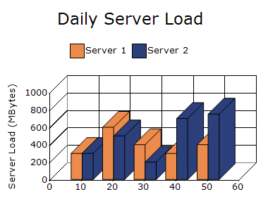
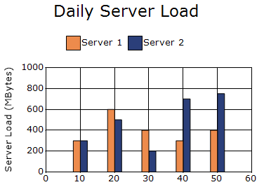
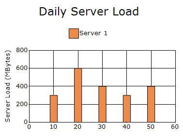
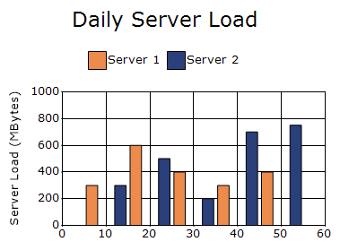

# Column and Bar in Windows Forms Charts

## Column chart

A column chart renders discrete vertical rectangles for the given data points.

The following code example demonstrates how to create a column Chart.




// Create chart series and add data points into it.
ChartSeries firstServer = new ChartSeries("Server 1", ChartSeriesType.Column);
firstServer.Points.Add(10, 300);
firstServer.Points.Add(20, 600);
firstServer.Points.Add(30, 400);
firstServer.Points.Add(40, 300);
firstServer.Points.Add(50, 400);

ChartSeries secondServer = new ChartSeries("Server 2", ChartSeriesType.Column);

secondServer.Points.Add(10, 300);
secondServer.Points.Add(20, 500);
secondServer.Points.Add(30, 200);
secondServer.Points.Add(40, 700);
secondServer.Points.Add(50, 750);

chartControl.Series.Add(firstServer);
chartControl.Series.Add(secondServer);




' Create chart series and add data points into it.
Dim firstServer As New ChartSeries("Server 1", ChartSeriesType.Column)
firstServer.Points.Add(10, 300)
firstServer.Points.Add(20, 600)
firstServer.Points.Add(30, 400)
firstServer.Points.Add(40, 300)
firstServer.Points.Add(50, 400)

Dim secondServer As New ChartSeries("Server 2", ChartSeriesType.Column)
secondServer.Points.Add(10, 300)
secondServer.Points.Add(20, 500)
secondServer.Points.Add(30, 200)
secondServer.Points.Add(40, 700)
secondServer.Points.Add(50, 750)

chartControl.Series.Add(firstServer)
chartControl.Series.Add(secondServer)




### Column draw mode

The [ColumnDrawMode](https://help.syncfusion.com/cr/windowsforms/Syncfusion.Windows.Forms.Chart.ChartControl.html#Syncfusion_Windows_Forms_Chart_ChartControl_ColumnDrawMode) property specifies how columns or bars are arranged when the chart is rendered in 3D mode. The default value is [InDepthMode](https://help.syncfusion.com/cr/windowsforms/Syncfusion.Windows.Forms.Chart.ChartColumnDrawMode.html).

The supported values are defined in the [ChartColumnDrawMode](https://help.syncfusion.com/cr/windowsforms/Syncfusion.Windows.Forms.Chart.ChartColumnDrawMode.html) enumeration:

- [ClusteredMode](https://help.syncfusion.com/cr/windowsforms/Syncfusion.Windows.Forms.Chart.ChartColumnDrawMode.html): Draws columns in depth using the same size.
- [InDepthMode](https://help.syncfusion.com/cr/windowsforms/Syncfusion.Windows.Forms.Chart.ChartColumnDrawMode.html): Draws columns at different positions along the depth of the chart.
- [PlaneMode](https://help.syncfusion.com/cr/windowsforms/Syncfusion.Windows.Forms.Chart.ChartColumnDrawMode.html): Draws columns side by side on the same plane.

N> The `ColumnDrawMode` property applies to `Column Range`, `Bar`, `Box and Whisker`, and `Gantt` charts. The selected mode is visible only when 3D rendering is enabled.

The following code enables 3D rendering and displays the columns in plane mode.



chartControl.Series3D = true;
chartControl.ColumnDrawMode = ChartColumnDrawMode.PlaneMode;


chartControl.Series3D = True
chartControl.ColumnDrawMode = ChartColumnDrawMode.PlaneMode



### Column width mode

The [ColumnWidthMode](https://help.syncfusion.com/cr/windowsforms/Syncfusion.Windows.Forms.Chart.ChartControl.html#Syncfusion_Windows_Forms_Chart_ChartControl_ColumnWidthMode) property specifies how the widths of column-like chart elements are calculated. The default value is [DefaultWidthMode](https://help.syncfusion.com/cr/windowsforms/Syncfusion.Windows.Forms.Chart.ChartColumnWidthMode.html#Syncfusion_Windows_Forms_Chart_ChartColumnWidthMode_DefaultWidthMode).

The supported values are defined in the [ChartColumnWidthMode](https://help.syncfusion.com/cr/windowsforms/Syncfusion.Windows.Forms.Chart.ChartColumnWidthMode.html) enumeration:

- [DefaultWidthMode](https://help.syncfusion.com/cr/windowsforms/Syncfusion.Windows.Forms.Chart.ChartColumnWidthMode.html#Syncfusion_Windows_Forms_Chart_ChartColumnWidthMode_DefaultWidthMode): Calculates the column width automatically to fill the available space between columns.
- [FixedWidthMode](https://help.syncfusion.com/cr/windowsforms/Syncfusion.Windows.Forms.Chart.ChartColumnWidthMode.html#Syncfusion_Windows_Forms_Chart_ChartColumnWidthMode_FixedWidthMode): Uses `Series.Points[i].YValues[1]` as the column width in pixels. If `Series.Points[i].YValues[1]` is not specified, the chart automatically calculates the width to fill the available space between columns.
- [RelativeWidthMode](https://help.syncfusion.com/cr/windowsforms/Syncfusion.Windows.Forms.Chart.ChartColumnWidthMode.html#Syncfusion_Windows_Forms_Chart_ChartColumnWidthMode_RelativeWidthMode): Uses `Series.Points[i].YValues[1]` as the column width in units of the X-axis range.

N> The `ColumnWidthMode` property also applies to `Column Range`, `Stacking Column`, `Stacked Column 100`, `Box and Whisker`, and `Candle charts`.

The following code sets ColumnWidthMode to FixedWidthMode and defines individual column widths for each data point using YValues[1].




ChartSeries firstServer = new ChartSeries("Server 1", ChartSeriesType.Column);
// X, Height(YValues[0]), Width(YValues[1])

firstServer.Points.Add(new ChartPoint(10, new double[] { 300, 4 }));
firstServer.Points.Add(new ChartPoint(20, new double[] { 600, 5 }));
firstServer.Points.Add(new ChartPoint(30, new double[] { 400, 6 }));
firstServer.Points.Add(new ChartPoint(40, new double[] { 300, 5 }));
firstServer.Points.Add(new ChartPoint(50, new double[] { 400, 4 }));

ChartSeries secondServer = new ChartSeries("Server 2", ChartSeriesType.Column);
// X, Height(YValues[0]), Width(YValues[1])

secondServer.Points.Add(new ChartPoint(10, new double[] { 300, 10 }));
secondServer.Points.Add(new ChartPoint(20, new double[] { 500, 11 }));
secondServer.Points.Add(new ChartPoint(30, new double[] { 200, 13 }));
secondServer.Points.Add(new ChartPoint(40, new double[] { 700, 6 }));
secondServer.Points.Add(new ChartPoint(50, new double[] { 750, 5 }));

chartControl.ColumnWidthMode = ChartColumnWidthMode.FixedWidthMode;

chartControl.Series.Add(firstServer);
chartControl.Series.Add(secondServer);




Dim firstServer As New ChartSeries("Server 1", ChartSeriesType.Column)

' X, Height(YValues(0)), Width(YValues(1))
firstServer.Points.Add(New ChartPoint(10, New Double() {300, 4}))
firstServer.Points.Add(New ChartPoint(20, New Double() {600, 5}))
firstServer.Points.Add(New ChartPoint(30, New Double() {400, 6}))
firstServer.Points.Add(New ChartPoint(40, New Double() {300, 5}))
firstServer.Points.Add(New ChartPoint(50, New Double() {400, 4}))

Dim secondServer As New ChartSeries("Server 2", ChartSeriesType.Column)

' X, Height(YValues(0)), Width(YValues(1))
secondServer.Points.Add(New ChartPoint(10, New Double() {300, 10}))
secondServer.Points.Add(New ChartPoint(20, New Double() {500, 11}))
secondServer.Points.Add(New ChartPoint(30, New Double() {200, 13}))
secondServer.Points.Add(New ChartPoint(40, New Double() {700, 6}))
secondServer.Points.Add(New ChartPoint(50, New Double() {750, 5}))

chartControl.ColumnWidthMode = ChartColumnWidthMode.FixedWidthMode

chartControl.Series.Add(firstServer)
chartControl.Series.Add(secondServer)



### Column fixed width

The [ColumnFixedWidth](https://help.syncfusion.com/cr/windowsforms/Syncfusion.Windows.Forms.Chart.ChartControl.html#Syncfusion_Windows_Forms_Chart_ChartControl_ColumnFixedWidth) property specifies the width of each column in pixels when the [ColumnWidthMode](https://help.syncfusion.com/cr/windowsforms/Syncfusion.Windows.Forms.Chart.ChartControl.html#Syncfusion_Windows_Forms_Chart_ChartControl_ColumnWidthMode) property is set to [FixedWidthMode](https://help.syncfusion.com/cr/windowsforms/Syncfusion.Windows.Forms.Chart.ChartColumnWidthMode.html#Syncfusion_Windows_Forms_Chart_ChartColumnWidthMode_FixedWidthMode). The default value is `20`.

N>
- The `ColumnFixedWidth` property also applies to `Column Range`, `Stacking Column`, `Stacked Column 100`, `Box and Whisker`, and `Candle charts`.
- If both the second Y-value and `ColumnFixedWidth` are specified, the second Y-value takes higher priority.

The following code example demonstrates how to set a fixed width for chart columns.



chartControl.ColumnFixedWidth = 10;


chartControl.ColumnFixedWidth = 10



### Draw column separating lines

The [DrawColumnSeparatingLines](https://help.syncfusion.com/cr/windowsforms/Syncfusion.Windows.Forms.Chart.ChartSeries.html#Syncfusion_Windows_Forms_Chart_ChartSeries_DrawColumnSeparatingLines) property controls whether separating lines are drawn between the columns in a series. The default value is `false`.

N> The `DrawColumnSeparatingLines` property also applies to `Bar` charts.

The following code displays separating lines between columns.



chartControl.Series[0].DrawColumnSeparatingLines = true;


chartControl.Series(0).DrawColumnSeparatingLines = True



### Column type

The [ColumnType](https://help.syncfusion.com/cr/windowsforms/Syncfusion.Windows.Forms.Chart.ChartColumnConfigItem.html#Syncfusion_Windows_Forms_Chart_ChartColumnConfigItem_ColumnType) property specifies the shape used to render columns in a 3D chart. The default value is [Box](https://help.syncfusion.com/cr/windowsforms/Syncfusion.Windows.Forms.Chart.ChartColumnType.html#Syncfusion_Windows_Forms_Chart_ChartColumnType_Box).

The supported values are defined in the [ChartColumnType](https://help.syncfusion.com/cr/windowsforms/Syncfusion.Windows.Forms.Chart.ChartColumnType.html) enumeration:

- [Box](https://help.syncfusion.com/cr/windowsforms/Syncfusion.Windows.Forms.Chart.ChartColumnType.html#Syncfusion_Windows_Forms_Chart_ChartColumnType_Box): Displays columns as rectangular boxes.
- [Cylinder](https://help.syncfusion.com/cr/windowsforms/Syncfusion.Windows.Forms.Chart.ChartColumnType.html#Syncfusion_Windows_Forms_Chart_ChartColumnType_Cylinder): Displays columns as cylinders.

N> The `ColumnType` property also applies to `Column Range`, `Stacking Column`, `Candle`, `Bar`, and `Stacking Bar` charts.

The following code enables 3D rendering and displays the columns as cylinders.



chartControl.Series3D = true;
chartControl.Series[0].ConfigItems.ColumnItem.ColumnType =
    ChartColumnType.Cylinder;


chartControl.Series3D = True
chartControl.Series(0).ConfigItems.ColumnItem.ColumnType =
    ChartColumnType.Cylinder



### Corner radius

The [CornerRadius](https://help.syncfusion.com/cr/windowsforms/Syncfusion.Windows.Forms.Chart.ChartColumnConfigItem.html#Syncfusion_Windows_Forms_Chart_ChartColumnConfigItem_CornerRadius) property specifies the horizontal and vertical radii used to render rounded corners for columns. The default value is `SizeF.Empty`, which renders columns without rounded corners.

The following code example demonstrates how to set the corner radius for column chart.



chartControl.Series[0].ConfigItems.ColumnItem.CornerRadius = new SizeF(10, 10);


chartControl.Series(0).ConfigItems.ColumnItem.CornerRadius = New SizeF(10, 10)



### Spacing

The [Spacing](https://help.syncfusion.com/windowsforms/chart/chart-series#spacing) property specifies the space between data points as a percentage of the X-axis interval width. The default value is `30`.

N>
- The supported value ranges from `10` to `99`. The remaining interval width is used to render the data points and is divided among the series when multiple series are displayed.
- The `Spacing` property also applies to `Column Range`, `Stacking Column`, `Stacked Column 100`, `Bar`, `Stacking Bar`, `Stacked Bar 100`, `Box and Whisker`, `Gantt`, `Tornado`, `Candle`, `HiLo`, and `HiLo Open Close` charts.
- The `Spacing` property is not applied when the `ColumnWidthMode` property is set to `FixedWidthMode`.

The following code sets the spacing between columns to `70`.



chartControl.Spacing = 70;


chartControl.Spacing = 70



### Spacing between points

The [SpacingBetweenPoints](https://help.syncfusion.com/cr/windowsforms/Syncfusion.Windows.Forms.Chart.ChartSeries.html#Syncfusion_Windows_Forms_Chart_ChartSeries_SpacingBetweenPoints) property specifies the spacing between adjacent data points in a series.

N> The `SpacingBetweenPoints` property also applies to `Bar`, `HiLo`, `HiLo Open Close`, `Candle`, `Tornado`, and `Box and Whisker` charts.

The following code sets the spacing between adjacent columns.



chartControl.SpacingBetweenPoints = 10;


chartControl.SpacingBetweenPoints = 10



## Bar chart

A bar chart renders data points as horizontal bars to compare values across different categories.

The following code shows how to define a bar chart in ChartControl.




ChartSeries firstServer = new ChartSeries("Server 1", ChartSeriesType.Bar);
firstServer.Points.Add(10, 100);
firstServer.Points.Add(20, 300);
firstServer.Points.Add(30, 200);
firstServer.Points.Add(40, 100);
firstServer.Points.Add(50, 200);

ChartSeries secondServer = new ChartSeries("Server 2", ChartSeriesType.Bar);

secondServer.Points.Add(10, 100);
secondServer.Points.Add(20, 200);
secondServer.Points.Add(30, 100);
secondServer.Points.Add(40, 300);
secondServer.Points.Add(50, 350);

chartControl.Series.Add(firstServer);
chartControl.Series.Add(secondServer);




Dim firstServer As New ChartSeries("Server 1", ChartSeriesType.Bar)
firstServer.Points.Add(10, 100)
firstServer.Points.Add(20, 300)
firstServer.Points.Add(30, 200)
firstServer.Points.Add(40, 100)
firstServer.Points.Add(50, 200)

Dim secondServer As New ChartSeries("Server 2", ChartSeriesType.Bar)
secondServer.Points.Add(10, 100)
secondServer.Points.Add(20, 200)
secondServer.Points.Add(30, 100)
secondServer.Points.Add(40, 300)
secondServer.Points.Add(50, 350)

chartControl.Series.Add(firstServer)
chartControl.Series.Add(secondServer)




