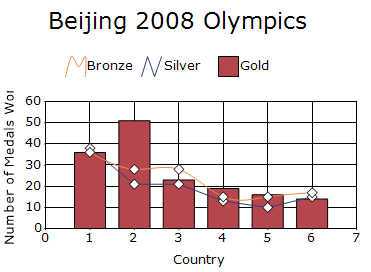

# Combination charts in windows forms chart

## Combination Chart

Combination Chart displays multiple data series in a single chart using different chart types. It is commonly used to compare related data sets by combining chart types such as Line and Column while sharing the same X-axis.

N>
Chart Details
* Number of Series - One or More.
* Cannot be combined with - Pie, Bar, Polar, Radar.

The following code example demonstrates how to create a Combination Chart.




for (int i = 0; i < 3; i++)
{
    ChartSeries Combination = new ChartSeries("Gold");
    if (i == 0)
    {
        Combination.Text = "Bronze";
        Combination.Points.Add(1, 36);
        Combination.Points.Add(2, 28);
        Combination.Points.Add(3, 28);
        Combination.Points.Add(4, 15);
        Combination.Points.Add(5, 15);
        Combination.Points.Add(6, 17);
        Combination.Type = ChartSeriesType.Spline;
    }
    else if (i == 1)
    {
        Combination.Text = "Silver";
        Combination.Points.Add(1, 38);
        Combination.Points.Add(2, 21);
        Combination.Points.Add(3, 21);
        Combination.Points.Add(4, 13);
        Combination.Points.Add(5, 10);
        Combination.Points.Add(6, 15);
        Combination.Type = ChartSeriesType.Line;
    }
    else
    {
        Combination.Points.Add(1, 36);
        Combination.Points.Add(2, 51);
        Combination.Points.Add(3, 23);
        Combination.Points.Add(4, 19);
        Combination.Points.Add(5, 16);
        Combination.Points.Add(6, 14);
        Combination.Type = ChartSeriesType.Column;

    }
  chartControl.Series.Add(Combination);
}

chartControl.Series[1].Style.Symbol.Shape = ChartSymbolShape.Diamond;
chartControl.Series[0].Style.Symbol.Shape = ChartSymbolShape.Diamond;




For i As Integer = 0 To 2

    Dim Combination As New ChartSeries("Gold")

    If i = 0 Then

        Combination.Text = "Bronze"
        Combination.Points.Add(1, 36)
        Combination.Points.Add(2, 28)
        Combination.Points.Add(3, 28)
        Combination.Points.Add(4, 15)
        Combination.Points.Add(5, 15)
        Combination.Points.Add(6, 17)
        Combination.Type = ChartSeriesType.Spline

    ElseIf i = 1 Then

        Combination.Text = "Silver"
        Combination.Points.Add(1, 38)
        Combination.Points.Add(2, 21)
        Combination.Points.Add(3, 21)
        Combination.Points.Add(4, 13)
        Combination.Points.Add(5, 10)
        Combination.Points.Add(6, 15)
        Combination.Type = ChartSeriesType.Line

    Else

        Combination.Text = "Gold"
        Combination.Points.Add(1, 36)
        Combination.Points.Add(2, 51)
        Combination.Points.Add(3, 23)
        Combination.Points.Add(4, 19)
        Combination.Points.Add(5, 16)
        Combination.Points.Add(6, 14)
        Combination.Type = ChartSeriesType.Column

    End If

    chartControl.Series.Add(Combination)

Next

chartControl.Series(1).Style.Symbol.Shape = ChartSymbolShape.Diamond
chartControl.Series(0).Style.Symbol.Shape = ChartSymbolShape.Diamond




### Customization option

The following chart series properties are used as customization options for Combination chart:

- [Border](https://help.syncfusion.com/windowsforms/chart/chart-series#border)
- [DisplayShadow](https://help.syncfusion.com/windowsforms/chart/chart-series#displayshadow)
- [DisplayText](https://help.syncfusion.com/windowsforms/chart/chart-series#displaytext)
- [DrawColumnSeparatingLines](https://help.syncfusion.com/windowsforms/chart/chart-series#drawcolumnseparatinglines)
- [ElementBorders](https://help.syncfusion.com/windowsforms/chart/chart-series#elementborders)
- [FancyToolTip](https://help.syncfusion.com/windowsforms/chart/chart-series#fancytooltip)
- [Font](https://help.syncfusion.com/windowsforms/chart/chart-series#font)
- [ImageIndex](https://help.syncfusion.com/windowsforms/chart/chart-series#imageindex)
- [Images](https://help.syncfusion.com/windowsforms/chart/chart-series#images)
- [Interior](https://help.syncfusion.com/windowsforms/chart/chart-series#interior)
- [LegendItem](https://help.syncfusion.com/windowsforms/chart/chart-series#legenditem)
- [LightAngle](https://help.syncfusion.com/windowsforms/chart/chart-series#lightangle)
- [LightColor](https://help.syncfusion.com/windowsforms/chart/chart-series#lightcolor)
- [Name](https://help.syncfusion.com/windowsforms/chart/chart-series#name)
- [PhongAlpha](https://help.syncfusion.com/windowsforms/chart/chart-series#phongalpha)
- [PointsToolTipFormat](https://help.syncfusion.com/windowsforms/chart/chart-series#pointstooltipformat)
- [ShadowInterior](https://help.syncfusion.com/windowsforms/chart/chart-series#shadowinterior)
- [ShadowOffset](https://help.syncfusion.com/windowsforms/chart/chart-series#shadowoffset)
- [SmartLabels](https://help.syncfusion.com/windowsforms/chart/chart-series#smartlabels)
- [Spacing Between Series](https://help.syncfusion.com/windowsforms/chart/chart-series#spacingbetweenseries)
- [Summary](https://help.syncfusion.com/windowsforms/chart/chart-series#summary)
- [Text](https://help.syncfusion.com/windowsforms/chart/chart-series#text-series)
- [TextColor](https://help.syncfusion.com/windowsforms/chart/chart-series#textcolor)
- [TextFormat](https://help.syncfusion.com/windowsforms/chart/chart-series#textformat)
- [TextOffset](https://help.syncfusion.com/windowsforms/chart/chart-series#textoffset)
- [TextOrientation](https://help.syncfusion.com/windowsforms/chart/chart-series#textorientation)
- [Visible](https://help.syncfusion.com/windowsforms/chart/chart-series#visible)